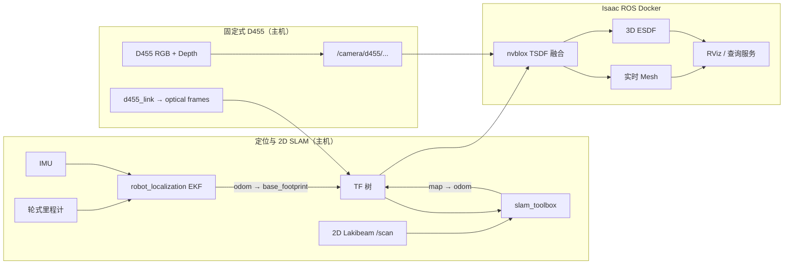

# Tracer + JAKA + D455：SLAM 与 3D ESDF 仿真/实机运行指南

> 适用工作区：
>
> - ROS 2、MuJoCo、定位与 SLAM：`/home/a/ocs2_ws`
> - Isaac ROS、nvblox 与 ESDF：`/home/a/workspaces/isaac_ros-dev`
>
> 当前传感器分工：
>
> - 轮式里程计 + IMU + 2D Lakibeam：机器人定位和 `slam_toolbox` 建图。
> - 底盘固定式 D455：nvblox TSDF、Mesh 和 3D ESDF 建图。
> - 机械臂末端 D435：抓取识别；默认不参与 ESDF 建图。

## 1. 总体运行结构



### 关键 TF

```text
map
└── odom                         slam_toolbox 发布
    └── base_footprint           robot_localization 发布
        └── base_link            URDF 固定关节
            ├── laser_link
            ├── imu_link
            ├── d455_link
            │   ├── d455_depth_optical_frame
            │   └── d455_color_optical_frame
            └── JAKA 机械臂
                └── d435i_link
```

D455 在当前 URDF 中的安装基准：

```xml
<joint name="base_to_d455" type="fixed">
  <parent link="base_link"/>
  <child link="d455_link"/>
  <origin xyz="0.25 0 0.24" rpy="1.5708 0 1.5708"/>
</joint>
```

仿真中实测：

```text
base_footprint -> d455_depth_optical_frame
translation = [0.255, 0.000, 0.387]
相机视线方向 = base_link +X（机器人正前方）
```

## 2. 通用环境要求

主机与 Docker 必须使用相同的 DDS 配置：

```bash
export ROS_DOMAIN_ID=20
export RMW_IMPLEMENTATION=rmw_fastrtps_cpp
```

提供的 MuJoCo ESDF、D455 和 nvblox launch 已默认设置为上述值。但单独执行
`ros2 topic`、`tf2_echo` 或手动启动 `real_slam.launch.py` 前，仍建议在当前
终端显式导出。

进入 Isaac ROS 容器时必须使用 `admin` 用户：

```bash
docker start isaac_ros_dev-x86_64-container

docker exec -it -u admin \
  --workdir /workspaces/isaac_ros-dev \
  isaac_ros_dev-x86_64-container bash
```

不要使用容器内的 `root` 用户运行 ROS 2。当前机器上 root 用户可能无法通过
Fast DDS 发现主机发布的话题。

## 3. 首次构建或修改代码后的构建

### 3.1 构建主机工作区

```bash
cd /home/a/ocs2_ws
source /opt/ros/humble/setup.bash

colcon build --symlink-install \
  --packages-select tracer_jaka_mujoco

source install/setup.bash
```

### 3.2 构建 Isaac ROS 工作区

先进入容器，然后执行：

```bash
cd /workspaces/isaac_ros-dev
source /opt/ros/humble/setup.bash

colcon build --symlink-install \
  --packages-select my_nvblox_bringup

source install/setup.bash
```

## 4. MuJoCo 仿真运行

仿真需要两个终端：

- 主机终端：MuJoCo、轮式里程计、IMU、2D 激光、EKF、slam_toolbox、D455。
- Docker 终端：nvblox、3D ESDF、Mesh 和 ESDF RViz。

### 4.1 主机启动完整仿真

```bash
cd /home/a/ocs2_ws
source /opt/ros/humble/setup.bash
source install/setup.bash

export MUJOCO_GL=egl

ros2 launch tracer_jaka_mujoco esdf_sensor_sim.launch.py
```

该 launch 默认执行：

```text
esdf_sensor_sim.launch.py
└── slam_sim.launch.py
    ├── bridge.launch.py
    │   ├── MuJoCo 物理仿真
    │   ├── /clock
    │   ├── /wheel/odometry
    │   ├── /imu/data
    │   ├── /scan
    │   ├── /camera/d455/color/image_raw
    │   └── /camera/d455/depth/image_raw
    ├── robot_localization
    └── slam_toolbox
```

常用覆盖参数：

```bash
# 打开 SLAM RViz
ros2 launch tracer_jaka_mujoco esdf_sensor_sim.launch.py \
  rviz:=true

# 相机渲染较慢时降为 15 Hz
ros2 launch tracer_jaka_mujoco esdf_sensor_sim.launch.py \
  camera_rate:=15.0

# 使用其他 ROS Domain
ros2 launch tracer_jaka_mujoco esdf_sensor_sim.launch.py \
  ros_domain_id:=21
```

`esdf_sensor_sim.launch.py` 默认关闭 MuJoCo 自带 viewer，因为 EGL 离屏相机和
viewer 同时运行时性能较差。需要检查机器人模型时，可单独运行：

```bash
ros2 launch tracer_jaka_mujoco bridge.launch.py \
  viewer:=true \
  camera:=false
```

### 4.2 Docker 启动仿真 nvblox

进入容器：

```bash
docker exec -it -u admin \
  --workdir /workspaces/isaac_ros-dev \
  isaac_ros_dev-x86_64-container bash
```

容器内：

```bash
source /opt/ros/humble/setup.bash
source /workspaces/isaac_ros-dev/install/setup.bash
export ISAAC_ROS_NVBLOX_PLUGIN_FORCE_FALLBACK_MATERIAL=1
ros2 launch my_nvblox_bringup mujoco_esdf.launch.py
```

仿真 nvblox 默认读取：

```text
/camera/d455/depth/image_raw
/camera/d455/depth/camera_info
/camera/d455/color/image_raw
/camera/d455/color/camera_info
```

默认打开 nvblox RViz，并显示：

```text
/nvblox_node/mesh
/nvblox_node/esdf_3d_pointcloud
```

只运行建图、不打开 RViz：

```bash
ros2 launch my_nvblox_bringup mujoco_esdf.launch.py \
  rviz:=false
```

只显示 Mesh，不生成局部 ESDF 可视化点云：

```bash
ros2 launch my_nvblox_bringup mujoco_esdf.launch.py \
  esdf_viz:=false
```

## 5. 实机运行

实机推荐使用三个终端：

1. 主机：底盘、IMU、Lakibeam、EKF、slam_toolbox。
2. 主机：固定式 D455。
3. Docker：nvblox、ESDF 和 RViz。

如果还需要抓取识别，可增加第四个主机终端启动末端 D435。

### 5.1 实机定位与 2D SLAM：推荐一键方式

连接底盘 CAN、IMU 和 Lakibeam 后：

```bash
sudo chmod 777 /dev/ttyUSB0

cd /home/a/ocs2_ws
source /opt/ros/humble/setup.bash
source install/setup.bash

export ROS_DOMAIN_ID=20
export RMW_IMPLEMENTATION=rmw_fastrtps_cpp

ros2 launch tracer_jaka_mujoco real_slam.launch.py
```

该 launch 默认启动：

- Tracer 底盘与轮式里程计；
- `robot_state_publisher`；
- Hipnuc IMU；
- Lakibeam；
- `robot_localization`；
- `slam_toolbox`；
- SLAM RViz。

常用参数：

```bash
ros2 launch tracer_jaka_mujoco real_slam.launch.py \
  can_port:=can0 \
  serial_port:=/dev/ttyUSB0 \
  wheel_odom_topic:=/odom \
  imu_topic:=/IMU_data \
  scan_topic:=/scan \
  rviz:=true
```

如果传感器已经单独启动，可以关闭对应驱动：

```bash
ros2 launch tracer_jaka_mujoco real_slam.launch.py \
  start_base:=false \
  start_imu:=false \
  start_lidar:=false
```

### 5.2 实机定位：沿用已有传感器启动方式

如果继续使用原来的启动命令：

```bash
# IMU
sudo chmod 777 /dev/ttyUSB0
ros2 launch hipnuc_imu imu_spec_msg.launch.py

# Lakibeam
ros2 launch lakibeam1 lakibeam1_scan_view.launch.py
```

确保底盘里程计也已经发布，然后只启动 EKF 和 slam_toolbox：

```bash
cd /home/a/ocs2_ws
source install/setup.bash

export ROS_DOMAIN_ID=20
export RMW_IMPLEMENTATION=rmw_fastrtps_cpp

ros2 launch tracer_jaka_mujoco localization.launch.py \
  wheel_odom_topic:=/odom \
  imu_topic:=/IMU_data \
  scan_topic:=/scan
```

如果实际话题不同，先执行：

```bash
ros2 topic list
```

再修改上述三个 topic 参数。

### 5.3 主机启动固定式 D455

只有一台 RealSense 时：

```bash
cd /home/a/ocs2_ws
source install/setup.bash

ros2 launch tracer_jaka_mujoco d455_sensor.launch.py
```

同时连接 D455 和 D435 时，必须使用序列号区分：

```bash
ros2 launch tracer_jaka_mujoco d455_sensor.launch.py \
  serial_no:="'D455序列号'"
```

D455 默认发布：

```text
/camera/d455/depth/image_rect_raw
/camera/d455/depth/camera_info
/camera/d455/color/image_raw
/camera/d455/color/camera_info
```

RealSense 驱动发布：

```text
d455_link -> d455_depth_optical_frame
d455_link -> d455_color_optical_frame
```

URDF 的 `robot_state_publisher` 发布：

```text
base_link -> d455_link
```

### 5.4 Docker 启动实机 nvblox

容器内执行：

```bash
source /opt/ros/humble/setup.bash
source /workspaces/isaac_ros-dev/install/setup.bash

ros2 launch my_nvblox_bringup d455_esdf.launch.py
```

如果 D455 驱动的话题名称不同，可覆盖：

```bash
ros2 launch my_nvblox_bringup d455_esdf.launch.py \
  depth_image_topic:=/camera/d455/depth/image_rect_raw \
  depth_camera_info_topic:=/camera/d455/depth/camera_info \
  color_image_topic:=/camera/d455/color/image_raw \
  color_camera_info_topic:=/camera/d455/color/camera_info
```

### 5.5 可选：启动末端 D435 做抓取识别

```bash
cd /home/a/ocs2_ws
source install/setup.bash

ros2 launch tracer_jaka_mujoco d435_sensor.launch.py \
  serial_no:="'D435序列号'"
```

D435 默认使用：

```text
根 frame：d435i_link
话题前缀：/camera/d435i/
用途：机械臂末端抓取、物体识别
```

默认 nvblox 不订阅 D435，因此机械臂运动不会改变 ESDF 主相机的安装姿态。

## 6. 当前 nvblox 参数

参数文件：

```text
/home/a/workspaces/isaac_ros-dev/src/my_nvblox_bringup/config/nvblox_3d.yaml
```

| 参数 | 当前值 | 作用 | 建议 |
|---|---:|---|---|
| `voxel_size` | `0.05 m` | TSDF/ESDF 分辨率 | 常规导航保持 5 cm |
| `mapping_type` | `static_tsdf` | 静态环境 TSDF | 当前正确 |
| `esdf_mode` | `3d` | 真正三维 ESDF | 不要改成 2D |
| `integrate_depth_rate_hz` | `30` | 最大深度融合频率 | GPU 压力大可降到 15 |
| `integrate_color_rate_hz` | `5` | 颜色融合频率 | ESDF 不依赖高频颜色 |
| `update_mesh_rate_hz` | `5` | Mesh 更新频率 | RViz 卡顿可降到 2 |
| `update_esdf_rate_hz` | `10` | ESDF 更新频率 | 运动规划建议 10 Hz |
| `projective_integrator_max_integration_distance_m` | `5.0` | 最大深度融合距离 | 室内保持 4～5 m |
| `esdf_integrator_max_distance_m` | `2.0` | ESDF 截断距离 | 局部规划通常足够 |
| `map_clearing_radius_m` | `7.0` | 保留机器人附近地图 | 显存不足时减小 |
| `maximum_input_queue_length` | `20` | RGB-D 输入队列 | 延迟大时不要盲目增大 |

### ESDF RViz 可视化参数

这些参数只改变显示，不改变规划器内部 ESDF：

| launch 参数 | 默认值 | 说明 |
|---|---:|---|
| `esdf_viz` | `true` | 是否发布局部 3D ESDF 点云 |
| `esdf_viz_size_x` | `4.0` | 显示区域 X 尺寸 |
| `esdf_viz_size_y` | `4.0` | 显示区域 Y 尺寸 |
| `esdf_viz_min_z` | `-0.2` | 相对底盘最低显示高度 |
| `esdf_viz_size_z` | `3.0` | 显示区域高度 |
| `esdf_viz_rate` | `1.0` | ESDF 点云发布频率 |
| `esdf_viz_max_distance` | `1.5` | 显示的最大障碍距离 |
| `esdf_viz_subsampling` | `2` | 体素显示降采样 |

低负载示例：

```bash
ros2 launch my_nvblox_bringup d455_esdf.launch.py \
  esdf_viz_rate:=0.5 \
  esdf_viz_subsampling:=3 \
  esdf_viz_max_distance:=1.0
```

## 7. 需要修改参数时去哪里改

| 修改目标 | 文件 |
|---|---|
| D455 在机器人上的安装位置 | `/home/a/ocs2_ws/src/tracer_jaka/tracer_jaka_mujoco/urdf/tracer_jaka_zu5.urdf` |
| D455 在 MuJoCo 中的位置和视线 | `models/tracer_jaka_zu5_robot.xml` |
| MuJoCo D455 频率、分辨率、FOV、话题 | `config/sensors.yaml` |
| 实机 D455 分辨率、帧率、命名空间 | `launch/d455_sensor.launch.py` |
| 实机 D435 分辨率、帧率、命名空间 | `launch/d435_sensor.launch.py` |
| 实机 EKF 融合配置 | `config/ekf_real.yaml` |
| 实机 slam_toolbox 配置 | `config/slam_toolbox_real.yaml` |
| nvblox 体素、距离和更新频率 | `my_nvblox_bringup/config/nvblox_3d.yaml` |
| nvblox 仿真输入话题 | `my_nvblox_bringup/launch/mujoco_esdf.launch.py` |
| nvblox 实机输入话题 | `my_nvblox_bringup/launch/d455_esdf.launch.py` |
| ESDF RViz 布局 | `my_nvblox_bringup/config/nvblox_esdf.rviz` |

### 修改 D455 安装姿态后的同步规则

如果修改了 URDF 中的：

```xml
<joint name="base_to_d455">
  <origin xyz="..." rpy="..."/>
</joint>
```

必须同步检查：

1. MuJoCo `tracer_jaka_zu5_robot.xml` 中 `body name="d455_link"` 的
   `pos` 和 `quat`；
2. MuJoCo `camera name="d455_depth"` 的视线是否仍朝机器人前方；
3. 实机 `tf2_echo base_link d455_link`；
4. 仿真 `tf2_echo base_footprint d455_depth_optical_frame`；
5. 修改后重新构建 `tracer_jaka_mujoco`。

## 8. 运行后的检查命令

### 8.1 检查定位和 SLAM

```bash
ros2 topic hz /scan
ros2 topic hz /imu/data          # 仿真
ros2 topic hz /IMU_data          # 当前实机默认
ros2 topic hz /odometry/filtered

ros2 run tf2_ros tf2_echo odom base_footprint
ros2 run tf2_ros tf2_echo map odom
```

### 8.2 检查仿真 D455

```bash
ros2 topic hz /camera/d455/depth/image_raw
ros2 topic echo /camera/d455/depth/camera_info --once
ros2 run tf2_ros tf2_echo base_footprint d455_depth_optical_frame
```

### 8.3 检查实机 D455

```bash
ros2 topic hz /camera/d455/depth/image_rect_raw
ros2 topic echo /camera/d455/depth/camera_info --once
ros2 run tf2_ros tf2_echo base_link d455_depth_optical_frame
```

### 8.4 检查容器是否收到主机数据

容器内：

```bash
export ROS_DOMAIN_ID=20
export RMW_IMPLEMENTATION=rmw_fastrtps_cpp

ros2 topic list | grep d455
ros2 topic hz /camera/d455/depth/image_rect_raw
ros2 run tf2_ros tf2_echo odom d455_depth_optical_frame
```

仿真时把 `image_rect_raw` 换为 `image_raw`。

### 8.5 检查 nvblox

```bash
ros2 node info /nvblox_node
ros2 topic hz /nvblox_node/mesh
ros2 topic hz /nvblox_node/esdf_3d_pointcloud
```

主要输出：

```text
/nvblox_node/mesh
/nvblox_node/esdf_3d_pointcloud
/nvblox_node/get_esdf_and_gradient
/nvblox_node/back_projected_depth/d455_depth_optical_frame
```

注意：在 `esdf_mode: 3d` 下，内部 ESDF 不会通过
`/nvblox_node/static_esdf_pointcloud` 持续发布。当前功能包使用
`/nvblox_node/esdf_3d_pointcloud` 显示局部三维距离场。

## 9. 常见问题

### 9.1 RViz 提示 `Frame [odom] does not exist`

依次检查：

```bash
ros2 topic echo /clock --once       # 只针对仿真
ros2 topic echo /odometry/filtered --once
ros2 run tf2_ros tf2_echo odom base_footprint
```

常见原因：

- 主机和容器 `ROS_DOMAIN_ID` 不一致；
- 容器使用 root 而不是 admin；
- 仿真 nvblox 没有使用 `use_sim_time=true`；
- EKF 尚未启动或没有收到里程计/IMU；
- Docker 启动早于主机 TF，启动后等待几秒即可。

### 9.2 只能看到反投影深度点，看不到地图

反投影点只表示 nvblox 收到了当前深度帧，不等于地图显示已经开启。

检查：

```bash
ros2 topic echo /nvblox_node/mesh nvblox_msgs/msg/Mesh --once
ros2 topic echo /nvblox_node/esdf_3d_pointcloud \
  sensor_msgs/msg/PointCloud2 --once --field width
```

RViz 的 Fixed Frame 应设为 `odom`。

### 9.3 ESDF/相机出现在机器人很远的位置

检查完整 TF：

```bash
ros2 run tf2_ros tf2_echo base_footprint d455_depth_optical_frame
ros2 run tf2_ros tf2_echo odom d455_depth_optical_frame
```

当前仿真的正常平移值应接近：

```text
[0.255, 0.000, 0.387]
```

实机允许有毫米级光学中心偏移，但不应相差数米。

### 9.4 相机方向反了

检查点云是否主要出现在机器人前方。MuJoCo 中相机光轴已经校正为
`base_link +X`。如果再次修改 URDF 的 `rpy`，必须同步修改 MJCF 的
`d455_link quat`，不能只旋转 CAD visual。

### 9.5 nvblox 或 RViz 卡顿

优先按顺序降低：

1. `esdf_viz_subsampling:=3`；
2. `esdf_viz_rate:=0.5`；
3. `esdf_viz_max_distance:=1.0`；
4. `camera_rate:=15.0`；
5. 只显示 Mesh：`esdf_viz:=false`。

不要先增大输入队列。队列过大会增加延迟，使当前深度帧与 TF 时间更难匹配。

### 9.6 同时连接 D455 和 D435 后相机串号

分别指定序列号：

```bash
ros2 launch tracer_jaka_mujoco d455_sensor.launch.py \
  serial_no:="'D455序列号'"

ros2 launch tracer_jaka_mujoco d435_sensor.launch.py \
  serial_no:="'D435序列号'"
```

并确认：

```text
D455 -> /camera/d455/...
D435 -> /camera/d435i/...
```

## 10. 推荐日常启动清单

### 仿真

主机：

```bash
cd /home/a/ocs2_ws
source install/setup.bash
export MUJOCO_GL=egl
ros2 launch tracer_jaka_mujoco esdf_sensor_sim.launch.py
```

Docker：

```bash
source /workspaces/isaac_ros-dev/install/setup.bash
ros2 launch my_nvblox_bringup mujoco_esdf.launch.py
```

### 实机

主机终端 1：

```bash
cd /home/a/ocs2_ws
source install/setup.bash
export ROS_DOMAIN_ID=20
export RMW_IMPLEMENTATION=rmw_fastrtps_cpp
sudo chmod 777 /dev/ttyUSB0
ros2 launch tracer_jaka_mujoco real_slam.launch.py
```

主机终端 2：

```bash
cd /home/a/ocs2_ws
source install/setup.bash
ros2 launch tracer_jaka_mujoco d455_sensor.launch.py \
  serial_no:="'D455序列号'"
```

Docker：

```bash
source /workspaces/isaac_ros-dev/install/setup.bash
ros2 launch my_nvblox_bringup d455_esdf.launch.py
```

可选 D435：

```bash
ros2 launch tracer_jaka_mujoco d435_sensor.launch.py \
  serial_no:="'D435序列号'"
```

## 11. 重要注意事项

1. 仿真和实机不要同时发布 `/camera/d455/...`。
2. 同一时刻只能有一个节点发布 `odom -> base_footprint`。
3. 同一时刻只能有一个节点发布 `map -> odom`。
4. nvblox 默认在 `odom` 中建立局部 ESDF；这是为了避免 SLAM 回环时 `map`
   坐标突跳直接影响局部规划。
5. D455 负责 ESDF，D435 负责末端识别，两者使用不同 topic 和 frame。
6. 修改 URDF 传感器位姿后，要同步 MJCF 并重新构建。
7. 重启 nvblox 会清空当前内存地图；修改 TF 后必须重启 nvblox，避免旧错误
   位姿的数据继续留在地图中。
