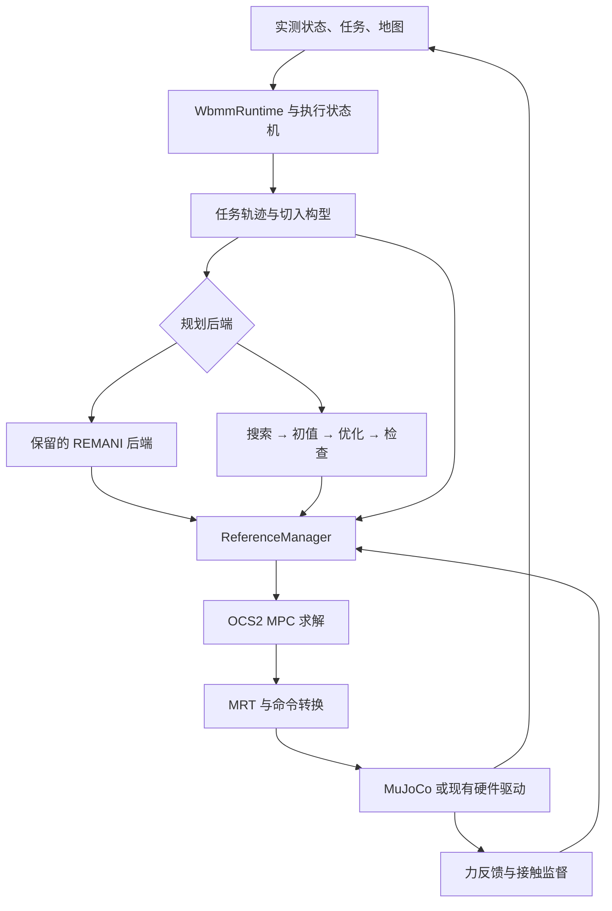

# WBMM 架构评估与重构执行方案（优化版 v2）

日期：2026-09-06  
对象：Tracer 差速底盘 + JAKA Zu5，ROS 2 Humble，MuJoCo / 实机  
代码基线：`main` / `16110af0d6bf4e175e9b6861cbc9157e59e54dbc`

本方案重新核对了 GitHub 当前版本的目录、文档、主要调用链和关键函数，并参考上传的《WBMM架构评估与重构执行方案.md》。当前 main 与旧方案审查版本一致。本文是**设计与静态源码审查结果**，没有在本次环境中编译 ROS 工作空间、运行 MuJoCo 或连接实机；仓库文档记录的历史通过情况与本次验证严格区分。

文中的新目录、接口、脚本、配置项和验收任务均是**待实施设计**。最后的“现有基线命令”单独列出当前确实存在的入口。

## 1. 先明确最终建议

建议采用：**一条自己掌握的任务执行主线，搜索和优化可以单独替换，成熟控制和硬件能力继续复用。**

具体做五个决定：

1. **OCS2 保留核心，封装集成层。** 不重写 SLQ/DDP、自动微分、MPC/MRT。你的控制研究改动放在机器人问题装配、代价、约束、参考与执行策略中。
2. **REMANI 先保留整套基线，再拆搜索、初值构造和优化。** 第一阶段适配现有流程，第二阶段按真实函数边界提取。长期不能只留下一个不可拆的 `PlannerBackend.plan()`。
3. **新增一个主要研发包 `wbmm`。** 任务生成、入口构型选择、规划编排、执行状态机、参考管理、接触监督集中在这里，内部用目录和普通 C++ 类分工。
4. **保留现有 `tracer_jaka_ocs2`、bringup、驱动、机器人描述、仿真和可视化包。** OCS2 的重依赖留在已有控制集成包，日常改搜索不需要进入 MPC 实现。
5. **按可运行的小步骤迁移。** 先修复已明确的接线与语义缺口，再建立新主程序；每一步有旧入口回退，最后再删除重复实现。

你最终应能做到：

| 想做的事情 | 主要修改位置 |
|---|---|
| 换一条擦拭/绘制任务轨迹 | `wbmm/task/` 和任务 YAML |
| 改任务切入构型评分 | `wbmm/task/entry_selector.cpp`、`entry_cost.cpp` |
| 改搜索算法 | `wbmm/planning/search/` |
| 改轨迹代价和梯度 | `wbmm/planning/optimization/` |
| 改导航、接近、接触的切换 | `wbmm/execution/fsm.cpp` |
| 改恒力修正与底盘分担策略 | `wbmm/contact/` |
| 改 MPC 的跟踪目标、权重或约束 | `tracer_jaka_ocs2/problem/` 与原生 `.info` 配置 |
| 从仿真切到实机 | bringup 场景配置及 I/O，沿用同一研发逻辑 |

“好上手”的验收方式是：看到一个现象，能找到负责它的文件；改一个研究模块，能单独运行和比较结果。

## 2. 相比旧方案，这版具体优化了什么

| 旧方案的方向 | 这版的落实方式 |
|---|---|
| 两个日常开发包 | `wbmm_core + wbmm` 负责轻量研发；已有 OCS2 集成包保留，避免重依赖重新集中 |
| 搜索与优化要拆开 | 明确从 `astarWithMinTraj()` 拆成 `search → seed_builder → optimizer`，给出中间数据、先后步骤和对照方法 |
| 补环境检查 | 补到任务候选、运动段、修正后参考及执行监测；同时区分无接触轨迹和允许的工具接触 |
| 用实测初值规划 | 在线请求、离线指定初值、到达后重新校验接近段，各自有明确入口 |
| 收口参考发布 | 先保留原交权协议，再改为唯一发布者；补暂停时未来参考不前进的语义 |
| 迁移旧擦拭模块 | 建立接触监督功能清单，逐项迁入，覆盖首次接触、稳力、滞回、退让和完成判据 |
| 仿真实机共接口 | 明确位置命令、力坐标、驱动故障反馈，以及 sim / real 实际话题差异 |
| 给阶段计划 | 改成可以逐次交给 Codex 执行的提交任务，每项有涉及文件、产物、验收和回退 |

旧方案的大方向可以保留；本版主要补齐**可替换模块之间传什么、已有行为由谁接手、怎样验证部署链没有丢功能**。

## 3. 当前仓库已经有什么

### 3.1 两条主链及一个保留基线

**导航链**：状态与地图 → REMANI FSM → `MMPlannerManager` → 搜索和多项式优化 → bridge → OCS2 MPC/MRT → 底盘速度与机械臂位置命令。[S01]、[S07]、[S08]、[S10]、[S11]

**任务链的设计目标**：任务 YAML → TA-WBMP 任务轨迹与切入构型 → 导航到 `q_pre` → 显式交权 → 接近与任务参考 → 可选力修正 → OCS2。[S02]、[S05]

**旧擦拭链**：`wipe_planner` 已退出文档规定的主链，但仍保留接触执行、虚拟进度和监督逻辑，且实机入口还依赖它。它目前是需要保留的功能回归基线。[S02]、[S15]、[S19]

### 3.2 当前模块职责与处理意见

| 当前模块 | 实际作用 | 重构处理 |
|---|---|---|
| `wbmm_core / wbmm_math` | 状态、结果、Port 原型和数学转换 | 精简并逐项接入真实调用；暂不强制全部实现 |
| `ta_wbmp/task_trajectory.cpp` | 统一任务 YAML、表面几何、覆盖轨迹 | 保留算法，迁入 `task/` |
| `ta_wbmp/planner.cpp` | 候选枚举、IK、评分、导航预览、接近与任务拼接、验证 | 按这些职责拆分 |
| `execution_coordinator_node.cpp` | 规划初始化、交权状态机、参考采样、力处理、ROS 发布 | 拆为 ROS 接口、FSM、进度、参考管理与接触监督 |
| REMANI `plan_manage` | 运行状态机、重规划、地图和算法装配 | 旧后端保留；新后端由自己的 pipeline/FSM 承接 |
| REMANI `path_searching` | 基底搜索及机械臂采样衔接 | 优先开放研究替换点 |
| REMANI `traj_opt` | 多项式优化、约束代价、梯度，兼有搜索/初值工作 | 先拆职责，再移走 ROS 依赖 |
| REMANI `mm_config` | 机器人参数、URDF 几何、运动学、碰撞、可视化 | 分别归入模型、碰撞与调试输出 |
| REMANI `plan_env` | 静态 ESDF 读取及其他地图更新/ROS 工作 | 初期保留；先统一查询语义 |
| REMANI `traj_utils` | 多项式求值、MinSnapOpt、轨迹容器、消息 | 提取用到的数学部分，保留来源 |
| `tracer_jaka_ocs2` | MPC 装配、MRT、目标输入、轨迹 bridge | 保留独立集成包，内部重构 |
| `whole_body_force_control` | 导纳、恒力/力跟随与位姿修正 | 复用已有数值库；应用监督迁入 `wbmm/contact` |
| `wipe_planner` | 旧规划与接触执行基线 | 暂保留；按功能迁移，不整包继续扩展 |
| `wbmm_visualization` | 统一轨迹/机器人显示 | 保留，算法输出数据即可 |
| description / drivers / simulation / perception / bringup | 模型、硬件、仿真、地图、系统组合 | 保留主要结构，修正边界与部署配置 |

### 3.3 已有实现不等于整条任务闭环已通过

`verification_matrix.md` 记录的是较早基线的离线测试和部分交权验证，TA-WBMP 的 MuJoCo/实机任务闭环仍缺完整证据。当前 Coordinator 代码也确实保留“未配置环境碰撞检查则拒绝执行”的条件。因此应先恢复一条可复现导航基线，再逐级验证新任务链。[S03]、[S05]

## 4. 源码中需要优先处理的问题

以下“影响”是根据源码作出的工程判断，涉及运动效果的部分仍需回放或仿真证实。

| 编号 | 已核对的源码现象 | 为什么影响重构 | 对应工作 |
|---|---|---|---|
| F01 | Coordinator 构造函数直接调用 `planner_->plan()`；TA 初值从 YAML 读取 | 实机启动位置可能不同，耗时规划也绑在节点初始化里 | 显式在线规划请求 + 工作线程 |
| F02 | 默认有效性检查只有 URDF 自碰撞；`navigationReadiness()` 拒绝无环境检查执行 | 新主链缺真实环境查询接入 | ESDF checker + 运动段验证 |
| F03 | TA 的 `gridAstar()` 使用二维网格，之后 `rotateTo` / 直线行驶时间化 | 文档称 SE2 grid A* 不够准确，也容易把预览导航误当 REMANI 实际导航 | 分清预览、候选导航估价和执行导航 |
| F04 | `astarWithMinTraj()` 内先调用 KinoAstar，再分配时间并生成 `MinSnapOpt<8>` | 无法只换搜索或只换优化 | 分离 Path、Seed 和 Optimizer |
| F05 | `poly_traj_utils.hpp` 引入 `mm_config`，`plan_container.hpp` 含 `rclcpp::Time` | 复制数学头文件仍会带入模型/ROS 依赖 | 提取必要数学类型，拆时间元数据 |
| F06 | Coordinator 更新 `virtual_progress_` 时乘 `progress_scale`，但未来取样用 `progress + offset` | 暂停进度时，MPC 预测窗口可能仍包含向前运动的目标 | 整个参考窗口统一时间缩放 |
| F07 | Coordinator 发布完成主要依据虚拟进度到轨迹末尾 | 参考走完不代表实测末端已完成任务 | 完成判据包含实测误差与保持时间 |
| F08 | Coordinator 的力状态是带分号字段的字符串；MRT 用旧擦拭状态名精确比较 | 仅 remap 力状态话题不能保证接触模式兼容 | 显式执行模式与兼容转换 |
| F09 | JAKA `read()` 已把力/力矩变换到 tool0；控制器配置也标注 tool0 | 部分架构文档仍按原始传感器系说明，可能重复变换 | 核实并统一 wrench 合同 |
| F10 | `FTCompensator` 有实现和驱动成员，但当前 `read()` 路径未见调用 `predict()` | 不能因为模型文件存在就认为姿态补偿已参与控制 | 把补偿作为可选、可验证的独立环节 |
| F11 | JAKA `read()` 在 EDG 读取失败后仍返回 OK；`write()` 未检查伺服发送返回值 | 上层可能继续看到旧值，难区分“静止”与“通信失败” | 驱动健康状态与故障传播 |
| F12 | REMANI ESDF 读取 occupancy 等字段但不读取 observed；nvblox 导出器有 observed | 无法在加载后可靠区分未观测空间，结果依赖导出选项 | 未知区域策略、地图版本与加载校验 |
| F13 | OCS2 环境约束装配读取 box/sphere/cylinder 障碍；REMANI 使用 ESDF | 两者还不能被视为共用一张碰撞地图 | 明确过渡策略，再接同源 ESDF 代价 |
| F14 | `tracer_jaka_bringup/package.xml` 汇总了多种实机/仿真/MoveIt 运行依赖 | “只编一个 bringup 包”仍可能缺一串依赖 | 提供构建场景脚本，按依赖闭包构建 |
| F15 | 闭环 launch 固定延迟 20 秒；现有 readiness 脚本主要检查发布者/TF 所有权 | 等待时间不能证明状态、地图、控制器和 policy 就绪 | 数据就绪条件及明确失败原因 |
| F16 | `ocs2_esdf_validation.launch.py` 要求显式提供地图；默认路径为空 | 旧方案中仅传 viewer/use_rviz 的命令不足以运行该入口 | 基线命令补齐输入及场景核对 |

依据：F01–03、06–08 见 [S04]、[S05]、[S11]；F04–05 见 [S08]、[S09]、[S35]；F09–11 见 [S16]、[S17]、[S18]、[S41]；F12–13 见 [S12]、[S13]、[S14]；F14–16 见 [S20]、[S21]、[S22]、[S38]。

另外两点要保留原意：

- `whole_body_force_control::correctedState()` 已把底盘修正投影到车头方向，把侧向剩余位移交给机械臂。应保留这个差速底盘约束；但它的位置 IK 不自动保证修正后姿态仍满足任务要求，需要额外验证。[S23]
- OCS2 vendor 内已有全身跟踪代价和项目相关装配。精确 upstream SHA 未记录，不能把整个目录当作可直接覆盖的原版上游。[S14]、[S24]

## 5. 推荐的目标框架

### 5.1 用目录表达职责，用现有包隔离重依赖

以下路径为目标设计。`wbmm` 包内部的 `task/` 等简称，都对应 `src/wbmm/src/` 下的目录。

| 目标路径 | 放什么 | 依赖边界 |
|---|---|---|
| `src/core/wbmm_core/` | 公共状态、轨迹元数据、结果、少量数学与校验 | 普通 C++ / Eigen；源码不依赖 ROS 或 vendor |
| `src/wbmm/src/node.cpp` | 收消息、读配置、调用主程序、发状态 | ROS 外壳 |
| `src/wbmm/src/runtime.cpp` | 组装对象、快照、规划工作线程、取消与结果交付 | 不写具体搜索/力控公式 |
| `src/wbmm/src/task/` | 任务解析、轨迹生成、切入构型与评分 | 纯算法 target |
| `src/wbmm/src/model/` | Pinocchio FK、Jacobian、关节映射与几何 | 纯模型 target |
| `src/wbmm/src/environment/` | 地图读取、距离查询、碰撞检查 | 不在算法内创建 ROS 订阅者 |
| `src/wbmm/src/planning/` | pipeline、search、seed_builder、optimization、validator | 搜索与优化可独立运行 |
| `src/wbmm/src/execution/` | FSM、进度管理、参考选择与采样 | 管阶段和参考，不直接驱动电机 |
| `src/wbmm/src/contact/` | 力数据处理、接触监督、修正策略 | 复用已有导纳数学库 |
| `src/wbmm/src/adapters/` | legacy REMANI 通信、ROS 类型、OCS2 目标消息转换 | vendor/ROS 类型集中在这里 |
| `src/wbmm/src/cli/` | 离线任务、搜索、优化与对比入口 | 不启动机器人 |
| `src/wbmm/config/` | robot、planner、execution、任务与场景索引 | 原生 OCS2 `.info` 用引用方式接入 |
| `src/algorithms/control/tracer_jaka_ocs2/` | problem、MPC 节点、MRT、命令转换、OCS2 约束 | OCS2 重依赖的固定边界 |
| `src/algorithms/control/whole_body_force_control/` | 已有导纳/力跟随数值库及独立演示 | 迁移期保留，避免一次性改所有调用者 |
| `src/bringup/tracer_jaka_bringup/` | 仿真与实机系统组合 | 继续是完整系统 launch 所有者 |
| `src/robot/`、`src/drivers/`、`src/simulation/`、`src/perception/` | 已有部署资产与基础能力 | 不为改名字搬迁 |
| `src/algorithms/visualization/wbmm_visualization/` | 显示与回放 | 只消费数据 |
| `src/vendor/` | 固定版本的外部源码 | 当前 fork 保留，补丁可追溯 |

同一个包可以编译多个 CMake target。日常只改 `wbmm` 中的小模块；需要改 MPC 才进入 `tracer_jaka_ocs2`。不必把所有工作空间包压缩成两个。

### 5.2 运行时主链



这张图表示目标运行关系。legacy 第一阶段仍按原来的 bridge/Coordinator 交权运行；迁移完成后才由 ReferenceManager 独家发布 MPC target。

### 5.3 谁可以调用谁

- `node` 只调用 `runtime` 的任务、停止和状态接口。
- `runtime` 负责组装、工作线程、当前请求；`FSM` 只决定阶段与事件响应。
- `planning/pipeline` 只串联搜索、初值、优化和验证；搜索不得偷偷调用优化器。
- 模型和环境提供查询，不能反向启动任务或发布机器人命令。
- ReferenceManager 负责选取和生成当前有效参考，接触模块返回修正与进度建议。
- MRT 负责执行有效 policy 和最后的命令转换；驱动只做设备 I/O。

**不再同时设置一个包办一切的 Manager 和一个包办一切的 Runtime。** 本版只保留 `WbmmRuntime` 作为装配与调用入口，把具体逻辑留给明确模块。

### 5.4 只在真实替换点使用小接口

建议优先保留 `PathSearcher`、`TrajectoryOptimizer`、`StateValidityChecker`，以及 TA 已有的候选评分/导航估价函数。RobotModel 第一版可直接用 Pinocchio 实现，Environment 第一版可直接用静态 ESDF 实现。

用构造函数传入对象，或用简单函数对象。算法选择放在一个 `make_planner.cpp` 中用普通 `if/switch` 组装。暂不需要动态插件注册、多级工厂、每个类一个 ROS 包。

## 6. 把模块之间的数据讲清楚

### 6.1 三种向量必须分开命名

| 名称 | 当前平台含义 | 用途 |
|---|---|---|
| `State` / `x` | `[base_x, base_y, yaw, q1…q6]`，9D | 机器人构型、MPC 状态 |
| `Input` / `u` | `[v, omega, qdot1…qdot6]`，8D | 差速底盘与关节速度输入 |
| `FlatState` / `z` | `[base_x, base_y, q1…q6]`，8D | REMANI 的多项式变量 |

第一版明确支持当前 9D/8D 平台，边界检查维度。基础类型可保留以后扩展的余地，但不以“任意机器人通用”作为本轮交付要求。禁止把两个 8D 向量混用。

统一单位 m、rad、s、N、N·m。关节顺序通过名字校验；frame 与时间来源必须明确。算法内部直接使用 Eigen，不新增 Matrix/Pose 数学框架。

### 6.2 最小数据清单

| 数据 | 必要字段 | 初学者可以这样理解 |
|---|---|---|
| `RobotState` | 状态、可用速度、关节映射、来源时间、接收时间、frame、健康状态 | 机器人现在在哪里，信息是否可信 |
| `TaskSpec` | 几何、任务模式、法向、速度、约束、接触规则 | 这次要做什么 |
| `TaskPlan` | 候选结果、`q_pre`、接近段、任务段、评分分项 | 为什么选择这个站位，之后做什么 |
| `PlanRequest` | 实测起点、目标/任务、请求编号、模型/地图快照、截止时间、取消标记 | 一次规划的完整输入 |
| `Path` | 有序状态点、每段方向、yaw、夹爪状态、搜索状态 | 从哪里绕过去 |
| `TrajectorySeed` | 8D 中间点、各段时间、起止位置/速度/加速度/jerk、换向信息 | 优化器从什么初值开始 |
| `Trajectory` | 多项式/明确插值规则、时间、阶段、frame、请求及地图版本 | 每个时刻应该到哪里 |
| `TrajectorySample` | `x`、`u` 和必要导数 | 在某一时刻取一个参考 |
| `MapSnapshot` | 数据、origin、分辨率、frame、hash、observed 与未知策略 | 这次规划到底用的哪张地图 |
| `PlanResult` | 状态、失败原因、结果、耗时、代价、地图/请求编号 | 规划有没有成功，为什么 |
| `RobotCommand` | `base_v/base_omega`、`arm_q_command`、有效期与模式 | 真正发给现有控制器的量 |

Path 保留真实 9D 构型，SeedBuilder 再按 REMANI 需要提取 8D 平坦变量。不要让所有新算法都必须构造 `poly_traj::MinSnapOpt<8>`，该类型应属于具体数学实现。

### 6.3 搜索、初值、优化的接口示意

下面是职责示意，不是可以直接复制编译的完整头文件。

```cpp
SearchResult search(const PlanRequest&, const PlanningContext&);
SeedResult buildSeed(const Path&, const BoundaryState&, const SeedConfig&);
OptimizeResult optimize(const TrajectorySeed&, const PlanningContext&);
ValidationResult validate(const Trajectory&, const PlanningContext&);
TrajectorySample sample(const Trajectory&, double relative_time);
```

`PlanningContext` 放模型、只读地图、参数、随机种子、截止时间和取消标记。失败要区分：起点碰撞、终点碰撞、无路、超时、取消、只有局部路径、初值不兼容、优化失败、最终验证失败。

REMANI 的 `REACH_HORIZON` 只能映射为局部路径，不能当作已到最终目标；`REACH_END_BUT_SHOT_FAILS` 等状态也要逐项映射。一个优化器只接受自己支持的段类型；不兼容就说明原因，不静默换算法。

### 6.4 路径不能丢掉可执行性

REMANI 的曲线包含前进/倒车、多段、时间和边界导数。bridge 还负责低速 yaw、角度展开和时钟转换。[S08]、[S10]

- 对行驶段保留 gear、yaw、时间和导数。
- 停止、原地转向、底盘静止而机械臂运动，必须有显式段语义；xy 速度为零时不能单靠 `atan2(vy, vx)` 恢复 yaw。
- legacy MINCO 后端不支持的段，先拒绝；确有需求再补单独转向/保持段及验证。
- 新搜索必须输出差速底盘可实现路径。把 Jupyter 中全关节直线连接的 RRT 直接扩成 9D，可能产生底盘侧移；可以先做固定底盘的机械臂搜索实验，或增加符合差速运动学的连接器。

### 6.5 线程和时间只定几条规则

1. 搜索/优化在单独工作线程运行；ROS 状态回调与 MRT 不等待规划完成。
2. 一次规划固定模型和地图快照。结果返回时检查请求是否取消、地图是否变化、当前状态是否偏离有效起点。
3. 普通轨迹时间用相对秒；ROS/仿真时钟只在边界转换。传感器新鲜度与超时另记录单调时钟接收时间，处理仿真暂停/时间回跳。
4. 不同线程各持自己的 Pinocchio Data、优化器工作区；共享只读模型，不共享可变求解状态。
5. OCS2 是异步求解：提交参考、观察求解状态、MRT 取有效 policy。不要把它包装成“一次同步 update 立即得到新控制结果”。

## 7. 逐模块修改和迁移计划

### M01：基础类型与数学

**已有位置**：`src/core/wbmm_core`、`src/core/wbmm_math`。[S25]

**目标**：让实际代码使用少量统一类型，不先做大规模 Port 实现。

执行顺序：

1. 列出旧类型与新状态/输入的映射，只优先接入状态、结果、轨迹元数据和关节映射。
2. 算法内部允许 Eigen；转换集中在边界。保留原型类型的兼容层，避免一次改全部测试。
3. 12 个 Port 中没有真实调用者的部分先冻结；搜索/优化接口放在 planning，避免 core 变成业务接口仓库。
4. `wbmm_math` 的实际使用内容逐项迁入 core；所有使用者切换后才删除旧 target。
5. 为离线构建加入明确选项，关闭 ROS 时不要求 `ament_cmake`。当前 core CMake 仍要求 ament，“源码不依赖 ROS”与“构建不需要 ROS”要分别完成。[S36]

**验收**：给乱序、缺失、重复关节名均有明确结果；新旧状态转换一致；离线数学与类型校验可在无 ROS 构建环境运行。

### M02：机器人模型与碰撞几何

**已有位置**：TA `planner.cpp`、REMANI `mm_config.cpp`、力控与可视化中的运动学实现。[S04]、[S34]、[S23]

**目标位置**：`wbmm/model/robot_model.*`、`collision_geometry.*`。

执行顺序：

1. 固定 canonical URDF、tool0、关节名、底盘参考点和外参来源。
2. 把 TA 的 FK/IK/SVD 指标提成模型查询；Pinocchio Model 初始化一次，Data 按使用线程分配。
3. 分清 URDF 坐标导数对应的 9 个变量与速度输入的 8 个变量；计算全身速度 Jacobian 时乘差速输入映射，不能直接截取 9D Jacobian。
4. 初期保留 MMConfig 的 URDF 球体生成和碰撞算法，对同一批构型做中心、半径、FK、距离的交叉对照。
5. 统一配置来源不等于统一数值结果：必须实际检查球体、排除自碰撞对、夹爪/工具状态以及坐标偏移。
6. 验证一致后逐个替换调用；OCS2 保留自己的 Pinocchio 实例，读取相同模型与配置即可。

**验收**：home、伸展、近奇异、接近桌面的构型能对照；Jacobian 用有限差分校验；夹爪/工具几何状态不会丢失。仅运动学一致不能替代碰撞模型一致。

### M03：环境、ESDF 与碰撞检查

**已有位置**：REMANI `GridMap`、`MMConfig::checkcollision()`、TA `extensions.*`、两个地图导出器。[S06]、[S12]、[S13]、[S26]

**目标位置**：`environment/esdf_map.*`、`collision_checker.*`、`contact_policy.*`。

分两轮实施。

**第一轮：在旧调用结构内接通。**

1. 实现 `SharedEsdfValidityChecker`，通过现有 TA 构造函数注入。第一版可以包装独立初始化的 GridMap/MMConfig，参数和 ROS 依赖留在适配层。
2. 从同一文件加载地图，核对 hash、frame、分辨率和机器人几何配置；跨进程无需共享同一个 C++ 指针。
3. 查询完整机器人；不能用“底盘中心距离”代替连杆/工具碰撞，也不能只检查路径端点。
4. 补 `observed` 读取、未知和越界规则。nvblox 数据缺掩码时默认拒绝用于新实机路径；对确定全域已知的仿真生成地图，可通过明确来源标记采用兼容模式，之后重新导出规范格式。
5. 首先验证接近前的无接触路径。完整接触任务需要下一轮的阶段接触策略，不能给 checker 加一个“全部放行”开关。

**第二轮：形成可离线使用的轻量实现。**

1. 把静态 NPZ 读取和距离/梯度查询提成普通 C++ target；动态建图和可视化继续留在原系统。
2. 校验 dtype、数组排列、体素中心约定、origin/bounds、非有限值、插值点周围 observed 状态。距离不足以判断时返回 unknown，不给乐观净空。
3. 新规划链使用这份快照；legacy 保留独立加载器并做同输入一致性检查，避免为了复用出现 `wbmm ↔ plan_env` 编译循环。
4. `ContactPolicy` 指定阶段、工具几何和任务面身份。只有该工具与该任务面允许接触，其他配对继续检查。普通 ESDF 不携带物体身份时补任务面几何/掩码，或接入可识别配对的查询实现。
5. 轨迹验证采用与运动范围相关的细分检查，记录检查分辨率；离散采样不能标成严格连续碰撞证明。

**验收**：错 frame、越界、未知区域、路径中间碰撞被识别；底盘与臂使用同一地图语义；允许工具接触桌面不意味着腕部或底盘也被放行。

### M04：任务生成与入口构型选择

**已有位置**：TA `task_trajectory.cpp`、`planner.cpp`、`cost.cpp`、`extensions.*`。[S04]、[S06]、[S27]

**目标文件**：`task_loader.cpp`、`task_generator.cpp`、`entry_selector.cpp`、`entry_cost.cpp`、`approach_planner.cpp`。

执行顺序：

1. 先迁 `task_trajectory` 和现有 YAML 解析；保持 table、blackboard、RAS 的几何与输出语义。
2. 将 `selectCandidate/evaluateCandidate` 迁入入口选择；保留评分分项和每个候选失败原因。
3. 在线新增 `plan(request)` 接收实测起点。离线工具显式提供起点；不再让 YAML 初值隐式覆盖机器人状态。
4. 将二维网格预览移到 `preview_navigation`。在线候选先用廉价导航估价排序，再逐个验证能否实际到达 `q_pre`；第一个不可达时尝试后续候选，不把单候选失败误当整任务无解。
5. 保留对完整未来任务的 IK/裕度检查，避免只找一个可达接触点却无法完成后续轨迹。
6. 导航到达后，用实测状态重新验证/构造对齐与接近段，处理实际落点与计划起点的偏差。
7. 第一阶段迁移仍为“任务入口选择 + 导航 + 接近/任务”的分段方案。以后研究连续全身联合优化，可以让新优化器接收任务阶段约束；不能把分段拼接直接称为已实现联合优化。

**验收**：给两个不同实测起点，候选导航评分相应变化；目标构型不可达时有候选回退；旧任务生成结果可对照；接近段起点贴合实测状态且通过碰撞检查。

### M05：REMANI 适配、搜索与初值构造

**已有位置**：`MMPlannerManager`、`KinoAstar`、`SampleMani`、`PolyTrajOptimizer::astarWithMinTraj()`。[S07]、[S08]、[S28]

分成三个提交，避免一边拆边改算法。

**提交 A：整个旧后端接入。**

- `LegacyRemaniAdapter` 通过现有 WholeBodyGoal 和轨迹通信工作。
- 保留旧 FSM 的重规划、失败次数和终止行为；adapter 报告异步状态，不伪装为无延迟函数。
- 此时配置只允许 `backend: legacy_remani`，暂不承诺 `search` 与 `optimizer` 的任意组合。

**提交 B：先在原文件体系内分离职责。**

- 把 `KinoAstarSearchAndGetSimplePath()` 返回的路径/yaw/方向/时间保存为 `SearchResult`。
- 将 `astarWithMinTraj()` 后半段的短路径补点、关节时间分配、起止 P/V/A/J、换向非零速度处理迁入 `SeedBuilder`。
- `astarWithMinTraj()` 暂时只是调用这两个新函数的兼容入口，旧 Manager 仍可运行。
- 正式的 `Path` 及 `TrajectorySeed` 不暴露 ROS 时间或 MINCO 求解器对象。

**提交 C：搜索成为独立模块。**

- 将参数声明移至适配层，算法接收 `SearchConfig`。
- 地图/碰撞通过查询对象注入，可视化改为返回 DebugData。
- 保留 KinoAstar 与 SampleMani 的协作关系；先将组合视为一个搜索实现，之后确有研究需要再分别替换。
- 原实现采用转弯半径/转向角运动原语。迁移时保留其行为；若改为更贴合 Tracer 的 `(v, omega)` 原语，单独作为算法实验，并验证原地转向等能力。
- 搜索器持有自己的随机源，输出 seed、耗时、扩展节点数与失败类型。

**验收**：固定输入能导出搜索结果；固定搜索结果能单独生成初值；短路径、前进/倒车、局部路径和零速边界均不丢信息；新搜索 + 原优化器能通过同一 validator。

### M06：轨迹优化与数学复用

**已有位置**：`PolyTrajOptimizer`、`poly_traj_utils.hpp`、`lbfgs.hpp`。[S08]、[S09]

**目标文件**：`optimization/minco_optimizer.cpp`、`optimization/costs/`、`planning/seed_builder.cpp`；复用数学放 `planning/numerics/` 并保留来源说明。

执行顺序：

1. 优化器只接收已经构造好的 Seed，不再拥有/初始化搜索器。
2. 先保留原 `OptimizeTrajectory_lbfgs()` 及变量组织、时间变换、换向速度优化策略；第一轮不更换求解器或调整权重。
3. 分离现有代价与梯度：平滑、时间、底盘/机械臂环境碰撞、自碰撞、底盘可行性、关节可行性。先保留同一个类的成员函数也可以，不强制每个代价一个继承类。
4. 输出 `CostBreakdown`：每项值、最大违约、迭代数、结束原因；用于解释“为什么这条轨迹变成这样”。
5. 提取真正使用的 Piece、Trajectory、MinSnapOpt、root finder、L-BFGS。先确认 include 依赖和许可证，移走 MMConfig/ROS/可视化依赖。不要仅按 MINCO 名称从另一个仓库换一套实现。
6. 原来的障碍/车体梯度涉及 yaw、速度、球体与连杆位置。提取时连同链式求导一起对照，不只复制代价函数。
7. 优化结束交给独立 validator。优化器返回“收敛”不能替代无碰撞和速度/关节约束检查；软惩罚也不能自动解释成硬约束。

**验收**：同一 Seed 下，新旧采样轨迹、总代价、分项代价在设定数值容差内一致；光滑区域用有限差分检查梯度；不光滑边界另外检查约定；失败/超时不会发布未经验证的轨迹。

你的第一个研究实验可以只增加一个代价项，或只替换搜索器。保留下面四种组合，其中只有实际实现且兼容的组合才加入配置：

| 组合 | 用途 |
|---|---|
| REMANI 搜索 + 原优化器 | 保留算法基线 |
| 你的搜索 + 原优化器 | 判断搜索改动的收益 |
| 原搜索 + 你的优化器/代价 | 判断优化改动的收益 |
| 你的搜索 + 你的优化器 | 组合实验 |

### M07：执行状态机与任务进度

**已有位置**：Coordinator、REMANI FSM、WipePlannerNode。[S05]、[S15]、[S29]

**目标文件**：`execution/fsm.cpp`、`execution/progress_manager.cpp`、`runtime.cpp`。

建议面向用户保留少量阶段：

| 阶段 | 进入条件 | 退出条件 |
|---|---|---|
| READY | 配置、模型、地图和状态可用 | 收到任务开始请求 |
| PLANNING | 获得当前请求快照 | 有效方案 / 超时 / 取消 |
| NAVIGATING | 已接收导航参考 | 实测底盘和机械臂到达 q_pre 并保持 |
| ALIGNING | 已确认参考权交接 | 实测接近起点满足要求 |
| APPROACHING | 接近段通过检查 | 到达空描起点，或确认首次接触 |
| TASK | 任务条件满足 | 进度、实测误差、保持条件都满足 |
| COMPLETE | 已确认任务完成 | 新任务或复位 |
| STOPPED / FAILED | 取消、超时、数据失效或其他故障 | 明确复位并重新建立有效执行上下文 |

交权中的请求/等待等子状态放内部实现，保留超时，不要求用户理解所有服务细节。

执行顺序：

1. 从 Coordinator 抽出 `stateError`、到达判断和阶段转换，先让旧节点调用新类。
2. 将一个混合 m/rad 的平方距离阈值拆成底盘位置、yaw、关节各自阈值；保留兼容参数用于旧结果对照，新配置打印具体阈值。
3. `runtime` 在 READY/开始请求后获取新鲜状态再启动工作线程，构造函数只初始化。
4. 取消使当前规划请求失效；迟到结果直接丢弃。状态进入 STOPPED 后还要向控制侧撤销执行许可，不能只改状态字符串。
5. 任务完成需同时检查进度、末端/全身误差和保持时间；接触任务再检查任务定义要求的力状态。
6. REMANI 在 TASK_EXEC 阶段会停止自身导航检查，新任务链必须有独立执行碰撞监测承接这一职责。

**验收**：可用记录的状态序列驱动 FSM；到达后又偏离、规划中取消、结果迟到、参考交权失败、虚拟时间到末尾但实测未到等情况都有正确状态和动作。

### M08：参考管理、bridge 与控制所有权

**已有位置**：`remani_to_ocs2_reference_bridge.cpp`、Coordinator 的 `publishMpcReference()`。[S05]、[S10]

**目标文件**：`adapters/remani_trajectory_decoder.cpp`、`execution/trajectory_sampler.cpp`、`execution/reference_manager.cpp`。

分四步实施：

1. 把 PolynomialTraj 解析、多段组装、多项式求值、flat→whole-body 转换和时间转换抽成独立函数；旧 bridge 先调用这些函数，保留原服务和发布方式。
2. 建立 ReferenceManager，先在回放中生成候选参考，对照旧 bridge/Coordinator 的输出。
3. 在新运行模式下，让 bridge 只输出导航候选，任务模块只输出任务候选；ReferenceManager 成为唯一 target 发布者。旧模式继续使用原 1→0→1 交权协议，两个模式由 launch 互斥选择。
4. 统一导航、接近、接触、遥控、调试、停止的参考来源；每个 mode 明确谁有权修改参考和谁输出命令。

**需要单独修复的时间语义**：假设任务当前进度为 `tau`，进度速度为 `rho`，未来真实时间偏移为 `dt`，整个预测窗口都应按 `tau + rho * dt` 取样。`rho=0` 时不能仍按 `tau+dt` 取样。前馈速度也应随相同时间映射变化。

实现细节：

- 先在一个窗口内使用常值 `rho`，对 `rho` 的变化做限速；后续再研究更复杂的进度预测。
- 参考状态、输入及必要导数来自同一个采样与时间变换过程；加入法向修正后，重新检查输入与状态变化是否相符。
- “暂停切向任务进度”可以保留受限的法向稳力修正；“超力/传感器故障停止”使用另一个明确动作，不混在普通暂停里。
- 正常切换从上次有效参考或实测状态构造经检查的过渡，避免状态/输入突跳；故障停止由控制侧及时停止运动输出，不能只等待下一轮优化。
- legacy 当前 `trajectory_id` 被当成从 1 开始的段号，40 ms 静默用于猜测收齐。它不是可靠的整条轨迹唯一编号。短期保留兼容并做段序/连续性检查；新协议需要批次号、段数和完整提交语义，必要时使用整条轨迹消息。未收齐不替换当前有效轨迹。

**取消与旧 policy**：ReferenceManager 发 hold 不代表 MRT 已不再执行旧 policy。控制侧需撤销当前执行许可、清除/作废旧结果，恢复时确认收到本轮重新求解的 policy。若 OCS2 原消息没有任务编号，可先采用明确的停止—reset—首次新 policy 握手；不能仅按消息接收时间猜测归属。

**验收**：前进、倒车、零速、yaw 跨界、多段丢失、乱序、取消与时间回跳；`rho=0` 时未来切向参考不再推进；停止后不会继续旧 policy；每个运行模式只有一个 target 发布者。

### M09：OCS2 装配、MRT 与命令转换

**已有位置**：`TracerJakaMpcNode.cpp`、`TracerJakaMrtNode.cpp`、vendor `MobileManipulatorInterface.cpp`。[S11]、[S14]、[S30]

**目标位置仍在 `tracer_jaka_ocs2`**，内部建议拆成：

| 文件/目录 | 职责 |
|---|---|
| `problem/problem_builder.cpp` | 模型、代价和约束组装 |
| `problem/costs/`、`problem/constraints/` | WBMM 专用 OCS2 项 |
| `mpc_node.cpp` | OCS2 求解进程入口 |
| `mrt_node.cpp` | 接收状态、更新/执行 policy、输出状态 |
| `execution/state_receiver.cpp` | 里程计、关节名映射、TF 与新鲜度 |
| `execution/command_adapter.cpp` | policy → 底盘速度与机械臂位置命令 |

执行顺序：

1. 优先从 MRT 抽 `computeSafeArmCommand()`、关节名映射、底盘发布和保持命令，保持输出数值和当前参数行为。
2. 明确 `RobotCommand.arm_q_command` 是位置。保留已有“预测位置”与“速度积分”策略的配置，逐一做旧新对照；不把 `qdot` 填进位置消息。
3. 把旧擦拭字符串解析换成明确执行模式；兼容转换放边界。Coordinator 的 `tracking;enabled=...` 不能直接映射成 MRT 期待的 `active_force_settling`。
4. 对接触时直接机械臂参考的旧路径记录适用模式和来源，迁移中保持单一命令出口；是否继续使用该策略，应独立比较跟踪、接触峰值和延迟，不能无意中改成另一种控制策略。
5. 补观测、TF、policy、模式、接触参考的有效期与执行许可；发布者活着不代表数据新鲜。
6. 完成等价运行后，把 vendor 中能移出的 WBMM 问题装配/代价迁到本包。核心求解器不动，暂不能移出的扩展保留小补丁并记录。
7. 保留 MPC/MRT 独立运行和更新机制。频率以实际 launch 与 `.info` 为准，记录实测 policy 更新率和 MRT 周期，不统一硬改为文档中的约数。

**MPC 地图分两步接入**：

- 过渡期明确 OCS2 仍使用原几何障碍/配置，使用同源 ESDF 的轨迹验证和执行监测补足外部检查。它们不能替代未来预测约束，也不构成任意动态环境的安全保证。
- 后续在 WBMM 的 OCS2 约束/代价类中查询同一地图快照，按机器人碰撞点 Jacobian 形成状态导数，有限差分验证。每次求解固定快照，不在求解中一半使用旧地图、一半使用新地图。

**验收**：给相同状态和 policy，新旧命令对照；无效/过期/已取消 policy 不产生运动命令；停止与恢复连续；实测周期和构建依赖清楚。

### M10：力数据、导纳修正与接触监督

**已有位置**：`whole_body_force_control`、WipePlannerNode、Coordinator、JAKA 硬件接口。[S05]、[S15]、[S16]、[S23]

**目标分工**：

- `wrench_processor`：单位、坐标、时间、补偿和滤波。
- `contact_supervisor`：确认接触、稳力、暂停/恢复、故障与恢复条件。
- `force_correction`：调用现有导纳/力跟随模型，输出位移或速度修正。
- `correction_allocator`：分配底盘与机械臂修正，并验证修正结果。

迁移清单要逐项签收：

| 旧实现的功能 | 新位置与验收 |
|---|---|
| 单点尖峰拒绝 | wrench_processor；脉冲与持续变化分别回放 |
| 首次接触确认、接触面偏移捕获 | contact_supervisor；偏早/偏晚接触时参考连续 |
| 初次稳力保持 | contact_supervisor；未稳力时切向任务不前进 |
| 力误差暂停与恢复滞回 | progress_manager + supervisor；阈值附近不反复切换 |
| 虚拟进度与空间投影 | progress_manager；重复轨迹点不会错误跳阶段 |
| 超力锁存与退让 | supervisor；保持/退让动作明确，恢复需要有效状态 |
| 力数据超时 | supervisor + MRT；停止继续推进，旧数据不维持 active |
| 接触机械臂参考 | reference_manager + command_adapter；单一命令出口 |
| 实测任务完成与保持 | FSM；时间到末尾但实测未到不算完成 |

具体步骤：

1. 数值导纳库先原样复用，提取旧 WipePlannerNode 的监督逻辑为独立类；不要把旧 2000 多行 node 整体复制到新 node。
2. 当前实机公共 wrench 已是 tool0 表达；保持该输出基线。原始 sensor wrench 若需要记录，使用另一个明确命名的话题。
3. 将硬编码旋转和力臂移到标定配置，并检查旋转合法性。变换完整 wrench 时保留力矩的力臂项。
4. 将姿态补偿做成明确可选模块：记录模型文件/参数 hash、训练输入关节顺序、输出 frame 与补偿顺序。先证明 `predict()` 的结果被实际使用，并与离线计算一致；这属于行为改动，要与纯移动代码分开提交。
5. 法向力最终应由统一坐标下的法向投影计算，正负号通过已知方向受力验证；迁移基线可暂保留现有 absolute 模式，但不能让 `abs()` 掩盖坐标或受力方向错误。
6. 当前底盘沿 heading 分担、机械臂补剩余的策略先保留。修正之后检查姿态、关节裕度、碰撞和可实现速度；限幅后仍无法达到目标时报告残差，不能默认为成功。
7. 超力退让路径同样需要有效状态和碰撞检查；状态/TF 已不可信时先进入停止，不盲目计算空间退让。尖峰过滤与紧急停止阈值的关系需要单独验收，不能照搬旧确认次数作为已验证的保护能力。

**后续论文改动位置**：在 `correction_allocator` 比较固定底盘分担比例与基于裕度/奇异程度的全身分配；在 `progress_manager` 比较固定进度与自适应进度。这些是明确研究扩展点，不要求本轮把高级分配器全部实现。

**验收**：静态无载不同姿态、已知方向推力、首次接触、持续超力、丢帧、TF 失效、奇异附近修正；输出具有坐标、模式和限幅依据。先做无接触与仿真，再做实机接触。

### M11：驱动与实机 I/O

**保留**：JAKA SDK、ros2_control 硬件插件、Tracer 驱动及已有传感器包。

需要改的范围：

1. JAKA `read()` 区分读成功、短时丢包与持续故障，记录最后成功更新时间和错误码；不能每次返回 OK 同时悄悄保留旧值。
2. `write()` 检查所有值是否有限，而不只检查 NaN；检查 SDK 返回结果，把失败传给执行侧。停止/重试策略依据实际设备接口验证。
3. `last_sent/inited` 从函数静态变量改为实例状态，在激活/停用时显式复位，便于多次运行和故障恢复。
4. 保留只读模式与现有命令输出控制条件；规划失败、数据失效时能使底盘停止、机械臂进入已定义保持策略。
5. 一次系统运行指定唯一底盘与机械臂命令路径。仿真同时订阅 `/cmd_vel` 与 `/base_controller/cmd_vel` 不代表允许同时有两套控制源。
6. 标定、补偿模型、网络地址和控制器配置分别记录；除非为修复已经确认的协议问题，不改设备 SDK。

**验收**：只读启动不发送关节运动；SDK 失败可被观测到；模拟陈旧状态不会被判定为健康；已确认控制接口为“底盘速度 + 臂位置”，且关节名顺序一致。[S16]、[S17]、[S31]

### M12：仿真、地图生成与定位

执行顺序：

1. 保留 `mujoco_bridge_node.py` 的物理步进和现有传感器拆分；先统一参数、控制源和状态报告，不重写仿真桥。[S31]
2. 每个场景建一个 `scene.yaml` 索引，关联 MuJoCo XML、任务 YAML、ESDF、二维定位地图、frame 和初始位姿。缺少必要文件就给出明确原因。
3. 仿真地图生成器与 nvblox 导出器形成同一地图格式。前者是仿真真值，后者有观测范围与误差；分别记录来源，不混称实测地图。[S13]、[S26]
4. nvblox/CUDA 继续按已有 Docker 边界部署；静态地图算法实验不要求先启动在线建图。
5. 保留定位 TF 所有权。规划可在 map，控制在 odom，通过同一个转换模块连接；不能仅把地图 `frame_id` 改名冒充坐标变换。
6. 每个参考窗口使用一致的 TF 快照，监测 map→odom 修正；大幅定位变化时重新验证/暂停，不把变换跳变直接变成机器人参考跳变。
7. 加控制命令超时与仿真暂停/恢复场景；传感器更新时间和图形刷新率分开统计。

**验收**：相同算法配置在 sim/real 使用同一逻辑入口；地图、场景、工具几何相符；仿真异常碰撞信号接到新执行监督；地图错 frame 和过期 TF 能被识别。

### M13：配置、启动、可视化和文档

配置建议保留五类文件：

| 文件 | 内容 |
|---|---|
| `robot.yaml` | URDF、关节名、frame、限位、设备/控制器配置引用 |
| `planner.yaml` | 后端、搜索、初值、优化及验证参数 |
| `execution.yaml` | 参考、控制模式、频率、超时、接触监督 |
| `tasks/*.yaml` | 任务几何、轨迹模式及任务约束 |
| `scenes/*.yaml` | 仿真/实机环境文件和坐标关系 |

OCS2 `.info`、controllers.yaml、nvblox 配置保持原生格式，顶层只引用。任务 YAML 与 OCS2 配置分别叫 `task_yaml`、`ocs2_task_file`，避免已有 `task_file` 名称冲突。

执行顺序：

1. 配置装配只做一次，打印并保存最终值及来源；保留旧参数兼容映射，不让 launch 隐藏修改算法参数。
2. 新增 bringup 的 `sim.launch.py`、`real.launch.py` 简洁别名，内部选择经过验证的组合。旧入口继续保留用于回归。
3. 就绪检查包含：模型与地图、当前状态、必需 TF、控制器/通信、参考源、首条有效 policy；启动依赖要按阶段检查，不能在没有目标前无限等待 policy 导致循环等待。
4. 现有 `readiness_check.py` 可扩展，但它当前主要审计发布者与 TF 所有权；不能直接当作完整就绪检测。[S22]
5. 保留 `wbmm_visualization` 契约，新模块输出轨迹、候选点、代价与阶段数据，显示逻辑留在可视化包。
6. 修复 README/CLAUDE 中指向不存在的 `docs/architecture.md`、`docs/frames.md` 等链接；当前实际文件在仓库根目录。确定一个权威位置，再统一链接，不新建多份互相漂移的副本。
7. 将“文档目标”“当前实现”“已验证场景”明确分开。新读者首先看主链、开发改动指南和启动说明，其余数学推导保留为专题文档。

**验收**：一个场景能找到全部配置来源；启动失败指出缺哪个条件；改搜索无需改 launch；新读者能从 `node → runtime → pipeline/FSM` 找到负责行为的函数。

## 8. 外部库到底适配还是剥离

| 对象 | 本轮决定 | 原因 |
|---|---|---|
| OCS2 求解器、自动微分、MPC/MRT 基础 | 长期复用，固定版本 | 不属于当前主要研究修改点，重新实现验证成本高 |
| OCS2 中 WBMM 机器人问题、代价和约束 | 逐步移到现有控制集成包 | 这些是你需要掌握的控制研究代码 |
| REMANI 整个运行后端 | 先适配并长期保留基线 | 有现成导航链可用于回归 |
| REMANI 搜索与初值构造 | 分步提取 | 你明确要改搜索；这里必须开放 |
| REMANI 优化器 | 分步提取并拆代价/梯度 | 你明确要加优化改动，不能永久黑盒化 |
| MINCO/MinSnap、L-BFGS、多项式求值 | 提取实际使用的数学实现 | 数学工具适合小范围复用，须清理隐含依赖 |
| 地图与机器人几何 | 先适配，再统一查询与配置 | 涉及多条现有调用链，不宜同时重写 |
| Pinocchio、nvblox、定位、硬件 SDK | 调用库或现有包 | 复用成熟基础能力，掌握其输入输出即可 |

提取代码附来源 URL、当前提交、许可和本地改动。旧实现可以作为冻结基线保留，但同一个算法的新功能只在一个实现中继续发展。外部代码暂留小补丁是可以接受的，不必为了宣称“完全无侵入”增加复杂结构。

## 9. 按提交推进的执行顺序

表中工期是熟悉环境后、单人有效工作日的规划估计，不包含不可预测的设备调试时间。以验收结果决定是否进入下一步。

| 提交 | 工作与依赖 | 具体交付物 | 验收 | 回退方式 | 估计 |
|---|---|---|---|---|---|
| R0 基线 | 首先执行 | 当前 SHA、依赖、构建/运行命令、模型地图 hash、失败清单 | 现有离线场景能复现或留下明确阻塞记录 | 原提交和原配置 | 1–2 天 |
| R1 接通真实输入 | R0 后 | SharedEsdf checker、显式实测起点、frame/unknown 校验 | 障碍/错 frame/过期状态拒绝；无接触样例通过 | 旧入口保留，新 checker 不绕过 | 3–6 天 |
| R2 建立代码边界 | R1 后 | wbmm runtime/FSM、任务核心抽取、旧节点转调 | 相同任务和状态序列输出可对照 | 继续运行旧 node | 3–5 天 |
| R3 收口参考 | R2 后 | bridge 解码采样库、ReferenceManager、完整暂停/取消语义 | 单一 target；停止/迟到结果/时间回跳回放通过 | launch 切回原交权模式 | 3–5 天 |
| R4 拆前端 | R2 后，可在研发路径提前 | Path、SearchResult、SeedBuilder、兼容包装 | 搜索结果能保存，Seed 能独立构造 | 原 astarWithMinTraj 兼容入口 | 3–5 天 |
| R5 拆优化 | R4 后 | optimizer、分项代价、梯度检查、独立 runner | 新搜索/旧优化与旧搜索/新优化均可比较 | `backend=legacy_remani` | 4–7 天 |
| R6 控制边界与健康状态 | R3 后 | command_adapter、模式兼容、policy 失效处理、驱动错误反馈 | 旧新命令回放等价，故障传播有效 | 原控制节点配置 + 禁止新运动 | 3–5 天 |
| R7 无接触闭环与部署 | R1–3、R6 后 | 空描任务、场景配置、sim/real 入口、构建脚本 | MuJoCo 闭环；实机只读、分项低速、全身无接触分级记录 | 原导航基线 | 3–6 天以上 |
| R8 接触功能迁移 | R7 后 | 监督清单、法向参考、修正后验证、接触任务 | 仿真接触通过后再验证实机；旧功能清单逐项对照 | 旧擦拭验证入口 | 5–10 天以上 |
| R9 清理与研究对比 | 所有使用者完成迁移后 | 旧包退出主链、文档更新、实验 A/B 报告 | 没有失去承接者的旧功能，结果可追溯 | 保留历史 tag | 1–3 天 |

不要在 R0 同时改目录、算法、地图和驱动。R4/R5 的离线研发可以先于实机接触，不必等全部工程完成才开展论文算法实验。

MPC 同源 ESDF 约束（M09 后半段）作为 R6/R7 后的独立任务；若实验要求 MPC 预测范围也直接使用 ESDF，它就是该实验的前置条件。不要把这个目标隐藏在“adapter 已完成”里。

## 10. 第一周如何开始

| 工作日 | 实际工作 | 当天应留下什么 |
|---|---|---|
| 第 1 天 | 固定版本，按原入口跑离线场景与导航基线 | 一份可复现记录，包含失败项 |
| 第 2 天 | 梳理状态、frame、地图输入；抽小型碰撞适配 | 一个能查询完整机器人有效性的入口 |
| 第 3 天 | 补 unknown/运动段校验，构造空描测试场景 | 碰撞/未知/错 frame 的检查结果 |
| 第 4 天 | 规划改为显式请求实测状态；构造函数不规划 | 在线与离线初值来源清楚，过期状态拒绝 |
| 第 5 天 | 汇总旧新对照，开始抽 FSM/参考采样边界 | 一个小提交和下一步明确阻塞清单 |

五天是建议安排，不要求把环境、碰撞和实机问题都挤在一周解决。第一周交付应是**数据和基线可信、一个真实模块边界已经工作**。

## 11. 当前能执行的基线命令

以下是给你的 Ubuntu / ROS 2 Humble 工作站的命令，本次未执行。使用独立目录，避免影响正在做实验的工作空间。

### 11.1 固定版本与构建

```bash
git clone https://github.com/JinHeMu/WBMM.git WBMM-refactor
cd WBMM-refactor
git switch -c refactor/baseline 16110af0d6bf4e175e9b6861cbc9157e59e54dbc

source /opt/ros/humble/setup.bash
colcon list
colcon build --symlink-install --packages-up-to \
  tracer_jaka_bringup wbmm_core wbmm_math \
  --cmake-args -DCMAKE_BUILD_TYPE=Release
source install/setup.bash

colcon test --packages-select \
  ta_wbmp wipe_planner whole_body_force_control wbmm_core wbmm_math
colcon test-result --all
```

当前 bringup 汇总许多运行依赖，因此这仍可能是较大的构建。依赖安装先按 README 和实际报错补齐，失败就记录为环境阻塞。`--packages-select` 适合依赖已构建后的增量构建；新环境应使用依赖闭包，不能跳过缺失的 `package.sh` 文件。

### 11.2 运行现有三个离线任务

```bash
for wbmm_case in table_wipe blackboard_wipe ras_drawing
do
  ros2 run ta_wbmp ta_wbmp_scenario_runner \
    --urdf="$PWD/src/robot/tracer_jaka_description/urdf/tracer_jaka_zu5.urdf" \
    --task="$PWD/src/algorithms/planning/ta_wbmp/config/${wbmm_case}.yaml" \
    --output="$PWD/data/baseline/${wbmm_case}"
done
```

现有 runner 确实接受 `--urdf=... --task=... --output=...` 格式。[S32] 结果作为旧行为基线；当前默认环境检查尚未补齐，不能把离线 PASS 当作 ESDF 全身无碰撞验证。

### 11.3 启动现有静态地图验证入口

先选定**与仿真场景几何一致**的 ESDF、二维地图、场景 XML 和实际 frame，并设置下面四个变量。这些输入不能由路径名称推断，也不能拿任意已有地图凑齐参数。

```bash
: "${WBMM_ESDF:?请设置已核对的 ESDF NPZ 绝对路径}"
: "${WBMM_MAP2D:?请设置配套二维地图 YAML 绝对路径}"
: "${WBMM_SCENE:?请设置匹配的 MuJoCo XML 绝对路径}"
: "${WBMM_FRAME:?请设置地图实际 frame，例如 odom 或 map}"

export MUJOCO_GL=egl
ros2 launch tracer_jaka_bringup ocs2_esdf_validation.launch.py \
  esdf_file:="$WBMM_ESDF" \
  map2d_yaml:="$WBMM_MAP2D" \
  mujoco_model:="$WBMM_SCENE" \
  frame_id:="$WBMM_FRAME" \
  publish_ply_mesh:=false viewer:=false use_rviz:=true
```

该入口代码会检查 `esdf_file`、`map2d_yaml`；启用 PLY 显示时还会检查 `ply_file`。[S21] 这修正了旧方案启动示例缺少必填地图的问题。还应按实际 frame 配置 map→odom 关系并核对 TF。

`ta_wbmp_mujoco_closed_loop.launch.py` 是现有任务闭环入口，但目前受环境检查缺失阻断。补齐 R1 后再验证，不通过删掉拒绝条件来让它运行。

特别注意：**`force_control_enabled=false` 只是不做力修正，不代表任务路径不接触桌面。** 当前 `mujoco_table_task.yaml` 仍是 surface_contact。R7 的无接触验证必须使用几何上有正净空的空描任务，并让该任务的接触语义关闭。[S33]

## 12. 重构完成后希望得到的使用方式

下面是**待实现命令设计**，当前仓库没有这些脚本或新别名。

```bash
# 无机器人：只验证任务、模型、搜索、初值和优化
./tools/build.sh offline
./tools/run.sh offline --scene table_hover --planner planner.yaml

# 仿真：启动同一套研发模块与现有 MPC/MRT
./tools/build.sh sim
ros2 launch tracer_jaka_bringup sim.launch.py \
  scene:=table_hover planner:=planner.yaml

# 实机：默认只读，不输出运动命令
./tools/build.sh real
ros2 launch tracer_jaka_bringup real.launch.py \
  scene:=lab_table command_output_enabled:=false
```

脚本应很薄，只做配置解析、环境检查和已公开命令的调用，打印实际命令和完整失败输出。不要把依赖安装、任意参数重写、自动启动运动隐藏进去。实机入口继续保留仓库现有的明确放行条件。

**构建如何真正变轻**：

- offline 使用独立 CMake 入口，只加入 core 和算法 targets，关闭 ROS 节点/旧适配器/OCS2；Pinocchio、Eigen、YAML 和必要地图读取依赖仍需存在。
- sim/real 脚本记录当前所需包集合与依赖闭包，首次构建依赖，日常增量只编修改模块。
- 不靠删除必要 package.xml 依赖来伪造轻量构建。若 bringup 的历史可选功能造成长期依赖膨胀，再把旧 MoveIt/旧演示组合隔离；不把“继续减少包数量”作为硬目标。
- 已存在但尚未拆离的 legacy 适配器仍需要 ROS；离线能力按模块逐个达成，不能在 R2 就声称整个 REMANI 已可无 ROS 运行。

建议配置示意：

```yaml
planner:
  backend: modular          # legacy_remani | modular
  search: remani            # 已注册、已验证的实现
  seed_builder: remani_minco
  optimizer: minco_lbfgs
  random_seed: 42

execution:
  reference_source: task
  contact_enabled: false
  command_output_enabled: false
```

切换 `search` 不改优化器；切换仿真/实机不改搜索实现。`contact_enabled` 的任务语义要与任务几何一致，不能单凭一个开关改变实际碰撞事实。

## 13. 哪些旧模块何时可以删除

| 旧对象 | 可以删除/退出的条件 |
|---|---|
| 原 Coordinator 大文件 | FSM、进度、参考、力监督和 ROS 接口都已迁移，原行为回放通过 |
| 原 bridge 发布逻辑 | 新 ReferenceManager 已接管，原解析/采样回归通过，旧入口有明确归档模式 |
| `wipe_planner` 主链依赖 | M10 功能清单全部有承接者，旧实机入口已替换并逐级验证 |
| 原 Manager/FSM 在新后端中的调用 | 模块化 pipeline 可独立工作；legacy 仍可作为冻结基线存在 |
| `wbmm_math` 包 | 使用者全部改为 core/math，测试和 CMake 导出已迁移 |
| 重复运动学代码 | 对照验证完成，每个使用者有确定的新实现 |
| 历史 launch | 有一个已验证的新入口覆盖其必要功能，并保留迁移说明 |
| vendor 内定制 | 已移到集成层且回归通过，或明确保留为最小补丁 |

目标是每种生产行为有一个权威实现，同时保留冻结基线作比较。冻结的旧实现不要继续接收新功能。

## 14. 实验与验收怎么做才有用

### 14.1 每次实验至少保存

git SHA、最终解析配置、模型/地图/补偿模型 hash、场景名、随机种子、起终状态、轨迹与参考、实测状态、控制命令、失败原因。

先用现有 CSV、YAML、rosbag 和 `experiment_manifest` 思路即可，不建设额外实验平台。

### 14.2 对照指标

| 模块 | 主要指标 |
|---|---|
| 任务入口选择 | 完整任务可行率、候选失败原因、导航可达性、关节裕度、最小奇异值 |
| 搜索 | 成功率、耗时、扩展节点、路径长度、换向次数、局部/完整结果 |
| 优化 | 耗时、分项代价、最小净空、最大约束违约、终点误差 |
| 跟踪 | 底盘/关节/末端误差、MPC policy 更新率、MRT 周期、超时次数 |
| 接触 | 法向力误差、峰值、接触建立时间、暂停/退让次数、任务完成率 |
| 部署 | 从干净构建到运行的步骤、启动失败可诊断性、实机只读与故障反馈 |

纯重构优先做同输入的数值/行为对照；算法改动再比较收益。随机搜索比较约束与统计指标，不要求每条路径逐点相同。可以从少量固定冒烟场景和约 30 个固定种子开始，但不能把这个数量当作统计充分性的保证。

### 14.3 最值得保留的回归场景

1. 起终点有效，但运动段中间穿过障碍。
2. 同一个几何坐标配错 frame；地图未知区域或越界。
3. 前进、倒车、换向、零速、yaw 跨越 ±π。
4. 只找到局部路径、优化失败、分段缺失、乱序。
5. 规划时取消，旧结果之后才返回。
6. `rho=0` 的整个参考窗口，以及暂停后的恢复。
7. 任务时间结束但末端尚未达到完成条件。
8. 首次接触、力尖峰、持续超力、力传感器失效。
9. 状态/TF 陈旧，设备读写失败，旧 policy 仍在时间窗内。
10. 只有工具与指定任务面允许接触，其余连杆仍需避碰。

容差来自当前模型精度和实验要求，记录在测试配置中。不要为通过测试临时放宽阈值；若现有行为本身有问题，单独提交修复并记录新旧差异。

## 15. 每次怎样让 Codex 帮你改，同时保持掌控

一次交付一个真实模块。每次要求它先列出当前调用者，再改函数边界，最后给出可复现结果。

可直接使用以下任务模板：

```text
请执行 WBMM 重构方案中的 [R编号/模块编号]。

先确认当前 git SHA，并阅读本次涉及的代码与架构、坐标约定。
列出：现有入口函数、调用者、输入输出、此次需要保持的行为。

本次只完成以下边界：
[例如：从 astarWithMinTraj 提取 SeedBuilder，旧入口改为调用它。]

要求：
1. 不顺带改其他模块的算法、权重或控制频率。
2. 保留原入口作为兼容调用；说明新增文件与旧函数的对应关系。
3. 使用同一输入比较旧新输出，保存能复现的命令与结果。
4. 对源码中另发现的问题先记录，不混入当前纯重构提交。
5. 完成后给出：改了什么、为什么、怎么运行、怎么验收、如何回退。
6. 用一段简单调用流程说明我接下来应该阅读哪几个函数。

如果当前环境无法运行某项验证，请区分“已静态检查”和“待目标机验证”，
不要把构建成功或单测通过写成实机闭环完成。
```

你自己只需逐次回答四个问题：这个模块接收什么、输出什么、失败时如何反馈、为什么这个验收能证明边界没有改坏。算法推导可以在 Jupyter 中做，再用相同输入输出与 C++ 实现对照；正式实机链继续沿用 C++ 和已有驱动。

## 16. 本版交付的完成定义

本轮重构的最终验收是：

- 一份任务配置能够沿明确主链进入仿真与实机部署流程。
- 搜索、初值、优化、参考采样、命令转换能分别运行或回放。
- 修改一个研究模块有固定位置，结果能与旧算法比较。
- 使用实测状态和明确的地图/坐标/时间语义。
- 旧接触功能迁移有逐项记录，未完成的功能不会被目录清理掩盖。
- 出错时知道哪一层失败，能够停止执行并回到可复现基线。

建议现在从 R0/R1 开始。先得到可信的状态、地图与无接触基线，再推进 R2–R5；这一顺序能尽早让你拥有可独立修改的搜索与优化代码，也保留真实部署的连续性。

## 17. 源码依据与建议阅读顺序

所有链接固定到本次审查提交。大型文件重点检查与本方案相关的函数；本表不是对所有第三方算法正确性的审计。

建议先看 [S05] Coordinator，理解当前任务怎么执行；再看 [S04] TA planner；接着看 [S07]、[S08] 的搜索—初值—优化；最后看 [S10]、[S11] 的参考与命令。做接触迁移时重点看 [S15]、[S23]。

| 编号 | 文件 | 本方案使用的证据 |
|---|---|---|
| [S01] | `README.md` | 系统能力、导航链与构建入口 |
| [S02] | `architecture.md` | 任务主链目标、参考交权与旧擦拭定位 |
| [S03] | `docs/verification_matrix.md` | 历史验证范围与环境检查缺口 |
| [S04] | `src/algorithms/planning/ta_wbmp/src/planner.cpp` | plan、候选选择、二维 gridAstar、导航时间化与验证 |
| [S05] | `src/algorithms/planning/ta_wbmp/src/execution_coordinator_node.cpp` | 构造规划、readiness、交权、进度和参考发布 |
| [S06] | `src/algorithms/planning/ta_wbmp/include/ta_wbmp/extensions.hpp` | 状态有效性与导航估价扩展点 |
| [S07] | `src/vendor/remani_planner/plan_manage/src/planner_manager.cpp` | 算法装配与规划编排 |
| [S08] | `src/vendor/remani_planner/traj_opt/src/poly_traj_optimizer.cpp` | astarWithMinTraj、初值构造、优化和梯度 |
| [S09] | `src/vendor/remani_planner/traj_utils/include/traj_utils/poly_traj_utils.hpp` | 多项式与 MinSnapOpt 的实现和 include 依赖 |
| [S10] | `src/algorithms/control/tracer_jaka_ocs2/src/remani_to_ocs2_reference_bridge.cpp` | 分段、采样、8D→9D、时钟与参考所有权 |
| [S11] | `src/algorithms/control/tracer_jaka_ocs2/src/TracerJakaMrtNode.cpp` | policy 执行、臂位置命令和接触模式 |
| [S12] | `src/vendor/remani_planner/plan_env/src/grid_map.cpp` | 静态 NPZ 加载、frame、occupancy 和距离场 |
| [S13] | `src/perception/my_nvblox_bringup/my_nvblox_bringup/nvblox_map_exporter.py` | observed/unknown 与导出格式 |
| [S14] | `src/vendor/ocs2_ros2/basic examples/ocs2_mobile_manipulator/src/MobileManipulatorInterface.cpp` | 全身跟踪、末端参考、环境碰撞装配 |
| [S15] | `src/applications/wiping/wipe_planner/src/node.cpp` | 旧接触监督、进度、退让与完成判据 |
| [S16] | `src/drivers/arm/jaka_hardware_interface/src/jaka_hardware_interface.cpp` | EDG 读取、tool0 wrench 变换、位置命令发送 |
| [S17] | `src/robot/tracer_jaka_description/config/ros2_controllers.yaml` | 臂 position 接口与 wrench frame |
| [S18] | `src/drivers/arm/jaka_hardware_interface/include/jaka_hardware_interface/ft_compensator.hpp` | 姿态补偿网络推理实现 |
| [S19] | `src/bringup/tracer_jaka_bringup/launch/wipe_real_pipeline.launch.py` | 旧实机擦拭入口、参数与延迟 |
| [S20] | `src/bringup/tracer_jaka_bringup/package.xml` | 顶层系统组合的运行依赖 |
| [S21] | `src/bringup/tracer_jaka_bringup/launch/ocs2_esdf_validation.launch.py` | 必填地图参数与输入检查 |
| [S22] | `src/bringup/tracer_jaka_bringup/scripts/readiness_check.py` | 当前发布者/TF 所有权审计 |
| [S23] | `src/algorithms/control/whole_body_force_control/src/whole_body_kinematics.cpp` | 沿航向底盘分担与 3D/6D 修正 |
| [S24] | `docs/vendor_patches.md` | 外部依赖来源、fork 与补丁台账 |
| [S25] | `src/core/wbmm_core/include/wbmm_core/types.hpp` | 现有基础类型原型 |
| [S26] | `src/perception/grid_map/grid_map/mjcf_to_esdf.py` | 仿真真值 ESDF 导出及参数 |
| [S27] | `src/algorithms/planning/ta_wbmp/src/task_trajectory.cpp` | 统一任务 YAML 与轨迹生成 |
| [S28] | `src/vendor/remani_planner/path_searching/src/kino_astar.cpp` | 基底搜索、SampleMani 调用和运动原语 |
| [S29] | `src/vendor/remani_planner/plan_manage/src/remani_replan_fsm.cpp` | 重规划、TASK_EXEC 与轨迹消息发布 |
| [S30] | `src/algorithms/control/tracer_jaka_ocs2/src/TracerJakaMpcNode.cpp` | OCS2 求解节点装配 |
| [S31] | `src/simulation/tracer_jaka_mujoco/tracer_jaka_mujoco/mujoco_bridge_node.py` | 仿真 I/O、物理步进与碰撞监测 |
| [S32] | `src/algorithms/planning/ta_wbmp/src/scenario_runner.cpp` | 现有离线命令参数与结果导出 |
| [S33] | `src/algorithms/planning/ta_wbmp/config/mujoco_table_task.yaml` | 默认桌面任务仍为接触轨迹 |
| [S34] | `src/vendor/remani_planner/mm_config/src/mm_config.cpp` | URDF 几何、运动学、碰撞与可视化耦合 |
| [S35] | `src/vendor/remani_planner/traj_utils/include/traj_utils/plan_container.hpp` | 包含 ROS 时间的轨迹容器 |
| [S36] | `src/core/wbmm_core/CMakeLists.txt` | 当前 core 构建仍要求 ament |
| [S37] | `docs/WBMM重新架构与代码掌控计划.md` | 仓库已有简化草案与尚未实施部分 |
| [S38] | `src/bringup/tracer_jaka_bringup/launch/ta_wbmp_mujoco_closed_loop.launch.py` | 20 秒延迟与默认任务装配 |
| [S39] | `frames.md` | 当前坐标文档及与驱动力表达的待修订处 |
| [S40] | `src/algorithms/planning/ta_wbmp/CMakeLists.txt` | 已有算法库/节点 target 分离 |
| [S41] | `src/drivers/arm/jaka_hardware_interface/include/jaka_hardware_interface/jaka_hardware_interface.hpp` | 驱动中的 FTCompensator 成员 |
| [S42] | `src/algorithms/control/whole_body_force_control/src/controllers.cpp` | 已可复用的导纳/力跟随数学实现 |

[S01]: https://github.com/JinHeMu/WBMM/blob/16110af0d6bf4e175e9b6861cbc9157e59e54dbc/README.md
[S02]: https://github.com/JinHeMu/WBMM/blob/16110af0d6bf4e175e9b6861cbc9157e59e54dbc/architecture.md
[S03]: https://github.com/JinHeMu/WBMM/blob/16110af0d6bf4e175e9b6861cbc9157e59e54dbc/docs/verification_matrix.md
[S04]: https://github.com/JinHeMu/WBMM/blob/16110af0d6bf4e175e9b6861cbc9157e59e54dbc/src/algorithms/planning/ta_wbmp/src/planner.cpp
[S05]: https://github.com/JinHeMu/WBMM/blob/16110af0d6bf4e175e9b6861cbc9157e59e54dbc/src/algorithms/planning/ta_wbmp/src/execution_coordinator_node.cpp
[S06]: https://github.com/JinHeMu/WBMM/blob/16110af0d6bf4e175e9b6861cbc9157e59e54dbc/src/algorithms/planning/ta_wbmp/include/ta_wbmp/extensions.hpp
[S07]: https://github.com/JinHeMu/WBMM/blob/16110af0d6bf4e175e9b6861cbc9157e59e54dbc/src/vendor/remani_planner/plan_manage/src/planner_manager.cpp
[S08]: https://github.com/JinHeMu/WBMM/blob/16110af0d6bf4e175e9b6861cbc9157e59e54dbc/src/vendor/remani_planner/traj_opt/src/poly_traj_optimizer.cpp
[S09]: https://github.com/JinHeMu/WBMM/blob/16110af0d6bf4e175e9b6861cbc9157e59e54dbc/src/vendor/remani_planner/traj_utils/include/traj_utils/poly_traj_utils.hpp
[S10]: https://github.com/JinHeMu/WBMM/blob/16110af0d6bf4e175e9b6861cbc9157e59e54dbc/src/algorithms/control/tracer_jaka_ocs2/src/remani_to_ocs2_reference_bridge.cpp
[S11]: https://github.com/JinHeMu/WBMM/blob/16110af0d6bf4e175e9b6861cbc9157e59e54dbc/src/algorithms/control/tracer_jaka_ocs2/src/TracerJakaMrtNode.cpp
[S12]: https://github.com/JinHeMu/WBMM/blob/16110af0d6bf4e175e9b6861cbc9157e59e54dbc/src/vendor/remani_planner/plan_env/src/grid_map.cpp
[S13]: https://github.com/JinHeMu/WBMM/blob/16110af0d6bf4e175e9b6861cbc9157e59e54dbc/src/perception/my_nvblox_bringup/my_nvblox_bringup/nvblox_map_exporter.py
[S14]: https://github.com/JinHeMu/WBMM/blob/16110af0d6bf4e175e9b6861cbc9157e59e54dbc/src/vendor/ocs2_ros2/basic%20examples/ocs2_mobile_manipulator/src/MobileManipulatorInterface.cpp
[S15]: https://github.com/JinHeMu/WBMM/blob/16110af0d6bf4e175e9b6861cbc9157e59e54dbc/src/applications/wiping/wipe_planner/src/node.cpp
[S16]: https://github.com/JinHeMu/WBMM/blob/16110af0d6bf4e175e9b6861cbc9157e59e54dbc/src/drivers/arm/jaka_hardware_interface/src/jaka_hardware_interface.cpp
[S17]: https://github.com/JinHeMu/WBMM/blob/16110af0d6bf4e175e9b6861cbc9157e59e54dbc/src/robot/tracer_jaka_description/config/ros2_controllers.yaml
[S18]: https://github.com/JinHeMu/WBMM/blob/16110af0d6bf4e175e9b6861cbc9157e59e54dbc/src/drivers/arm/jaka_hardware_interface/include/jaka_hardware_interface/ft_compensator.hpp
[S19]: https://github.com/JinHeMu/WBMM/blob/16110af0d6bf4e175e9b6861cbc9157e59e54dbc/src/bringup/tracer_jaka_bringup/launch/wipe_real_pipeline.launch.py
[S20]: https://github.com/JinHeMu/WBMM/blob/16110af0d6bf4e175e9b6861cbc9157e59e54dbc/src/bringup/tracer_jaka_bringup/package.xml
[S21]: https://github.com/JinHeMu/WBMM/blob/16110af0d6bf4e175e9b6861cbc9157e59e54dbc/src/bringup/tracer_jaka_bringup/launch/ocs2_esdf_validation.launch.py
[S22]: https://github.com/JinHeMu/WBMM/blob/16110af0d6bf4e175e9b6861cbc9157e59e54dbc/src/bringup/tracer_jaka_bringup/scripts/readiness_check.py
[S23]: https://github.com/JinHeMu/WBMM/blob/16110af0d6bf4e175e9b6861cbc9157e59e54dbc/src/algorithms/control/whole_body_force_control/src/whole_body_kinematics.cpp
[S24]: https://github.com/JinHeMu/WBMM/blob/16110af0d6bf4e175e9b6861cbc9157e59e54dbc/docs/vendor_patches.md
[S25]: https://github.com/JinHeMu/WBMM/blob/16110af0d6bf4e175e9b6861cbc9157e59e54dbc/src/core/wbmm_core/include/wbmm_core/types.hpp
[S26]: https://github.com/JinHeMu/WBMM/blob/16110af0d6bf4e175e9b6861cbc9157e59e54dbc/src/perception/grid_map/grid_map/mjcf_to_esdf.py
[S27]: https://github.com/JinHeMu/WBMM/blob/16110af0d6bf4e175e9b6861cbc9157e59e54dbc/src/algorithms/planning/ta_wbmp/src/task_trajectory.cpp
[S28]: https://github.com/JinHeMu/WBMM/blob/16110af0d6bf4e175e9b6861cbc9157e59e54dbc/src/vendor/remani_planner/path_searching/src/kino_astar.cpp
[S29]: https://github.com/JinHeMu/WBMM/blob/16110af0d6bf4e175e9b6861cbc9157e59e54dbc/src/vendor/remani_planner/plan_manage/src/remani_replan_fsm.cpp
[S30]: https://github.com/JinHeMu/WBMM/blob/16110af0d6bf4e175e9b6861cbc9157e59e54dbc/src/algorithms/control/tracer_jaka_ocs2/src/TracerJakaMpcNode.cpp
[S31]: https://github.com/JinHeMu/WBMM/blob/16110af0d6bf4e175e9b6861cbc9157e59e54dbc/src/simulation/tracer_jaka_mujoco/tracer_jaka_mujoco/mujoco_bridge_node.py
[S32]: https://github.com/JinHeMu/WBMM/blob/16110af0d6bf4e175e9b6861cbc9157e59e54dbc/src/algorithms/planning/ta_wbmp/src/scenario_runner.cpp
[S33]: https://github.com/JinHeMu/WBMM/blob/16110af0d6bf4e175e9b6861cbc9157e59e54dbc/src/algorithms/planning/ta_wbmp/config/mujoco_table_task.yaml
[S34]: https://github.com/JinHeMu/WBMM/blob/16110af0d6bf4e175e9b6861cbc9157e59e54dbc/src/vendor/remani_planner/mm_config/src/mm_config.cpp
[S35]: https://github.com/JinHeMu/WBMM/blob/16110af0d6bf4e175e9b6861cbc9157e59e54dbc/src/vendor/remani_planner/traj_utils/include/traj_utils/plan_container.hpp
[S36]: https://github.com/JinHeMu/WBMM/blob/16110af0d6bf4e175e9b6861cbc9157e59e54dbc/src/core/wbmm_core/CMakeLists.txt
[S37]: https://github.com/JinHeMu/WBMM/blob/16110af0d6bf4e175e9b6861cbc9157e59e54dbc/docs/WBMM%E9%87%8D%E6%96%B0%E6%9E%B6%E6%9E%84%E4%B8%8E%E4%BB%A3%E7%A0%81%E6%8E%8C%E6%8E%A7%E8%AE%A1%E5%88%92.md
[S38]: https://github.com/JinHeMu/WBMM/blob/16110af0d6bf4e175e9b6861cbc9157e59e54dbc/src/bringup/tracer_jaka_bringup/launch/ta_wbmp_mujoco_closed_loop.launch.py
[S39]: https://github.com/JinHeMu/WBMM/blob/16110af0d6bf4e175e9b6861cbc9157e59e54dbc/frames.md
[S40]: https://github.com/JinHeMu/WBMM/blob/16110af0d6bf4e175e9b6861cbc9157e59e54dbc/src/algorithms/planning/ta_wbmp/CMakeLists.txt
[S41]: https://github.com/JinHeMu/WBMM/blob/16110af0d6bf4e175e9b6861cbc9157e59e54dbc/src/drivers/arm/jaka_hardware_interface/include/jaka_hardware_interface/jaka_hardware_interface.hpp
[S42]: https://github.com/JinHeMu/WBMM/blob/16110af0d6bf4e175e9b6861cbc9157e59e54dbc/src/algorithms/control/whole_body_force_control/src/controllers.cpp

