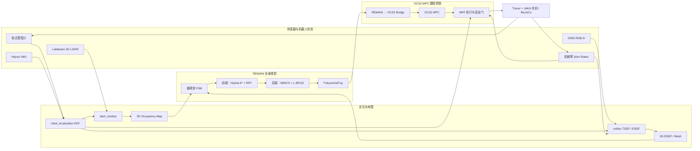
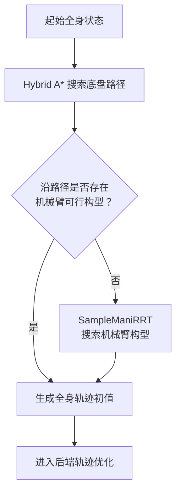
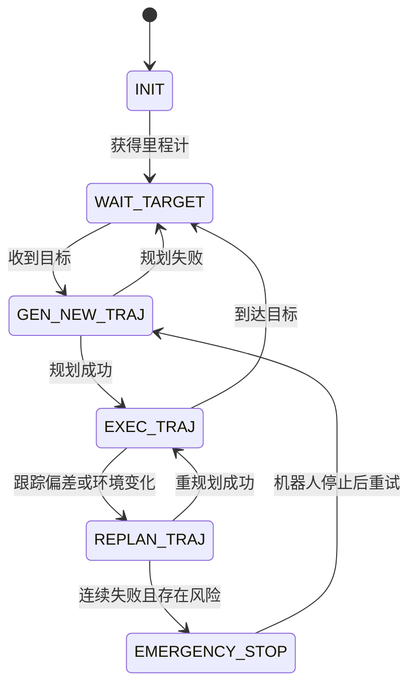
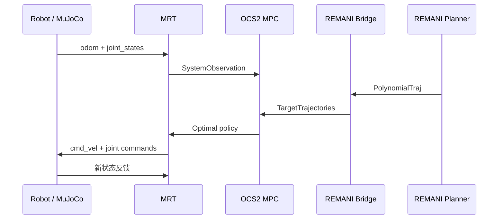
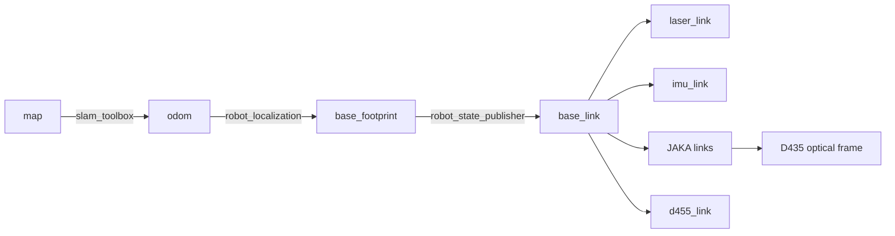
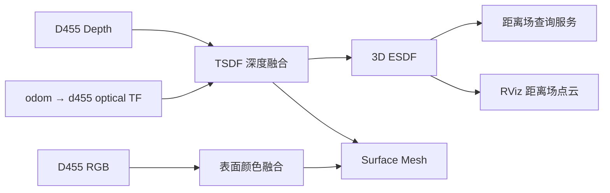

# 移动机械臂规划、控制与三维环境感知系统周报

> 汇报周期：2026.07.25—2026.07.31  
> 汇报人：__________  
> 项目平台：Tracer 移动底盘 + JAKA Zu5 机械臂 + Lakibeam 2D 激光雷达 + Hipnuc IMU + RealSense D455/D435  
> 软件环境：Ubuntu 22.04、ROS 2 Humble、MuJoCo、OCS2、slam_toolbox、Isaac ROS nvblox

---

## 1. 本周工作概述

本周围绕“移动机械臂在未知或半未知环境中的自主运动”这一目标，完成了从全身路径规划、模型预测控制，到机器人定位、二维建图和三维 ESDF 环境建模的系统搭建。

主要工作可以概括为五个部分：

1. 将 REMANI-Planner 从 ROS 1 迁移到 ROS 2 Humble，并解决编译、消息、可视化和目标交互问题；
2. 将 Tracer + JAKA Zu5 实际机器人模型、运动学参数和碰撞模型接入 REMANI；
3. 建立 REMANI 全身轨迹规划器与 OCS2-MPC 跟踪控制器之间的桥接；
4. 使用轮式里程计、IMU 和 2D 激光雷达完成实机定位与 slam_toolbox 二维建图；
5. 在 MuJoCo 和实机中接入 D455，使用 nvblox 建立 TSDF/ESDF 三维距离场，并完成离线 rosbag 建图流程。

### 1.1 本周成果总表

| 模块 | 本周完成内容 | 当前状态 |
|---|---|:---:|
| REMANI ROS 2 迁移 | 消息、CMake、节点、参数、RViz2、手动目标交互适配 | 已完成 |
| 机器人模型接入 | Tracer + JAKA URDF、关节、碰撞球、相机与传感器坐标系 | 已完成 |
| REMANI + OCS2 | `PolynomialTraj` 到 `TargetTrajectories` 的在线桥接 | 已跑通 |
| 定位 | wheel odom + IMU，通过 `robot_localization` 融合 | 已跑通 |
| 2D SLAM | Lakibeam + `slam_toolbox`，输出 `map → odom` | 已跑通 |
| MuJoCo 传感器仿真 | 2D LiDAR、IMU、D455 RGB-D 与真实接口对齐 | 已完成 |
| nvblox 三维建图 | D455 TSDF/ESDF、Mesh、距离场可视化 | 已跑通 |
| 离线建图 | 录制 RGB-D、TF、odom 的 rosbag，Docker 内回放建图 | 已跑通 |
| ESDF 接入 REMANI | 已确认静态 NPZ 接口和规划器距离梯度查询链路 | 接口已具备 |
| ESDF 直接接入 MPC | 在线缓存与 MPC ESDF 约束尚待实现 | 下一阶段 |

---

## 2. 系统总体结构

本周形成的整体系统由“定位建图—全身规划—MPC 跟踪—机器人执行”四层组成。



系统采用统一的 ROS 2 消息接口，因此仿真和实机可以共用主要算法节点：

| 数据 | 仿真接口 | 实机接口 |
|---|---|---|
| 底盘里程计 | `/wheel/odometry` 或 `/base_controller/odom` | `/odom` |
| 融合里程计 | `/odometry/filtered` | `/odometry/filtered` |
| IMU | `/imu/data` | `/IMU_data` |
| 激光雷达 | `/scan` | `/scan` |
| 机械臂状态 | `/joint_states` | `/joint_states` |
| D455 深度图 | `/camera/d455/depth/image_rect_raw` | 同名 |
| D455 彩色图 | `/camera/d455/color/image_raw` | 同名 |
| 全身规划轨迹 | `/planning/trajectory` | 同名 |

---

## 3. REMANI-Planner 的 ROS 2 Humble 迁移

### 3.1 迁移目标

原始 REMANI-Planner 基于 ROS 1。迁移目标并不是只让代码通过编译，而是使其在 ROS 2 Humble 下具备以下完整运行能力：

- 使用 `colcon` 完成全工作空间构建；
- 正确收发 ROS 2 消息；
- 在 RViz2 中显示机器人、搜索路径和优化轨迹；
- 使用 RViz2 的 `2D Goal Pose` 发送真实规划目标；
- 保留原算法的前端搜索、后端优化和重规划逻辑；
- 为后续接入 OCS2-MPC 和实机传感器提供稳定接口。

### 3.2 主要迁移内容

| 类型 | ROS 1 写法或问题 | ROS 2 Humble 适配 |
|---|---|---|
| 构建系统 | `catkin_make`、旧 CMake 依赖 | `ament_cmake`、`colcon build` |
| 时间消息 | `time start_time` | `builtin_interfaces/Time start_time` |
| C++ 消息命名 | `geometry_msgs::Point` | `geometry_msgs::msg::Point` |
| 发布接口 | `publisher.publish(msg)` | `publisher->publish(msg)` |
| 日志 | `ROS_ERROR` 等 | `RCLCPP_ERROR` 等 |
| 消息类型支持 | 旧 typesupport 链接方式 | `rosidl_get_typesupport_target()` |
| 参数 | ROS 1 参数服务器 | ROS 2 Node 参数声明与读取 |
| 可视化 QoS | 普通发布后晚加入 RViz 丢失模型 | `transient_local` 保存模型 Marker |
| 目标输入 | 预设目标触发模式 | 默认改为手动 `PoseStamped` 目标 |

### 3.3 迁移过程中的典型问题

#### （1）消息接口生成失败

`PolyTraj.msg` 中 ROS 1 的裸 `time` 类型无法直接在 ROS 2 Humble 中生成接口，需要改成：

```text
builtin_interfaces/Time start_time
```

#### （2）CMake target 重名

`traj_utils` 的消息接口 target 与同名 C++ 库冲突。将代码库 target 调整为 `traj_utils_core`，并重新链接 ROS 2 typesupport 后解决。

#### （3）RViz2 中没有机器人

机器人模型使用 `visualization_msgs/msg/MarkerArray` 发布到：

```text
/model_vis/vis_mm
```

通过安装 `mm_config/meshes` 资源、修复 Marker 发布，并将 QoS durability 设置为 `transient_local`，保证 RViz2 后启动时仍能收到机器人模型。运行时能够发布 11 个机器人网格 Marker。

#### （4）RViz2 点击目标无效

原程序默认使用预设航点模式。调整为：

```text
fsm.target_type = 1
auto_start = false
```

使 `2D Goal Pose` 的位置和朝向真正作为规划目标，而不是仅作为预设轨迹的触发信号。

### 3.4 ROS 2 包依赖顺序

迁移过程中采用由底层到上层的构建顺序：


最终 REMANI 相关包可以在 ROS 2 Humble 下完整构建，并运行手动目标规划示例。

> **实验视频 1：ROS 2 版 REMANI 在 RViz2 中接收目标并生成轨迹**
>
> 建议插入内容：机器人模型、点击目标、前端搜索路径、后端优化轨迹。

```html
<!-- 将视频放入相对目录后取消注释
<video src="./assets/videos/remani_ros2_planning.mp4" controls width="90%"></video>
-->
```

---

## 4. REMANI 的主要原理

### 4.1 算法定位

REMANI 面向移动机械臂的全身运动规划问题。与“底盘先导航、机械臂再运动”的串行方法不同，REMANI 将底盘位置和机械臂关节统一纳入规划变量：

$$
\mathbf{p}
=
[x_b,\ y_b,\ q_1,\ q_2,\ldots,q_6]^\mathsf{T}
$$

其中底盘航向由平面运动速度方向和前进/后退标志恢复。

核心思想是：

> 前端搜索负责快速找到无碰撞的拓扑可行解；后端连续优化负责获得平滑、动态可行且安全的全身轨迹。

### 4.2 前端：环境自适应搜索

前端包含两部分：

1. **Hybrid A\***：在 $SE(2)$ 空间搜索底盘的 $x、y、yaw$，考虑非完整约束、转向代价、前进/后退和换挡；
2. **机械臂构型采样/RRT**：沿底盘路径搜索机械臂关节空间可行构型，解决机械臂与环境以及机器人自身的碰撞。



### 4.3 后端：MINCO 轨迹优化

后端使用 MINCO 多项式轨迹表示，并通过 L-BFGS 优化中间点和分段时间。

轨迹代价可以概括为：

$$
\begin{aligned}
J =\;&
w_b J_{\text{base-obs}}
+w_m J_{\text{arm-obs}}
+w_s J_{\text{self}} \\
&+w_v J_{\text{velocity}}
+w_a J_{\text{acceleration}}
+w_t J_{\text{time}}
+J_{\text{smooth}}
\end{aligned}
$$

主要约束包括：

- 底盘与环境障碍物距离；
- 机械臂与环境障碍物距离；
- 底盘与机械臂自碰撞；
- 机械臂连杆间自碰撞；
- 底盘速度、加速度及转向约束；
- 机械臂关节位置、速度和加速度约束；
- 轨迹连续性和平滑性。

### 4.4 ESDF 在 REMANI 中的作用

机器人使用多个碰撞球近似底盘和机械臂几何。对于第 $i$ 个碰撞球，安全条件为：

$$
d(\mathbf{p}_i)-r_i-d_{\text{safe}} \ge 0
$$

其中：

- $d(\mathbf{p}_i)$：碰撞球中心到最近障碍物的 ESDF 距离；
- $r_i$：碰撞球半径；
- $d_{\text{safe}}$：额外安全距离。

后端同时查询 ESDF 距离和梯度：

$$
\nabla d(\mathbf{p}_i)
$$

梯度指示“远离最近障碍物”的方向，可以直接参与轨迹优化。

### 4.5 重规划状态机



当前集成还增加了基于实测状态的跟踪误差重规划：当底盘位置、航向或机械臂关节误差持续超过阈值时，从最新实测状态重新生成轨迹，避免控制器已经落后但规划器仍按旧时间轴运行。

---

## 5. 将实际机器人加入 REMANI

### 5.1 机器人组成

本项目的移动机械臂由以下部分组成：

- Tracer 差速移动底盘；
- JAKA Zu5 六自由度机械臂；
- DH AG95 夹爪；
- 底盘固定 D455，用于三维环境建图；
- 机械臂末端 D435，用于后续抓取识别；
- Lakibeam 2D 激光雷达，用于定位和二维建图；
- Hipnuc IMU，用于提高局部姿态与里程计稳定性。

### 5.2 URDF 与运动学接入

以实际机器人对应的 `tracer_jaka_zu5.urdf` 为统一模型来源，完成：

- `base_footprint → base_link → Link_0 → Link_1...Link_6` 运动链；
- JAKA 六个关节的轴、原点和限位；
- 底盘与机械臂固定安装变换；
- D455、D435、LiDAR、IMU 的固定或动态 TF；
- 可视化 mesh 和碰撞几何；
- 底盘、机械臂、末端工具和相机的碰撞球模型。

机器人碰撞模型采用多个不同半径的球体近似。与统一使用大半径相比，逐连杆配置球半径能够减少机械臂折叠姿态下的假碰撞。

### 5.3 仿真与实机的一致接口

MuJoCo 中的传感器位置、方向和话题尽可能与实机一致：

| 传感器 | Frame | 作用 |
|---|---|---|
| Lakibeam | `laser_link` | 单层 2D 扫描、SLAM |
| Hipnuc IMU | `imu_link` | 角速度、局部姿态融合 |
| D455 | `d455_link` 及 optical frames | 固定视角三维环境建图 |
| D435 | 末端相机 link 及 optical frames | 抓取识别与局部观测 |

这样可以在 MuJoCo 中先验证算法，再通过替换传感器驱动迁移到实机。

> **实验图片 1：Tracer + JAKA + D455/D435 的 URDF 与 MuJoCo 模型**
>
> 建议并排放置 URDF/RViz 和 MuJoCo 截图，并标出四类传感器位置。

```html
<!--

-->
```

---

## 6. REMANI-MPC 的核心结构

### 6.1 为什么需要规划器与 MPC 两层

REMANI 和 OCS2-MPC 解决的问题不同：

| 层级 | 核心任务 | 时间尺度 |
|---|---|---|
| REMANI | 在复杂环境中搜索并优化全身无碰撞轨迹 | 较低频、长预测范围 |
| OCS2-MPC | 根据当前实测状态滚动优化并跟踪参考轨迹 | 高频、短预测范围 |
| MRT | 执行最新策略、发布底盘和机械臂命令、进行安全检查 | 控制频率 |

因此系统采用“规划器提供全局参考，MPC 负责在线跟踪”的层次化结构。

### 6.2 状态与输入

OCS2 中的移动机械臂状态定义为：

$$
\mathbf{x}
=
[x_b,\ y_b,\ \theta_b,\ q_1,\ldots,q_6]^\mathsf{T}
\in \mathbb{R}^{9}
$$

控制输入定义为：

$$
\mathbf{u}
=
[v,\ \omega,\ \dot q_1,\ldots,\dot q_6]^\mathsf{T}
\in \mathbb{R}^{8}
$$

其中：

- $v$：底盘线速度；
- $\omega$：底盘角速度；
- $\dot q_1 \ldots \dot q_6$：机械臂关节速度。

### 6.3 REMANI 到 OCS2 的轨迹桥接

REMANI 输出八维多项式轨迹：

```text
[x, y, q1, q2, q3, q4, q5, q6]
```

桥接节点根据多项式位置与解析速度恢复 OCS2 所需的状态和输入：

```text
REMANI PolynomialTraj
        ↓ 多项式采样
x, y, q 以及 dx/dt, dy/dt, dq/dt
        ↓ 航向与底盘速度重建
OCS2 TargetTrajectories
        ↓
MPC / MRT
```

底盘航向和输入由轨迹速度恢复：

$$
\theta_b=\operatorname{atan2}(\dot y,\dot x)
$$

$$
v=\sqrt{\dot x^2+\dot y^2}
$$

同时考虑 REMANI 中的前进/后退 `singul` 标记。

桥接节点使用当前 `MpcObservation` 作为时间和状态锚点，持续发布滚动参考窗口，而不是一次性发送整条轨迹。

### 6.4 MPC 在线闭环



MRT 层包含执行安全门：只有当策略时间有效、状态有限、策略未过期且命令满足限制时，才向真实执行器发送控制量。

### 6.5 已验证结果

在 MuJoCo 无头仿真中，向 `(0.5, 0.0)` 发送目标后：

1. REMANI FSM 从 `WAIT_TARGET` 进入 `GEN_NEW_TRAJ`；
2. 成功生成一条八维全身多项式轨迹；
3. FSM 进入 `EXEC_TRAJ`；
4. Bridge 组装出约 `3.978 s` 的全身参考轨迹；
5. 发布包含九维状态、八维输入的 OCS2 `TargetTrajectories`。

> **实验视频 2：REMANI 规划轨迹与 OCS2-MPC 闭环跟踪**

```html
<!--
<video src="./assets/videos/remani_ocs2_tracking.mp4" controls width="90%"></video>
-->
```

---

## 7. 机器人定位与二维 SLAM

### 7.1 为什么不能只使用轮式里程计

轮式里程计通过轮速积分估计机器人位姿，容易受到以下因素影响：

- 轮胎打滑；
- 地面不平；
- 左右轮半径和编码器误差；
- 转向过程中的积分误差；
- 长时间运行后的航向累计漂移。

仅依赖 wheel odom 时，位置和航向误差会随时间持续累积。因此采用以下融合结构：

```text
wheel odom + IMU → robot_localization → odometry/filtered
                                          ↓
                         LaserScan → slam_toolbox
                                          ↓
                                      map → odom
```

### 7.2 TF 责任划分

为了避免 TF 冲突，每条动态变换只由一个节点发布：



| TF | 发布节点 |
|---|---|
| `map → odom` | `slam_toolbox` |
| `odom → base_footprint` | `robot_localization` |
| 机器人固定和机械臂 TF | `robot_state_publisher` |

### 7.3 LiDAR 与 IMU 的仿真实现

MuJoCo 中将原三维雷达改为与实机 Lakibeam 对应的单层 2D `LaserScan`：

- 扫描范围与实机角度配置对应；
- 将安装方向放在 TF 中表达，避免消息角度和 URDF 同时旋转；
- 处理机器人自身结构遮挡；
- 传感器频率与 MuJoCo 物理步进解耦。

同时在机器人上方板件位置加入 IMU site，并输出与实机一致的 `sensor_msgs/Imu` 接口。

### 7.4 典型问题与解决方法

| 问题 | 原因 | 处理 |
|---|---|---|
| `/scan` QoS 不兼容 | 雷达与 RViz/slam_toolbox reliability 不一致 | 统一 SensorData QoS |
| Message Filter 队列满 | TF 不完整或时间戳不能对齐 | 修复完整 TF 链和仿真时间 |
| TF future extrapolation | `/scan` 时间超前于对应 TF | 统一 `/clock`、传感器与 TF 时间来源 |
| 雷达在 RViz 中向后 | 安装 yaw 与扫描角偏移重复 | 将方向统一放在 URDF/MJCF TF |
| 多个 `odom → base` | 驱动、EKF 同时发布 TF | 关闭重复 TF 发布者 |

### 7.5 二维地图结果

实机已经完成 slam_toolbox 建图，并保存二维占据地图：

- `maps/factory_map.yaml` + `factory_map.pgm`
- `maps/map_1785229365.yaml` + `map_1785229365.pgm`

2D 地图后续主要负责：

- 全局定位；
- 底盘全局路径和可通行区域；
- 提供稳定的 `map → odom`；
- 补充 D455 视场之外的墙壁和大型障碍。

> **实验视频 3：实机移动、激光扫描与 slam_toolbox 实时建图**

```html
<!--
<video src="./assets/videos/real_robot_slam.mp4" controls width="90%"></video>
-->
```

> **实验图片 2：保存后的二维地图**

```html
<!--

-->
```

---

## 8. 使用 nvblox 建立三维 ESDF 地图

### 8.1 传感器分工

最终采用：

| 传感器 | 安装位置 | 主要用途 |
|---|---|---|
| D455 | 底盘固定位置 | 持续建立环境 TSDF/ESDF |
| D435 | 机械臂末端 | 抓取目标识别和近距离精细观测 |

将 D455 固定在底盘上，可以避免末端相机随机械臂快速运动造成大范围 TF 变化，更适合作为持续环境建图相机。

### 8.2 nvblox 地图表示

nvblox 主要构建两类地图：

1. **TSDF**：融合深度图，估计空间中的隐式表面；
2. **ESDF**：在 TSDF/占据结果基础上计算每个体素到最近障碍物的有符号距离。

ESDF 对规划的意义是：规划器不仅知道哪里被占据，还能获得当前位置到最近障碍物的距离和梯度。



### 8.3 MuJoCo 到实机的统一流程

#### MuJoCo

```text
MuJoCo D455 RGB-D + CameraInfo + TF
                ↓
Docker 中 my_nvblox_bringup
                ↓
TSDF / ESDF / Mesh
```

#### 实机

```text
NUC：D455 驱动 + robot TF + localization
                ↓ 局域网 / DDS
笔记本 Docker：my_nvblox_bringup + GPU
                ↓
TSDF / ESDF / Mesh
```

由于实时跨机器传输 RGB-D 对网络时延和丢包较敏感，又增加了离线 rosbag 流程：

```text
NUC 本地 SSD 录制 RGB-D + TF + odom
                ↓ 复制完整 bag
Docker 隔离 ROS_DOMAIN_ID 回放
                ↓
低速、稳定地离线构建 ESDF
```

### 8.4 当前稳定接口

| 接口 | 作用 |
|---|---|
| `/camera/d455/depth/image_rect_raw` | D455 深度图 |
| `/camera/d455/depth/camera_info` | 深度相机内参 |
| `/camera/d455/color/image_raw` | RGB 图像和 Mesh 着色 |
| `/tf`、`/tf_static` | 相机与机器人位姿 |
| `/nvblox_node/mesh` | 融合后的表面 Mesh |
| `/nvblox_node/esdf_3d_pointcloud` | 有界、下采样的 ESDF 可视化 |
| `/nvblox_node/get_esdf_and_gradient` | 规划器使用的稠密 ESDF 查询服务 |

### 8.5 显存与数据量优化

实机与离线回放中曾出现 CUDA Out Of Memory。主要原因是三维体素数量随分辨率呈立方增长：

$$
N_{\text{voxel}}
\propto
\frac{L_xL_yL_z}{r^3}
$$

当体素分辨率从 $10\,\text{cm}$ 提升到 $5\,\text{cm}$ 时，理论体素数量约增加：

$$
\left(\frac{0.10}{0.05}\right)^3=8
$$

因此采用不同配置：

| 场景 | 推荐体素尺寸 | 地图策略 |
|---|---:|---|
| 实时局部规划 | 5 cm | 有界滚动地图 |
| 4 GB GPU 离线大范围建图 | 10 cm | 持久融合、限制查询范围 |
| RViz 显示 | 不改变实际 ESDF | 降低显示频率并下采样 |

RViz 中只显示接近障碍物的体素：

```text
|ESDF distance| ≤ 0.5 m
```

这样保留了障碍物附近对规划最有价值的距离信息，同时显著减少可视化数据量。

### 8.6 典型问题与解决方法

| 问题 | 原因 | 解决方式 |
|---|---|---|
| `odom` frame 不存在 | Docker 未收到 `/tf` 或 `/clock` | 统一 DDS、Domain ID、TF QoS 和 bag 话题 |
| optical frame 离机器人很远 | 相机驱动 frame 与 URDF 重复或不一致 | 使 RealSense 根 frame 对齐 `d455_link` |
| ESDF 旋转 90° | 相机 link 与 optical frame 轴定义混淆 | 使用 ROS optical frame：x 右、y 下、z 前 |
| 机器人移动后地图消失 | nvblox 清除半径或 RViz 查询窗口跟随机器人 | 关闭地图清除或固定查询中心 |
| 只能看到反投影深度点 | 3D ESDF 默认不持续发布完整点云 | 主动查询有界 ESDF 并发布可视化点云 |
| CUDA OOM | 体素太细、地图范围过大 | 10 cm 体素、限制 AABB、降低显示频率 |
| bag 无法打开 | 压缩未完成或 recorder 被强制杀死 | `Ctrl+C` 后等待 zstd 正常完成 |
| 回放后没有 TF | 录制/回放 `/tf` QoS 不匹配 | 录制 best effort，回放 reliable |

> **实验视频 4：MuJoCo D455 输入与 nvblox ESDF/Mesh**

```html
<!--
<video src="./assets/videos/mujoco_nvblox_esdf.mp4" controls width="90%"></video>
-->
```

> **实验视频 5：实机 rosbag 离线回放建立三维地图**

```html
<!--
<video src="./assets/videos/real_d455_bag_nvblox.mp4" controls width="90%"></video>
-->
```

---

## 9. 2D 地图、3D ESDF 与规划控制的关系

二维地图和三维 ESDF 不是相互替代关系，而是面向不同任务：

| 地图 | 优势 | 主要使用者 |
|---|---|---|
| 2D Occupancy Grid | 范围大、数据量小、适合定位和底盘通行判断 | slam_toolbox、全局导航 |
| 3D ESDF | 表达高度、桌面、悬空物体，并提供距离梯度 | REMANI、机械臂避障、后续 MPC |

推荐的坐标系策略是：

- `map`：长期全局地图和定位坐标系；
- `odom`：局部连续控制坐标系；
- `map → odom`：由 slam_toolbox 根据定位结果修正；
- nvblox 实时局部 ESDF：优先工作在连续的 `odom`；
- 长期保存的 ESDF：SLAM 优化完成后再转换到 `map`。

### 9.1 当前 ESDF 接入 REMANI 的情况

REMANI 的 `GridMap` 已经支持直接加载以下 NPZ：

```text
esdf         float32[nx, ny, nz]
occupancy    bool[nx, ny, nz]
origin       float32[3]
voxel_size   float32
bounds_max   float32[3]
```

轨迹优化器已经对底盘和机械臂碰撞球调用 ESDF 距离与梯度查询。因此可以将 nvblox 的稠密查询结果导出为上述 NPZ，直接替换当前 MuJoCo 静态 ESDF。

### 9.2 当前尚未完成的部分

目前 REMANI 到 OCS2 的 Bridge 只传递轨迹参考，不传递地图。

OCS2-MPC 当前的环境碰撞约束仍以配置文件中的静态 box、sphere、cylinder 为主。因此：

- REMANI 可以根据 ESDF 生成绕障轨迹；
- OCS2 可以跟踪该无碰撞轨迹；
- 但 OCS2 尚不能独立对 nvblox 中突然出现的动态障碍物作出局部 ESDF 避障。

这也是下一阶段的核心工作。

---

## 10. 本周实验验证情况

| 编号 | 实验内容 | 验证指标 | 结果 |
|:---:|---|---|:---:|
| 1 | REMANI ROS 2 编译 | 规划相关包完整构建 | 通过 |
| 2 | RViz2 模型显示 | 机器人 mesh Marker 可见 | 通过 |
| 3 | 手动目标规划 | `2D Goal Pose` 触发真实目标规划 | 通过 |
| 4 | REMANI-OCS2 Bridge | 发布 9 维状态、8 维输入参考 | 通过 |
| 5 | MuJoCo 2D SLAM | 完整 `map → odom → base` TF 和地图 | 通过 |
| 6 | 实机定位与建图 | odom、IMU、LaserScan 融合并保存地图 | 通过 |
| 7 | MuJoCo D455 nvblox | 深度融合、Mesh 和三维 ESDF 显示 | 通过 |
| 8 | 实机 D455 nvblox | 实时 RGB-D 输入与 ESDF 建图 | 通过 |
| 9 | rosbag 离线建图 | RGB-D、TF、odom 回放并持续融合 | 通过 |
| 10 | 大范围 ESDF 显示 | 限距、降频、下采样后稳定显示 | 通过 |

### 10.1 建议组会展示顺序

1. 先展示一张总体架构图，说明本周已连接哪些模块；
2. 播放 REMANI ROS 2 规划视频；
3. 播放 REMANI + OCS2-MPC 跟踪视频；
4. 展示实机 2D SLAM 建图；
5. 展示 D455/nvblox 的 Mesh 和 ESDF；
6. 最后用“当前限制与下一步”说明 ESDF 接入 MPC 的工作。

---

## 11. 当前存在的问题

### 11.1 nvblox ESDF 尚未直接进入 OCS2-MPC

当前最重要的接口缺口是：OCS2 求解器尚未读取实时 ESDF。

不能在 MPC 每次迭代中直接调用 ROS service，因为网络和服务延迟会破坏求解实时性。更合适的结构是：


对于每个机器人碰撞球，MPC 约束为：

$$
h_i(\mathbf{x})
=
d(\mathbf{p}_i(\mathbf{x}))
-r_i-d_{\text{safe}}
\ge 0
$$

线性化所需梯度为：

$$
\frac{\partial h_i}{\partial \mathbf{x}}
=
\nabla d(\mathbf{p}_i)^\mathsf{T}
J_{\mathbf{p}_i}(\mathbf{x})
$$

其中 $J_{\mathbf{p}_i}$ 可以由 Pinocchio 机器人运动学计算。

### 11.2 2D 与 3D 地图融合策略仍需确定

直接将 2D 障碍整列拉伸为三维障碍虽然保守，但可能禁止机械臂从桌面或低矮物体上方通过。

更合理的方式可能是：

- 2D 地图主要约束底盘；
- 3D ESDF 同时约束底盘与机械臂；
- 对 D455 未观察区域采用可配置的保守策略；
- 在 `map` 和 `odom` 之间明确在线地图与持久地图的职责。

### 11.3 实时跨机器 RGB-D 通信仍受网络影响

NUC 与笔记本 Docker 通过局域网传输 RGB-D 时，可能出现延迟和丢帧。当前采用 rosbag 离线建图保证实验稳定；后续可进一步评估：

- 降低 RGB-D 帧率或分辨率；
- 使用有线千兆网络；
- 调整 DDS transport 和 QoS；
- 将 GPU 主机或 Jetson 部署到机器人本体。

---

## 12. 下周工作计划

| 优先级 | 任务 | 预期结果 |
|:---:|---|---|
| P0 | 编写 nvblox ESDF 导出节点 | 将有界 ESDF 保存为 REMANI 兼容 NPZ |
| P0 | 在 REMANI 中加载实机 ESDF | 使用 D455 三维地图生成底盘/机械臂避障轨迹 |
| P1 | 建立实时 ESDF 内存缓存 | 避免 MPC 求解过程中调用 ROS service |
| P1 | 实现 OCS2 ESDF 环境约束 | MPC 对突然出现的障碍物产生局部避障响应 |
| P1 | 统一 `map/odom` 坐标策略 | 支持实时局部地图和长期持久地图 |
| P2 | 2D Occupancy 与 3D ESDF 分层融合 | 底盘利用大范围 2D 地图，机械臂利用 3D 信息 |
| P2 | 完成仿真—实机对比实验 | 比较定位误差、规划时间、最小障碍距离和跟踪误差 |

计划先在 MuJoCo 中验证完整闭环：

```text
D455 → nvblox ESDF → REMANI 规划 → OCS2 MPC → MuJoCo 执行
```

验证通过后再迁移到实机，降低直接调试真实机器人时的风险。

---

## 13. 总结

本周完成了移动机械臂自主运动系统的主体框架：

- REMANI-Planner 已完成 ROS 2 Humble 迁移；
- 实际 Tracer + JAKA 机器人模型已经接入规划和控制；
- REMANI 与 OCS2-MPC 的轨迹接口已经跑通；
- wheel odom、IMU、2D LiDAR 定位与 slam_toolbox 建图已经在实机验证；
- D455 已在 MuJoCo 和实机中接入 nvblox，能够建立三维 TSDF、Mesh 和 ESDF；
- 离线 RGB-D rosbag 建图解决了跨机器通信不稳定的问题；
- 已明确下一阶段从 nvblox ESDF 到 REMANI 和 OCS2-MPC 的集成路径。

本周工作的主要意义是：系统已经从各模块独立运行，推进到了规划、控制、定位和三维感知可以通过统一 ROS 2 接口串联的阶段。下一步重点将从“地图可见”转向“规划器和控制器真正使用距离场进行全身避障”。

---

## 附录 A：核心代码位置

| 模块 | 代码位置 |
|---|---|
| REMANI FSM | `src/remani_planner/plan_manage/src/remani_replan_fsm.cpp` |
| Planner Manager | `src/remani_planner/plan_manage/src/planner_manager.cpp` |
| Hybrid A* | `src/remani_planner/path_searching/src/kino_astar.cpp` |
| 机械臂 RRT | `src/remani_planner/path_searching/src/sample_mani_RRT.cpp` |
| MINCO/L-BFGS 优化 | `src/remani_planner/traj_opt/src/poly_traj_optimizer.cpp` |
| GridMap/ESDF | `src/remani_planner/plan_env/src/grid_map.cpp` |
| 机器人碰撞模型 | `src/remani_planner/mm_config/src/mm_config.cpp` |
| REMANI→OCS2 Bridge | `src/tracer_jaka/tracer_jaka_ocs2/src/remani_to_ocs2_reference_bridge.cpp` |
| OCS2 MPC | `src/tracer_jaka/tracer_jaka_ocs2/src/TracerJakaMpcNode.cpp` |
| OCS2 MRT | `src/tracer_jaka/tracer_jaka_ocs2/src/TracerJakaMrtNode.cpp` |
| MuJoCo Bridge | `src/tracer_jaka/tracer_jaka_mujoco/tracer_jaka_mujoco/mujoco_bridge_node.py` |
| 实机 SLAM Launch | `src/tracer_jaka/tracer_jaka_mujoco/launch/real_slam.launch.py` |
| D455 rosbag 录制 | `src/tracer_jaka/tracer_jaka_mujoco/launch/record_d455_esdf_bag.launch.py` |
| nvblox Bringup | `/home/a/workspaces/isaac_ros-dev/src/my_nvblox_bringup` |

---

## 附录 B：组会展示素材清单

- [ ] REMANI ROS 2 编译成功终端截图
- [ ] RViz2 中机器人模型与前后端轨迹截图
- [ ] REMANI 手动目标规划视频
- [ ] OCS2-MPC 跟踪视频
- [ ] 实机 2D SLAM 建图视频
- [ ] 保存后的二维地图截图
- [ ] MuJoCo D455 深度图与 RGB 图截图
- [ ] nvblox Mesh 截图
- [ ] ESDF 障碍物邻域点云截图
- [ ] 实机 rosbag 离线回放建图视频
- [ ] GPU 显存与建图参数对比表

建议素材目录：

```text
assets/
├── images/
│   ├── system_overview.png
│   ├── robot_urdf_and_mujoco.png
│   ├── slam_2d_map.png
│   └── nvblox_esdf.png
└── videos/
    ├── remani_ros2_planning.mp4
    ├── remani_ocs2_tracking.mp4
    ├── real_robot_slam.mp4
    ├── mujoco_nvblox_esdf.mp4
    └── real_d455_bag_nvblox.mp4
```
