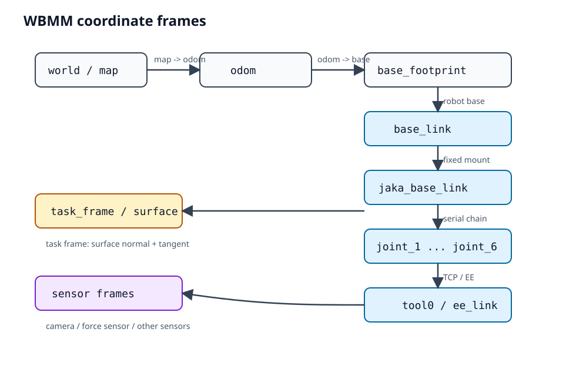

# WBMM 文档契约

> Status: ACTIVE  
> Author: Agent  
> Reviewer: TBD  
> Reviewed at: TBD  
> Warning: 本文档尚未经过人工审查，不能作为实现依据。

> 本文件定义 `docs/` 目录下所有文档的编写约定。当前目录中的文档以 Markdown 为主，公式使用 Typora 兼容的 LaTeX，图片统一放在 `docs/img/` 下。

## 1. 文件类型

- 文档主要使用 `.md` 文件。
- 不使用 Word / PDF / 图片作为唯一信息载体。
- 如果必须提供图表，优先使用 Markdown + Mermaid 或 SVG。
- 不把可执行脚本、ROS 配置、C++ 源码放进 `docs/`，除非它是文档生成工具的一部分。

## 2. 公式约定

- 行内公式使用：

```text
$...$
```

- 独立公式块必须以 `$$` 开始、以 `$$` 结束：

```latex
$$
x = [x_b, y_b, \psi_b, q_1, \dots, q_6]^T
$$
```

- 公式必须能在 Typora 中直接阅读，避免使用 Typora 不支持的自定义宏。
- 多行公式使用 `aligned`：

```latex
$$
\begin{aligned}
\dot{x}_b &= v\cos\psi_b \\
\dot{y}_b &= v\sin\psi_b \\
\dot{\psi}_b &= \omega
\end{aligned}
$$
```

- 变量命名必须与 `docs/math_contract.md` 保持一致。
- 不要在正文中写裸变量歧义，例如不要只写 `x`，优先写 `x_b`、`x_{ee}`、`x_{task}` 等。

## 3. 图片约定

- 所有图片放置在：

```text
docs/img/
```

- 图片文件名使用小写字母、数字和下划线，不要使用空格。
- 推荐格式：

```text
.svg
.png
.jpg
```

- 优先使用 SVG，矢量图更适合坐标树、数据流和架构图。
- 在 Markdown 中使用相对路径引用：

```markdown

```

- 不要把图片放在仓库根目录、`docs/` 根目录或外部临时路径。
- 如果图片来自外部，必须在文档中说明来源，并确认许可证允许使用。

## 4. 目录约定

```text
docs/
├── README.md                       # 本文件：文档契约
├── math_contract.md                # 数学与接口契约
├── human_review_standard.md        # 人工审查标准
├── agent_output_standard.md        # Agent 输出文档标准
├── img/                            # 所有文档图片
│   └── README.md                   # 图片目录说明
└── ...
```

- 一个主题可以拆成多个 `.md`，但它们必须在本文件或相关索引中登记。
- 如果新增了重要文档，应更新本文件的“文档索引”。

## 5. 文档索引

| 文档 | 内容 |
|---|---|
| `README.md` | 文档编写契约、公式、图片、目录约定 |
| `math_contract.md` | 输入输出、坐标系、轨迹定义、任务定义、力控定义 |
| `human_review_standard.md` | 人工审查标准、审查流程、审查清单 |
| `agent_output_standard.md` | Agent 输出文档标准、禁止事项、交付检查表 |

## 6. 修改原则

- 先改契约，再改代码。
- 变量语义、维度、单位、坐标系发生变化时，必须在本文件或 `math_contract.md` 中明确记录。
- 如果实现与契约不一致，以契约中的语义为准，并尽快修正实现或更新契约。
