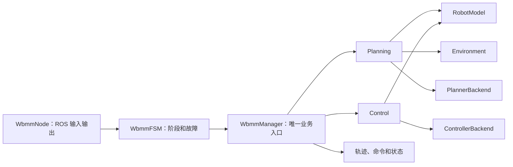

# WBMM 简化重构与代码掌控计划

> 版本：科研快速开发版 v3
>
> 日期：2026-09-05
>
> 目标：主链简单、代码容易找到、一次 launch 可以运行，同时保留更换机器人和算法后端的能力。

---

## 1. 为什么简化

上一版按照长期产品化思路拆出了 core、math、interfaces、ROS converters、execution、bringup、platform 和多个 adapter 包。边界完整，但科研阶段会出现三个问题：

1. 实现一个功能需要跨多个包修改；
2. 部署前需要组合大量包、配置和 launch；
3. 接口数量超过当前真实替换需求，容易为了架构而写架构。

本次调整采用：

> **像 REMANI 一样保留一条清晰主链，但不照搬它对 ROS 和具体实现的强耦合。**

当前阶段先建立可以理解、可以运行、可以实验的科研主程序。只有真实出现独立复用、依赖隔离或部署需求时才拆包。

---

## 2. REMANI Planner 源码审查结论

本次审查以仓库实际代码为准：

- 主入口：`src/vendor/remani_planner/plan_manage/src/remani_planner_node.cpp`；
- 状态机：`plan_manage/remani_replan_fsm.*`；
- 规划编排：`plan_manage/planner_manager.*`；
- 环境：`plan_env/GridMap`；
- 机器人模型：`mm_config/MMConfig`；
- 搜索：`path_searching`；
- 优化：`traj_opt/PolyTrajOptimizer`；
- 轨迹：`traj_utils`；
- 部署入口：`plan_manage/launch/sim_example.py`。

### 2.1 它真正简单的地方

REMANI 并不是单包工程。当前代码由多个相互依赖的 ROS 包组成，但开发者始终沿着一条主链工作：

```text
remani_planner_node
        ↓
REMANIReplanFSM
        ↓
MMPlannerManager
        ├── GridMap
        ├── MMConfig
        ├── 前端搜索
        └── PolyTrajOptimizer
        ↓
PolynomialTraj
```

它的开发体验简单，主要因为：

- 一个 node 是系统入口；
- 一个 FSM 管运行阶段；
- 一个 Manager 串联算法；
- Eigen 直接用于算法数据；
- 一组 YAML 管参数；
- 一个 launch 同时启动仿真、规划器和 RViz。

### 2.2 不应该照搬的地方

源码也显示出一些不适合 WBMM 长期复用的特征：

- ROS 类型和 `rclcpp::Node` 进入多个算法包；
- Manager 直接构造具体 `GridMap`、`MMConfig` 和优化器；
- 多个包之间形成较密的编译依赖；
- `MinSnapOpt<8>` 等维度出现在实现合同中；
- 平台 description 以运行依赖进入主规划包；
- 更换机器人、地图或控制后端时修改面较大。

因此 WBMM 只借鉴它的“单主链、单入口、直接组合”，不复制具体耦合。

---

## 3. 简化原则

### 3.1 只在三种情况下拆包

满足以下任一条件才新建 ROS/CMake 包：

1. 需要被两个以上独立程序复用；
2. 依赖很重或可选，需要独立编译；
3. 需要独立部署、发布或硬件资源隔离。

仅仅“职责不同”不构成拆包理由。职责不同优先使用同一个包内的 C++ 子目录和类边界。

### 3.2 只抽象真实变化点

当前只保留四个稳定接口：

```text
RobotModel         # FK、Jacobian、关节限制和碰撞几何
Environment        # 距离、占据和环境版本
PlannerBackend     # 状态、任务和环境 → 全身轨迹
ControllerBackend  # 参考和反馈 → 全身命令
```

其余类直接组合。暂不把 StateProvider、CommandSink、Navigation、TaskProvider、Ownership 等全部设计成 Port。

### 3.3 配置表达机器人差异

通用包和源文件不得包含具体机器人名称。机器人差异放入 profile：

```text
config/profiles/platform_v1/
├── robot.yaml
├── joints.yaml
├── frames.yaml
└── controllers.yaml
```

迁移到另一机器人时增加 `platform_v2`，不复制和重命名算法包。

### 3.4 先直接，重复后再抽象

- 第一次实现放在最容易找到的位置；
- 第二次出现相同逻辑时提取函数；
- 出现第二个后端时再稳定接口；
- 出现第二个独立程序时再拆包。

---

## 4. 目标架构：一个核心库、一个主程序



### 4.1 `wbmm_core`：稳定 C++ 基础

负责：

- 全身状态、输入、轨迹、环境快照和结果；
- frame、单位、时间、关节名称和错误语义；
- Eigen 转换和机器人无关数学工具；
- 上述四个稳定接口。

不负责 ROS node、具体规划/控制算法、具体机器人模型、硬件和场景编排。

为了减少包数量，目标形态把当前实验性的 `wbmm_math` 合并为 `wbmm_core/math/`。Eigen 成为 `wbmm_core` 的允许依赖，但领域结构仍使用普通 C++ 字段，只有算法和转换函数使用 Eigen。

### 4.2 `wbmm`：科研主程序包

负责：

- `WbmmNode`：ROS 输入输出和 TF 转换；
- `WbmmFSM`：运行阶段、重规划、停止和故障；
- `WbmmManager`：串联规划、控制、环境和机器人模型；
- planning/control 算法和 backend 实现；
- 配置、任务、launch 和 RViz；
- 仿真/实机模式选择。

这些职责放在一个包中，通过 C++ 子目录分开，不通过 ROS 包分开。

### 4.3 `vendor`：保持外部项目边界

REMANI、OCS2 等上游代码继续保存在 `vendor/`，不为了统一目录而改写其内部包结构。WBMM 主程序只通过少量 backend 类调用它们。

---

## 5. 简化后的目录

```text
src/
├── core/
│   └── wbmm_core/                    # 唯一基础库
│       ├── include/wbmm_core/
│       │   ├── types.hpp
│       │   ├── result.hpp
│       │   ├── validation.hpp
│       │   ├── math/
│       │   └── interfaces.hpp
│       ├── src/
│       └── test/
│
├── wbmm/                             # 唯一主程序包
│   ├── include/wbmm/
│   │   ├── manager.hpp
│   │   ├── fsm.hpp
│   │   ├── planning/
│   │   ├── control/
│   │   └── backends/
│   ├── src/
│   │   ├── node.cpp
│   │   ├── manager.cpp
│   │   ├── fsm.cpp
│   │   ├── planning/
│   │   ├── control/
│   │   └── backends/
│   ├── config/
│   │   ├── common.yaml
│   │   ├── profiles/platform_v1/
│   │   └── tasks/
│   ├── launch/
│   │   ├── sim.launch.py
│   │   └── real.launch.py
│   ├── rviz/
│   └── test/
│
└── vendor/                           # 外部项目，不强制改名
    ├── remani_planner/
    └── ocs2_ros2/
```

暂不创建：

- `wbmm_ros`；
- `wbmm_execution`；
- 独立 `wbmm_bringup`；
- 每个 backend 一个 adapter 包；
- description/hardware/simulation 各自一个 platform 包；
- 没有实际使用者的 interfaces 包。

如果自定义 ROS 消息真正被多个进程共享，再单独建立 `wbmm_interfaces`。这是 ROS 构建要求带来的拆包，不是预先设计。

---

## 6. 唯一主数据流

```text
ROS state / task / environment
            ↓
         WbmmNode
            ↓  转成 wbmm_core 类型
          WbmmFSM
            ↓
        WbmmManager
            ├── PlannerBackend.plan()
            ├── ControllerBackend.update()
            ├── RobotModel FK/Jacobian/limits
            └── Environment distance/collision
            ↓
trajectory / command / status
            ↓
         WbmmNode
            ↓
ROS controller / visualization / log
```

阅读代码只需要按顺序：

```text
node.cpp → fsm.cpp → manager.cpp → planning/ 或 control/ → backends/
```

---

## 7. 最小核心合同

第一版只冻结：

```text
WholeBodyState
WholeBodyInput
TaskTrajectory
WholeBodyTrajectory
EnvironmentSnapshot
PlanningResult
ControlStatus
Fault
```

通用表达不固定机械臂自由度。当前差速底盘六关节后端继续使用：

```text
x = [base_x, base_y, base_yaw, q1, q2, q3, q4, q5, q6]  # 9D
u = [base_v, base_yaw_rate, qdot1, qdot2, qdot3, qdot4, qdot5, qdot6]  # 8D
```

转换函数按 `joint_names` 映射，禁止猜测顺序、截断或静默补零。

---

## 8. 四个接口的最小形态

接口只表达算法能力，不表达 ROS 通信方式：

```cpp
class RobotModel {
public:
  virtual Result<Pose> forwardKinematics(const WholeBodyState &) = 0;
  virtual Result<Matrix> jacobian(const WholeBodyState &) = 0;
  virtual Status validate(const WholeBodyState &) = 0;
};

class Environment {
public:
  virtual Result<EnvironmentSnapshot> snapshot() = 0;
  virtual Result<double> distance(const EnvironmentSnapshot &, const Vector3 &) = 0;
};

class PlannerBackend {
public:
  virtual PlanningResult plan(const PlanningRequest &) = 0;
};

class ControllerBackend {
public:
  virtual Result<WholeBodyInput> update(const ControlRequest &) = 0;
};
```

超时、取消、freshness 等先作为 request 字段或 Manager 规则实现，不为每个概念单独创建 Port。

---

## 9. 快速部署合同

目标命令只有两组：

```bash
colcon build --packages-up-to wbmm

ros2 launch wbmm sim.launch.py profile:=platform_v1 task:=wiping

ros2 launch wbmm real.launch.py \
  profile:=platform_v1 task:=wiping command_output:=false
```

`real.launch.py` 默认关闭运动输出。启用真实命令必须经过独立的 L5 read-only 和 L6 motion 门禁。

配置层次固定为：

```text
common.yaml
  → profiles/<platform_id>/*.yaml
  → tasks/<task>.yaml
  → launch arguments
```

禁止 launch 脚本偷偷重写算法安全参数；覆盖后的最终配置必须打印并保存。

---

## 10. 快速开发方式

### 新增任务

```text
增加 tasks/<task>.yaml
  → 在 planning/tasks/ 增加任务轨迹代码
  → 调用现有 Manager
  → 增加一个离线场景测试
```

### 新增规划算法

```text
在 planning/ 增加实现
  → 实现 PlannerBackend
  → 在 common.yaml 增加 backend 选择
  → 保持 PlanningRequest/PlanningResult 不变
```

### 新增机器人

```text
增加 profiles/platform_v2/
  → 配置 joint order、frames、limits 和 controllers
  → 实现或复用 RobotModel
  → 运行合同测试和仿真测试
```

不复制 planner、controller 或 launch 包。

---

## 11. 分阶段迁移

### S0：冻结旧链

- 保留现有 WipePlanner、REMANI、OCS2 和启动文件；
- 记录可运行命令、配置和 L0–L6 证据；
- 新架构不立即替换旧链。

### S1：简化核心

- 审阅并缩减 `wbmm_core` 类型；
- 将 `wbmm_math` 内容合并进 `wbmm_core/math`；
- 把当前较多 Ports 缩减为四个稳定接口；
- 独立 C++ 测试通过。

### S2：建立一个 `wbmm` 主程序

- 新增 `WbmmNode`、`WbmmFSM`、`WbmmManager`；
- 先接 mock backend；
- 一个 launch 完成状态输入、规划、输出和 RViz。

### S3：接入 REMANI

- 在 `wbmm/src/backends/` 增加 REMANI backend；
- 不修改 vendor 算法内核；
- 完成 L2 离线规划回归。

### S4：接入 OCS2 和接触控制

- 增加 ControllerBackend；
- 明确导航和任务执行的唯一命令所有者；
- 完成 L3 无接触和 L4 接触仿真。

### S5：验证第二个平台

- 通过新 profile 和 RobotModel 实现迁移；
- 如果出现独立发布或依赖冲突，再决定是否拆 platform/adapter 包。

---

## 12. 当前代码状态

截至 2026-09-05：

- `src/core/wbmm_core` 已实现并通过 L1 测试；
- `src/core/wbmm_math` 已实现 Eigen 转换和线性代数测试；
- 本文的新决定是把二者合并为一个目标包，但尚未执行文件移动或删除；
- 当前 `wbmm_core` 的 Ports 数量多于最终建议的四个接口，尚未裁剪；
- `wbmm` 主程序包尚未建立；
- 现有运行链没有被本轮架构文档修改。

因此目前只能说“核心原型和数学原型已验证”，不能说简化架构已经集成完成。

---

## 13. 何时允许再拆包

| 现象 | 可以拆出的包 |
|---|---|
| 自定义消息被多个进程使用 | `wbmm_interfaces` |
| ROS 转换被多个 node 重复实现 | `wbmm_ros` |
| backend 需要独立发布或可选安装 | 独立 adapter 包 |
| 硬件插件需要 ros2_control 独立加载 | platform hardware 包 |
| 仿真资产需要独立发布 | simulation 包 |
| 主程序编译时间或依赖冲突不可接受 | planning/control 子包 |

没有这些证据时继续保持一个主程序包。

---

## 14. 一句话记忆

> **WBMM = 一个 Core 管合同和数学，一个 Manager 串规划与控制，一个 Node 管 ROS，一个 Launch 管部署；机器人和后端通过四个小接口替换。**
