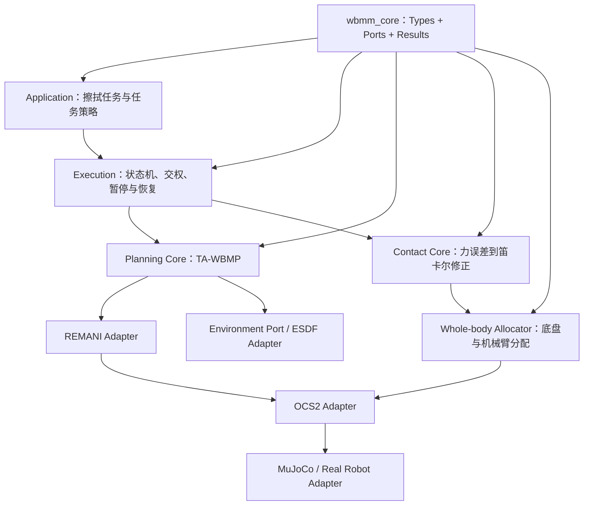

# WBMM 重新架构与代码掌控计划

## 1. 文档目的

本文面向当前 WBMM 仓库，目标不是再做一次大规模目录搬迁，而是建立一条可以逐步实施、逐步验证、始终保留可运行基线的重新架构路线。

核心原则是：

> 先把项目拥有的数据合同和能力接口建立为稳定内核，再通过适配器逐步包住 Pinocchio、REMANI、OCS2、ROS 2、MuJoCo 和真实硬件。

本文同时也是后续使用 Codex 修改 WBMM 时的实施约束。架构合同、接口、配置默认值、验收门槛和发布决定由项目负责人确认；实现可以交给 Codex，但每次修改必须保持范围明确、可测试、可回退。

当前审计基线：

```text
branch: main
commit: 017b1df
date: 2026-09-04
```

本计划来自源码和文档只读审计，不代表已经完成新的构建、MuJoCo 闭环或实机验证。

---

## 2. 总体结论

WBMM 当前已经具备较好的外层结构：

- 主链已经明确为统一任务 YAML → TA-WBMP → REMANI → 参考所有权交接 → OCS2 → 可选力控 → MuJoCo/实机；
- 9D 全身状态、8D 控制输入和差速底盘非完整约束已经形成技术合同；
- `NAVIGATING` 和 `TASK_EXEC` 阶段的 MPC 参考所有权已经明确；
- TA-WBMP 在共享环境碰撞能力缺失时会 fail-closed；
- 力控已成为独立算法包，并具有 fake-wrench MuJoCo 无接触跟踪记录；
- 完整系统启动入口正在向 `tracer_jaka_bringup` 收口。

当前真正缺少的不是新的目录，而是稳定的内部领域内核：

1. 项目自己的 `types / ports` 尚未进入 WBMM；
2. `tracer_jaka_interfaces` 仍基本为空；
3. 数学核心、后端适配、ROS 通信、执行状态机和安全监督仍有混合；
4. 关键状态仍使用 `String` 或 `Float64MultiArray`；
5. TA-WBMP 尚未接入与 REMANI 一致的环境/ESDF adapter；
6. Coordinator、MRT、bridge 和旧 WipePlanner 节点过大；
7. 验证矩阵没有覆盖当前 HEAD 和最近力控改动。

因此，重新架构应采用：

```text
合同优先
→ 最小纵向闭环
→ 适配器包裹现有实现
→ 执行层收口
→ 等价验证
→ 最后退役旧链
```

不采用：

- 一次性移动大量目录；
- 物理合并 REMANI 和 OCS2；
- 在新链未达到等价验证前删除 WipePlanner；
- 为了让规划成功而关闭碰撞检查；
- 把仿真启动成功或 RViz 有轨迹当作闭环完成。

---

## 3. WBMM 的目标架构



### 3.1 建议的目标目录

```text
src/
├── core/
│   └── wbmm_core/                       # 纯 C++ 领域类型、ports、结果和错误码
├── interfaces/
│   └── tracer_jaka_interfaces/          # ROS msg/srv/action
├── algorithms/
│   ├── planning/
│   │   ├── ta_wbmp/                     # 任务全身规划核心
│   │   └── remani_adapter/              # REMANI 项目侧适配，不放 solver 内核
│   ├── environment/
│   │   └── wbmm_environment/            # ESDF、碰撞和 clearance 语义
│   ├── control/
│   │   ├── whole_body_force_control/    # 接触修正和全身分配
│   │   └── ocs2_adapter/                # OCS2 跟踪适配，不放 solver 内核
│   └── execution/
│       └── wbmm_execution/              # Coordinator、交权和接触监督
├── applications/
│   └── wiping/                          # 擦拭任务配置和应用策略
├── simulation/
│   └── tracer_jaka_mujoco/              # 仿真后端和场景
├── drivers/                             # 实机后端
├── robot/                               # 唯一机器人描述
├── vendor/                              # 上游或项目 fork
└── bringup/
    └── tracer_jaka_bringup/             # 唯一系统组合入口
```

这只是目标形态。实施过程中只在功能真正迁入时创建对应包，不提前制造空目录。

### 3.2 允许的依赖方向

```text
applications / bringup
        ↓
execution / planning / control
        ↓
wbmm_core / tracer_jaka_interfaces
        ↓
adapters
        ↓
vendor / simulation / drivers
```

约束：

- 领域核心不依赖 ROS、Pinocchio、OCS2、REMANI 或 MuJoCo；
- 算法只依赖 Port，不直接依赖具体硬件、topic 或设备地址；
- vendor 不反向依赖 WBMM application；
- 完整系统组合只允许出现在 `tracer_jaka_bringup`；
- 仿真和实机通过同一上层合同提供可替换后端。

---

## 4. 领域数据合同

已有 `Pose`、`Wrench`、`JointState` 和 `TrajectoryPoint` 可以作为语义原型，但 WBMM 需要在此基础上补齐全身状态、输入、时间、阶段和失败语义。

### 4.1 第一版 `wbmm_core` 类型

```text
Pose
Wrench
JointState
WholeBodyState
WholeBodyInput
WholeBodyTrajectoryPoint
TaskTrajectory
WholeBodyTrajectory
PlanningResult
ContactCorrection
ControlStatus
Fault
ExecutionPhase
```

### 4.2 不可改变的全身合同

```text
WholeBodyState:
  x = [base_x, base_y, base_yaw, q1, q2, q3, q4, q5, q6]  # 9D

WholeBodyInput:
  u = [base_v, base_yaw_rate, qdot1, qdot2, qdot3, qdot4, qdot5, qdot6]  # 8D
```

每个空间数据必须显式包含：

- `frame_id`；
- 时间戳或相对时间；
- SI 单位；
- 关节名称和顺序；
- finite/维度校验；
- 坐标变换发生的位置；
- 插值语义。

内部四元数可以继续约定为 `wxyz`，但 ROS adapter 必须显式处理 ROS 消息使用的 `xyzw` 顺序，禁止通过位置猜测。

---

## 5. 能力接口设计

### 5.1 建议的 Ports

```text
KinematicsPort
CollisionCheckerPort
EnvironmentPort
TaskTrajectoryProvider
WholeBodyPlannerPort
ContactControllerPort
WholeBodyAllocatorPort
NavigationPort
TrajectoryTrackerPort
StateProviderPort
CommandSinkPort
ReferenceOwnershipPort
```

### 5.2 力控必须拆成两个概念

```text
ContactControllerPort
  nominal EE reference + measured wrench + dt
  → Cartesian correction

WholeBodyAllocatorPort
  Cartesian correction + measured whole-body state
  → corrected 9D reference / bounded 8D command
```

含义分别是：

- `ContactController` 回答“力误差应该让末端怎样修正”；
- `WholeBodyAllocator` 回答“这个修正由底盘和机械臂各承担多少”。

现有学习接口：

```python
update(nominal: Pose, wrench: Wrench, dt_s: float) -> Pose
```

可以作为 v1 保留。生产接口通过兼容 adapter 逐步增加：

```text
desired_wrench
timestamp
controller_state
saturation
fault
```

在 adapter 完成前不直接破坏已有接口。

### 5.3 碰撞接口不能只返回 bool

生产版本建议返回：

```text
valid
minimum_clearance
collision_pair
environment_checked
reason/error_code
```

这使 TA-WBMP、REMANI 和验证报告能够共享同一语义，而不是只知道“失败”。

---

## 6. ROS 2 接口层

`tracer_jaka_interfaces` 只负责跨节点的线协议，不放算法实现。

优先复用标准消息：

- `geometry_msgs/PoseStamped`；
- `geometry_msgs/WrenchStamped`；
- `sensor_msgs/JointState`；
- `trajectory_msgs/JointTrajectory`；
- `ocs2_msgs/MpcTargetTrajectories`。

建议补充的项目消息：

```text
PipelineStatus.msg
ForceControlStatus.msg
PlanningResult.msg
SetReferenceOwner.srv
ExecuteTask.action
```

优先替换的弱类型接口：

- 用 typed status 替换执行和力控状态 `std_msgs/String`；
- 用 `ForceControlStatus` 替换无字段语义的 `Float64MultiArray`；
- 用明确的错误码、阶段、owner、时间戳和 freshness 表达失败。

不应为了“统一接口”重复定义 ROS 已有的 Pose、Wrench 和 JointState 消息。

---

## 7. 分阶段实施计划

### PR0：冻结当前基线

目标：在重构前建立可比较的当前行为。

工作内容：

- 更新 `docs/verification_matrix.md` 到当前 Git SHA；
- 记录任务、配置、场景、随机种子、命令、日志和输出文件；
- 列出所有完整 launch 入口、关键 topic、TF 和 publisher owner；
- 分开记录普通力跟随、无限力跟随、恒力和二阶导纳；
- 把现有 fake-wrench 结果标记为“MuJoCo 无接触参考跟踪”；
- 明确哪些当前结果只是历史记录，哪些已在当前 HEAD 复验。

验收：

- 目标包构建和单测绑定当前 SHA；
- 验证矩阵没有含糊的“已完成”；
- 每个场景都有明确 L0–L6 状态；
- 工作区没有因基线验证产生未解释的源码修改。

禁止：

- 修改算法行为；
- 删除 WipePlanner；
- 借基线整理同时搬迁目录。

### PR1：建立 `wbmm_core`

目标：让领域合同成为真正的代码依赖中心。

工作内容：

- 新增纯 C++ `wbmm_core` 包；
- 实现 9D/8D 类型、frame、单位、时间和关节顺序检查；
- 定义结果、错误码和主要 Ports；
- 提供不依赖 ROS 的单元测试；
- 写明 Python 原型与 C++ 类型的字段映射。

验收：

- 不依赖 ROS、Pinocchio、OCS2、REMANI 和 MuJoCo；
- 错误维度、NaN、空 frame、关节顺序不匹配都被拒绝；
- 核心测试可独立运行；
- 不改变现有运行链。

### PR2：最小全身力控数学闭环

目标：先掌握数学，再迁移工程代码。

建议实验顺序：

```text
01_contact_model
02_force_follower
03_whole_body_kinematics
04_weighted_whole_body_control
05_admittance_control
```

实验模型：

```text
1D 弹簧墙
+ 1D 移动底盘
+ 2-link planar arm
+ 力跟随/导纳
+ 加权伪逆
```

必须比较：

- arm-only；
- base-only；
- whole-body。

必须输出：

- force error vs time；
- base displacement vs time；
- joint angles/velocities vs time；
- 最小奇异值或 manipulability；
- 迭代时间、饱和和稳定时间。

验收：

- 正负力方向正确；
- 撤力行为符合控制模式定义；
- 差速底盘没有横向速度；
- 权重变化能解释底盘与机械臂的分配变化；
- 极限和奇异状态有明确失败行为。

### PR3：重构 `whole_body_force_control`

目标：不改变现有外部行为，将包内职责分清。

建议包内结构：

```text
whole_body_force_control/
├── include/.../core/          # ForceFollower、Admittance、滤波和限幅
├── include/.../allocation/    # WholeBodyAllocator
├── include/.../safety/        # 接触监督纯逻辑
└── src/ros/                   # ROS 参数、消息、TF、service 和 publisher
```

迁移原则：

- `ContactController` 不发布 ROS topic；
- `WholeBodyAllocator` 不读取参数服务器；
- Pinocchio 通过 `KinematicsPort` adapter 使用；
- ROS node 只负责消息转换、定时和组合；
- 所有权与安全状态不藏在数学类中。

验收：

- 现有控制器单测全部通过；
- 相同输入产生与基线一致的输出；
- core 可不启动 ROS 单测；
- 原有 fake-wrench MuJoCo 回归通过；
- 新旧行为差异有数值报告。

### PR4：结构化状态与 `ContactSupervisor`

目标：把控制算法与执行安全分开。

`ContactSupervisor` 负责：

- wrench freshness；
- OCS2 observation freshness；
- TF 可用性；
- 软力阈值节流；
- 硬力阈值锁存；
- 尖峰拒绝；
- enable/disable；
- 保持、减速、撤退或停机决策。

验收场景：

```text
无力
正常接触
力尖峰
持续超力
wrench 超时
observation 超时
TF 丢失
重复 MPC target owner
```

所有异常默认 fail-closed，故障不得无提示自动恢复。

### PR5：共享环境与碰撞 Adapter

目标：让 TA-WBMP 和 REMANI 使用一致的环境语义。

工作内容：

- 新增 `wbmm_environment`；
- 统一机器人碰撞几何；
- 统一 ESDF 查询、最小安全距离和 unknown-space 策略；
- 为 TA-WBMP 实现 `EnvironmentPort/CollisionCheckerPort` adapter；
- 对目标、预接触、完整任务段和段间插值做检查；
- 将 `AcceptAll` 移到测试支持路径，生产代码不可构造。

验收：

- 碰撞目标被拒绝；
- 相邻离散点安全但插值碰撞时仍被拒绝；
- frame 不匹配时拒绝加载；
- unknown-space 行为与 REMANI 一致；
- MuJoCo 场景中无穿透；
- 在此阶段完成前，Coordinator 继续拒绝生产执行。

### PR6：TA-WBMP 依赖反转

目标：让 TA-WBMP 成为后端无关的规划核心。

迁移内容：

- Pinocchio FK/IK → `KinematicsPort` adapter；
- 自碰撞/ESDF → `CollisionCheckerPort`；
- 导航估价/REMANI → `NavigationPort`；
- 任务轨迹生成 → `TaskTrajectoryProvider`；
- 候选评分 → `CandidateCostEvaluator`；
- ROS publisher、TF 和 action 放到 adapter/node。

验收：

- 使用 mock adapter 可以完整测试规划核心；
- 同一任务可替换运动学、碰撞或导航实现；
- 规划核心不包含设备地址、topic 名或 launch 行为；
- table、blackboard 和 RAS 离线基线保持或改善。

### PR7：执行层收口

目标：让 Coordinator 只负责流程，不承担算法细节。

建议拆分：

```text
ExecutionCoordinator
ReferenceOwnershipManager
ContactSupervisor
ProgressGovernor
RecoveryPolicy
```

阶段状态建议统一为：

```text
IDLE
PLANNING
NAVIGATING
REQUESTING_TASK
APPROACH
TASK_EXEC
PAUSED
RETREATING
COMPLETE
FAILED
```

验收：

- `NAVIGATING` 只有 REMANI bridge 发布 MPC target；
- 交权中间态允许 publisher 数为 0；
- `TASK_EXEC` 只有 Coordinator/执行 adapter 发布；
- publisher 数绝不允许为 2；
- 超时、拒绝和恢复均有 typed error code；
- 状态机可在不启动机器人时测试。

### PR8：WipePlanner 退役

WipePlanner 在以下条件全部满足前不得删除：

1. 统一 YAML 能表达现有 table、blackboard 和 RAS 任务；
2. TA-WBMP 能输出等价或更好的 `q_pre/q_entry/task trajectory`；
3. REMANI 导航和显式交权已在 MuJoCo 复现；
4. guarded approach、首触捕获、进度节流、尖峰拒绝、硬限位和超时已迁移；
5. 新链通过无接触和真实接触 MuJoCo 回归；
6. 旧链的配置、关键参数和实验数据已归档；
7. 至少保留一个稳定发布周期的 deprecated 状态。

满足后按顺序执行：

```text
停止新增功能
→ 标记 deprecated
→ 新旧链对比测试
→ 删除运行依赖
→ 最后删除源码
```

---

## 8. 第一条纵向切片：全身力控

全身力控应作为重新掌控 WBMM 的第一个完整模块，推荐顺序：

```text
1D 接触模型
→ 力误差产生末端速度/位移
→ Planar2 全身 Jacobian
→ 加权伪逆分配
→ 二阶导纳
→ Pinocchio/JAKA adapter
→ ROS 2 adapter
→ MuJoCo fake wrench
→ MuJoCo 真实接触面
→ 实机 shadow/read-only
→ 经现场授权的低速运动
```

需要分开证明：

| 层次 | 要证明的问题 |
|---|---|
| 数学 | 符号、稳定性、离散积分、滤波和限幅是否正确 |
| 分配 | 底盘与机械臂比例、关节限位和奇异性是否受控 |
| 接口 | frame、wrench 变换、9D/8D 顺序是否正确 |
| 执行 | 参考交权、进度和停止是否正确 |
| 安全 | 超时、超力、TF 丢失、重复 owner 是否 fail-closed |
| 物理 | 接触刚度、噪声、时延和摩擦变化下是否稳定 |

fake-wrench 无接触跟踪只能证明消息、参考、OCS2/MRT 和 MuJoCo 执行链能够联通；不能证明真实恒力接触稳定性。

---

## 9. 重新学习 WBMM 的顺序

以后不再按 ROS package 数量通读，而是按一次数据变换阅读：

1. `wbmm_core/types`：系统允许什么数据流动；
2. `wbmm_core/ports`：算法可以要求哪些能力；
3. `whole_body_force_control/core`：力误差怎样变成末端修正；
4. `whole_body_force_control/allocation`：底盘和机械臂怎样分配修正；
5. Pinocchio、ESDF、REMANI、OCS2 adapters：这些能力由谁实现；
6. `wbmm_execution`：各能力在什么阶段调用；
7. ROS nodes 和 launch：数据怎样进入和离开系统；
8. MuJoCo 和 drivers：最后阅读具体后端。

每学完一个模块，必须能够回答：

```text
它只负责什么？
输入是什么？
输出是什么？
单位、维度和 frame 是什么？
依赖哪个 Port？
谁拥有输出？
失败时发生什么？
不启动 ROS 能否测试？
当前验证到了 L0–L6 的哪一级？
```

如果无法回答，说明这个模块的合同仍不完整，不应继续增加功能。

---

## 10. 验证等级

| 等级 | 含义 | 不能证明什么 |
|---|---|---|
| L0 | 合同、维度、frame、单位和所有权明确 | 不能证明实现正确 |
| L1 | 纯核心/包级单元测试通过 | 不能证明 ROS 和闭环正确 |
| L2 | 离线规划和碰撞检查通过 | 不能证明控制执行正确 |
| L3 | MuJoCo 无接触闭环通过 | 不能证明接触稳定 |
| L4 | MuJoCo 接触闭环通过 | 不能证明实机传感器和安全有效 |
| L5 | 实机只读/影子计算通过 | 不能证明真实运动安全 |
| L6 | 经风险评审和显式授权的实机运动通过 | 不等于工业安全认证 |

所有结论必须附带：

```text
Git SHA
配置文件
场景/地图
启动与测试命令
日志或报告路径
数值指标
未验证项
```

---

## 11. Codex 协作标准

每次修改前，Codex 必须先提交一张设计卡：

```text
问题：要解决什么可测量问题？
边界：修改哪些模块，不修改哪些模块？
接口：输入、输出、维度、单位、frame、owner？
影响：是否改变消息、配置、默认行为或安全门？
失败：保持、减速、撤退、重规划还是停机？
验证：目标 L0–L6 等级和通过阈值？
回退：如何恢复旧行为？
未验证：哪些项目本轮不会证明？
```

实施要求：

- 一次 PR 只解决一个可以解释的问题；
- 优先修改纯核心和测试，再接 ROS adapter；
- 不覆盖无关工作区修改；
- 不静默放宽碰撞、速度、力或关节限制；
- 不新增隐式 fallback；
- 参数变化记录旧值、新值、单位和依据；
- 关键接口变化先写 ADR；
- 未达到目标验收等级时，不使用“完成”“已可实机”等表述。

项目负责人保留：

- 架构权；
- 接口权；
- 配置默认值决定权；
- 验收权；
- 实机放行权；
- 发布和旧链删除权。

---

## 12. 推荐的立即行动

第一轮只实施 PR0 和 PR1：

```text
PR0：冻结当前行为和验证证据
PR1：建立 wbmm_core 的 Types + Ports
```

在这两个阶段完成前：

- 不迁移 Coordinator；
- 不删除 WipePlanner；
- 不重命名大量包；
- 不改变 REMANI/OCS2 vendor 内核；
- 不把最近的力控仿真结果扩大解释为接触闭环或实机安全证明。

完成 PR0 和 PR1 后，再以“最小全身力控闭环”作为第一个端到端迁移对象。这样每一步都能从数学、接口、适配器、ROS 通信和后端执行五个层次理解和验收，代码的控制权也会逐步回到项目自身的合同上。
