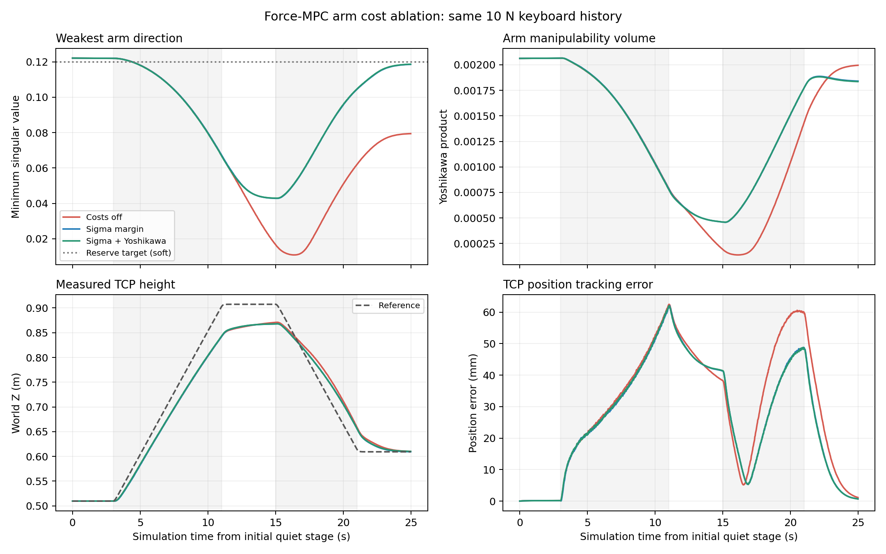
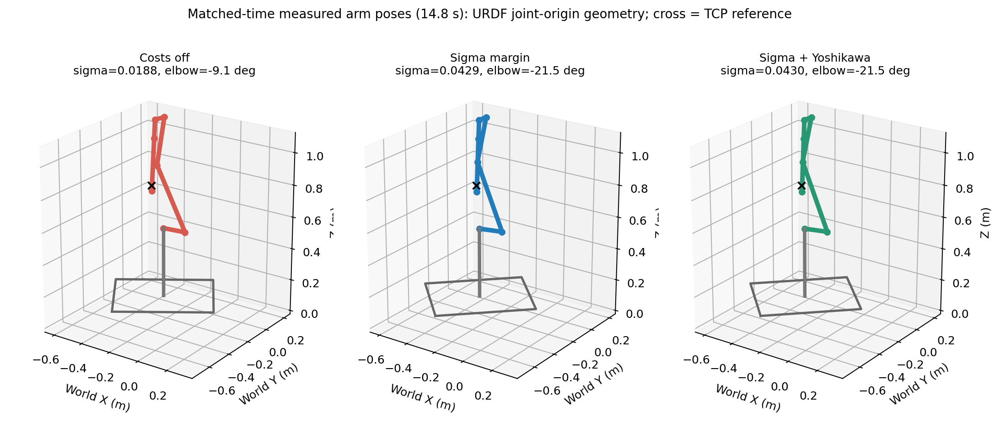

# Force-MPC 机械臂奇异性与操作度裕度

2026-10-09：按用户要求收敛为过程／终端代价、task 配置和只读指标诊断。已删除新增的奇异性执行 gate、反馈 gate、减速系数 motion_scale、专用复位服务及相关测试。原有 ForceExecutionGate、指令限速和力传感器联锁恢复到本任务开始前的代码；whole_body_force_control 没有本次新增改动。

随后按用户要求精简力控参数：移除力范数限制、导纳逐轴速度限制及 MRT 可选速度积分模式。保留各轴力/力矩限制、末端线/角速度范数限制和预测关节位置跟踪。该次变更与下文的奇异性代价对比独立，验证记录位于 `docs/diagnostics/force_mpc_parameter_cleanup/`。

## 过程代价、终端代价与 rollout

MPC 在每次求解中优化未来控制输入，并预测状态轨迹：

\[
\min_u J=\int_{t_0}^{t_0+T}L(x(t),u(t),t)\,dt+\Phi(x(t_0+T)),
\qquad \dot x=f(x,u).
\]

- 过程代价 L 沿整个预测窗口累计。机械臂在途中接近伸直，哪怕终点又弯回来，仍会受到过程项惩罚。
- 终端代价 Phi 只评价预测窗口结束时的状态，鼓励在窗口结束时留有裕度。它不是整个作业结束时的状态：每次 MPC 更新后，这个终点随窗口向前移动。
- rollout 根据动力学、初始状态和候选输入积分出预测状态。代价用于评价这些状态，求解器据此改善输入。代价注册在 OptimalControlProblem，动力学 rollout 由 TimeTriggeredRollout 执行，两者职责不同。

本配置预测窗口 T=2.0 s，向 MRT 下发的策略窗口约 0.2 s。

## 代码职责

- cost/ArmManipulabilityCost.h 解释 Jacobian、奇异值、Yoshikawa 操作度和代价公式；cpp 负责代价值、解析导数、参数检查和工作区复用。
- WbmmInterface.cpp 独立注册 stateCostPtr 中的 armManipulability 过程项与 finalCostPtr 中的 finalArmManipulability 终端项。它读取 task 配置并处理终端继承／覆盖。
- wbmm_robot_metrics 提供公共配置和完整诊断指标；求解器在 cost 中只求所需的谱指标，省去关节限位诊断和矩阵求逆。运动学沿用 OCS2 原生 PinocchioInterface。
- ArmMetricsDiagnostics.h / WbmmMpcNode.cpp 发布预测指标；WbmmMrtNode.cpp 发布实测指标。诊断不修改参考、控制输入或执行状态，也不要求指标反馈到力控节点。
- 每个代价／诊断实例独立复用 Pinocchio 工作区，计算和 clone 受互斥锁保护。该锁用于数据并发一致性，不是控制 gate。

## 指标与代价

状态为 [base_x, base_y, base_yaw, q1..q6]，输入为 [v, omega, qdot1..qdot6]。Jacobian 行顺序为 [linear; angular]，参考点为 tool0 原点，表达坐标系为 odom。arm scope 只取全身 6x8 Jacobian 最后六列。

位姿任务采用固定特征长度 ell=0.30 m：

\[
\bar J_a=[J_v;\ell J_\omega],\qquad
s=\sigma_{\min}(\bar J_a),\qquad
w=\prod_i\sigma_i=\sqrt{\det(\bar J_a\bar J_a^T)}.
\]

s 衡量最弱方向的速度能力，w 是速度椭球体积尺度。启用 normalizeMargins 后：

\[
L_a=\frac{\alpha}{2}\left[
\lambda_s\max(0,1-s/s_r)^2+
\lambda_w\max(0,1-w/w_r)^2\right].
\]

alpha 对应 weightScale。仅加入启用的项，达到参考值后该项惩罚为零。关闭 normalizeMargins 可保留原有 0.5*weight*max(0,reference-metric)^2 语义。终端项使用同一公式，但采用独立实例和参数。

使用 Pinocchio 运动学 Hessian 得到 Jacobian 对关节位置的导数，再通过 SVD 求指标解析梯度；保留 PSD Gauss–Newton 近似。在所有启用项达到裕度后跳过导数组装。零／重合奇异值处仅对线性化 Jacobian 做局部矩阵差分，不再扰动状态重算运动学。finiteDiffStep 仅用于该分支。无效指标保留 invalidMetricsPenalty。这些是软代价，不构成 sigma 的硬下界；完全奇异构型附近的局部梯度也未必能提供脱离方向。

求解速度优化及相同参数下的前后验证见 [速度优化记录](force_mpc_solver_speed.md)。下方原始消融对比的耗时属于优化前实现。

代码还支持可选条件数、正则逆操作度和固定方向指标。正则逆操作度是 trace((Jbar*Jbar^T+regularization*I)^-1)，不是 1/w；方向指标是投影幅值，不等价于严格沿该方向的最大速度。本轮默认只开启最小奇异值。

## 启动和调参

```bash
ros2 launch tracer_jaka_bringup force_mpc.launch.py \
  backend:=sim fake_wrench:=true keyboard_wrench:=true
```

仿真使用 config/sim/task_force_mpc.info；实机使用 config/real/task_force_mpc.info，实机新增代价默认关闭。其他导航／轨迹入口继续使用自己的任务配置。

```text
armManipulability
{
  activate true
  normalizeMargins true
  weightScale 1.0
  metrics
  {
    scope "arm"
    task "pose"
    scaling "characteristic_length"
    characteristicLength 0.30
  }
  useMinSingularValue true
  minSingularRef 0.12
  minSingularWeight 0.5
  useYoshikawa false
  yoshikawaRef 0.0015
  yoshikawaWeight 0.005
  terminal
  {
    activate true
    weightScale 1.0
    minSingularRef 0.12
  }
  diagnostics { activate true }
}
```

过程 activate 与 terminal.activate 独立。终端继承过程设置，再覆盖显式给出的开关、参考值和权重。diagnostics.activate 只控制诊断实例，关闭后不影响求解或执行。

MPC 规划速度保留在 task_force_mpc.info 的 jointVelocityLimits；执行限值保留在 force_mpc.yaml。当前仿真两者数值相同：底盘 v=±0.1 m/s、omega=±0.4 rad/s，机械臂 qdot=±0.2 rad/s，但不自动互相覆盖。职责与加载规则见 [参数配置说明](force_mpc_configuration.md)。

## 指标诊断

| 主题 | data 顺序 |
|---|---|
| /mobile_manipulator_arm_kinematic_metrics | time, sigma_min, yoshikawa, condition_number, joint_margin, valid |
| /mobile_manipulator_arm_prediction_metrics | time, horizon_s, min_sigma, terminal_sigma, min_yoshikawa, terminal_yoshikawa, time_to_min_s, valid, solve_ms |

layout label 包含 frame、TCP 点、scope、task、scaling 和特征长度。实测消息已收敛为六个字段；旧版八字段消息中的 reference_scale 和 guard_active 已移除。无效指标保留 NaN 与 valid 标志，仅供观察。

预测诊断在 postSolverRun 中抽样完整 2 秒预测窗口，约每 50 ms 预测时间取样，包含终点，最多每 100 ms 墙钟时间发布一次。solve_ms 为同步回调测得的求解段耗时。

## 验证与复现

每组全新启动 MuJoCo 仿真，零力 3 秒、TCP -Z 方向施力 8 秒、释放 4 秒、反向 6 秒、释放 4 秒。持续力约 10 N，按仿真时钟计时，三组分别关闭代价、开启奇异值、开启奇异值与操作度。

2026-10-09 精简版本的闭环对比：

| 指标 | 代价关闭 | 奇异值过程＋终端 | 奇异值＋操作度 |
|---|---:|---:|---:|
| 最低奇异值 | 0.01091 | 0.04286 | 0.04296 |
| 最低操作度 | 0.0001382 | 0.0004578 | 0.0004585 |
| TCP 位置误差 RMS | 35.48 mm | 32.16 mm | 32.18 mm |
| 求解耗时 P95 | 2.76 ms | 32.14 ms | 31.41 ms |
| 碰撞／故障 | 无 | 无 | 无 |

最低奇异值提高约 3.93 倍。操作度项额外收益很小，默认只开启奇异值。数值差分仍有开销，不能据此声称达到配置的 100 Hz 求解频率；实际耗时受运行负载和求解时序影响。

```bash
/usr/bin/python3 -s src/bringup/test/run_force_mpc_arm_margin_ablation.py \
  --directory docs/diagnostics/force_mpc_arm_margin
/usr/bin/python3 -s src/bringup/test/plot_force_mpc_arm_margin.py \
  --directory docs/diagnostics/force_mpc_arm_margin

/usr/bin/python3 -s src/bringup/test/run_force_mpc_arm_margin_ablation.py \
  --directory docs/diagnostics/force_mpc_arm_margin --cases six_axes \
  --sequence w:3,zero:2,s:3,zero:2,a:3,zero:2,d:3,zero:2,r:3,zero:2,f:3,zero:2

/usr/bin/python3 -s src/bringup/test/run_force_mpc_arm_margin_ablation.py \
  --directory docs/diagnostics/force_mpc_arm_margin --cases integration_cost \
  --integration-probe
```

先加载 ROS／工作空间环境。使用系统 Python 的 -s，避免当前用户 NumPy 2.x 与 ROS Pinocchio NumPy 1.x ABI 冲突。运行器使用私有 ROS domain，只启动仿真，释放按键并清理本次启动的进程。综合探针验证的是原有断流联锁与复位流程。

integration_cost.info 关闭了 diagnostics.activate，用于确认诊断不是力控正常运行或复位的前置条件。

当前版本结果写入 comparison.json 与 verification.json；逐帧实测状态、配置和图像保存在同目录。

精简版构建、58 项 C++ 测试和 23 项配置检查通过。三组代价对比、六方向回归，以及关闭诊断后的原有断流／显式复位综合探针均通过；whole_body_force_control 和原有 ForceExecutionGate 的源码与任务开始前一致。





2026-10-08 的保护版本说明及测试记录保留在 historical_protection_2026-10-08/，其中的阈值、减速和复位说明不适用于当前代码；历史日志与逐帧轨迹采用 gzip 压缩保存。before_workspace_reuse/ 记录更早的性能对比。baseline_stress14.* 是速度限值对齐前的问题复现，不参与当前公平对比。

本轮没有实机运动验证。当前工作重点是让 MPC 通过代价主动规划姿态裕度，并用诊断和仿真评估效果。
