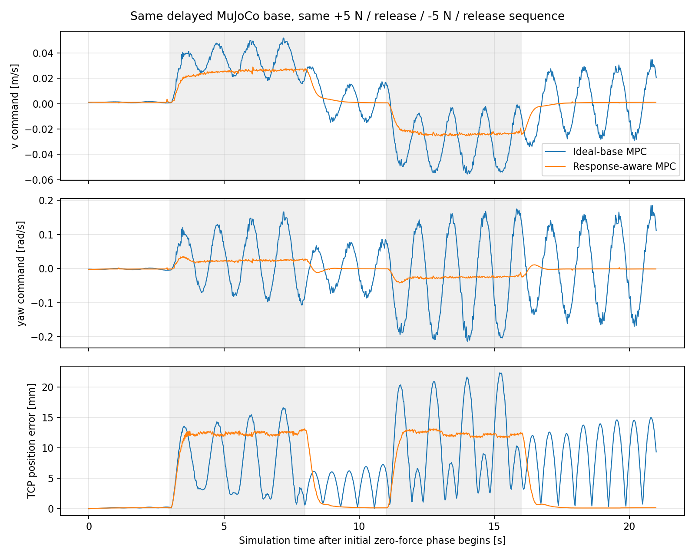

# Force-MPC diag03：底盘启动运动与牵引震荡修复

2026-10-09。依据 `/tmp/wbmm_force_diag_03` 实机包实现并验证。此次执行仅使用离线数据和隔离 ROS 域内的模拟节点，没有连接 CAN、启动实机驱动或使能实机。

## 实现

- 底盘驱动 `tracer_base` 将里程计发布改为定时器，执行器持续处理速度订阅；`/cmd_vel` 使用 KeepLast(1)。SDK 接口仍直接发送指令，没有另加指令缓存或固定周期的发送等待。发布里程计默认仍为 50 Hz，可由 `state_publish_rate` 配置。退出时发送零速度并正常结束；连接失败直接报告错误，移除原 main 中无条件重启的循环。
- 硬件入口启用 `publish_command_timing`，新增 `/tracer_base_node/command_received` 和 `/tracer_base_node/command_dispatched`。两条 `TwistStamped` 分别标记回调入口、SDK 调用完成，携带对应指令值。第二个时间戳是软件下发完成时间；CAN 接收确认和实际运动起始需要结合反馈分析。`deploy/record_force_mpc.sh` 已记录两个话题，并增加驱动参数快照。
- 实机 Force-MPC 的 `baseResponse.activate=true`：状态为 `[x,y,yaw,q1..q6,v_actual,w_actual]`（11 维），输入仍为 `[v_cmd,w_cmd,qdot1..qdot6]`（8 维）。实际速度从 `/wheel/odometry.twist` 读取；对有限值、twist 所属 child frame、时间戳新鲜度做检查，失去合法反馈继续由现有联锁超时处理。
- 动力学为 `x_dot=v_actual*cos(yaw)`、`y_dot=v_actual*sin(yaw)`、`yaw_dot=w_actual`，`v_dot=(g_v*v_cmd-v_actual)/tau_v`、`w_dot=(g_w*w_cmd-w_actual)/tau_w`。关节速度输入保持原行为。
- Pinocchio 几何配置、全身参考和 Core 力控状态保持 9 维；运动学映射、Jacobian、奇异值导数、关节索引、全身参考代价、MRT reset 和可视化均已适配。新增速度状态不参与几何参考跟踪代价。未启用响应模型的任务保持原 9 维状态。自动生成模型缓存区分 9/11 维，动力学缓存名包含完整响应参数签名。
- 实机任务的过程、终端 `minSingularRef` 均为 **0.05**，权重仍为 **0.50**。底盘输入/状态代价权重、公共导纳质量/阻尼、速度上限、跟踪保护与故障复位流程保持此次修改前的设置。
- MuJoCo 增加可选的底盘惯性、各轴独立输入延迟模型。`base_response_config` 将 YAML 传入桥接节点；未提供时保留已有理想底盘行为。命令超时清空等待指令并保持原模拟器硬停止行为。

## 参数来源与范围

| 参数 | 实机 MPC 有效一阶模型 | diag03 对照仿真底盘 |
|---|---:|---:|
| 线速度时间常数 s | 0.35 | 0.1893 |
| 角速度时间常数 s | 0.60 | 0.3039 |
| 线速度增益 | 0.94 | 0.8182 |
| 角速度增益 | 1.31 | 1.1471 |
| 线速度输入纯延迟 s | 未单独建模 | 0.12 |
| 角速度输入纯延迟 s | 未单独建模 | 0.14 |

MPC 参数是 diag03 10–24 s 的不含纯延迟的一阶拟合，24–30.1 s 留出验证。速度验证 RMSE 从瞬时模型的 0.0802 m/s 降到 0.0348 m/s；角速度从 0.3918 rad/s 降到 0.1293 rad/s。无常量速度偏置，保证零指令的稳态速度为零。

这些是“指令到上报速度”的有效响应参数，包含驱动、执行、反馈等综合效应。此次 MPC 没有加入精确纯输入延迟状态或读取历史指令进行前馈补偿。使用包含纯延迟、与 MPC 不完全匹配的底盘作为测试对象，以检验当前一阶近似的效果。驱动调度改变后的实机响应应重新录包确认，不能将包内相关性直接视为唯一的物理系统辨识结果。

`0.05` 仍是软代价参考：低于参考值时可主动调整构型，不构成奇异值硬保证，也不保证所有起始姿态下零力底盘严格不动。

## 验证

### 编译和回归

构建通过：`tracer_base`、`wbmm_ros_interfaces`、`wbmm_ocs2`、`wbmm_ocs2_ros`、`whole_body_force_control`、`tracer_jaka_mujoco`、`tracer_jaka_bringup`。

128 项检查通过：32 项 OCS2、9 项 ROS 转换、29 项力控、13 项 MRT、1 项模拟 SDK 驱动、44 项 Python。覆盖动力学数值/导数、速度状态映射、几何代价和奇异值导数、9/11 维 observation、双参考、最新指令队列、非法指令停止、延迟和惯性响应、原有 TF/力滤波修复及配置。最后一次 MRT 编译和测试在反馈时间戳检查完成后执行。

模拟 SDK 测试不连接 CAN。独立驱动调度检查显式设置 `simulated_robot=true`，将状态发布降至 **1 Hz** 并以 **125 Hz** 发送 300 条指令，300 条全部配对收到；接收延迟 P50/P95/max 为 **0.138/0.393/4.673 ms**，退出码 0。这验证接收路径不等待里程计周期；时延数字代表本机模拟测试。

### diag03 初始姿态离线闭环

从包内姿态 `[0,0,0,0.2653,1.2596,-1.0275,1.2269,1.4266,1.3736]` 起步，末端目标由该姿态 FK 获取。三组使用相同的带延迟底盘、相同几何/输入代价和相同世界 X 方向参考：保持 3 s、以 0.025 m/s 移动 5 s、保持 3 s、反向 5 s、保持 6 s。该工具的机械臂为理想速度模型，补充验证使用下述完整 MuJoCo 链路。

| 控制模型 | 奇异值参考 | 前 3 s 零力底盘净位移 | 22 s 最大 TCP 误差 |
|---|---:|---:|---:|
| 原瞬时底盘 | 0.10 | 31.90 mm | 3.91 mm |
| 原瞬时底盘 | 0.05 | 1.43 mm | 3.67 mm |
| 新响应模型 | 0.05 | 1.21 mm | 3.93 mm |

说明这组姿态的启动运动主要来自原奇异值参考；响应模型着重改善动态预测。离线工具保留约 1 mm 的残余移动，结果不构成绝对静止保证。将仿真输入延迟增大到原拟合的 1.5 倍，响应模型闭环最大 TCP 误差为 3.90 mm，求解结果保持有限。

### 完整 MuJoCo 力控闭环对照

独立 ROS 域 82，无界面；两组从同一 `low` 关键帧启动，采用实机任务权重、当前公共导纳参数与相同 `base_response_diag03.yaml` 仿真底盘。按仿真时间发送：零力 3 s、TCP +X 方向 5 N 持续 5 s、释放 3 s、-X 方向 5 N 持续 5 s、释放 5 s。虚拟力经过原虚拟传感器、处理器、导纳、MPC、MRT、MuJoCo 物理伺服和反馈链路；未直接写机器人关节状态或处理后力话题。

| 指标 | 瞬时底盘 MPC，ref=0.05 | 响应模型 MPC，ref=0.05 |
|---|---:|---:|
| 最大 TCP 跟踪误差 | 22.35 mm | 13.15 mm |
| 全段 TCP 误差 RMS | 8.90 mm | 8.30 mm |
| 最后释放阶段，排除首 1 s，线速度指令 RMS | 0.01991 m/s | 0.000882 m/s |
| 同区间角速度指令 RMS | 0.11108 rad/s | 0.001551 rad/s |
| 同区间 TCP 误差 RMS | 10.01 mm | 0.172 mm |
| 运行故障 / 意外碰撞 | 无 / 无 | 无 / 无 |

先前使用 X11 键盘事件的第一组测试在反向阶段实际输入为零，探针按预期报失败，不能用于控制器对照；其结果保留在 `keyboard_attempt`。表格和图来自重新执行的定时虚拟力输入版本。该输入方式已加入测试脚本的 `--direct-force` 参数，不依赖窗口焦点。

### 故障锁存与恢复

使用最终 MRT 和带延迟 MuJoCo 底盘，完成另一组正向 5 N 持续 10 s、释放、反向、断开力反馈、恢复数据和逐级显式复位测试：

- TCP 正向运动 0.478 m，底盘参与 0.199 m，关节变化范数 0.615 rad。
- 松手稳定后 3 s 漂移 0.090 mm；反向运动 -0.479 m。
- 断开力反馈触发 `FAULT_WRENCH_TIMEOUT`；底盘零指令、机械臂保持指令变化均为 0。
- 恢复传感器数据仍保持锁存；显式重置处理器、力控、MRT 联锁后恢复，恢复位移 0.147 mm。
- 无意外碰撞。

## 使用与实机复测

本地 install 已更新。重新 `source install/setup.bash` 后继续原 launch/enable 指令即可，启动日志应显示 `state=11 input=8 arm=6`。MPC 与 MRT 必须使用同一任务文件；同时重启两者以加载新模型。

复测应先观察 enable 后的零力段，再做小幅前后牵引、松手和反向，使用更新的录包脚本保存下一包。重点核对 `/cmd_vel`、两个驱动时序话题、`/wheel/odometry.twist`、11 维 observation 尾部速度、末端参考/误差及奇异值。当前设置基于已有包和仿真验证，实际底盘新响应及实际震荡改善程度仍待新实机包确认。

原始测试结果、任务快照、脚本和压缩日志见 [诊断目录](diagnostics/force_mpc_diag03_repair/README.md)。
