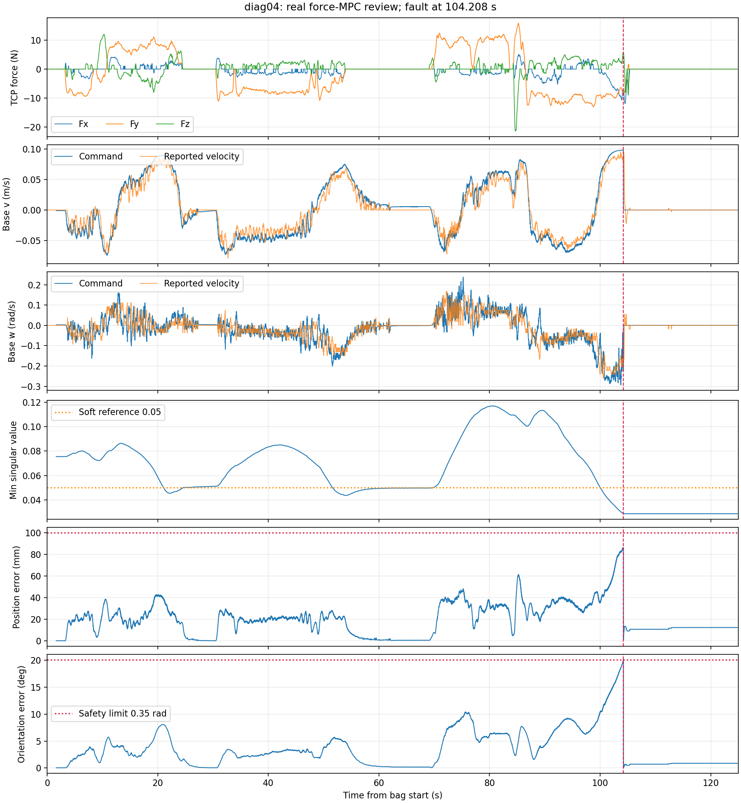
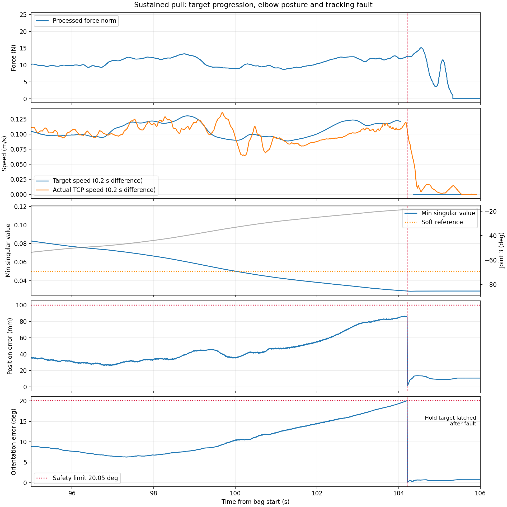

# Force-MPC diag04 实机复查

2026-10-09。只读分析 `/tmp/wbmm_force_diag_04`，时长 124.812 s，共 223969 条消息；结合 `/tmp/wbmm_force_diag_04.params` 参数快照。没有修改控制代码或参数，没有启动、停止或使能实机。用户确认最后保护发生时仍在持续牵引。

## 结论

上轮底盘修复在本包中表现良好：已录到的初始零力段没有底盘里程计位移，牵引时的底盘震荡明显减小，没有原来的 `WRENCH_TF` 故障。第 **104.208 s** 发生一次 `FAULT_TRACKING_ERROR`，直接原因是**姿态误差超过 0.35 rad**，随后 MRT 联锁停止。

持续施力使导纳目标继续推进，最后阶段实际末端落后；同时底盘持续转弯，肘部接近伸直，固定末端朝向的跟踪逐步变差。数据支持“继续牵引、跟踪余量下降、误差达到阈值而停止”，不能把原因单独归结为力过大或通信延迟，也没有证据证明某个关节撞到了速度硬上限。



## 停止的直接证据

日志中的保护条件：

```text
104.207477 s  TCP tracking error: 0.0855 m (limit 0.1000), 0.3503 rad (limit 0.3500)
104.207536 s  Force-control fault latched: TRACKING_ERROR
104.207583 s  whole_body_force_control -> FAULT_TRACKING_ERROR
104.214784 s  MRT -> FAULT_INTERLOCK
```

| 指标 | 约 100 s | 触发时 | 配置 |
|---|---:|---:|---:|
| TCP 位置误差 | 35.2 mm | 85.5 mm | 上限 100 mm |
| TCP 姿态误差 | 10.34° | 20.07° | 上限 20.05°（0.35 rad） |
| 手臂最小奇异值 | 0.0501 | 0.0288 | 软参考 0.05 |
| joint_3 | -33.1° | -18.45° | 用于观察肘部伸展趋势 |

第 100 s 到保护前：

- 处理后力的模长中位数约 10.67 N，最大 12.72 N；并非触发传感器力限保护。
- 导纳速度模长平均 0.1064 m/s。用 0.2 s 居中差分计算，目标平均速度模长 0.1064 m/s，实际 TCP 为 0.0945 m/s；矢量速度差模长平均 0.0185 m/s。窗口两端各排除 0.1 s，避免差分跨越故障目标切换。
- 底盘 yaw 改变约 -0.863 rad（49.44°），平移路径约 0.327 m。
- 旋转导纳未开启，**故障前目标四元数完全不变**。底盘转动时手臂仍须补偿转角以保持末端朝向。
- 肘部更接近伸直，最小奇异值持续下降。这说明构型裕度下降；尚不能称为严格达到数学奇异点。0.05 是软代价参考，不保证最小奇异值始终高于该值。
- 本窗口关节实测速度峰值均低于 0.2 rad/s；故障前策略首点的关节速度输入也未达到该值。不据此断言手臂速度饱和或跟踪任务在约束下必然无解。

对照前一个 95–100 s 窗口：力模长中位数约 10.22 N，目标/实际平均速度分别约 0.1086/0.1095 m/s。因此相近施力并非在每种构型下都会导致停止；不能单凭力大小解释最后的误差积累。

实际触发代码见 `src/control/whole_body_force_control/src/node.cpp`：检查上一轮导纳目标与当前测量位姿的线性误差和旋转角误差，任一超过阈值便锁存 `TRACKING_ERROR`。并非位置误差必须先超过 100 mm。



注意：故障后参考切换为锁存的当前末端位姿，图中误差骤降是**参考改变**，不代表恢复跟踪。故障保持锁存至录包结束。

## 正常阶段与底盘修复

初始已观测零力区间为约 1.647–3.240 s。底盘里程计位置、yaw、反馈速度均为零；TCP 净移动约 0.126 mm。指令仍存在约 -0.0011 m/s、0.0024 rad/s 的小量，因此不能说指令绝对为零。相关话题首次录到时已是 ACTIVE，包中没有完整 enable 转换，结论仅适用于已观测区间。

53.904–69.096 s 有约 15.2 s 的处理后零力段。取稳定后的 62–68 s，里程计位置和 yaw 不变，TCP 位置误差中位数约 0.584 mm。仍有约毫米每秒量级的底盘小指令；不构成所有构型下绝对无零力移动的保证。

5–100 s 的正常区间：TCP 位置误差中位数 21.26 mm，P95 为 40.30 mm；姿态误差中位数 3.16°，P95 为 8.75°。最小奇异值最低 0.0437，前期也会低于软参考。

用相同的 50 Hz 重采样和 0.5 Hz 三阶高通，描述性对比 diag03 原震荡段 20–30.1 s 与 diag04 的 5–100 s：

| 高频残差 RMS | diag03 | diag04 |
|---|---:|---:|
| 线速度指令 m/s | 0.05427 | 0.004586 |
| 角速度指令 rad/s | 0.26911 | 0.02665 |
| 线速度反馈 m/s | 0.04663 | 0.006486 |
| 角速度反馈 rad/s | 0.17430 | 0.02173 |

震荡量级明显减小，与用户手感一致。但两次人为施力、轨迹及构型不同，这不是严格同输入 A/B 实验，不能将比值当成控制修改的精确收益。

## 时序、模型与停止行为

- 15586 对驱动 `command_received` / `command_dispatched` 消息按顺序逐一配对，指令值一致。回调入口至 SDK 调用完成耗时 P50/P95/max 为 **0.042/0.051/0.430 ms**；接收间隔中位数 8.000 ms，P95 为 8.297 ms。`/cmd_vel` 较少的计数来自录包发现话题较晚，不能直接当作驱动丢包。
- SDK 耗时不是发送节点到驱动的完整延迟，也不是 CAN 确认或机械响应时间。`/cmd_vel` 无源时间戳，不能用录包接收时间精确推算端到端延迟。
- 全部 15394 条 MPC observation 均为 11 维；尾部实际速度与最新轮速消息 99% 精确一致，少量差别可能受异步消息到达顺序影响。
- 从包内 MPC 策略状态轨迹回归得到线速度 τ≈0.35003 s、增益≈0.94000，角速度 τ≈0.59990 s、增益≈1.30931。说明新响应动力学实际参与了策略求解，不仅是配置文件中的设置。
- 指令与上报速度的相关性最佳滞后仍约为线速度 0.20–0.24 s、角速度 0.32–0.36 s。此值包含执行和反馈相位效应，不是纯通信延迟；新模型用于预测这类响应，没有使物理迟滞消失。
- 机械臂动态 TF 时间间隔中位数约 8.000 ms，P95 为 8.016 ms，最大 11.037 ms。无 `WRENCH_TF`、力超时或策略过期故障。
- 力消息年龄 P95 为 10.42 ms，最大 16.95 ms；策略年龄 P95 为 24.05 ms，最大约 63.13 ms。年龄按录包到达时间与消息时间计算，不能等同各节点内部处理耗时。
- 力控进入 FAULT 后约 **7.21 ms** 发出首条底盘零指令，后续持续为零。采用持续 0.3 s 小速度标准，线速度在约 0.777 s 后保持 ≤0.005 m/s，角速度在约 0.577 s 后保持 ≤0.01 rad/s。故障后第一秒底盘净位移约 10.8 mm。
- 机械臂按既有速度限制平滑进入锁存保持目标；故障后 0.1 s 起，六个关节的保持指令均完全不变。不是触发保护后仍持续跟随牵引目标。

## 后续处理方向

当前包支持优先研究**让导纳参考推进速度与跟踪能力协调**：当姿态误差增长、或肘部奇异值裕度下降时平滑减慢目标推进，必要时抑制继续拉大误差的增量；误差回落后再平滑恢复。同时保留现有故障保护，并检查参考调速是否影响松手、反向及重置行为。

只降低施力或增大导纳阻尼可以降低目标速度，但不会单独解决所有构型下的裕度问题。直接放宽 0.35 rad 阈值只会允许更大的姿态偏离，不能证明能够恢复跟踪。是否增加奇异值代价或改变其参考，应结合零力构型调整的副作用另行评估。

以上是下一轮方案方向，本轮没有执行这些修改。原始统计、脚本、参数快照和图见 [诊断目录](diagnostics/force_mpc_diag04_review/README.md)。
