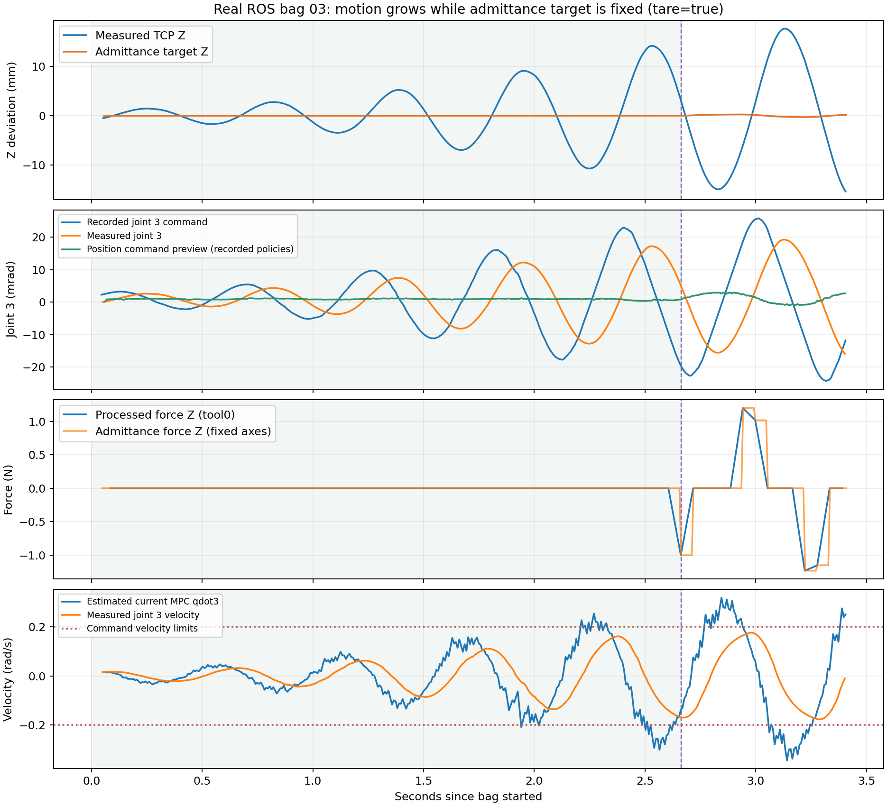

# ROS 实机录包 03：tare=true 后的增长震荡

## 结论

这份录包将问题定位到 **MPC→MRT→位置执行器的闭环**：在补偿力与导纳修正为零、
末端目标完全固定时，机械臂指令和反馈仍发生增长震荡。
当前 MRT 把 MPC 速度继续积分成位置指令，而实际关节对位置指令存在明显滞后；
记录与这条执行链的不稳定机制高度吻合。
后段速度饱和会进一步改变各关节的协调比例。

因此，tare=false 的静态偏置不是这次增长震荡的必要条件；提高导纳质量不能修复
这一段，因为当时导纳根本没有生成任何位移。
尚不能从单份短录包排除执行器内部的其他动态因素，或承诺切换执行模式后实机必然稳定。

分析仅离线读取 SQLite/CDR，没有创建 ROS 节点、发布或回放话题、连接 SDK、执行 hardware write。
没有修改控制代码和运行配置。下方候选 YAML 不会被默认 launch 加载。

## 数据及有效配置

- 原始 bag：`/tmp/wbmm_force_oscillation_03`，共 4821 条消息，时长 3.427 秒。
- 参数快照：`/tmp/wbmm_force_oscillation_03.params`；已复制到本报告的诊断目录。
- tare_on_start=true、tare_after_compensation=true；质量 20 kg、阻尼 200、K=0。
- MRT：arm_use_velocity_integrator=true，125 Hz，arm_max_command_velocity=.2 rad/s，
  相对反馈最大位置超前量 .05 rad，traj_horizon=.1 s。
- 全部记录的导纳和执行状态为 ACTIVE，传感器 ACTIVE；未见故障/反复复位。
- 参数快照的 admittance.enable=false 是启用前的配置值；服务启用只修改内部状态，
  不同步这个 ROS 参数。录包的状态和 correction enable 标志证明录制时已启用。
- 启用时名义 TCP 捕获日志的**原始时间戳**是 bag 起点前 1.249 秒。
  `/rosout` 在录制初期收到若干历史消息，不能把到达时间当作发生时间。
  因而这份包包含增长过程，但不包含最初启用瞬间/最早触发。

## 时间顺序直接排除“力参考先振荡”

以 bag 起点为 0：

1. 从首批有效数据约 .08 s 到 2.66 s，processed_wrench 三轴力为零；
   correction 的六轴导纳偏移为零；7D 末端目标完全相同。
2. 同一段内，第 2/3/4 关节同步来回变化，每个周期约 .57 秒（约 1.75 Hz），振幅持续增长。
3. 1.94 s 左右，重构的 MPC 速度已开始越过 .2 rad/s 执行限幅。
4. 2.661 s，processed_wrench 的 Z 才首次非零；2.663 s，导纳修正首次非零。
   当时执行层振荡已经明显，后出现的力可以参与进一步耦合，不能反过来解释此前零力段。

| 录制时间窗口 | 第 3 关节实测峰峰值 | 第 3 关节指令峰峰值 |
| --- | --- | --- |
| .08–1.08 s | .00773 rad | .01063 rad |
| 1.08–2.08 s | .02039 rad | .03144 rad |
| 2.08–2.65 s（更短窗口） | .02998 rad | .04066 rad |

全包 TCP 实测 X/Y/Z 峰峰值约 8.70/28.79/32.96 mm。
全包目标 X/Y/Z 峰峰值仅 .0117/.0261/.5415 mm，且这些变化全部发生在后段。
模型重算最大 TCP 跟踪误差约 23.34 mm，未超过现有 100 mm 跟踪联锁。
因此没有触发该联锁也不代表没有增长震荡。
轮式 odom 的 x/y/yaw 全程不变，底盘命令最大约 .00369 m/s、.00104 rad/s。

## ROS 指令与反馈支持明显的执行滞后

仅在零导纳段，用以下近似模型拟合 `/joint_states` 中的实测速度：

```text
qdot(t) = [qcmd(t-delay) - q(t)] / tau
```

| 关节 | delay | tau | 速度拟合 RMS 误差 |
| --- | --- | --- | --- |
| 2 | 24 ms | 119 ms | .000814 rad/s |
| 3 | 26 ms | 118 ms | .001387 rad/s |
| 4 | 25 ms | 121 ms | .001540 rad/s |

速度预测与记录的相关系数均大于 .9995。
这是有限频率、单姿态、短时闭环数据上的等效拟合，不是完整独立辨识；
不能把 delay 与 tau 唯一归因于某个 SDK 设置或机械部件。
但它直接说明在当前闭环中，`qdot=u` 的理想模型不描述实机对位置指令的即时响应。
MPC 策略年龄重构均值约 25.5 ms，与节点时序日志一致，仍有额外的规划/反馈滞后。

当前 MRT 的 `integrateArmCommand()` 对积分位置保留跨周期记忆。
实际反馈落后时，MPC 基于偏差输出反向速度，首先改变的是指令积分量；
实测关节仍可能沿旧方向移动，产生反复纠偏和增长过冲。
指令相对反馈最大超前量在第 3 关节约 .0254 rad，尚小于 .05 rad 限制；
该限制在这里没有阻止振荡。

重构的第 2/3/4 关节 MPC 速度绝对峰值约 .262/.344/.263 rad/s，
超过 .2 rad/s 的执行限速。各关节分别裁剪会改变 MPC 原先计划的比例。
重构依据 bag 上的策略到达顺序与最近 observation 时间，可能与 MRT 实际使用的策略相差一周期，
这些速度和年龄是近似值，不应当用作逐条命令完全一致性的验证。
另外，本仓库 observation.input 初始化为零，不能把该字段当作真实关节执行速度。

## 与 MuJoCo 修复的关系及候选修复

MuJoCo 修复后的 sim/force_mpc.yaml 已覆盖 arm_use_velocity_integrator=false；
real 没有加载该覆盖文件，仍由 common/force_mpc.yaml 设为 true。
关闭外部速度积分后，现有 MRT 会使用未来约 .1 秒的预测关节位置，
通过 `boundedArmPositionCommand()` 同时限制速度与相对反馈超前量。

将本次已记录的 MPC 策略离线输入这条现有位置命令生成算法，
第 3 关节命令峰峰值从记录的 .05009 rad 变为预览的 .003956 rad。
这说明 MPC 的预测位置本身比积分执行指令平稳得多。
**这个预览没有让 MPC 根据新机械臂响应重新规划，不是闭环模拟，也不是稳定性验收。**

已准备 `diagnostics/force_mpc_real_20261008/bag03/force_mpc_position_candidate.yaml`：
复制当前完整 force_mpc 配置，只将 arm_use_velocity_integrator 改为 false；
质量、阻尼、力死区、速度限制、标定加载和联锁都保留。
没有应用到运行配置，没有启动任何实机测试。只有显式使用 force_params_file 才会加载它。
优先修复方向是让 real 也使用预测位置执行，再用实际执行动态/延迟检查闭环带宽；
不建议继续用导纳质量调参掩盖零导纳时的执行层振荡。

## 可复现结果



浅绿色区间：导纳目标固定；紫色虚线：首次非零导纳修正。
绿色位置预览仅为已记录策略的离线命令计算。

原始包的 SHA256、逐话题计数和全部统计见同目录 `summary.json`；
`aligned_joint3.csv` 保存核心对齐曲线，参数快照也已保存。

重算（不会初始化 ROS 或发布话题）：

```bash
cd /home/a/WBMM
source /opt/ros/humble/setup.bash
source install/setup.bash
python3 docs/diagnostics/force_mpc_real_20261008/bag03/analyze_rosbag.py \
  /tmp/wbmm_force_oscillation_03 \
  docs/diagnostics/force_mpc_real_20261008/bag03
```
