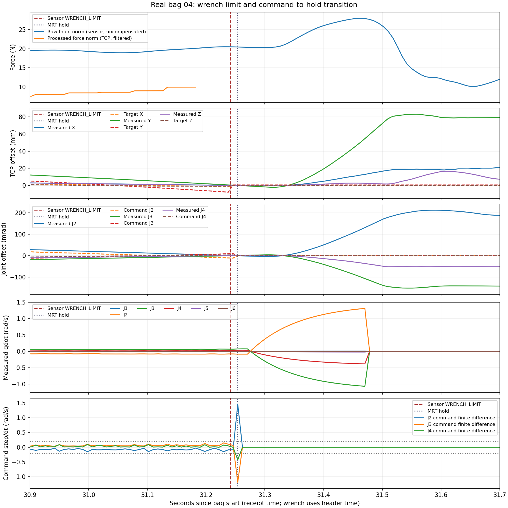

# 实机故障后大跳：bag 04 原因、修复与验证

原始包 `/tmp/wbmm_force_oscillation_04`，时长 35.227 秒，共 48781 条消息。
本次只离线读取 SQLite/CDR、分析和编译测试；没有回放 bag、启用控制或执行任何实机写入。
用户确认：仅用手给末端施力，没有按急停或切换模式；JAKA 随后自动报警，
示教器原因是关节 2 伺服位置跟随误差触发碰撞检测。

## 结论及故障位置

故障切换时，MRT 直接把运动中的位置指令替换成当前测量位置，绕过正常限幅；
硬件接口随后对相同的保持位置去重，使这一位置跳变之后没有继续发送保持帧。
ROS 的“持续发布相同位置”因此不等于机器人收到连续的伺服位置指令。

旧代码位置：

- `src/control/wbmm_ocs2_ros/src/WbmmMrtNode.cpp::forceExecutionAllowed()`：
  故障时锁存实测关节位置并直接 `publishArmPositions(forceHoldArm_)`。
- `src/drivers/arm/jaka_hardware_interface/src/jaka_hardware_interface.cpp::write()`：
  只有位置变化超过 `1e-5 rad` 才 `edg_servo_j()`；返回值被忽略。
  **该功能包现已迁至 `src/robotics/jaka_hardware_interface`。**

## 最后几秒的证据

时间以 bag 起点为零；状态没有 header，使用录包接收时间。
日志本身有时间戳，事件发生时间与接收时间相差约 0.1 ms。

| 时间 | 事件 |
| --- | --- |
| 31.24094 s | 传感器日志锁存 `WRENCH_LIMIT`，不是上次的 `WRENCH_TF` |
| 31.24556 s | 导纳控制器锁存同一故障，发布当前 TCP 保持参考 |
| 31.25385 s | MRT 发布 `FAULT_INTERLOCK`；紧接其前的关节指令跳变 |
| 约 31.27035 s | 关节速度开始向最后一次指令跳变对应的速度变化 |
| 31.47031 s | 关节 2 实测速度约 1.3102 rad/s；原指令限速仅 0.2 rad/s |
| 故障后约 0.35 s | 末端相对故障位置最大偏离约 85.7 mm |

关节 2 的单周期指令跳变为 **+0.01160393 rad**；
正常 125 Hz、0.2 rad/s 的允许增量约 **0.0016 rad**，前者约为后者 7.25 倍。
故障后的六轴位置指令全部固定，`cmd_vel` 为零，执行状态持续 `FAULT_INTERLOCK`。
因此大位移没有来自故障后仍在变化的 ROS MPC 位置指令。
关节 2 最大偏离保持指令约 0.212 rad，最终停在偏离约 0.177 rad 的位置，
并非一个正常位置保持的小幅过冲后回到原位置。

把故障后、JAKA 报警前的速度曲线拟合为：

```text
v(t) = v_inf + (v0 - v_inf) * exp(-(t - onset) / tau)
```

| 关节 | 指令跳变 / 8 ms | 实测速率曲线拟合 v_inf | 拟合 tau |
| --- | --- | --- | --- |
| 2 | +1.450491 rad/s | +1.450335 rad/s | 83.490 ms |
| 3 | −1.184980 rad/s | −1.184853 rad/s | 83.490 ms |
| 4 | −0.426685 rad/s | −0.426635 rad/s | 83.492 ms |

三轴同时匹配，拟合 RMS 误差仅约 0.00019–0.00028 rad/s。
这是很强的证据：故障后下游表现等同于持续执行最后一次位置增量产生的速度。
它支持“位置跳变 + 后续伺服帧被去重”这一原因链。
bag 没有记录 SDK 发送帧或固件内部状态，不能把数据拟合当作固件实现的直接证明。

本次参数快照确认 `arm_use_velocity_integrator=false`、tare=true。
因此这次故障后大跳与 bag 03 的外部速度积分震荡应分别处理。
`WRENCH_LIMIT` 只是触发上述错误停机路径：力阈值为 30 N，力矩阈值为 3 Nm；
检测包含未滤波值及变换后的 TCP 力矩，不能仅看绘图中约 10 N 的滤波力判断是否超限。
原日志没有指出具体超限分量，因此不将触发轴写成确定结论。



## 修复

1. MRT 故障保持、等待新策略、策略失效保持共用一个函数：
   锁存一次实测目标，从上一条已发布指令按现有速度限制逐步逼近，
   到位后固定；不随移动中的反馈重新捕获保持目标。
2. 恢复执行时从保持阶段实际发布的位置继续限幅，避免重新从反馈初始化造成另一处跳变。
3. 移除旧的 `lastGoodArmQ_` 缓存和重复的故障保持发布分支。
4. 硬件接口取消相同位置去重，每个 ros2_control 写周期均下发伺服位置；检查发送返回值。
5. 硬件保护只增加实际速度和位置跟踪偏差两项检查，集中处理发送/反馈失败。
   异常时锁存、阻止后续运动指令、请求退出伺服并返回 ERROR；禁止自动重新激活。
   请求失败可以重试，但 SDK 返回成功不等于已经测得机器人完全停稳。

当前 force launch 从有效 MRT 配置派生硬件阈值：

- 实测关节速度上限：`2 * arm_max_command_velocity`，本配置为 **0.4 rad/s**。
- 关节跟踪偏差上限：`arm_max_delta_per_step + 2 * arm_max_command_velocity / mrt_loop_rate`，
  本配置为 **0.0532 rad**；额外两周期仅留给测量和指令的采样对齐。

直接调用 hardware launch 时阈值默认 0，只有数值超限检查关闭；
连续下发、发送失败锁存等行为仍有效。
force launch 的 `start_backend=false` 不会改变已启动硬件接口的阈值。
原有力超限、数据超时、参考跟踪联锁和 JAKA 自身碰撞检测保留：
它们分别检查力输入、控制链可用性与实际执行，没有另加重复的力检测或额外保护线程。

## 验证及范围

- 新 MRT 可执行文件及迁移后的硬件插件已编译；工作区安装采用符号链接，下次启动会加载新构建。
- C++ 回归覆盖故障指令限幅、固定保持帧逐周期发送、发送失败锁存、停止请求失败重试、
  速度/位置超限；测试发送和停止函数仅计数，没有链接 SDK 或驱动机器人。
- 使用真实包的 **4387 行指令/反馈** 调用修改后的 C++ 保持算法及硬件保护：
  故障后最大单周期增量 **0.00160848 rad**，由真实 dt 的微小变化产生，仍严格满足 `0.2 * dt`。
  保持目标在约 56 ms 内完成逼近；实际包中已发生的失控反馈会在 **31.3097 s** 触发速度保护，
  故障前没有误触发。那一时刻原包末端偏离故障位置约 2.19 mm。
  这只是保护条件检查，**不是修改后机器人会在 2.19 mm 内停下的证明**。
- 在“发送帧更新速度，缺帧保持最后速度”的简化模型上，
  旧逻辑只发送一次保持帧，速度趋向 1.45 rad/s；
  新逻辑每秒发送 125 帧，最大位置指令步长 0.0016 rad，没有持续加速。
  该模型验证时关闭新增数值保护，避免靠保护遮盖根因修复。
  这是由录包拟合支持的机制回归，不能代替 JAKA 固件仿真或实机验收。

完整数值见同目录 `summary.json`、`offline_check.json`、`simulation_check.json`。
原始参数快照仍在 `/tmp/wbmm_force_oscillation_04.params`。
没有执行实机测试，所以不承诺实机已经不会再次大跳。

离线重算：

```bash
source /opt/ros/humble/setup.bash
source /home/a/WBMM/install/setup.bash
cd /home/a/WBMM
python3 docs/diagnostics/force_mpc_real_20261008/bag04/analyze_fault.py \
  /tmp/wbmm_force_oscillation_04 docs/diagnostics/force_mpc_real_20261008/bag04
g++ -std=c++17 -O2 \
  -I src/control/wbmm_ocs2_ros/include -I src/robotics/jaka_hardware_interface/include \
  docs/diagnostics/force_mpc_real_20261008/bag04/check_fixed_commands.cpp -o /tmp/wbmm_bag04_offline_check
/tmp/wbmm_bag04_offline_check docs/diagnostics/force_mpc_real_20261008/bag04/command_rows.csv
g++ -std=c++17 -O2 \
  -I src/control/wbmm_ocs2_ros/include -I src/robotics/jaka_hardware_interface/include \
  docs/diagnostics/force_mpc_real_20261008/bag04/simulate_fault_transition.cpp -o /tmp/wbmm_bag04_offline_sim
/tmp/wbmm_bag04_offline_sim
```
