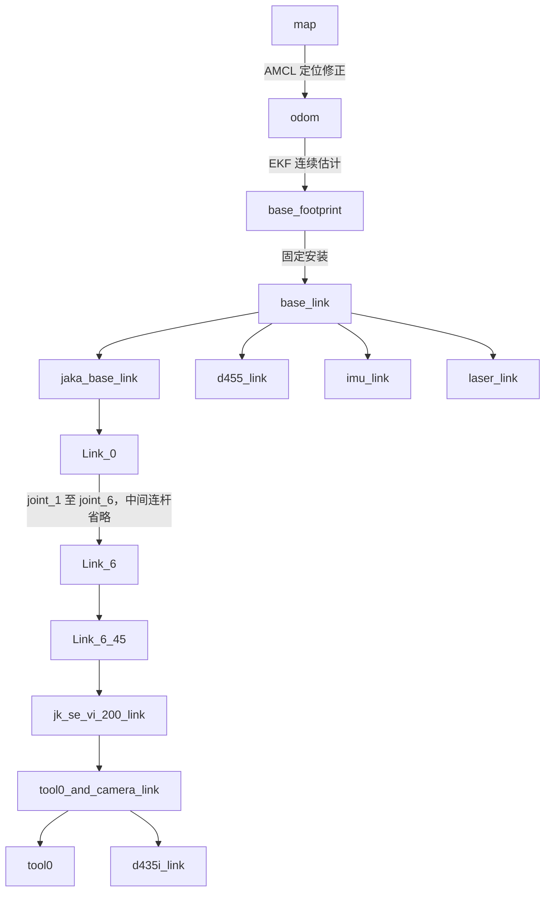

# WBMM 坐标系契约与阅读指南

> Status: DRAFT  
> Author: Agent  
> Reviewer: TBD  
> Reviewed at: TBD  
> Review Level: L1；力控、接触与实机条目须人工逐条审查  
> 核对日期：2026-09-14  
> 代码基线：`74ce9e1` 加当前工作区未提交内容；本次读取的是已存在的 `src/robotics/` 目录和拆分后的力控节点。  
> Warning: 本文档尚未经过人工完整审查，不能作为实现依据。

本文补充 [数学与接口契约](math_contract.md)，不改变 9D 状态、8D 输入、关节顺序和控制职责。`CURRENT` 表示源码或启动配置中可确认的行为，不表示已运行或实机验证；`PROPOSED` 表示待审阅的规范；`TBD` 表示尚需确认。本文中的“必须”属于契约草案要求，不能据此推断代码已强制检查。

## 1. 先记住这几个区别

| 名称 | 用一句话理解 | 在本仓库怎样使用 |
|---|---|---|
| `map` | 给房间、地图和长期任务定位的参考系 | 定位实机入口中的静态 ESDF、REMANI 规划使用它 |
| `odom` | 给机器人短期连续运动定位的参考系 | EKF、OCS2/MRT 的主要参考系；允许长期漂移 |
| `world` | 需要看上下文的“世界”名称 | MuJoCo 世界、数学符号和 ROS frame 不是自动相同的东西 |
| `base_footprint` | 随底盘移动的平面基准 | 当前 9D 状态中底盘位置、yaw 对应的基准 |
| `base_link` | 底盘本体上的固定坐标系 | 当前模型比 `base_footprint` 高 0.147 m |
| `jaka_base_link` | 装在车上的机械臂基座 | 相对底盘有安装平移和旋转，不能当成 `base_link` |
| `tool0` | 当前 URDF 定义的工具参考点与方向 | MPC 默认末端 frame；不能仅凭名称断言它等于实际接触点 |
| `task_frame` | 在任务表面上选的原点和法向、切向 | 本文规定其语义；是否已有对应 TF 发布者为 `TBD` |

`odom` 并不跟着车一起移动；车在 `odom` 中的位置变化。`base_footprint`、`base_link` 才是随车运动的坐标系。`map` 下的机器人估计位姿可能因重定位发生跳变，`odom` 用于保持局部连续性。这是 [REP-105 的移动平台约定](https://raw.githubusercontent.com/ros-infrastructure/rep/master/rep-0105.rst)。

**读一个量时，先问三件事：描述哪个对象或点？在哪个坐标系表达？对应哪个时刻？** 例如“末端位置”还不完整；“时刻 t，`tool0` 原点在 `odom` 中的位置”才完整。

## 2. 当前坐标树与发布所有权

### 2.1 定位实机入口的主链 [CURRENT]

以下来自 [定位实机入口](../src/bringup/launch/remani_mpc_localized_real.launch.py) 与 [机器人 URDF](../src/robotics/tracer_jaka_description/urdf/tracer_jaka_zu5.urdf)。箭头表示 **TF 父 → 子**；它不是点坐标换算的方向。



这是所列入口的配置和模型拓扑，不是本次从运行中的 `/tf` 抓取的结果。相机 optical frame 未画入；真实相机驱动与仿真发布方式见第 7 节。

| TF 边或内容 | 发布责任 [CURRENT] | 契约要求 [PROPOSED] |
|---|---|---|
| `map → odom` | 定位入口由 AMCL 提供；建图由 slam_toolbox 提供；`ocs2_sim.launch.py` 不启动 SLAM 时启用固定变换发布者 | 三种来源按运行模式互斥 |
| `odom → base_footprint` | EKF 入口由 EKF 提供，定位实机入口关闭 MRT 所包含链路的里程计 TF 输出 | 同一运行模式只能有一个权威发布者；轮速消息仍可作为 EKF 输入 |
| `base_footprint → base_link` 及机器人固定边 | robot_state_publisher 按 URDF 发布 | 安装外参以加载的 URDF 为准，不叠加同名静态 TF |
| `Link_0 → … → Link_6` | robot_state_publisher 根据 URDF 和关节状态计算 | `joint_1…joint_6` 是关节名称，TF 连杆名称是 `Link_1…Link_6` |
| `map → task_frame` | 本次未确认统一发布者 | 固定工件任务由一个任务/感知所有者提供；运动工件需另定动态语义 |

局部纯 `odom` 场景不要求为了“树完整”额外创建 `world`。一个 TF 子节点只能有一个父节点，不能同时把 `base_footprint` 直接挂到 `map` 和 `odom`。参见 [REP-105](https://raw.githubusercontent.com/ros-infrastructure/rep/master/rep-0105.rst)。

### 2.2 当前重要固定外参 [CURRENT]

下表逐项提取自 URDF `joint/origin`，单位 m、rad。数值描述 **child 在 parent 中的位姿**，只是模型值，不是标定证书。

| Parent → child | xyz | rpy |
|---|---|---|
| `base_footprint → base_link` | `(0, 0, 0.147)` | `(0, 0, 0)` |
| `base_link → jaka_base_link` | `(0, 0, 0.221)` | `(0, 0, -1.57)` |
| `jaka_base_link → Link_0` | `(0, 0, 0)` | `(0, 0, 0)` |
| `Link_6 → Link_6_45` | `(0, 0, 0)` | `(0, 0, -0.7854)` |
| `Link_6_45 → jk_se_vi_200_link` | `(0, 0, 0.0315)` | `(0, 0, 0.785398)` |
| `jk_se_vi_200_link → tool0_and_camera_link` | `(0, 0, 0)` | `(0, 0, -0.7853)` |
| `tool0_and_camera_link → tool0` | `(0, 0, 0.27)` | `(0, 0, 0)` |
| `tool0_and_camera_link → d435i_link` | `(0, -0.085, 0.03)` | `(0, 0, 3.14)` |
| `base_link → d455_link` | `(0.25, 0, 0.24)` | `(0, 0, 0)` |
| `base_link → imu_link` | `(0.185, 0.185, 0.23)` | `(0, 0, 3.1415)` |
| `base_link → laser_link` | `(0.31, 0, 0.03)` | `(0, 0, 0)` |

因此机械臂基座相对地面投影基准的高度为模型值 `0.147 + 0.221 = 0.368 m`。工具参考点沿其父系 Z 轴偏移 0.27 m。计算 FK 时这些安装关系已经在模型中，外部不能再手动加一次。

`arm_base`、`ee_link`、`tool_frame`、`ft_sensor_frame`、`camera_frame` 是常见概念名；本仓库应分别解析为实际名称或显式配置，禁止默认它们已存在于 TF。`joint_1` 即使可能出现在数学库内部 frame 表中，也不等于 ROS TF 连杆名。

## 3. `world`、`map`、`odom` 的选择规则

### 3.1 不把参数名当 frame 名 [CURRENT]

- [MRT](../src/control/wbmm_ocs2_ros/src/WbmmMrtNode.cpp) 的 `world_frame` 默认值为 `odom`；含义是“控制参考系参数”，不是必须存在名为 `world` 的 TF。
- [EKF 实机配置](../src/bringup/config/ekf_real.yaml) 的 `world_frame: odom` 同样如此。
- [MuJoCo 桥接](../src/sim/tracer_jaka_mujoco/tracer_jaka_mujoco/mujoco_bridge_node.py) 从平面关节 `qpos` 读取 x、y、yaw 作为里程计，默认标为 `odom`。当前 [OCS2 仿真入口](../src/bringup/launch/ocs2_sim.launch.py) 注明 MuJoCo 世界与发布里程计使用同一原点；这是具体仿真配置关系，不能推广为实机的 `world = map = odom`。
- 数学公式中的上标 `w` 只表示所选参考系。本文改用 `G` 指代明确选定的全局/局部参考系；每条链路必须把 `G` 落实为 `map` 或 `odom` 等实际值。

### 3.2 按入口选择，而非全仓库统一成一个名字

| 入口/场景 | 规划参考系 | OCS2/MRT 参考系 | 变换边界 |
|---|---|---|---|
| `remani_mpc_localized_real.launch.py` [CURRENT] | `map`；静态 ESDF 明确检查 `frame_id=map` | `odom` | 里程计 relay 将 pose 转入 map；轨迹 bridge 将参考转回 odom |
| `remani_mpc_sim.launch.py` [CURRENT] | `odom` | `odom` | 显式配置同系；不需要动态 map/odom 轨迹转换 |
| 其他 launch / 手工启动 [TBD] | 核对最终参数和实际消息 | 核对 observation 与 target 所属系 | 不能继承上面任一行的假设 |

[PROPOSED] 固定地图和固定工件优先在 `map` 描述；短期连续控制在 `odom` 描述。地图、ESDF、任务、规划状态必须在同一参考系或经过显式转换。不能仅把 ESDF 的 `frame_id` 从 odom 改成 map；其原点、体素坐标和实际几何也必须匹配。

## 4. 变换方向：唯一记法

### 4.1 位姿、点与向量

沿用数学契约：`T_A_B` 等价于 ${}^{A}T_B$，表示 **B 在 A 中的位姿，同时把 B 表达的点换算到 A**。

$$
{}^{A}T_B=\begin{bmatrix}{}^{A}R_B&{}^{A}p_B\\0_{1\times3}&1\end{bmatrix},\qquad
{}^{A}p_P={}^AR_B\,{}^Bp_P+{}^Ap_B
$$

其中旋转为 3×3 无量纲矩阵，位置为 3D 米制向量。若使用 4×4 矩阵乘法，点必须写成齐次坐标：

$$
\begin{bmatrix}{}^Ap_P\\1\end{bmatrix}={}^AT_B\begin{bmatrix}{}^Bp_P\\1\end{bmatrix}
$$

方向向量、表面法向和同一点速度的换基只旋转，不加平移：

$$
{}^An={}^AR_B\,{}^Bn
$$

法向是单位向量，无量纲；位移向量单位 m。旋转矩阵的三列分别是 B 的 X、Y、Z 轴在 A 中的表达。

$$
{}^AT_C={}^AT_B\,{}^BT_C,\qquad
{}^BT_A=({}^AT_B)^{-1}=
\begin{bmatrix}({}^AR_B)^T&-({}^AR_B)^T{}^Ap_B\\0&1\end{bmatrix}
$$

**TF 树 `map → odom` 存储的是 ${}^{map}T_{odom}$；把 map 中的轨迹换到 odom，要使用它的逆 ${}^{odom}T_{map}$。** [轨迹 bridge](../src/control/wbmm_ocs2_ros/src/remani_to_ocs2_reference_bridge.cpp) 实际调用 `lookupTransform(targetFrame_, plannerFrame_, stamp, …)`，先 target，后 source。

### 4.2 一个可手算例子

假设 ${}^{map}p_{odom}=(1,2,0)$，odom 相对 map 的 yaw 为 +90°。odom 点 `(1,0,0)` 转到 map 为 `(1,3,0)`；反向转换 `(1,3,0)` 应回到 `(1,0,0)`。这是方向检查例子，不是当前现场外参。

### 4.3 轴向、RPY 与四元数

[PROPOSED] 底盘遵循右手系：X 前、Y 左、Z 上，正 yaw 绕 +Z。光学系采用 X 右、Y 下、Z 前。安装后的工具和传感器方向由外参决定，不能要求每个 link 都“X 朝车前”。单位和轴向依据 [REP-103](https://raw.githubusercontent.com/ros-infrastructure/rep/master/rep-0103.rst)。

URDF 的固定轴 RPY 对应：

$$
R=R_z(yaw)R_y(pitch)R_x(roll)
$$

[CURRENT 契约] core 四元数数组顺序 `wxyz`；ROS 消息字段为 x、y、z、w。使用 Eigen 时 `Quaterniond(w,x,y,z)` 构造顺序不能与 `.coeffs()` 的 x、y、z、w 存储顺序混淆。第三方 OCS2/Pinocchio 数组必须按其接口转换，不能把“core 内部 wxyz”推广成“所有库都 wxyz”。

## 5. 状态、轨迹、速度与雅可比

### 5.1 9D/8D 契约 [CURRENT]

令 B 为 `base_footprint`，E 为明确指定的末端（默认 `tool0`），G 为 `state.header.frame_id`：

$$
x=[x_b,y_b,\psi_b,q_1,\ldots,q_6]^T\in\mathbb R^9,\qquad
u=[v,\omega,\dot q_1,\ldots,\dot q_6]^T\in\mathbb R^8
$$

底盘位置在 G 中，以 m 表示；yaw 和关节角单位 rad；v 是底盘自身前向速度，m/s；omega 与关节速度为 rad/s。v 不是 G 系的 X 速度，也不是二维速度向量。

$$
\dot x_b=v\cos\psi_b,\quad\dot y_b=v\sin\psi_b,\quad\dot\psi_b=\omega,\quad
-\sin\psi_b\dot x_b+\cos\psi_b\dot y_b=0
$$

最后一式是差速底盘不能任意横移的非完整约束。状态从 source 转到 target 时，只转换底盘 xy、yaw，六个关节角不变；静态平面换系下 v、omega、关节速度不变。实现位置：TBD。

### 5.2 FK 和 Jacobian [CURRENT]

$$
{}^GT_E(x)={}^GT_B(x_b,y_b,\psi_b)\,{}^BT_E(q)
$$

后半段包含 URDF 从地面投影基准到机械臂、传感器和工具的全部安装变换。

$$
{}^GV_E=\begin{bmatrix}{}^Gv_E\\{}^G\omega_E\end{bmatrix}=J_E(x)u,\qquad J_E\in\mathbb R^{6\times8}
$$

线速度取 **E 原点**，方向在 **G 中表达**，不是 G 原点处的空间螺旋速度；行顺序是 `[linear; angular]`。线速度单位 m/s，角速度单位 rad/s。参见 [core RobotModel 接口](../src/core/wbmm_core/include/wbmm_core/robot_model.hpp) 与 [Pinocchio 实现](../src/robotics/wbmm_pinocchio/src/pinocchio_robot_model.cpp) 的 `forwardKinematics()`、`frameJacobian()`。

实现先调用 `LOCAL_WORLD_ALIGNED`，再按底盘 yaw 旋转关节 Jacobian，并补入差速底盘两列。`LOCAL_WORLD_ALIGNED` 的 WORLD 是数学模型的参考方向，不能理解为强制查询 ROS `world`。同理，修改 state 的 frame 字符串不会让模型自动调用 TF；必须先把底盘数值转换正确。

同一个物理点的速度换基为：

$$
{}^AV_E=\operatorname{diag}({}^AR_B,{}^AR_B)\,{}^BV_E
$$

若把参考点从 E 换到刚性连接的 TCP 点 P，还必须加杠杆项：

$$
{}^Gv_P={}^Gv_E+{}^G\omega_E\times{}^Gr_{EP}
$$

这解释了为什么更换工具接触点会影响线速度 Jacobian，不能只替换名字。不要把需要移动参考点的 6D adjoint 与“同一点只换表达方向”的块对角旋转混用。

### 5.3 Odometry 与 OCS2 消息边界

ROS `Odometry.pose` 在 `header.frame_id` 中表达，而 `twist` 在 `child_frame_id` 中表达。来源：[ROS 2 Humble Odometry 定义](https://raw.githubusercontent.com/ros2/common_interfaces/humble/nav_msgs/msg/Odometry.msg)。

[CURRENT] [odom_to_map_relay.py](../src/bringup/scripts/odom_to_map_relay.py) 把 pose 从 odom 转到 map，但保持 body-frame twist，因此“不旋转 twist”在其约定中是有理由的。前提是输入 child 与输出 child 确实描述同一底盘坐标系。

[CURRENT] [MRT 的 odomCallback()](../src/control/wbmm_ocs2_ros/src/WbmmMrtNode.cpp) 直接读 pose 的 x、y、yaw，未在该回调中依据 header 自动变换或校验 frame 是否匹配 `worldFrame_`。因此仅换订阅话题或仅改 `world_frame` 可能造成数值和语义不一致。

[PROPOSED] 输入 pose 必须与控制 G 匹配；不匹配应先显式转换或拒绝。没有 ROS Header 的 OCS2 数组必须通过适配器配置与日志绑定 frame、关节顺序、时钟域；`SystemObservation` 与 `TargetTrajectories` 必须使用同一 G 和同一 MPC 时间轴。

`TaskTrajectory` 描述期望末端位姿与任务方向；`WholeBodyTrajectory` 描述底盘与关节状态。不能因为两者都带“轨迹”就直接把末端坐标塞进 9D 状态。

### 5.4 动态定位变换的边界

[CURRENT] bridge 对每个采样时刻尝试查询 TF，将位置作刚体变换，速度和加速度只乘平面旋转；失败时使用 `planner_to_ocs2_x/y/yaw` 固定值。同系或禁用 TF 时也使用这些固定参数，并非代码自动保证恒等。

对真正随时间变化的坐标变换，位置轨迹的导数满足：

$$
p_A=R(t)p_B+d(t),\quad
\dot p_A=R\dot p_B+\dot R p_B+\dot d,\quad
\ddot p_A=R\ddot p_B+2\dot R\dot p_B+\ddot R p_B+\ddot d
$$

位置单位 m，导数单位 m/s、m/s²。当前 bridge 没有上述变换导数项，因此应理解为使用定位修正快照转换参考，不应声称实现了任意动态坐标系下严格一致的轨迹导数。地图重定位跳变更不能直接通过求导生成控制速度。

[PROPOSED] 同系转换的固定外参必须为零；动态定位模式下 TF 失败不应无条件退回任意固定值。滚动参考采用哪个修正快照、允许多大的更新、如何暂停/重新建立参考，须在独立实现任务中决定；阈值为 `TBD`。

## 6. `tool0`、TCP、任务坐标系和 wrench

### 6.1 工具点和任务点不是一回事

[CURRENT] `tool0` 是 URDF 中一个固定 link；`ee_frame` 是选择控制哪个末端的参数。`tool0` 会随机械臂运动。`jk_se_vi_200_link` 是腕部传感器相关模型坐标系，不能与 `tool0` 互换。

[PROPOSED] 若实际擦拭/接触点 P 与 E=`tool0` 不重合，应明确标定 ${}^{E}T_P$；需要公开 TF 时另设具体命名的 TCP frame。不要通过悄悄移动 `tool0` 来适配不同工具。更改 TCP 必须同步审查 FK、Jacobian、目标、碰撞几何和 wrench 的力矩参考点。

固定表面任务定义 K=`task_frame`：原点是可追溯的表面基准，+Z 为选定表面外法向，+X 为第一切向，+Y 完成右手系。必须记录外法向选择和“正接触力”含义。任务系不要求与 tool0 同向；若把工具 +Z 对准或反向对准法向，应记录明确的期望姿态。

$$
{}^GT_E^{des}={}^GT_K\,{}^KT_E^{des}
$$

这是把任务局部期望末端位姿转换为 G 中的目标；单位和姿态约定同第 4 节。任务系的统一 TF 发布者、真实 TCP 标定和法向正负目前为 `TBD`。

### 6.2 Wrench 必须同时说明方向和力矩参考点

$$
w=\begin{bmatrix}f\\\tau\end{bmatrix}\in\mathbb R^6
$$

前三项为 N，后三项为 N·m。把 B 原点处、B 方向表达的 wrench 换到 A 原点、A 方向：

$$
{}^Af={}^AR_B\,{}^Bf,\qquad
{}^A\tau_{O_A}={}^AR_B\,{}^B\tau_{O_B}+{}^Ap_B\times{}^Af
$$

平移项是“A 原点指向 B 原点”的向量，表达在 A 中。只旋转力矩会漏掉力臂效应。[当前 transformWrench()](../src/control/whole_body_force_control/src/controllers.cpp) 采用此形式。例：A 到 B 为 `(0,0,0.1) m`、旋转为单位阵，B 处力为 `(10,0,0) N` 且力矩为零，则 A 处力矩为 `(0,1,0) N·m`。

### 6.3 当前力信号链与待确认事项

| 路径 | CURRENT 行为 | 契约含义与限制 |
|---|---|---|
| [JAKA 驱动](../src/drivers/arm/jaka_hardware_interface/src/jaka_hardware_interface.cpp) | 直接透传 EDG 原始 F/T 数值，不做清零、换系、滤波、死区或过期检测 | 原始数值的坐标系、单位和符号须结合 JAKA/传感器资料与实机标定确认，不能在此处默认为 tool0 wrench |
| [实机 F/T broadcaster](../src/robotics/tracer_jaka_description/config/ros2_controllers.yaml) | `frame_id: jk_se_vi_200_link` | EDG 原始传感器 wrench，进入力控流程后按传感器原点处理；仍需标定与有效性检查 |
| [仿真 F/T broadcaster](../src/sim/tracer_jaka_mujoco/tracer_jaka_mujoco/fts_sensor.py) | 从 `tcp_fts_site` 读数，按配置填 header；默认 frame 由 bridge 配为 `jk_se_vi_200_link` | 填 header 本身不执行换系；必须检查 site 与所声明 frame 的原点、方向一致 |
| [力控 ROS I/O](../src/control/whole_body_force_control/src/node_ros_io.cpp) | 2026-09-17：直接接收 `sensor_frame` 下的 wrench，不再转换到 TCP；frame 不匹配时拒绝 | `sensor_frame` 默认为 `jk_se_vi_200_link`；实机只开启 fz 导纳，在名义传感器系生成修正，通过该 link 的 FK/Jacobian 转成全身参考 |

[CURRENT] 当前 [MuJoCo 模型](../src/sim/tracer_jaka_mujoco/models/tracer_jaka_zu5_robot.xml) 将 `tcp_fts_site` 放在 tool-side body，局部四元数抵消该 body 相对传感器父系的旋转，使 site 与仿真 `jk_se_vi_200_link` 同原点、同轴。注意该 MJCF 的腕部固定四元数与 URDF 表中的安装旋转并非逐项相同；仿真内部 site/header 对齐不等于仿真与实机外参已对齐，须列入 F06 联合核验。

[CURRENT，2026-09-17] 本轮力控移除 sensor → TCP/tool0 的 wrench 转换，力矩参考点保留在传感器原点。传感器到其他 link 的通用显式 wrench 转换能力与机器人几何 TF 保留。力控节点改用 `sensor_frame` 参数，实机导纳通过传感器 link 的 FK 和 6D Jacobian 控制该原点的位置与姿态；URDF/FK 使用同一 link 的 TF 轴定义，没有额外手工旋转。OCS2 自身的 `ee_frame=tool0` 配置未修改。实机验收仍为 TBD。

`desired_wrench`、`measured_wrench`、raw、去偏置、滤波后的值必须区分；相减前必须同轴、同力矩参考点并确认符号。静态去偏置不自动等于所有姿态下的重力补偿。

**发现不一致，需人工确认：** `math_contract.md` 第 6 节采用 `desired - measured`；当前标量 `AdmittanceController::update()` 使用 `filtered - desired` 驱动运动偏移。本文不改任何符号，也不据此判断哪一侧正确；须结合“环境对工具的力/工具对环境的力”、任务法向与偏移正方向联合审查。数学契约中 3D 位置修正与 6D wrench 的映射也需明确轴选择，不能直接作维度不匹配的等式。

[PROPOSED] 本节仅固定坐标与符号审查要求，不提供实机执行授权。实机默认 `execution_enabled=false` 的项目原则保持不变；实际入口的执行开关名称须按 launch 核对。接触判断、导纳/阻抗、力/力矩限幅、速度限幅、急停、看门狗、传感器/命令超时、SAFE_HOLD、FAULT 及恢复条件须人工逐条确认，阈值为 `TBD`。

## 7. 相机、激光和 IMU

[CURRENT] URDF 中包含 `d455_link`、`d435i_link`、`laser_link`、`imu_link`。其中 IMU 安装 yaw 约为 π，不能直接把原始 IMU X 分量当成车体 X 分量。

[CURRENT] [仿真相机](../src/sim/tracer_jaka_mujoco/tracer_jaka_mujoco/camera_sensor.py) 根据 MuJoCo camera 位姿计算 optical 方向，并可从 `base_footprint` 直接发布到 `d455_depth_optical_frame`、`d455_color_optical_frame`。因此“真实相机链必然和仿真链逐边相同”不是当前保证。实机 [D455](../src/bringup/launch/d455_real.launch.py) 和 [D435](../src/bringup/launch/d435_real.launch.py) 启动相机驱动；实际 optical 子树需运行时核验。

[CURRENT] MuJoCo bridge 的激光默认 `lidar.frame_id` 是 `lidar_link`，而上述 URDF link 为 `laser_link`。这些不是自动别名；最终 launch 是否覆盖参数、真实驱动 header 和运行 TF 是否连通，应逐入口核对。

[PROPOSED] 相机 link、optical frame、CAD mesh 方向分别管理；不得为让外观朝向正确而改变测量语义。点云/深度数据应按消息所声明的实际传感器 frame，经采样时刻 TF 转到地图。重命名 optical header 不会旋转点云。

## 8. 时间、异常和兼容性规则 [PROPOSED]

1. 每份状态、位姿、方向、wrench、地图都明确 frame；每份时变数据明确 stamp 和 clock domain。沿用数学契约的 `kSystem`、`kSimulation`、`kOcs2Mpc`，不能直接混算时间。
2. 传感器转换优先使用采样时刻；若使用 latest TF，必须记录这是近似、允许年龄和适用条件。静态边与动态边的时间检查分开处理。
3. frame 不匹配、TF 不可用/过期、四元数非法、数值非有限时，不得继续把未转换数据当有效参考。具体停止与恢复动作由控制/安全所有者决定。
4. 协方差随量的坐标变换一起处理。给定选定误差参数化的变换 Jacobian H，有 $\Sigma_A=H\Sigma_BH^T$；若定位变换本身不确定，还需考虑其不确定性，不能宣称只旋转就完成统计融合。
5. 重定位、换地图、仿真重置、时钟跳变后，旧参考和缓存是否仍有效必须重新判断；具体重建机制为 `TBD`。
6. RViz Fixed Frame 只是显示参考系。显示正确不证明 MPC、规划器、ESDF 和 F/T 消费者使用了相同坐标。

## 9. 与现有契约/代码的差异及后续审查

以下全部是文档记录，未实施修改。

| 编号 | 文件/定位 | 当前事实或文档表述 | 建议行为与影响 | 风险/人工确认 |
|---|---|---|---|---|
| F01 | `math_contract.md` §2.1 | 合写 world/map、tool0/ee_link，并将 joint 名列作坐标系 | 审阅后按本表拆分角色、参数名和实际 TF 名；只影响文档语义澄清 | 防止把别名误当实际 frame；需确认 |
| F02 | `math_contract.md` §2.2 | 4×4 T 乘 p 的简写未注明齐次点 | 采用第 4 节显式 4D 点写法 | 数学维度歧义；需确认 |
| F03 | `WbmmMrtNode.cpp::odomCallback` | 未显式核对输入 frame | 增加匹配/转换策略，影响状态入口 | 可能改变消息接收；需独立实现及确认 |
| F04 | bridge `getPlannerToTargetTransform/sampleAt` | TF 失败回退固定值；速度/加速度只旋转 | 区分固定仿真与动态定位，明确快照和故障策略 | 错位或参考跳变；需独立实现及确认 |
| F05 | `odom_to_map_relay.py::odom_callback` | latest TF + 输入消息 stamp；pose covariance 原样复制，未校验输入 frame/child | 记录近似，审查时效/坐标校验和协方差处理；影响 map 里程计消费者 | 时间与统计语义；需独立实现及确认 |
| F06 | JAKA 驱动、URDF、MuJoCo site | 实机硬编码外参，仿真另有 site | 核对原点、轴向、力臂、作用力符号 | 实机接触风险；逐项人工确认 |
| F07 | `math_contract.md` §6 / `controllers.cpp` | 力误差符号不同 | 联合审查力的作用对象与运动偏移方向 | 禁止仅按公式改符号；逐项人工确认 |
| F08 | task/TCP、相机 optical、激光 frame | 尚未统一证明每个运行入口的发布者与映射 | 明确任务 frame 所有者、TCP 标定及每个入口的传感器 TF | 真实外参和运行连通性 TBD；需确认 |

现有 [math_contract.md](math_contract.md) 与 [frame_tree.svg](img/frame_tree.svg) 暂不重写；本次用新文档记录冲突，避免未经审阅就覆盖原有约定。旧图应作为概念示意阅读，真实模型结构以本文核对的 URDF 为依据。

## 10. 如何核验与怎样阅读

建议阅读顺序：第 1 节建立直觉 → 第 2 节看实体安装 → 第 3 节选择运行场景 → 第 4 节手算变换 → 第 5/6 节分别看运动和力。

以下是后续只读核验建议，**本次未执行 ROS 运行检查**：

```bash
ros2 run tf2_ros tf2_echo map odom
ros2 run tf2_ros tf2_echo odom base_footprint
ros2 run tf2_ros tf2_echo base_footprint tool0
ros2 topic echo /odometry/filtered --once
ros2 topic echo /odometry/filtered_map --once
```

在对应定位入口中检查：第一条是否为预期定位修正；第二条是否连续；第三条是否与同一关节状态 FK 一致；两份里程计是否只有 pose 的参考系改变、twist 仍为相同 body frame。另检查实际 F/T 和传感器消息的 header、TF 发布者唯一性、地图文件 frame 元数据。未知节点名、话题和时效阈值必须从当前运行配置获取，不能照抄为现场结论。

建议验收项：

- 手算第 4 节点变换与逆变换、第 6 节力臂例子。
- 用同一时刻的关节/底盘状态比较 TF 和模型 FK；检查 6×8 Jacobian 在小量运动下的有限差分一致性。
- 定位跳变或 TF 断开时，核验参考更新与故障策略；不能只检查 RViz。
- 换 TCP、换地图、换相机或更改安装位置时，重新审阅受影响的外参及消费者。

本次验证记录：读取当前 URDF 的 joint/origin、上述源文件与配置；核对链接、公式块、文档差异及手算示例。不编译、不启动控制节点、不运行实机、不宣称闭环或安全验证通过。源码中已有 [基础合同测试](../src/core/wbmm_core/test/test_wbmm_core.cpp) 和 [运动学/力控测试](../src/control/whole_body_force_control/test/test_force_control.cpp) 可作为后续针对性验证入口，本次未运行。

人工审阅重点：F01–F08 是否接受；map/odom 分工是否覆盖实际使用入口；真实 TCP/传感器标定由谁负责；定位跳变和 TF 故障是否已有经认可的处理。当前人工审查结论：**DRAFT**。
