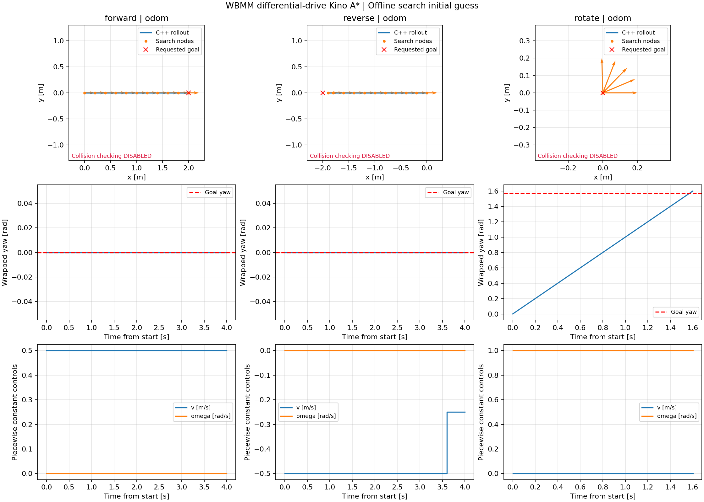

# WBMM 差速底盘 Kino A*

> Status: DRAFT  
> Author: Agent  
> Reviewer: TBD  
> Reviewed at: TBD  
> Review Level: L2  
> 本文档和实现需要人工完整审阅；当前仅完成离线算法验证。

## 1. CURRENT：实现解决什么问题

`wbmm_search` 位于 `src/planning/search/`，寻找差速底盘从起点到目标位置与朝向容差区域的一串运动段。

主链是：

```text
Header + 起终点 BaseState + 底盘限速 + 搜索配置 + 可选碰撞回调
  → 检查输入
  → 取 g+h 最小的节点
  → 枚举 (v, omega)
  → 差速模型推进，生成连续位姿
  → 位姿与控制历史去重、运动段采样检查
  → 记录更优节点及父索引
  → 到达目标容差区域后回溯
  → BaseSearchResult：底盘路径 + 运动段
```

普通栅格 A* 直接枚举相邻位置；这里先枚举控制，再用运动学模型生成邻居。A* 的 `g+h` 框架仍然保留。

当前只搜索底盘 3D 位姿，不搜索机械臂，也不调用 FK、IK、机械臂碰撞或 OCS2。算法代码不依赖 ROS 节点、OMPL、Pinocchio、MuJoCo 或硬件；包采用现有 ament/colcon 构建方式。

这是恒定速度控制的运动学搜索。速度不是搜索状态，加速度不是搜索输入，因此不宣称满足动力学、加速度或速度连续性约束。

**物理搜索状态仍是 3D 位姿，但去重 Key 还携带代价所需的控制历史。** 这两者不能混淆：加入控制变化代价后，即使没有加速度约束，也必须区分上一段控制。

## 2. CURRENT：与 core 和 REMANI 的关系

| 内容 | REMANI 的现有实现 | 本版 WBMM 实现 |
|---|---|---|
| 底盘节点 | `(x, y, yaw)` | 复用 `core::BaseState` 的位姿字段 |
| 运动段输入 | 自行车模型 `(steer, arc)` | 差速模型 `(v, omega, duration)` |
| 状态推进 | `stateTransit()` | `propagate()`，恒定控制解析积分 |
| 原地旋转 | 搜索运动段不是原地旋转模型 | 支持 `v=0, omega!=0` |
| 终点连接 | Reeds–Shepp shot | 通过运动段到达目标容差，不使用 shot |
| 机械臂 | 底盘路径之后另做采样 | 本版省略 |
| 碰撞 | GridMap 与 MMConfig | 预留底盘有效性回调 |
| 输出 | 后续采样、时间处理、机械臂初值 | 底盘专用搜索结果与控制段 |

本版参考搜索流程，未修改或复用 vendor 的实现类。代码入口为：

- `src/planning/search/include/wbmm_search/kino_astar.hpp`：公共类型、配置与函数声明。
- `src/planning/search/src/kino_astar.cpp`：输入检查、推进、搜索与回溯。
- `src/planning/search/examples/kino_astar_demo.cpp`：离线场景及 CSV 导出。
- `src/planning/search/scripts/plot_kino_astar.py`：读取导出数据并绘图。
- `src/planning/search/test/test_kino_astar.cpp`：核心行为与测试专用碰撞回调。

阅读代码时可先看五块：`discretize()` 如何构造 Key，`makeActions()` 如何产生控制，`propagate()` 如何推进，`collisionCheck` 如何采样，再看 `search()` 的 OPEN、`motionCost()`、启发式和父索引。输入校验、异常、时钟和预算是外围保护，仍然保留；本次没有增设其他模块或修改 core。

core 的全身契约仍为 9D 状态和 8D 输入，本版没有改变它。只复用 `Header`、`BaseState` 和 `RobotLimits`；后者只读取 `max_base_speed` 与 `max_base_yaw_rate`。

core 的 `SearchResult` 要求 `base_path`、`arm_seed`、`phases` 等长。因此纯底盘结果保存在 search 包的 `BaseSearchResult`，不构造虚假的六关节初值。

## 3. CURRENT：模型、坐标和单位

搜索状态与控制为：

$$
s_b=[x_b,y_b,\psi_b]^T,\qquad u_b=[v,\omega]^T
$$

位置、yaw 表达在请求 `header.frame_id` 中。`v` 是底盘前向速度，不是全局 x 方向速度；`omega` 是 yaw 角速度。单位为 m、rad、m/s、rad/s、s。

连续模型：

$$
\begin{aligned}
\dot x_b&=v\cos\psi_b\\
\dot y_b&=v\sin\psi_b\\
\dot\psi_b&=\omega
\end{aligned}
$$

满足差速底盘的连续非完整约束：

$$
-\sin\psi_b\,\dot x_b+\cos\psi_b\,\dot y_b=0
$$

一个运动段中控制保持恒定。令 $a=\omega\tau/2$，采用圆弧解析积分的稳定写法：

$$
\begin{aligned}
x_b(\tau)&=x_b(0)+v\tau\,\operatorname{sinc}(a)\cos(\psi_b(0)+a)\\
y_b(\tau)&=y_b(0)+v\tau\,\operatorname{sinc}(a)\sin(\psi_b(0)+a)\\
\psi_b(\tau)&=\operatorname{wrapToPi}(\psi_b(0)+\omega\tau)
\end{aligned}
$$

其中 $\operatorname{sinc}(a)=\sin(a)/a$，在零点取 1。代码在小角度附近使用极限展开，避免直接除以接近零的 `omega`。`v<0` 表示倒车；`v=0` 时位置不变；`omega=0` 时沿当前朝向直行。

有限圆弧不能用“起点朝向上的横向弦位移必须为零”来判断是否侧滑；连续运动模型满足上述约束。`docs/math_contract.md` 中有限步起点航向残差与圆弧推进的关系需要人工核对，标记为 **TBD**，本次未修改数学总契约。

起终点所有字段必须有限，yaw 必须在 `[-pi, pi]`。横向速度允许 `1e-8 m/s` 以内的浮点噪声，超过阈值则拒绝输入；返回路径横向速度始终为零。起终点前向速度与角速度不参与目标匹配，也不是边界速度约束。返回起点速度为零；后续路径点速度字段记录到达该点的运动段控制，不代表测量反馈。

Header 不允许空 frame、负或非有限 stamp、未指定或非法 clock。实现通过 core 的公开 `Twist` 校验复用 Header 检查，不构造全身状态。Header 的 stamp 是请求元数据；运动段时间是相对持续时间，不与其相加，不用于动态障碍预测。

## 4. CURRENT：配置与代价

| 参数 | 默认值 | 含义 |
|---|---|---|
| 搜索边界 | x、y 均为 `[-10,10] m` | 示例搜索区域，不是地图或真实工作空间 |
| `position_resolution` | `0.1 m` | x、y 去重栅格大小 |
| `yaw_bins` | 72 | 朝向周期分格，每格 5° |
| `primitive_duration` | `0.4 s` | 每个候选运动段的持续时间 |
| 两组控制采样 | `{-1,-0.5,0,0.5,1}` | 各自最大线速度、角速度的倍数 |
| `position_tolerance` | `0.15 m` | 到目标位置的欧氏距离阈值 |
| `yaw_tolerance` | `0.1 rad` | 最短朝向误差阈值 |
| `reverse_weight` | 0.5 | 倒车距离的附加代价权重 |
| `rotation_weight` | 0.1 | 旋转角度的附加代价权重 |
| `gear_switch_weight` | 1.0 | 前进与倒车方向切换的附加代价 |
| `speed_change_weight` | 0.1 | 相邻运动段线速度变化的附加代价 |
| `yaw_rate_change_weight` | 0.1 | 相邻运动段角速度变化的附加代价 |
| `max_search_time` | `2 s` | 单调时钟求解预算 |
| `max_nodes` | 100000 | 不可变节点记录上限，包括改善后的新记录 |
| `collision_mode` | `kRequireChecker` | 默认必须提供碰撞回调 |
| 三种采样步长上限 | `0.05 s / 0.05 m / 0.05 rad` | 同时约束时间、前向距离和转角 |

线速度和角速度上限只有一个来源：调用方的 `RobotLimits`。示例取 `0.5 m/s`、`1 rad/s`，这些是离线演示值，不是已验证的实机参数。

两组采样做笛卡尔积，默认产生 24 种运动段，排除静止控制。重复控制会合并，每个唯一 `(v,omega)` 对应稳定的 action id。速度和角速度采样必须有限、非空且在 `[-1,1]` 内；分辨率、时长、采样步长、限速和求解时间必须为正。所有代价权重必须有限且非负。配置还检查容差、边界、索引范围及算术溢出。

每条边代价包括原有时间、倒车距离与旋转角度，以及新增的换向和控制变化项：

$$
\begin{aligned}
c_k={}&\Delta t+w_{rev}\max(0,-v_k)\Delta t+w_{rot}|\omega_k|\Delta t\\
&+w_{gear}\,\mathbf{1}(d_k\ne0,\ d_{last}\ne0,\ d_k\ne d_{last})\\
&+w_{\Delta v}|v_k-v_{k-1}|+w_{\Delta\omega}|\omega_k-\omega_{k-1}|
\end{aligned}
$$

其中 $d_k=\operatorname{sign}(v_k)$，$d_{last}$ 是最近一次非零线速度的方向。`gear` 表示底盘前进／倒车切换，不代表机械变速箱的挡位。

第一段没有上一段控制，因此不加控制变化或换向代价，不把测量起点速度隐式用作上一段控制。此后控制变化对实际相邻运动段计算，包括进入／退出原地旋转时的变化。

原地旋转 `v=0` 不更新最近运动方向。例如“前进 → 原地旋转 → 倒车”仍计一次换向，而“前进 → 原地旋转 → 前进”不计换向。这样不能通过插入旋转绕过换向代价。

累计代价为 $g$。权重按 SI 数值配置，不是物理能量模型。控制变化惩罚倾向减少速度与转向跳变，但不提供加速度硬约束。将三个新增权重设为零可关闭这些代价；倒车距离惩罚仍由原有 `reverse_weight` 独立控制。

令 $d$ 是距目标位置的距离，$e_\psi$ 是最短朝向误差，启发式为：

$$
h=\max\left(\frac{\max(0,d-\epsilon_p)}{v_{max}},\frac{\max(0,e_\psi-\epsilon_\psi)}{\omega_{max}}\right)
$$

位置与朝向可以同时变化，因此取时间下界的最大值，不相加。新增代价非负，仍可使用这个忽略控制变化与换向成本的时间下界。默认 $f=g+h$。

当前完整 Key 为：

```text
(x 栅格, y 栅格, yaw 栅格, previous_action, last_direction)
```

- `previous_action`：上一段唯一 `(v,omega)` 控制的 id；只要任一控制变化权重非零就保留。
- `last_direction`：最近一次前进／倒车方向；换向权重非零时保留，旋转期间不清除。
- 不需要历史时相应字段使用统一哨兵；三个新增权重均为零时退回原先仅按位姿去重的策略。

例如相同位置格内，一个节点以 `v=0.5` 到达且前缀代价较低，另一个以 `v=0.25` 到达且前缀代价较高。若后续需要保持 `v=0.25`，后一节点的总代价可能反而更低。两者不能只按位姿合并。相反方向到达同一位姿时也有类似的后续换向差别。

每个完整 Key 仍只保留当前最低代价记录；连续位姿仍经栅格合并，细小运动仍可能被去重，不能保证连续空间完备性或全局最优。分辨率、运动段时长、控制集合与容差必须一起选择。保存控制历史会增加节点数，本次未提高 2 秒／100000 节点的默认预算。

节点记录不会原地修改。更低代价到达同一 key 时追加新节点、更新 best 表并重新入队；弹出时跳过过期记录，已扩展 key 也允许重新进入队列。父索引指向真实的连续状态记录，回溯不会因父状态被覆盖而断裂。栅格边界仅修正浮点索引误差，不改变实际位姿。

## 5. CURRENT：碰撞空接口与返回结果

```cpp
using BaseCollisionChecker = std::function<bool(
  const wbmm::core::Header&,
  const wbmm::core::BaseState&)>;
```

`true` 表示位姿有效，`false` 表示拒绝。回调未来负责底盘 footprint、环境数据、未知空间和安全距离的具体策略，算法本身不判断 footprint 大小或地图占据。

默认缺少回调时返回 `kMissingCollisionChecker`。显式选择 `kDisabled` 后不会调用回调；成功结果的 `collision_checked=false`，消息、CSV 与示例图标注未检查碰撞。

启用时先检查起终点，再检查待加入搜索树的实际运动段；不以直线弦代替圆弧。每段样本数为：

$$
N=\left\lceil\max\left(1,\frac{\Delta t}{\delta t},\frac{|v|\Delta t}{\delta s},\frac{|\omega|\Delta t}{\delta\psi}\right)\right\rceil
$$

原地旋转也有角度样本，供未来带方向的 footprint 检查使用。搜索边界始终采样检查，包括关闭碰撞检测时。回调抛出异常即终止搜索，不能将地图不可用解释为自由空间。

**采样通过只表示这些样本被回调接受，不表示整段连续无碰撞。** 新增的尖角障碍测试显示默认 50 ms 采样可漏掉短暂穿越；该场景显式设置 2.5 ms 检查，并用 5 ms 重放复核。真实场景需要根据障碍、footprint、速度及安全裕量制定检查策略，仍为 TBD。

回调应使用同一规划 frame 的稳定环境快照，并及时返回。单调时钟预算在搜索循环和采样循环内检查，无法抢占阻塞中的回调，因此不是硬实时期限。

成功结果包含：

- `path`：起点与各运动段的真实终点。
- `primitives`：相邻路径点之间的控制和持续时间，数量比路径点少一。
- `path_length`：$\sum |v|\Delta t$，原地旋转不增加平移长度。
- `total_cost`、`solve_time`、生成与扩展节点统计及请求 Header。
- `success`、`status`、`message` 与 `collision_checked`。

成功要求位置和朝向误差都在容差内，不将末点替换为精确目标。失败时路径、运动段、长度与总代价清空，保留统计及原因。状态区分非法输入、缺失回调、无效起点、无效目标、回调异常、离散搜索无路径、超时、节点记录耗尽。

## 6. CURRENT：如何运行

从 WBMM 仓库根目录构建。以下路径完整列出，构建、安装、日志和示例产物放在 `/tmp/`：

```bash
cd /home/a/WBMM
source /opt/ros/humble/setup.bash
colcon --log-base /tmp/wbmm_kino_build_logs build \
  --base-paths src/core/wbmm_core src/planning/search \
  --packages-select wbmm_core wbmm_search \
  --build-base /tmp/wbmm_kino_build \
  --install-base /tmp/wbmm_kino_install \
  --cmake-args -DCMAKE_BUILD_TYPE=Release
source /tmp/wbmm_kino_install/setup.bash
ros2 run wbmm_search kino_astar_demo /tmp/wbmm_kino_astar_demo
```

示例显式关闭碰撞检测，运行三组场景：

| 场景 | 起点 | 请求目标 | 本次离线结果 |
|---|---|---|---|
| forward | `(0,0,0)` | `(2,0,0)` | 成功，平移长度约 `2 m`，代价 4 |
| reverse | `(0,0,0)` | `(-2,0,0)` | 成功，平移长度 `1.9 m`，代价 4.975 |
| rotate | `(0,0,0)` | `(0,0,pi/2)` | 成功，平移长度为零，代价 1.76 |

以上是启用默认换向与控制变化代价后的本次运行结果，不是随机鲁棒性、仿真接触或实机验证；求解时间会随机器负载变化。末点保留容差内的真实结果，例如原地旋转结束朝向为 `1.6 rad`。倒车示例在原有 4.95 的代价上增加 0.025 的线速度变化成本。

每个场景输出 `_path.csv`、`_primitives.csv`、`_rollout.csv`。注释记录 frame、clock、请求 stamp、碰撞状态和请求目标。`path` 的时间从零开始按持续时间累加；`rollout` 使用 C++ 的同一个 `propagate()` 每 25 ms 导出采样点。

绘图脚本读取并拼接这些采样点，校验 CSV 元数据、数量、时间及首末端一致性，不重新维护另一套 Python 运动模型。运动段边界可以有同一时间的两个控制样本，因为控制允许跳变。

交互显示：

```bash
MPLCONFIGDIR=/tmp/wbmm_kino_mpl python3 \
  /home/a/WBMM/src/planning/search/scripts/plot_kino_astar.py \
  /tmp/wbmm_kino_astar_demo
```

无界面保存：

```bash
MPLCONFIGDIR=/tmp/wbmm_kino_mpl python3 \
  /home/a/WBMM/src/planning/search/scripts/plot_kino_astar.py \
  /tmp/wbmm_kino_astar_demo --no-show \
  --save /tmp/wbmm_kino_astar_demo/kino_astar.png
```



橙色箭头表示朝向，因此倒车场景的箭头仍指向前方；蓝色路径向后延伸。三幅图都未检查碰撞。

## 7. CURRENT：验证记录

2026-09-16，在本仓库环境执行：

- `wbmm_core` 与 `wbmm_search` Release 构建成功；最终增量构建没有编译警告。
- 首版验证中 core 22 项行为测试通过，本次未修改 core；当前 search 34 项行为测试全部通过。
- 覆盖直行、倒车、圆弧解析积分、小角度、原地旋转、yaw 跨 ±pi、目标相同、回溯重放、重复调用与非法数值。
- 测试专用回调覆盖起终点拒绝、运动段中间障碍、旋转朝向障碍、加密采样绕障、回调异常和碰撞关闭模式。
- 覆盖圆弧中间越界、节点预算耗尽、单调时钟超时及算术溢出。
- 本次新增 8 项测试：独立倒车／换向／速度变化成本、旋转期间保留方向、同格不同速度与角速度历史、同位姿前进与倒车到达历史、首段不使用测量速度、小横向噪声容差及重复控制去重。
- Key 回归测试通过已知可枚举的小场景验证：较贵的前缀可以带来较低的总控制变化代价；方向不同的到达状态也必须保留。测试中较大的权重和旋转限速仅用于合成场景。
- 三组离线示例成功，CSV 读取检查及无界面绘图成功，已查看生成图像并检查布局。

测试回调是合成障碍函数，不是仓库已经具备真实碰撞模型的证据。未进行 MuJoCo 或实机测试。

复现测试：

```bash
cd /home/a/WBMM
source /opt/ros/humble/setup.bash
source /tmp/wbmm_kino_install/setup.bash
colcon --log-base /tmp/wbmm_kino_test_logs test \
  --base-paths src/core/wbmm_core src/planning/search \
  --packages-select wbmm_core wbmm_search \
  --build-base /tmp/wbmm_kino_build \
  --install-base /tmp/wbmm_kino_install
colcon test-result --test-result-base /tmp/wbmm_kino_build
```

## 8. PROPOSED / TBD：后续接入

- **PROPOSED**：提供真实底盘碰撞回调；在调用方管理稳定的地图快照、frame 和环境 revision，再决定是否需要扩大公共接口。
- **PROPOSED**：将底盘搜索结果交给后续优化器；存在真实机械臂初值时再显式转换到 core `SearchResult`，不自动补零。
- **TBD**：底盘 footprint、地图查询、未知空间策略、连续碰撞／安全距离保证。
- **TBD**：优化后的限速、加速度、轨迹插值、revision 校验，以及 OCS2 参考转换；本版没有生成 `WholeBodyTrajectory`。
- **TBD**：数学总契约中有限步横向残差与精确圆弧的关系，须人工核对。

搜索运动段时间不构成可直接执行的时间参数化轨迹，控制不保证连续，未保证起终点停车。任何实机接入须另行设计安全门、急停、看门狗、超时与故障恢复，并人工逐条审查。本版没有实机执行入口。

来源：当前 `wbmm_core` 类型、模型和校验头文件；`docs/math_contract.md`；`src/vendor/remani_planner/path_searching/src/kino_astar.cpp` 的 `search()`、`stateTransit()`、`retrievePath()` 以及机械臂采样调用；本包实现与行为测试。
