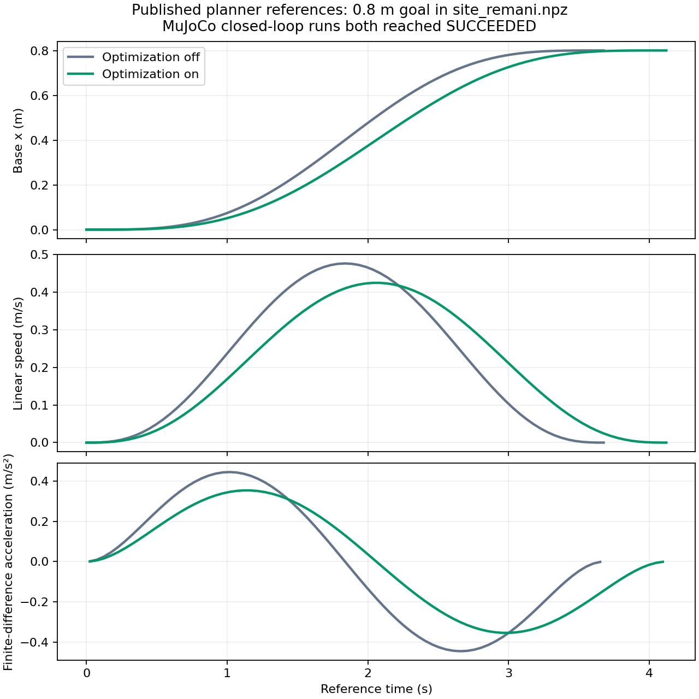

# REMANI 优化迁移与验证记录

日期：2026-09-28。工作区：`/home/a/WBMM`。本次修改未提交 Git。

## 本次实现

沿用 WBMM 现有 A* → sample arm RRT → 必要时 whole-body RRT 搜索链，搜索成功后接入 MINCO + L-BFGS 的空间、时间联合优化。复用 WBMM 的轨迹类型、机器人关节顺序、URDF 碰撞球和 ESDF，不改变 MPC 控制器或可视化消息接口。

此前已有 MINCO 和固定时间优化器，但后者没有接入 planner。本次完善的核心包括：

- 同时优化内部路径点 `[x,y,q1..q6]` 和各段持续时间，沿用 REMANI 的正时间变换并设置最小段时长。
- 补齐时间积分项、MINCO 伴随传播、虚拟时间变换的梯度；空间和时间梯度均有有限差分检查。
- 保留 snap、障碍物、地面、自碰撞、关节位置/速度/加速度代价，并加入 WBMM 差速底盘的角速度和线加速度软约束。没有照搬自行车转向模型。
- 使用分段中点积分，避免静止端点处航向导数奇异；修复 ESDF 网格边缘钳位区域的梯度。
- 保留求解过程的最佳有限候选值，限制迭代次数、求解时间和总轨迹时长。
- 候选先进行时间缩放，再通过既有参考轨迹检查：速度包络、航向连续性、关节范围、终点一致性、全身环境碰撞和参考插值采样检查。候选失败则回到原始种子生成流程，不额外重跑搜索。
- ROS 节点在已有异步规划工作线程中调用优化器，输出 `PLAN_METRICS` 分阶段计时。`build` 包含 `optimization`，不能将两项重复相加。
- tracking launch 默认启用优化，可通过 `planner_enable_optimization:=false` 恢复无优化对照。

**覆盖边界：**当前优化适用于可用单一行驶方向 MINCO 表达的轨迹。原地旋转、原地机械臂重配置和混合前后向等仍通过已有 `time_scaled_primitives` 处理，没有实现跨换向点的联合优化，也没有移植 REMANI 底盘特有的全部轮级约束。

## 实测对比

两次均使用用户指定的 `wbmm_tracking.launch.py` 和 `maps/map1/site_remani.npz`；每次重新启动 MuJoCo，只切换优化开关，关闭 GUI。目标为地图坐标 `(0.8, 0)`，终点 yaw 为 0。

| 指标 | 关闭优化 | 开启优化 |
|---|---:|---:|
| 最终状态 | SUCCEEDED | SUCCEEDED |
| 参考轨迹长度 | 0.800 m | 0.800 m |
| 参考轨迹时长 | 3.675 s | 4.120 s |
| 参考最大线速度 | 0.476 m/s | 0.425 m/s |
| 参考线加速度 RMS | 0.299 m/s² | 0.238 m/s² |
| 优化计算耗时 | 0 | 2.345 ms |
| 最终仿真底盘位置误差 | 0.386 mm | 0.409 mm |
| 目标发布至收到轨迹 | 419 ms | 394 ms |

加速度 RMS 下降约 **20.4%**，参考时长增加约 **12.1%**。本例是直线，几何长度和关节姿态没有变化；结果体现平滑性与时间的权衡，不代表复杂避障路径已经缩短。速度、加速度来自发布的规划参考，不是测量的真实机器人运动；加速度 RMS 由相邻参考速度的差分计算。

两次请求总延迟还包含停稳等待、桥接握手和异步定时器，单次 419/394 ms 的差异不能用来证明优化降低了规划延迟。日志中的目标函数 `218.57643 → 25.602203` 比较的是优化器的初始种子与候选；初始种子尚未经过原有时间缩放，不能当成两条最终发布轨迹的公平目标函数对比。



原始数据：

- [优化开关对照与启动参数](optimization_migration_results/comparison.json)
- [关闭优化参考](optimization_migration_results/baseline_trajectory.npz)、[开启优化参考](optimization_migration_results/optimized_trajectory.npz)，字段为 `t,xy,yaw,q,u`。
- [导航/转向/末端追踪/返回导航回归](optimization_migration_results/tracking_regression.json)
- [单测结果汇总](optimization_migration_results/unit_tests.json)

完整模式回归使用开启优化的同一 tracking 入口，四阶段均通过：导航位置误差 0.69 mm、原地旋转 yaw 误差 0.00242 rad、末端追踪位置误差 12.37 mm、返回导航位置误差 3.02 mm。这些均为 MuJoCo 仿真数据，不是硬件验收结果。

相关包编译通过；environment、collision、search、traj_opt、planner 共 **126 个 C++ 测试通过**，bringup 现有 **21 个 launch 测试通过**。包含空间/时间梯度、单段时间优化、错误关节顺序、优化异常/无效输出回退，以及最终参考碰撞检查回归。

## 搜索为什么慢，以及调整顺序

### 1. 已修复：关键包没有开启编译优化

修改前本机这些包的 `CMAKE_BUILD_TYPE` 为空，编译命令没有 `-O`；上游 REMANI 的搜索、碰撞配置和优化包显式使用 `-O3`。现在 WBMM 相关包在调用者未指定构建类型时默认 Release，显式 Debug 等设置仍被保留。

保留修改前的基准可执行文件，与本次 Release 构建分别运行三次。优化器均关闭，同一地图、姿态和有效目标；取成功案例的中位数：

| 指标 | 修改前无编译优化 | Release | 比值 |
|---|---:|---:|---:|
| A* | 332.789 ms | 31.858 ms | 10.45× |
| arm seed | 14.032 ms | 2.332 ms | 6.02× |
| 完整离线规划 | 380.457 ms | 39.511 ms | 9.63× |
| 底盘碰撞检查次数 | 3746 | 3746 | 相同 |
| 全身碰撞检查次数 | 134 | 134 | 相同 |

这证明 WBMM 自身的构建配置是主要性能问题之一，**不是本机 REMANI 与 WBMM 的直接速度对照**。基准另有三个目标被底盘碰撞检查拒绝，未纳入成功规划耗时统计；原始 JSON 保留这些失败记录。

数据：[修改前](optimization_migration_results/search_before.json)、[Release](optimization_migration_results/search_release.json)。

### 2. 建议下一步：合并一次状态下的 FK

`wbmm_collision/src/environment_collision_checker.cpp` 虽然按 link 缓存位姿，但每个 link 仍分别调用 `PinocchioRobotModel::forwardKinematics()`。后者每次创建 `pinocchio::Data`，执行整树 FK 和 frame 更新。应改成一次状态更新返回所需全部 link 位姿，并复用线程私有 Data。该项尚未修改，需单独验证线程安全及碰撞判断等价性。

### 3. 建议下一步：补差速底盘快速连接

上游 Kino A* 有 Reeds–Shepp one-shot 连接；WBMM 主要依靠栅格运动原语展开和位置启发式。可加入适配差速模型的终点连接与更强启发式，减少无效展开，但不能直接复制上游自行车转向参数。

### 4. 建议下一步：sample RRT 近邻与枝条管理

当前近邻查找线性扫描节点，上游的双向扩展/树管理策略也与当前实现不同。应先记录节点数、近邻查找时间、碰撞检测时间，再考虑缓存、空间索引、连接策略。不能仅凭总耗时就认定 RRT 是瓶颈；本次有效直线案例没有触发全身 RRT。

不建议首先放宽碰撞插值分辨率或只增加搜索超时。现有 `.02 m/.03 rad` 检查还承担最终参考验收作用。RViz 全身模型渲染负载与搜索耗时也应分开观察。

## 修改文件清单

以下路径均相对于 `/home/a/WBMM`。

| 文件 | 修改内容 |
|---|---|
| `src/planning/optimization/wbmm_traj_opt/include/wbmm_traj_opt/whole_body_optimizer.hpp` | 联合优化配置、候选返回值、诊断与输入约定 |
| `src/planning/optimization/wbmm_traj_opt/src/whole_body_optimizer.cpp` | 时间变量与梯度、差速约束、边界处理、有限候选保留 |
| `src/planning/optimization/wbmm_traj_opt/test/test_whole_body_optimizer.cpp` | 严格梯度和输入/优化回归 |
| `src/map/wbmm_environment/src/esdf_grid.cpp` | 边界钳位区域的插值梯度修复 |
| `src/map/wbmm_environment/test/test_environment_skeleton.cpp` | 边界梯度差分检查 |
| `src/planning/wbmm_planner/include/wbmm_planner/whole_body_planner.hpp` | ROS-free 优化回调与结果诊断 |
| `src/planning/wbmm_planner/src/whole_body_planner.cpp` | 接入优化、候选验收、保留种子回退 |
| `src/planning/wbmm_planner/test/test_whole_body_planner.cpp` | 回调、关闭开关、异常/无效输出回退测试 |
| `src/planning/wbmm_planner_ros/src/wbmm_planner_node.cpp` | 异步调用、ROS 参数、分阶段计时 |
| `src/bringup/launch/wbmm_tracking.launch.py` | tracking 优化开关 |
| `src/bringup/launch/wbmm.launch.py` | 向 planning 传递优化开关 |
| `src/bringup/launch/wbmm_planning.launch.py` | 将优化开关传入 ROS 节点 |
| `src/planning/wbmm_planner/package.xml` | 基准程序的 Pinocchio 测试依赖 |
| 下列六处 `CMakeLists.txt` | 未指定构建类型时默认 Release；planner 另增加基准目标 |
| `src/bringup/test/optimization_comparison.py`（新增） | 两次独立 MuJoCo 启动、数据记录与闭环对比 |
| `src/planning/wbmm_planner/test/planner_benchmark.cpp`（新增） | 实际 URDF/ESDF 的分阶段离线计时 |
| 本报告及 `docs/optimization_migration_results/`（新增） | 修改清单、实测 JSON、参考 NPZ、对比图 |

六处构建文件目录：`src/map/wbmm_environment`、`src/robotics/wbmm_collision`、`src/planning/search`、`src/planning/optimization/wbmm_traj_opt`、`src/planning/wbmm_planner`、`src/planning/wbmm_planner_ros`。

## 需要人工审核的事项

1. **行为权衡：**默认 `time_weight=5`、障碍裕量 0.10 m；本例明显更平滑但更慢，需要根据任务时效和空间约束确定权重。优化器新增加速度限制是软代价，不能视为严格执行器约束。
2. **碰撞保障范围：**地面与自碰撞是优化软代价；当前最终硬检查仍以既有环境碰撞与关节范围为主。采样和插值检查不构成连续时间、自碰撞的完整证明；`OptimizerResult.safe` 只是 ESDF 采样诊断。
3. **求解预算：**时间预算在 L-BFGS 已接受迭代的进度回调中检查，不能中断一次较慢的代价计算/线搜索，不是严格实时超时。
4. **模型假设：**本轮仍为六关节机械臂、9D 状态/8D 输入接口；更换关节数需要另行扩展 MINCO 维度。关节名称/顺序、帧和模型版本沿用当前 WBMM。
5. **验证范围：**已经验证简单实图直线对照及模式切换回归，尚未完成狭窄障碍、机械臂显著绕障、多目标统计以及硬件验证；也未直接测量同条件 REMANI 性能。复杂空间/时间梯度通过单元测试，但不能替代场景验收。

## 运行与复现

常规启动（默认开启优化）：

```bash
cd /home/a/WBMM
source install/setup.bash
ros2 launch tracer_jaka_bringup wbmm_tracking.launch.py esdf_file:=maps/map1/site_remani.npz
```

关闭优化进行人工对照：在上述 launch 命令后追加 `planner_enable_optimization:=false`。

自动闭环对照（独立 ROS domain，启动两次仿真）：

```bash
ROS_DOMAIN_ID=113 ROS_LOCALHOST_ONLY=1 \
  python3 src/bringup/test/optimization_comparison.py \
  --output /tmp/wbmm_optimization_comparison
```

完整模式回归：

```bash
ROS_DOMAIN_ID=114 ROS_LOCALHOST_ONLY=1 \
  python3 src/bringup/test/planning_tracking_check.py \
  --output /tmp/wbmm_optimizer_tracking_regression
```

离线阶段计时（需构建 planner 的测试目标）：

```bash
build/wbmm_planner/planner_benchmark
build/wbmm_planner/planner_benchmark --optimize
```

旧的无编译优化基准程序仅留在本机 `/tmp/wbmm_opt_baseline/benchmark_unoptimized`，未纳入仓库；新基准源文件和三次对照数据已保存。
