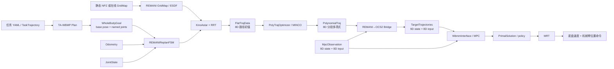

# WBMM 核心数据结构与数据流指南

> Status: DRAFT  
> Author: Agent  
> Reviewer: TBD  
> Reviewed at: TBD  
> Warning: 本文档尚未经过人工审查，不能作为实现依据。

本文档回答一个核心问题：一份“机器人、轨迹、地图或碰撞数据”在 WBMM 仓库中，到了 `wbmm_core`、TA-WBMP、REMANI、REMANI→OCS2 桥和 OCS2 MPC 后，分别以什么结构存在、维度如何变化、由谁生产和消费，以及源码在哪里。

本文档以当前仓库源码为依据。数学与坐标系总契约仍以 [`math_contract.md`](math_contract.md) 为准。

---

## 1. 阅读结论

### 1.1 一句话主线

当前控制主线中的核心数据变化是：

$$
\underbrace{p(t)=[x_b,y_b,q_1,\dots,q_6]^T}_{\text{REMANI 平坦输出，8D}}
\xrightarrow[\text{恢复 yaw}]{\text{bridge}}
\underbrace{x(t)=[x_b,y_b,\psi_b,q_1,\dots,q_6]^T}_{\text{OCS2 状态，9D}}
$$

以及：

$$
\dot p(t)
\xrightarrow[\text{差速约束}]{\text{bridge}}
\underbrace{u(t)=[v,\omega,\dot q_1,\dots,\dot q_6]^T}_{\text{OCS2 输入，8D}}
$$

`wbmm_core` 已经定义了与这套 9D/8D 数学契约对应的通用领域对象，但 **CURRENT：`wbmm_ocs2` 当前刻意不依赖 `wbmm_core`**，两者还没有通过统一 Adapter 完成数据闭环。

### 1.2 先记住这五类对象

| 层级 | 主要对象 | 它回答的问题 |
|---|---|---|
| `wbmm_core` | `WholeBodyState`、`WholeBodyInput`、`TaskTrajectory`、`WholeBodyTrajectory` | 跨规划器/控制器应怎样统一表达数据 |
| TA-WBMP | `TaskTrajectory`、`Plan`、`CandidateMetrics` | 任务表面上要做什么、从哪个全身构型进入 |
| REMANI | `PathNode`、`FlatTrajData`、`Trajectory<7>`、`SingulTrajData` | 如何搜索并优化无碰撞的全身参考 |
| Bridge | `PolynomialSample`、`AssembledTrajectory` | 如何把 REMANI 8D 多项式变成 OCS2 9D/8D 参考 |
| OCS2 | `SystemObservation`、`TargetTrajectories`、`OptimalControlProblem`、`PrimalSolution` | MPC 当前看到什么、追踪什么、求出了什么 |

### 1.3 状态标记

| 标记 | 含义 |
|---|---|
| `CURRENT` | 当前源码中已经存在的结构或行为 |
| `PROPOSED` | 为统一数据契约而建议的后续设计，本次未实现 |
| `TBD` | 仅靠当前静态源码不能完整确认，需要人工或运行验证 |

---

## 2. 端到端数据流



这张图里有两条不同性质的数据链：

- 参考链：任务目标 → REMANI 规划轨迹 → OCS2 `TargetTrajectories`；
- 反馈链：里程计/关节状态 → `SystemObservation` → MPC/MRT → 执行命令。

环境数据目前没有贯穿全链的唯一对象，详见第 9 节。

---

## 3. 全仓库统一数学字典

### 3.1 当前全身状态与输入

差速底盘 + 六轴机械臂的状态为：

$$
x=
\begin{bmatrix}
x_b & y_b & \psi_b & q_1 & q_2 & q_3 & q_4 & q_5 & q_6
\end{bmatrix}^{T}
\in \mathbb{R}^{9}
$$

控制输入为：

$$
u=
\begin{bmatrix}
v & \omega & \dot q_1 & \dot q_2 & \dot q_3 & \dot q_4 & \dot q_5 & \dot q_6
\end{bmatrix}^{T}
\in \mathbb{R}^{8}
$$

连续时间运动学为：

$$
\dot x=f(x,u)=
\begin{bmatrix}
v\cos\psi_b \\
v\sin\psi_b \\
\omega \\
\dot q_1 \\
\vdots \\
\dot q_6
\end{bmatrix}
$$

源码对应：

- `wbmm_core` 维度常量：[`types.hpp:131`](../src/core/wbmm_core/include/wbmm_core/types.hpp#L131)；
- OCS2 模型维度：[`WbmmModelInfo.h:39`](../src/control/wbmm_ocs2/include/wbmm_ocs2/WbmmModelInfo.h#L39)；
- OCS2 动力学：[`Dynamics.cpp:50`](../src/control/wbmm_ocs2/src/Dynamics.cpp#L50)。

### 3.2 同一物理量在不同层的名字

| 物理含义 | `wbmm_core` | REMANI | OCS2 |
|---|---|---|---|
| 底盘平面位置 | `BaseState.x/y` | 平坦输出 `pos.head(2)` | `state(0:1)` |
| 底盘 yaw | `BaseState.yaw` | 单独的 `yaw` 或由速度恢复 | `state(2)` |
| 关节角 | `JointState.positions` | 平坦输出尾部六维 | `state(3:8)` |
| 底盘前向速度 | `base_command[0]` | `singul * ||[vx,vy]||` | `input(0)` |
| 底盘角速度 | `base_command[1]` | 由平面速度/加速度恢复 | `input(1)` |
| 关节速度 | `joint_velocities` | 平坦输出导数尾部六维 | `input(2:7)` |
| 时间 | `stamp` / `time_from_start` | ROS 起始时刻 + 段内相对时间 | MPC 内部时间轴 |
| 坐标系 | `Header.frame_id` | `planning_frame` / GridMap `frame_id` | 状态隐含于节点配置，桥转换到 `target_frame` |

### 3.3 为什么状态 9D、输入 8D

底盘位置包含 $(x_b,y_b,\psi_b)$ 三个状态，但差速底盘只有 $(v,\omega)$ 两个独立输入。其非完整约束为：

$$
-\sin\psi_b\,\dot x_b+\cos\psi_b\,\dot y_b=0
$$

因此不能把 OCS2 的 9D `state` 直接当成 9D 可控速度。Pinocchio 使用 9D 广义速度表示，而 OCS2 输入通过映射矩阵进入：

$$
v_{pin}=B(\psi_b)u
$$

其中：

$$
B(\psi_b)=
\begin{bmatrix}
\cos\psi_b & 0 & 0_{1\times6} \\
\sin\psi_b & 0 & 0_{1\times6} \\
0 & 1 & 0_{1\times6} \\
0_{6\times1} & 0_{6\times1} & I_6
\end{bmatrix}
\in\mathbb{R}^{9\times8}
$$

于是末端或碰撞点关于 OCS2 输入的雅可比为：

$$
J_u(x)=J_v(q)B(\psi_b)\in\mathbb{R}^{6\times8}
$$

源码对应：[`PinocchioMapping.cpp:65`](../src/control/wbmm_ocs2/src/PinocchioMapping.cpp#L65) 与 [`PinocchioMapping.cpp:80`](../src/control/wbmm_ocs2/src/PinocchioMapping.cpp#L80)。

---

## 4. `wbmm_core`：统一领域对象

### 4.1 基础值类型

`wbmm_core` 不依赖 ROS 消息，用普通 C++ 结构表达跨模块数据。

| 类型 | 核心字段 | 数学/语义 | 源码 |
|---|---|---|---|
| `Header` | `frame_id, stamp, clock` | 坐标系、时间、时钟域 | [`types.hpp:25`](../src/core/wbmm_core/include/wbmm_core/types.hpp#L25) |
| `Vector3` | `x,y,z` | 三维向量 | [`types.hpp:32`](../src/core/wbmm_core/include/wbmm_core/types.hpp#L32) |
| `Quaternion` | `w,x,y,z` | 内部顺序固定为 `wxyz` | [`types.hpp:39`](../src/core/wbmm_core/include/wbmm_core/types.hpp#L39) |
| `Pose` | `Header + position + orientation` | 带时空语义的位姿 | [`types.hpp:49`](../src/core/wbmm_core/include/wbmm_core/types.hpp#L49) |
| `Twist` | `linear + angular` | 六维速度 $[v;\omega]$ | [`types.hpp:56`](../src/core/wbmm_core/include/wbmm_core/types.hpp#L56) |
| `Wrench` | `force + torque` | 六维力/力矩 $[f;\tau]$ | [`types.hpp:63`](../src/core/wbmm_core/include/wbmm_core/types.hpp#L63) |

`ClockDomain` 区分系统时钟、仿真时钟和 OCS2 MPC 时钟。不同域的时间不能直接相减；ROS/MPC Adapter 应负责转换。

### 4.2 机器人状态和输入

`WholeBodyState` 不是一个裸 9D `Eigen::VectorXd`，而是带名字、单位、坐标系和可选测量量的结构：

```text
WholeBodyState
├── Header
├── BaseModel
├── BaseState
│   ├── x, y, yaw
│   └── linear_velocity, lateral_velocity, yaw_rate
└── JointState
    ├── names
    ├── positions
    ├── velocities
    └── efforts
```

源码：[`types.hpp:78`](../src/core/wbmm_core/include/wbmm_core/types.hpp#L78) 与 [`types.hpp:97`](../src/core/wbmm_core/include/wbmm_core/types.hpp#L97)。

`WholeBodyInput` 保存：

- 差速底盘命令 `base_command=[v,\omega]`；
- 显式 `joint_names`；
- 六关节速度 `joint_velocities`。

源码：[`types.hpp:105`](../src/core/wbmm_core/include/wbmm_core/types.hpp#L105)。

关键区别：

- `WholeBodyState.base.linear_velocity` 是测量/估计状态附加量，不会使优化状态从 9D 变成 10D；
- `JointState.names` 是语义合同，转换时必须按名字映射，不能仅凭数组下标猜顺序；
- `WholeBodyInput` 的 `stamp` 和 `clock` 独立存在，目前没有完整 `Header`，因此不直接携带 `frame_id`。

### 4.3 任务轨迹与全身轨迹

`TaskTrajectory` 表示“末端要做什么”：

$$
\mathcal T_{task}=
\{t_i,{}^WT_{ee,i}^{des},\mathbf t_i,\mathbf n_i,c_i\}_{i=0}^{N}
$$

对应 `TaskTrajectoryPoint`：`time_from_start`、`pose`、`tangent`、`surface_normal`、`contact`。源码：[`trajectory.hpp:13`](../src/core/wbmm_core/include/wbmm_core/trajectory.hpp#L13)。

`WholeBodyTrajectory` 表示“机器人全身如何运动”：

$$
\mathcal X=
\{t_i,x_i,u_i^{ff},\phi_i,r_i^{task}\}_{i=0}^{N}
$$

对应 `WholeBodyTrajectoryPoint`：全身状态、可选前馈输入、执行相位、可选任务参考。整条轨迹还携带：

- `trajectory_id`；
- `environment_revision`；
- `collision_model_revision`；
- 离散轨迹点。

源码：[`trajectory.hpp:57`](../src/core/wbmm_core/include/wbmm_core/trajectory.hpp#L57) 与 [`trajectory.hpp:70`](../src/core/wbmm_core/include/wbmm_core/trajectory.hpp#L70)。

`SearchResult` 只保存搜索拓扑和优化初值，不是可执行轨迹：`base_path`、`arm_seed`、`phases`、`path_length`、`solve_time`、`success`。源码：[`trajectory.hpp:44`](../src/core/wbmm_core/include/wbmm_core/trajectory.hpp#L44)。

### 4.4 机器人模型接口

`RobotModel` 提供规划与控制共同需要的最小接口：

- 状态/输入维度；
- 底盘模型；
- 关节名与限位；
- 正运动学；
- 全身雅可比；
- 模型相关校验。

其雅可比合同为：

$$
{}^WV_{link}=J(x)u,\qquad J\in\mathbb{R}^{6\times8}
$$

前三行为线速度，后三行为角速度；参考点是指定 link 坐标系原点。源码：[`robot_model.hpp:24`](../src/core/wbmm_core/include/wbmm_core/robot_model.hpp#L24)。

### 4.5 校验对象

`ValidationResult{ok,message}` 为 fail-closed 校验返回值。当前通用校验明确要求：

- `Header.frame_id` 非空、时间有限且非负、时钟域已指定；
- 四元数归一化；
- 当前 `WholeBodyState` 必须是差速底盘；
- yaw 位于 $[-\pi,\pi]$；
- 恰好六个、不重复且非空的关节名；
- 状态、输入和轨迹数组长度一致，数值有限，时间严格递增。

源码：[`validation.hpp:14`](../src/core/wbmm_core/include/wbmm_core/validation.hpp#L14)。

### 4.6 当前接入边界

`CURRENT`：`wbmm_core` 是统一契约包；`wbmm_ocs2` 当前仍使用自己的 `WbmmModelInfo` 和 OCS2 `vector_t`，其 README 明确写明“本阶段刻意不接入”。源码说明：[`wbmm_ocs2/README.md:17`](../src/control/wbmm_ocs2/README.md#L17)。

`PROPOSED`：未来 Adapter 应只负责以下显式转换，不应重新定义数学语义：

```text
WholeBodyState  <-> OCS2 vector_t(9)
WholeBodyInput  <-> OCS2 vector_t(8)
WholeBodyTrajectory <-> TargetTrajectories
RobotModel      <-> Pinocchio-backed implementation
```

`TBD`：`environment_revision` 和 `collision_model_revision` 尚未在 REMANI→OCS2 参考链中看到生产、检查和拒绝旧版本轨迹的闭环。

---

## 5. TA-WBMP：任务级数据

TA-WBMP 位于任务生成和全身入口选择层。它的对象与 `wbmm_core` 同名但不是同一个 C++ 类型。

### 5.1 `TaskTrajectory`

TA-WBMP 的任务轨迹由以下部分组成：

| 结构 | 内容 | 源码 |
|---|---|---|
| `TaskWaypoint` | progress、位姿、切向、法向、名义速度、接触标志 | [`task_trajectory.hpp:20`](../src/planning/ta_wbmp/include/ta_wbmp/task_trajectory.hpp#L20) |
| `TaskGeometry` | 平面/曲面中心、法向、局部轴、边界、半径 | [`task_trajectory.hpp:32`](../src/planning/ta_wbmp/include/ta_wbmp/task_trajectory.hpp#L32) |
| `MpcExecutionConfig` | 参考发布率、窗口、采样步长、跟踪阈值 | [`task_trajectory.hpp:45`](../src/planning/ta_wbmp/include/ta_wbmp/task_trajectory.hpp#L45) |
| `ForceExecutionConfig` | 力轴、期望力、导纳参数和安全限幅 | [`task_trajectory.hpp:54`](../src/planning/ta_wbmp/include/ta_wbmp/task_trajectory.hpp#L54) |
| `TaskTrajectory` | 名称、frame、类型、几何、执行配置、点序列 | [`task_trajectory.hpp:86`](../src/planning/ta_wbmp/include/ta_wbmp/task_trajectory.hpp#L86) |

这里的 `ForceExecutionConfig` 是执行参数，不会把力加入 OCS2 的 9D 状态或 REMANI 的 8D 平坦输出。

### 5.2 `Plan`

`Plan` 是 TA-WBMP 的聚合结果，包含：

- 时间参数化的 `Waypoint` 序列；
- 任务目标与法向；
- 简化圆障碍 `obstacles=[x,y,r]`；
- 任务表面几何；
- 候选构型评估；
- `remani_navigation_goal`；
- `task_entry_state`；
- 各阶段起始索引和 `PlanReport`。

源码：[`planner.hpp:28`](../src/planning/ta_wbmp/include/ta_wbmp/planner.hpp#L28) 与 [`planner.hpp:68`](../src/planning/ta_wbmp/include/ta_wbmp/planner.hpp#L68)。

候选代价输入 `CandidateMetrics` 记录任务误差、关节裕量、可操作度、最小奇异值、底盘/手臂路径长度、导航代价等。源码：[`cost.hpp:10`](../src/planning/ta_wbmp/include/ta_wbmp/cost.hpp#L10)。

### 5.3 状态有效性

`WholeBodyStateValidityChecker` 是 TA-WBMP 注入碰撞/环境检查的扩展点。当前有：

- `AcceptAllStateValidityChecker`：全部接受，仅适合演示或隔离测试；
- `UrdfSelfCollisionStateValidityChecker`：检查 URDF 自碰撞；
- 环境/ESDF 检查：接口允许注入，但当前头文件中没有共享 REMANI ESDF 的具体实现。

源码：[`extensions.hpp:11`](../src/planning/ta_wbmp/include/ta_wbmp/extensions.hpp#L11)。

`CURRENT`：TA-WBMP 的 `Plan.obstacles` 是二维简化圆障碍，并不等价于 REMANI 的 3D ESDF，也不等价于 OCS2 的 COAL 几何体。

`TBD`：生产链是否始终注入了与 REMANI 同源的环境检查器，需要逐个 launch/入口做运行配置审查；仅看接口不能确认。

---

## 6. REMANI：搜索、优化和轨迹容器

### 6.1 REMANI 的 8D 平坦输出

REMANI 优化的多项式输出不是 9D 状态，而是：

$$
p(t)=
\begin{bmatrix}
x_b(t)&y_b(t)&q_1(t)&\cdots&q_6(t)
\end{bmatrix}^{T}
\in\mathbb{R}^{8}
$$

yaw 不在多项式维度中，而是由底盘平面速度和运动方向 `singul` 恢复：

$$
\psi_b(t)=\operatorname{atan2}
\left(s\dot y_b(t),s\dot x_b(t)\right),
\qquad s\in\{+1,-1\}
$$

其中 `singul=+1` 表示前进，`singul=-1` 表示倒车。

### 6.2 前端搜索节点

| 对象 | 主要数据 | 作用 | 源码 |
|---|---|---|---|
| `PathNode` | 2D 栅格索引、yaw 索引、`state=[x,y,yaw]`、输入、代价、父节点、方向 | 差速底盘 Kino A* 节点 | [`kino_astar.h:35`](../src/vendor/remani_planner/path_searching/include/path_searching/kino_astar.h#L35) |
| `NodeHashTable` | `(ix,iy,iyaw) -> PathNode*` | 已扩展节点哈希表 | [`kino_astar.h:79`](../src/vendor/remani_planner/path_searching/include/path_searching/kino_astar.h#L79) |
| `ManiPathNode` | 机械臂状态、树关系、代价、节点状态 | 在底盘路径条件下搜索机械臂构型 | [`sample_mani_RRT.h:22`](../src/vendor/remani_planner/path_searching/include/path_searching/sample_mani_RRT.h#L22) |
| `PathNodeRRT` | 动态维 `state`、单独 yaw、层、方向、父子节点、代价 | 全身 RRT 搜索节点 | [`rrt.h:25`](../src/vendor/remani_planner/path_searching/include/path_searching/rrt.h#L25) |

Kino A* 搜索结果进一步整理为：

- `CarFlatTrajData`：单个运动方向内的 $(x,y,t)$ 采样、yaw 列表、起终端平坦状态；
- `FlatTrajData`：单个运动方向内的 8D 路径点、分配时间、yaw、起终端状态；
- 多段容器通过 `singul` 把前进/倒车区间分开。

源码：[`plan_container.hpp:14`](../src/vendor/remani_planner/traj_utils/include/traj_utils/plan_container.hpp#L14)。

### 6.3 边界状态矩阵

REMANI 的起终端状态矩阵采用：

$$
S=
\begin{bmatrix}
p & \dot p & \ddot p & p^{(3)}
\end{bmatrix}
\in\mathbb{R}^{8\times4}
$$

源码中 `FlatTrajData.start_state` 的注释为 `(8,4)`，规划管理器用 `headState/tailState` 保存 `[pos, vel, acc, jerk]`。对应位置：[`plan_container.hpp:22`](../src/vendor/remani_planner/traj_utils/include/traj_utils/plan_container.hpp#L22) 与 [`planner_manager.cpp:163`](../src/vendor/remani_planner/plan_manage/src/planner_manager.cpp#L163)。

### 6.4 分段七次多项式

`poly_traj::Piece<7>` 的每个输出维度是一条七次多项式：

$$
p_d(t)=\sum_{k=0}^{7}c_{d,k}t^{7-k},
\qquad d=0,\dots,7
$$

整块系数矩阵为：

$$
C\in\mathbb{R}^{8\times8}
$$

`Piece<7>` 保存 `duration`、`coeffMat`、`singul`；`Trajectory<7>` 保存多个 Piece，并提供位置、速度、加速度、jerk 采样。源码：[`poly_traj_utils.hpp:16`](../src/vendor/remani_planner/traj_utils/include/traj_utils/poly_traj_utils.hpp#L16) 与 [`poly_traj_utils.hpp:493`](../src/vendor/remani_planner/traj_utils/include/traj_utils/poly_traj_utils.hpp#L493)。

`PolyTrajOptimizer` 以 `MinSnapOpt<8>`、控制点、中间点、段时长和换向点为主要优化数据，并保存障碍、可行性、时间、机械臂碰撞与自碰撞等权重。源码：[`poly_traj_optimizer.hpp:24`](../src/vendor/remani_planner/traj_opt/include/optimizer/poly_traj_optimizer.hpp#L24)。

其概念目标可概括为：

$$
\min_{C,T}
J_{smooth}+w_tJ_{time}+w_oJ_{obs}
+w_fJ_{feas}+w_{mo}J_{mani\text{-}obs}
+w_{ms}J_{self}
$$

上式是对源码权重与回调职责的结构化概括，不代表代码中存在完全相同名字的一条总公式。

### 6.5 轨迹容器

| 类型 | 内容 | 生命周期 |
|---|---|---|
| `GlobalTrajData` | 全局 `Trajectory<7>`、起始时间、总时长、局部目标在全局轨迹上的时间 | 全局参考 |
| `LocalTrajData` | 单段 `Trajectory<7>`、轨迹 ID、起止时间、起点、方向 | 一段同方向局部轨迹 |
| `SingulTrajData` | 多个 `LocalTrajData`、累计时长、ROS 起始时间 | 当前可发布局部轨迹 |
| `TrajContainer` | `global_traj + singul_traj_data` | Manager 持有的总容器 |

源码：[`plan_container.hpp:31`](../src/vendor/remani_planner/traj_utils/include/traj_utils/plan_container.hpp#L31)。

`MMPlannerManager` 聚合 `GridMap`、`TrajContainer`、`PolyTrajOptimizer` 和 `MMConfig`。源码：[`planner_manager.h:19`](../src/vendor/remani_planner/plan_manage/include/plan_manage/planner_manager.h#L19)。

### 6.6 运行状态 `MMState`

`MMState` 是从多项式采样出的运行快照，包含：

- 时间；
- 底盘位置、平面速度、yaw、带符号速度、加速度、角速度、角加速度；
- 底盘旋转矩阵与输入；
- 机械臂位置和速度。

源码：[`mm_config.hpp:178`](../src/vendor/remani_planner/mm_config/include/mm_config/mm_config.hpp#L178)。

注意：`MMState` 是 REMANI 内部便利结构，不等价于 `wbmm_core::WholeBodyState`，也不等价于 `ocs2::SystemObservation`。

### 6.7 FSM 数据

`REMANIReplanFSM` 保存：

- 执行状态 `INIT / WAIT_TARGET / GEN_NEW_TRAJ / REPLAN_TRAJ / EXEC_TRAJ / TASK_EXEC / EMERGENCY_STOP`；
- 8D `mm_state_pos/vel/acc`，yaw 单独保存；
- 起点、局部目标、终点、运动方向和夹爪状态；
- `Odometry`、`JointState`、`WholeBodyGoal` 等 ROS 接口；
- 当前 `MMPlannerManager`。

源码：[`remani_replan_fsm.h:52`](../src/vendor/remani_planner/plan_manage/include/plan_manage/remani_replan_fsm.h#L52)。

`WholeBodyGoal.msg` 用 `base_pose + joint_names + joint_positions` 表达完整目标；回调按关节名查找并拒绝缺失/非有限值。消息：[`WholeBodyGoal.msg`](../src/vendor/remani_planner/traj_utils/msg/WholeBodyGoal.msg)，回调：[`remani_replan_fsm.cpp:978`](../src/vendor/remani_planner/plan_manage/src/remani_replan_fsm.cpp#L978)。

---

## 7. REMANI → OCS2 桥：最关键的转换层

### 7.1 ROS 多项式消息

`PolynomialTraj` 每条消息表示一个恒定运动方向的 section：

- `trajectory_id`：段 ID；
- `action`：ADD / ABORT / WARN；
- `singul`：前进或倒车；
- `trajectory[]`：多个 `PolynomialMatrix` piece。

每个 `PolynomialMatrix` 保存 `num_order`、`num_dim`、扁平系数 `data` 和 `duration`。源码：[`PolynomialTraj.msg`](../src/vendor/remani_planner/quadrotor_msgs/msg/PolynomialTraj.msg) 与 [`PolynomialMatrix.msg`](../src/vendor/remani_planner/quadrotor_msgs/msg/PolynomialMatrix.msg)。

REMANI 直接把 Eigen 列主序系数矩阵复制到 `data`。源码：[`remani_replan_fsm.cpp:1370`](../src/vendor/remani_planner/plan_manage/src/remani_replan_fsm.cpp#L1370)。

### 7.2 桥内部结构

| 类型 | 字段 | 用途 | 源码 |
|---|---|---|---|
| `PolynomialSample` | position、velocity、acceleration、singul | 一个时刻的 8D 采样 | [`bridge.cpp:87`](../src/control/wbmm_ocs2_ros/src/remani_to_ocs2_reference_bridge.cpp#L87) |
| `TrajectorySection` | ID、方向、piece 数组 | 一条 REMANI section | [`bridge.cpp:103`](../src/control/wbmm_ocs2_ros/src/remani_to_ocs2_reference_bridge.cpp#L103) |
| `AssembledTrajectory` | 起始 ROS 时间、section 数组、总时长、代次 | 已按 ID 拼接的完整参考 | [`bridge.cpp:127`](../src/control/wbmm_ocs2_ros/src/remani_to_ocs2_reference_bridge.cpp#L127) |

### 7.3 多项式求值

桥按最高次项在前的顺序求值：

$$
\begin{aligned}
p_d(t)&=\sum_{k=0}^{n}c_{d,k}t^{n-k} \\
\dot p_d(t)&=\sum_{k=0}^{n-1}(n-k)c_{d,k}t^{n-k-1} \\
\ddot p_d(t)&=\sum_{k=0}^{n-2}(n-k)(n-k-1)c_{d,k}t^{n-k-2}
\end{aligned}
$$

并验证：

$$
|data|=num\_dim\,(num\_order+1)
$$

源码：[`bridge.cpp:153`](../src/control/wbmm_ocs2_ros/src/remani_to_ocs2_reference_bridge.cpp#L153)。

### 7.4 坐标系变换

桥优先查询 `planner_frame -> target_frame` 的动态 TF；失败时回退到固定二维变换参数。二维刚体变换为：

$$
{}^Tp={}^Tt_P+{}^TR_P\,{}^Pp
$$

$$
{}^TR_P=
\begin{bmatrix}
\cos\theta&-\sin\theta\\
\sin\theta&\cos\theta
\end{bmatrix}
$$

源码：[`bridge.cpp:654`](../src/control/wbmm_ocs2_ros/src/remani_to_ocs2_reference_bridge.cpp#L654) 与 [`bridge.cpp:773`](../src/control/wbmm_ocs2_ros/src/remani_to_ocs2_reference_bridge.cpp#L773)。

### 7.5 从平坦导数恢复 OCS2 输入

速度足够大时：

$$
\begin{aligned}
\psi_b&=\operatorname{unwrap}
\left(\operatorname{atan2}(s\dot y_b,s\dot x_b)\right)\\
v&=s\sqrt{\dot x_b^2+\dot y_b^2}\\
\omega&=\frac{\dot x_b\ddot y_b-\dot y_b\ddot x_b}
{\dot x_b^2+\dot y_b^2}
\end{aligned}
$$

速度低于阈值时保持上一 yaw，并令 $v=\omega=0$，避免起终点和换向点的数值退化。随后组装：

$$
x=[x_b,y_b,\psi_b,p_2,\dots,p_7]^T
$$

$$
u=[v,\omega,\dot p_2,\dots,\dot p_7]^T
$$

源码：[`bridge.cpp:805`](../src/control/wbmm_ocs2_ros/src/remani_to_ocs2_reference_bridge.cpp#L805)。

### 7.6 滚动参考窗口

桥发布 `TargetTrajectories` 时，第一个点锚定最新观测状态，后续点按 `sample_dt` 在 `reference_horizon` 内采样：

$$
\mathcal R_k=
\{t_i,x_i^{ref},u_i^{ref}\}_{i=0}^{N},
\qquad N\approx\left\lceil\frac{T_h}{\Delta t}\right\rceil+1
$$

结束后状态保持终点、输入置零。源码：[`bridge.cpp:875`](../src/control/wbmm_ocs2_ros/src/remani_to_ocs2_reference_bridge.cpp#L875)。

---

## 8. OCS2 MPC：观测、参考、问题和解

### 8.1 基础数值类型

OCS2 使用动态 Eigen 类型：

- `scalar_t = double`；
- `vector_t = Eigen::VectorXd`；
- `matrix_t = Eigen::MatrixXd`；
- `scalar_array_t / vector_array_t / matrix_array_t` 表示时间序列。

源码：[`Types.h:44`](../src/vendor/ocs2_ros2/core/ocs2_core/include/ocs2_core/Types.h#L44)。

### 8.2 `SystemObservation`

MPC 当前观测为：

```text
SystemObservation
├── mode
├── time
├── state   # 当前 WBMM 为 9D
└── input   # 当前 WBMM 为 8D
```

源码：[`SystemObservation.h:38`](../src/vendor/ocs2_ros2/mpc/ocs2_mpc/include/ocs2_mpc/SystemObservation.h#L38)。ROS 消息对应 [`MpcObservation.msg`](../src/vendor/ocs2_ros2/robotics/ocs2_msgs/msg/MpcObservation.msg)。

### 8.3 `TargetTrajectories`

参考由三条等长时间序列组成：

```text
TargetTrajectories
├── timeTrajectory
├── stateTrajectory
└── inputTrajectory
```

源码：[`TargetTrajectories.h:38`](../src/vendor/ocs2_ros2/core/ocs2_core/include/ocs2_core/reference/TargetTrajectories.h#L38)。ROS 消息对应 [`MpcTargetTrajectories.msg`](../src/vendor/ocs2_ros2/robotics/ocs2_msgs/msg/MpcTargetTrajectories.msg)。

当前存在两种互斥语义：

- `wholeBodyTracking.activate=true`：每个 state 是 9D 全身状态；
- `endEffector.activate=true`：同一字段按 7D 末端位置 + 四元数解释。

两者同时开启会被 `WbmmInterface` 拒绝，因为同一个数组不能同时具有两种语义。源码：[`WbmmInterface.cpp:195`](../src/control/wbmm_ocs2/src/WbmmInterface.cpp#L195)。

### 8.4 `WbmmModelInfo`

`WbmmModelInfo` 保存：

- `stateDim=9`；
- `inputDim=8`；
- `armDim=6`；
- `baseFrame`、`eeFrame`、可选第二末端；
- Pinocchio 顺序下的 `dofNames`。

源码：[`WbmmModelInfo.h:52`](../src/control/wbmm_ocs2/include/wbmm_ocs2/WbmmModelInfo.h#L52)。工厂函数要求 Pinocchio `nq=nv=9`，并在 URDF 根链路前加入 `PX/PY/RZ` 平面关节。源码：[`FactoryFunctions.cpp:98`](../src/control/wbmm_ocs2/src/FactoryFunctions.cpp#L98)。

### 8.5 `OptimalControlProblem`

OCS2 的问题容器聚合：

- 中间/终端 cost；
- 软约束 penalty；
- 等式/不等式约束；
- 增广拉格朗日项；
- 系统动力学；
- PreComputation；
- 当前目标轨迹指针。

源码：[`OptimalControlProblem.h:48`](../src/vendor/ocs2_ros2/core/ocs2_oc/include/ocs2_oc/oc_problem/OptimalControlProblem.h#L48)。`WbmmInterface` 是本项目组装这个对象的入口：[`WbmmInterface.h:49`](../src/control/wbmm_ocs2/include/wbmm_ocs2/WbmmInterface.h#L49)。

当前问题可抽象为：

$$
\begin{aligned}
\min_{x(\cdot),u(\cdot)}\quad
&\Phi(x(T))+
\int_{t_0}^{T}L(x(t),u(t),x_{ref}(t),u_{ref}(t))dt\\
\text{s.t.}\quad
&\dot x=f(x,u)\\
&q_{min}\le q\le q_{max}\\
&u_{min}\le u\le u_{max}\\
&h_{self}(x)\ge0\\
&h_{env}(x)\ge0\quad\text{（仅启用时）}
\end{aligned}
$$

全身状态跟踪代价为：

$$
L_x=\frac12(x-x_d)^TQ(x-x_d)
$$

yaw 误差使用最短角距离。无效或空参考会回退到初始状态保持。源码：[`WholeBodyTrajectoryCost.cpp:54`](../src/control/wbmm_ocs2/src/cost/WholeBodyTrajectoryCost.cpp#L54)。

输入代价使用 $R\in\mathbb{R}^{8\times8}$；关节位置限位来自 URDF，输入速度限位来自 `task.info`。组装位置：[`WbmmInterface.cpp:309`](../src/control/wbmm_ocs2/src/WbmmInterface.cpp#L309) 与 [`WbmmInterface.cpp:591`](../src/control/wbmm_ocs2/src/WbmmInterface.cpp#L591)。

### 8.6 `PreComputation`

`WbmmPreComputation` 持有 Pinocchio 模型和映射，在 cost/constraint 请求前缓存：

- forward kinematics；
- frame placements；
- 需要线性化时的 joint Jacobians；
- 全局几何位姿。

源码：[`PreComputation.h:44`](../src/control/wbmm_ocs2/include/wbmm_ocs2/PreComputation.h#L44) 与 [`PreComputation.cpp:59`](../src/control/wbmm_ocs2/src/PreComputation.cpp#L59)。

### 8.7 `PrimalSolution` 与性能指标

MPC 求解结果 `PrimalSolution` 包含：

- `timeTrajectory_`；
- `stateTrajectory_`；
- `inputTrajectory_`；
- 事件后索引；
- `ModeSchedule`；
- 可求值的 controller/policy。

源码：[`PrimalSolution.h:43`](../src/vendor/ocs2_ros2/core/ocs2_oc/include/ocs2_oc/oc_data/PrimalSolution.h#L43)。

`PerformanceIndex` 记录总 cost、merit、动力学违反、等式/不等式约束 SSE 和拉格朗日项。源码：[`PerformanceIndex.h:42`](../src/vendor/ocs2_ros2/core/ocs2_oc/include/ocs2_oc/oc_data/PerformanceIndex.h#L42)。

MRT 使用当前观测求值 policy；若 policy 空、过期、非有限或预测命令不安全，则停止底盘并保持机械臂。入口：[`WbmmMrtNode.cpp:441`](../src/control/wbmm_ocs2_ros/src/WbmmMrtNode.cpp#L441)。

---

## 9. 环境与碰撞数据结构

### 9.1 必须分开的四套环境表示

| 表示 | 数据结构 | 消费者 | 是否与其他层自动同步 |
|---|---|---|---|
| TA-WBMP 简化环境 | `Plan.obstacles: Vector3d(x,y,r)` | TA-WBMP 自身 | 否 |
| REMANI 规划环境 | `GridMap` 的 occupancy + ESDF buffer | Kino A*、RRT、轨迹优化、`MMConfig` | 同一 REMANI 内共享 |
| OCS2 环境几何 | `Obstacle{geometry,transform,minimumDistance}` | OCS2 环境碰撞软约束 | 否，不读取 REMANI ESDF |
| RViz 显示环境 | `PointCloud2/OccupancyGrid/Marker` | 人工观察 | 只显示，不参与规划 |

这四者外观可能相同，但数据所有权和安全含义不同。

### 9.2 REMANI `GridMap`

`MappingParameters` 保存地图几何和传感器参数：

- `map_origin/map_size/map_boundary/map_voxel_num`；
- `resolution/resolution_inv/frame_id`；
- 局部更新范围和障碍膨胀；
- 相机内参、深度过滤、射线长度；
- log-odds 占据概率参数；
- ESDF 显示/更新参数。

`MappingData` 保存运行期数组：

- `occupancy_buffer`、负占据和膨胀占据；
- 正/负/合并距离场 `distance_buffer*`；
- A* 访问、启发式长度和下一状态；
- 相机位姿、深度图、投影点；
- raycast 命中/遍历缓存；
- 局部更新边界和时序标志。

源码：[`grid_map.h:51`](../src/vendor/remani_planner/plan_env/include/plan_env/grid_map.h#L51) 与 [`grid_map.h:103`](../src/vendor/remani_planner/plan_env/include/plan_env/grid_map.h#L103)。

三维索引到一维地址的顺序为：

$$
a(i_x,i_y,i_z)=i_xN_yN_z+i_yN_z+i_z
$$

源码：[`grid_map.h:336`](../src/vendor/remani_planner/plan_env/include/plan_env/grid_map.h#L336)。

最近体素距离由 `getDistance()` 返回，连续位置精细距离由八邻点三线性插值得到：

$$
d(p)=\sum_{a,b,c\in\{0,1\}}
w_{abc}(p)d_{abc}
$$

源码：[`grid_map.h:594`](../src/vendor/remani_planner/plan_env/include/plan_env/grid_map.h#L594) 与 [`grid_map.cpp:2148`](../src/vendor/remani_planner/plan_env/src/grid_map.cpp#L2148)。

### 9.3 静态 ESDF NPZ 数据合同

REMANI 静态加载器要求 NPZ 至少包含：

| 字段 | 类型/形状 | 含义 |
|---|---|---|
| `esdf` | `float32[nx,ny,nz]` | 有符号欧氏距离，单位 m |
| `occupancy` | `bool/uint8[nx,ny,nz]` | 占据标志 |
| `origin` | `float32[3]` | 网格原点 |
| `voxel_size` | `float32 scalar` | 体素边长 |
| `bounds_max` | `float32[3]` | 上边界 |
| `frame_id` | scalar string | 网格所在坐标系 |

并校验：

$$
bounds_{max}\approx origin+voxel\_size
\begin{bmatrix}N_x&N_y&N_z\end{bmatrix}^{T}
$$

源码：[`grid_map.cpp:310`](../src/vendor/remani_planner/plan_env/src/grid_map.cpp#L310)。

MJCF 转换器采用“自由空间正、障碍内部负”的符号：

$$
d_{ESDF}=EDT(\neg occ)-EDT(occ)
$$

源码：[`mjcf_to_esdf.py:229`](../src/map/grid_map/grid_map/mjcf_to_esdf.py#L229)。

nvblox 导出器还写入 `observed`、`source`、`unknown_is_occupied` 元数据。未知空间保守模式下：

$$
d_{unknown}=-voxel\_size
$$

并把未知体素标为占据。源码：[`nvblox_map_exporter.py:350`](../src/map/my_nvblox_bringup/my_nvblox_bringup/nvblox_map_exporter.py#L350)。

`CURRENT`：REMANI C++ 静态加载器读取核心六字段，不单独读取 `observed` 和 `unknown_is_occupied`；未知空间策略已经在导出时折叠进 `esdf/occupancy`。

### 9.4 静态地图坐标系规则

加载器要求归档 `frame_id` 与规划器 `grid_map.frame_id` 完全一致，否则直接报错；只支持可选固定 XYZ 平移，不在加载时旋转/重采样 ESDF。源码：[`grid_map.cpp:552`](../src/vendor/remani_planner/plan_env/src/grid_map.cpp#L552)。

因此：

- 固定 ESDF 本身必须在稳定规划坐标系中；
- `map -> odom` 的动态变化由 REMANI→OCS2 bridge 转换轨迹参考；
- 不能只改 `frame_id` 字符串来假装地图已经变换。

### 9.5 REMANI 机器人碰撞模型

`MMConfig` 保存：

- 底盘碰撞球心与每球半径；
- 每个机械臂 link 的齐次局部采样点和对应半径；
- URDF 关节运动学、底盘到机械臂基座变换；
- 底盘、机械臂、自碰撞和地面安全裕量；
- 关节上下限。

源码：[`mm_config.hpp:106`](../src/vendor/remani_planner/mm_config/include/mm_config/mm_config.hpp#L106)。

对机器人球 $i$，环境安全条件为：

$$
h_i=d_{ESDF}(c_i(x))-r_i-m_i\ge0
$$

底盘检查额外加入一个地图分辨率项；机械臂检查还拒绝低于 `ground_safe_dis` 的采样点。源码：[`mm_config.cpp:1334`](../src/vendor/remani_planner/mm_config/src/mm_config.cpp#L1334) 与 [`mm_config.cpp:1379`](../src/vendor/remani_planner/mm_config/src/mm_config.cpp#L1379)。

四类碰撞返回码为：

| `coll_type` | 含义 |
|---:|---|
| 0 | 底盘－环境 |
| 1 | 机械臂－环境 |
| 2 | 底盘－机械臂自碰撞 |
| 3 | 非相邻机械臂 link 自碰撞 |
| -1 | 无碰撞 |

源码：[`mm_config.cpp:1558`](../src/vendor/remani_planner/mm_config/src/mm_config.cpp#L1558)。日志中的 `start (1) is not free` 因而表示“初始状态发生机械臂－环境碰撞”，不是“第 1 个起点”。

### 9.6 OCS2 环境几何

OCS2 的 `EnvironmentGeometryInterface::Obstacle` 保存：

- 唯一名称；
- COAL/FCL 碰撞几何；
- 世界位姿变换；
- 每障碍最小距离。

支持 box、sphere 和 cylinder，并以线程安全 map 管理。`DistanceResultExt` 保存实际距离、机器人/障碍最近点、机器人几何索引、父关节和最小距离。源码：[`EnvironmentGeometryInterface.h:25`](../src/control/wbmm_ocs2/include/wbmm_ocs2/collision/EnvironmentGeometryInterface.h#L25)。

每个机器人几何－障碍物 pair 的软约束为：

$$
h_j(x)=d_j(x)-d_{min,j}
$$

其中 $h_j>0$ 安全。线性化使用最近点雅可比：

$$
J_p=J_{linear}-[r]_{\times}J_{angular}
$$

$$
\frac{\partial h}{\partial q}
=-\hat n^TJ_p
$$

源码：[`EnvironmentCollisionConstraint.cpp:39`](../src/control/wbmm_ocs2/src/constraint/EnvironmentCollisionConstraint.cpp#L39)。

障碍物从 `task.info` 构造时一次性加载；类本身提供动态增删/移动 API，但当前没有对应 ROS 服务/话题接口。加载位置：[`WbmmInterface.cpp:797`](../src/control/wbmm_ocs2/src/WbmmInterface.cpp#L797)。

`CURRENT`：默认 `task.info` 中 `environmentCollision.activate=false`。参见 [`task.info:294`](../src/control/wbmm_ocs2_ros/config/task.info#L294)。因此不能因为 REMANI 正在使用 ESDF，就推断 OCS2 同时在做环境碰撞约束。

### 9.7 自碰撞

REMANI 自碰撞采用采样球之间的欧氏距离：

$$
\|c_i(x)-c_j(x)\|-r_i-r_j-m_{self}\ge0
$$

OCS2 自碰撞采用 URDF/Pinocchio 几何和配置的 link/object pair，并以 `minimumDistance` 和 `activationDistance` 构造软障碍惩罚。组装位置：[`WbmmInterface.cpp:520`](../src/control/wbmm_ocs2/src/WbmmInterface.cpp#L520)。

两者都称“自碰撞”，但离散几何、pair 选择和安全裕量不自动共享。

### 9.8 显示数据不是规划数据

`esdf_visualizer.py` 把 nvblox 服务返回的三维数组转成 `PointCloud2(x,y,z,intensity)`；`intensity` 是距离值。源码：[`esdf_visualizer.py:128`](../src/map/my_nvblox_bringup/my_nvblox_bringup/esdf_visualizer.py#L128)。

`esdf_rviz_node.py` 从 NPZ 发布 `/esdf_cloud`、`/esdf_occ2d`、表面 mesh。源码：[`esdf_rviz_node.py:123`](../src/map/grid_map/grid_map/esdf_rviz_node.py#L123)。

这些对象用于 RViz 人工检查，不会被规划器反向读取。RViz 看见地图不等于规划器已加载同一文件、同一 frame 或同一未知空间策略。

---

## 10. 跨层转换清单

### 10.1 `WholeBodyGoal` → REMANI

```text
base_pose.position.x/y -> end_pt[0:1]
base_pose.orientation  -> end_yaw
joint_names            -> 按 configured joint names 查表
joint_positions        -> end_pt[2:7]
```

必须保持按名映射，缺关节应拒绝，不能补零或静默重排。

### 10.2 REMANI 多项式 → OCS2 参考

```text
PolynomialTraj sections
  -> 按 trajectory_id 拼接
  -> 逐 Piece<7> 求 p, p_dot, p_ddot
  -> planner_frame 转 target_frame
  -> 用 singul + 平面导数恢复 yaw, v, omega
  -> TargetTrajectories(time, state[9], input[8])
```

### 10.3 ROS 观测 → OCS2

```text
Odometry pose.x/y/yaw + named JointState.position
  -> SystemObservation.state[9]

当前或上次输入
  -> SystemObservation.input[8]
```

`TBD`：具体实机与不同仿真入口对 `SystemObservation.input` 的测量、估计或回填策略可能不同，应在对应 MRT launch 的人工审查中确认。

### 10.4 OCS2 policy → 执行器

```text
policyInput[0:1] -> 底盘 v/omega
预测 state 中的 q -> 机械臂位置命令
```

执行前还有 policy 有效期、数值有限性、关节速度/步长等安全检查。源码入口：[`WbmmMrtNode.cpp:461`](../src/control/wbmm_ocs2_ros/src/WbmmMrtNode.cpp#L461)。

---

## 11. 当前最值得警惕的数据断点

### 11.1 `wbmm_core` 与实际算法包尚未统一接入

`CURRENT`：core 有强类型、名字、frame、clock、revision；REMANI/OCS2 主链主要使用裸 `Eigen::VectorXd`、独立结构和 ROS 消息。

风险：维度正确不等于语义正确，例如 8D 可能是 REMANI 平坦输出，也可能是 OCS2 输入。

### 11.2 环境没有唯一真源

`CURRENT`：REMANI ESDF、OCS2 手工几何、TA-WBMP 简化障碍和 RViz 显示是不同对象。

风险：一个层安全、另一个层未检查；地图更新后轨迹或 MPC 约束仍引用旧环境。

`PROPOSED`：以共享环境快照 ID 和碰撞模型 ID 贯穿搜索结果、全身轨迹和执行门，但本次不实现。

### 11.3 相同数组字段有两种参考语义

`TargetTrajectories.stateTrajectory` 既可能是 9D 全身状态，也可能是 7D 末端位姿。当前 `WbmmInterface` 已加互斥检查，但阅读 bag/日志时仍必须先确认 task 配置。

### 11.4 frame 在部分层是显式字段、部分层是外部配置

`wbmm_core` 和 ROS 消息显式带 `frame_id`；OCS2 裸向量不带 frame；REMANI 内部 Eigen 向量也不带 frame，依赖 `planning_frame` 和 `GridMap.frame_id`。

风险：只复制数值、不做刚体变换，会产生看似维度正确的错误轨迹。

### 11.5 未知空间策略在导出时固化

nvblox 的未知空间是否视为占据，会在 NPZ 导出时写进 `esdf/occupancy`。REMANI 加载后只看到结果，不再知道原始 nvblox sentinel。

风险：两个 NPZ 形状和 frame 相同，但未知空间安全语义不同。

---

## 12. 源码导航表

| 想查什么 | 首选入口 |
|---|---|
| 统一状态、输入、位姿、wrench | `src/core/wbmm_core/include/wbmm_core/types.hpp` |
| 任务轨迹、全身轨迹、搜索结果 | `src/core/wbmm_core/include/wbmm_core/trajectory.hpp` |
| 9D/8D 数学与 frame 合同 | `docs/math_contract.md` |
| TA-WBMP 任务与执行参数 | `src/planning/ta_wbmp/include/ta_wbmp/task_trajectory.hpp` |
| TA-WBMP 计划和候选数据 | `src/planning/ta_wbmp/include/ta_wbmp/planner.hpp` |
| REMANI FSM 状态和 ROS 接口 | `src/vendor/remani_planner/plan_manage/include/plan_manage/remani_replan_fsm.h` |
| REMANI Manager 聚合对象 | `src/vendor/remani_planner/plan_manage/include/plan_manage/planner_manager.h` |
| Kino A* 节点 | `src/vendor/remani_planner/path_searching/include/path_searching/kino_astar.h` |
| 机械臂/全身 RRT 节点 | `src/vendor/remani_planner/path_searching/include/path_searching/sample_mani_RRT.h`、`rrt.h` |
| 多项式 Piece/Trajectory | `src/vendor/remani_planner/traj_utils/include/traj_utils/poly_traj_utils.hpp` |
| REMANI 轨迹容器 | `src/vendor/remani_planner/traj_utils/include/traj_utils/plan_container.hpp` |
| REMANI 地图数据 | `src/vendor/remani_planner/plan_env/include/plan_env/grid_map.h` |
| REMANI 机器人碰撞数据 | `src/vendor/remani_planner/mm_config/include/mm_config/mm_config.hpp` |
| REMANI→OCS2 转换 | `src/control/wbmm_ocs2_ros/src/remani_to_ocs2_reference_bridge.cpp` |
| OCS2 模型维度 | `src/control/wbmm_ocs2/include/wbmm_ocs2/WbmmModelInfo.h` |
| OCS2 问题组装 | `src/control/wbmm_ocs2/src/WbmmInterface.cpp` |
| OCS2 动力学与 Pinocchio 映射 | `src/control/wbmm_ocs2/src/Dynamics.cpp`、`PinocchioMapping.cpp` |
| OCS2 环境几何与约束 | `src/control/wbmm_ocs2/include/wbmm_ocs2/collision/EnvironmentGeometryInterface.h`、`src/constraint/EnvironmentCollisionConstraint.cpp` |
| nvblox → REMANI NPZ | `src/map/my_nvblox_bringup/my_nvblox_bringup/nvblox_map_exporter.py` |
| MJCF → REMANI NPZ | `src/map/grid_map/grid_map/mjcf_to_esdf.py` |

---

## 13. 人工审查清单

本文档进入 `APPROVED` 前，建议至少逐条确认：

- [ ] 9D 状态和 8D 输入的关节顺序与当前 URDF、MRT、REMANI 参数一致；
- [ ] REMANI 的 8D 平坦输出顺序确为 `[x,y,q1..q6]`；
- [ ] 当前使用的 `TargetTrajectories` 是全身 9D 语义，而不是 7D 末端语义；
- [ ] 当前 launch 中 `planning_frame`、ESDF `frame_id`、bridge `target_frame` 与 TF 树一致；
- [ ] 生产入口没有把 `AcceptAllStateValidityChecker` 当成环境安全检查；
- [ ] REMANI 和 OCS2 各自实际启用的碰撞检查、margin 和几何来源已分别确认；
- [ ] 当前 NPZ 的 `unknown_is_occupied` 策略符合现场安全要求；
- [ ] 轨迹结束、规划失败、policy 过期时的 hold/stop 行为经过人工逐条审查；
- [ ] 本文所有 `TBD` 已有明确负责人或验证任务。

---

## 14. 不确定项

1. `environment_revision` / `collision_model_revision` 当前未形成规划到执行的版本闭环。
2. TA-WBMP 在每个生产 launch 中是否注入同源 ESDF 检查器，需按入口运行配置确认。
3. 不同 MRT 后端如何形成 `SystemObservation.input`，需分别审查仿真和实机节点配置。
4. REMANI 碰撞球与 OCS2 URDF/COAL 几何是否在当前平台上达到一致覆盖，尚无统一自动对比结果。
5. 本文是静态源码梳理，没有执行实机、接触或安全验证。
