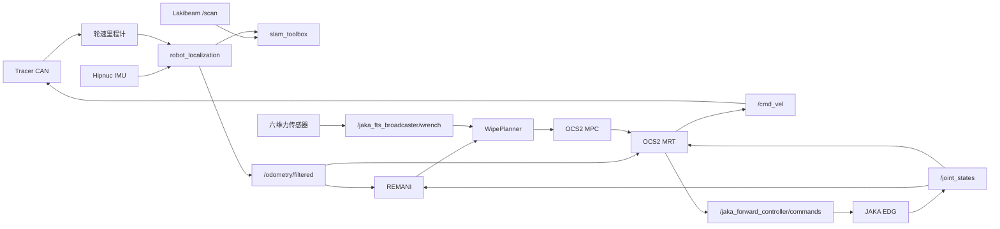

# Tracer + JAKA 全身擦拭系统实机部署指南

> 适用工程：`/home/a/ocs2_ws`  
> 适用系统：Tracer 差速底盘 + JAKA ZU5 + 六维力传感器 + REMANI + WipePlanner + OCS2  
> 文档日期：2026-08-18

## 1. 结论与当前状态

本工程的规划、全身参考、OCS2 跟踪和参考侧导纳力控已经在 MuJoCo 中形成完整闭环，但**当前还不能把仿真启动命令原样用于实机自主擦拭**。实机部署需要先完成硬件接口、安全链、坐标标定、力传感器补偿和实机组合 launch 的工程闭环。

建议把部署分成三层：

1. **硬件层可控**：底盘、机械臂、力传感器、急停和通信 watchdog 独立验证。
2. **非接触全身跟踪可控**：REMANI、WipePlanner 和 OCS2 在距离墙面至少 50 mm 的位置运行。
3. **低力接触逐级放开**：单点接触、短水平线、短竖直线、小区域覆盖，最后才运行全黑板覆盖。

### 1.1 当前可复用的组件

| 组件 | 当前工程位置 | 实机用途 |
| --- | --- | --- |
| Tracer CAN 驱动 | `tracer_base` | 订阅 `/cmd_vel`，发布底盘里程计 |
| JAKA ros2_control 接口 | `jaka_hardware_interface` | EDG 状态读取和六关节位置命令 |
| 实机 OCS2 启动雏形 | `tracer_jaka_ocs2/launch/ocs2_real.launch.py` | 启动底盘、JAKA 控制器、MPC/MRT |
| 实机定位 | `tracer_jaka_mujoco/launch/real_slam.launch.py` | Tracer + IMU + Lakibeam + EKF + SLAM |
| 覆盖与力控 | `wipe_planner` | 预接触、覆盖轨迹、导纳、力安全状态机 |
| 导航与全身规划 | `remani_planner` | 到达墙前预接触全身姿态 |
| 实机控制模型 | `tracer_jaka_ocs2/config/task_real.info` | OCS2 实机参数入口 |

### 1.2 上机前必须关闭的 P0 阻断项

以下项目没有完成时，不应运行自动接触：

- [ ] 新建并验证 `wipe_pipeline_real.launch.py`，不能继续包含 `ocs2_sim.launch.py`。
- [ ] 保证 `/cmd_vel`、机械臂位置命令、`/joint_states` 和 `odom -> base_footprint` 各只有一个发布者/控制者。
- [ ] 为底盘命令、JAKA EDG 状态、`/joint_states`、里程计和 MPC policy 增加并验证失联 watchdog。
- [ ] 启动 `jaka_fts_broadcaster`，确认实际话题为 `/jaka_fts_broadcaster/wrench`。
- [ ] 完成工具、力传感器、底盘到机械臂、墙面坐标和所有传感器外参标定。
- [ ] 完成力传感器多姿态重力/负载补偿，不能只依靠某一个启动姿态的零点。
- [ ] 使用真实测量值生成实机擦拭任务，不能使用仿真中的墙面绝对坐标。
- [ ] 具备独立于 ROS 的物理急停、JAKA 示教器停机和 Tracer 遥控接管能力。
- [ ] 先建立实机专用低速、低力参数文件，不直接使用当前 12 N / 35 N 上限进行第一次接触。

## 2. 实机运行架构



实机中应保持以下原则：

- `odom` 是控制与局部规划的连续世界坐标；`map -> odom` 只负责全局定位修正。
- EKF 是唯一的 `odom -> base_footprint` 发布者时，Tracer 驱动必须设置 `publish_odom_tf:=false`。
- `robot_state_publisher` 只启动一次。
- `/joint_states` 只能来自真实 JAKA 的 `joint_state_broadcaster`，不得混入固定姿态模拟节点。
- OCS2 MRT 接管后，不允许手动节点继续发布 `/cmd_vel` 或机械臂控制命令。

## 3. 硬件准备

### 3.1 计算与供电

- Ubuntu 22.04 x86_64 工控机或主机，ROS 2 Humble。
- 建议至少 8 个 CPU 线程、16 GB 内存；MPC 运行期间关闭不必要的可视化和录屏。
- 底盘、机械臂、主机和传感器供电应分别核对峰值功率、接地和急停断电范围。
- 主机、JAKA 控制柜和传感器网络使用有线连接；不要把机械臂实时 EDG 链路放在 Wi-Fi 上。
- 如果使用多台计算机，统一 NTP/PTP 时间并使用相同的 `ROS_DOMAIN_ID` 和 RMW 实现。

推荐环境：

```bash
export ROS_DOMAIN_ID=20
export RMW_IMPLEMENTATION=rmw_fastrtps_cpp
```

实机所有节点必须使用：

```text
use_sim_time = false
```

系统中不应依赖 `/clock`。

### 3.2 Tracer 底盘与 CAN

需要：

- Tracer 原厂遥控器可随时切回人工控制。
- SocketCAN 兼容的 CAN-USB 适配器。
- `can-utils`，用于 `candump` 和故障排查。
- 确认车型参数 `is_tracer_mini` 与实际底盘一致。

当前驱动使用 500 kbit/s：

```bash
sudo ip link set can0 down
sudo ip link set can0 up type can bitrate 500000
ip -details link show can0
candump can0
```

只有在 `candump can0` 能稳定收到帧、遥控器能够接管、轮子悬空测试方向正确后，才进入地面测试。

当前 `tracer_base` 驱动未看到上层 `cmd_vel` 超时自动清零逻辑。因此实机组合 launch 前应增加速度命令 watchdog，要求：

- 超过约 100–200 ms 未收到新命令时发布零速度或进入底盘安全停止。
- 节点退出、DDS 断连、MRT 卡死和主机网络中断都要触发停止。
- watchdog 必须独立验证，不能只根据“正常退出时会发零速度”来推断安全。

### 3.3 JAKA 机械臂与网络

当前硬件接口使用 JAKA SDK 的 EDG UDP 流：

```text
robot_ip：机械臂控制柜地址
local_ip：运行 ros2_control 的主机有线网卡地址
UDP port：10010
```

当前实机 URDF 中硬编码的是：

```text
robot_ip = 10.5.5.100
local_ip = 10.5.5.127
```

而 `ocs2_real.launch.py` 声明的默认参数是 `192.168.0.100/192.168.0.10`，并且这两个 launch 参数目前没有注入 URDF。部署前必须统一为现场实际地址，避免“命令行看似覆盖成功，硬件插件仍使用旧地址”。

网络验证：

```bash
ip address show
ping -c 3 10.5.5.100
```

同时检查：

- JAKA 控制器固件与仓库内 `libjakaAPI.so` 兼容。
- 主机防火墙没有阻断 EDG UDP。
- 机械臂安装方向、关节零位、关节顺序和正负号与 URDF 完全一致。
- `joint_1 ... joint_6` 均以弧度发布。
- 控制器激活时，第一条位置命令必须等于实测位置，防止上电跳变。

当前硬件接口在 `edg_get_stat()` 失败时仍可能保留旧状态并返回 `OK`。在自主运行前应增加：

- EDG 连续失败计数和状态时间戳。
- 超时后向 controller manager 返回错误并停止发送 `edg_servo_j`。
- 机械臂保持/减速停止策略。
- 独立于 MPC policy 有效性检查的关节状态超时保护。

### 3.4 六维力传感器与擦拭工具

力传感器至少需要完成：

1. 传感器本体与工具刚性安装。
2. 传感器坐标系到 `tool0` 的旋转标定。
3. 传感器原点到工具作用点的力臂标定。
4. 工具、板擦、相机和线缆的总质量及质心标定。
5. 多姿态重力补偿、温漂测试和零点测试。
6. 在软测试板上验证法向正负号和力值。

当前硬件接口有以下限制，必须在接触前处理：

- 激活时采集约 0.5 s 数据作为动态零点；此时工具必须静止且未接触任何物体。
- `R_sensor_to_tool` 仍在 C++ 中硬编码，不是现场标定参数。
- `ft_compensator_` 虽已声明，但当前读取路径没有实际调用它。
- 因而当前实现主要是“启动姿态标零 + 固定坐标变换 + 低通”，不能证明机械臂改变姿态后仍完成重力补偿。

建议验收指标：机械臂在整个计划姿态范围内缓慢空载运动时，法向残差最好小于 1 N，且不得随高度或关节姿态出现系统性 5–10 N 漂移。达不到该指标时，不允许启用自动恒力接触。

## 4. 软件环境与构建

### 4.1 依赖

至少需要：

- ROS 2 Humble、ros2_control、controller_manager。
- `robot_localization`、`slam_toolbox`、TF2。
- Pinocchio、OCS2 及本仓库 REMANI 依赖。
- `can-utils`。
- JAKA SDK 动态库，当前位于 `jaka_hardware_interface/lib/libjakaAPI.so`。

构建前：

```bash
cd /home/a/ocs2_ws
source /opt/ros/humble/setup.bash
rosdep install --from-paths src --ignore-src -r -y
```

构建实机相关包及其依赖：

```bash
colcon build --symlink-install --packages-up-to \
  tracer_base \
  jaka_hardware_interface \
  tracer_jaka_mujoco \
  tracer_jaka_ocs2 \
  remani_planner \
  wipe_planner

source install/setup.bash
```

检查 JAKA 动态库：

```bash
ldd install/jaka_hardware_interface/lib/libjaka_hardware_interface.so
```

输出中不能出现 `not found`。

### 4.2 推荐增加实机专用配置

不要直接修改仿真参数覆盖现场差异。建议新增：

```text
wipe_planner/config/wipe_planner_real.yaml
wipe_planner/config/wipe_task_real.yaml
wipe_planner/launch/wipe_pipeline_real.launch.py
tracer_jaka_mujoco/urdf/tracer_jaka_zu5_control.urdf.xacro
```

其中统一的 xacro 应通过参数选择真实或仿真硬件插件，但机械结构、碰撞几何、工具和传感器外参必须只有一份来源。

## 5. 当前 launch 文件需要整改的地方

### 5.1 `wipe_pipeline.launch.py` 是仿真入口

当前完整擦拭入口会包含：

```text
tracer_jaka_ocs2/launch/ocs2_sim.launch.py
```

并给 WipePlanner 设置 `use_sim_time: true` 和 MuJoCo URDF。因此它不能直接用于实机。

实机组合 launch 应启动：

1. 单一 `robot_state_publisher`。
2. 单一 Tracer 驱动或定位 bringup。
3. JAKA `ros2_control_node`。
4. `joint_state_broadcaster`。
5. `jaka_forward_controller`。
6. `jaka_fts_broadcaster`。
7. OCS2 MPC/MRT。
8. REMANI。
9. WipePlanner。
10. 可选的 RViz、SLAM 和 ESDF。

### 5.2 `ocs2_real.launch.py` 尚未形成完整擦拭入口

当前文件：

- 能启动 Tracer、JAKA controller manager 和 OCS2。
- 没有启动 REMANI 和 WipePlanner。
- 配置中声明了 `jaka_fts_broadcaster`，但 launch 没有创建它的 spawner。
- `robot_ip/local_ip` launch 参数没有传入硬件 URDF。
- MRT 默认读取 `/odom`，而完整定位链更适合统一使用 `/odometry/filtered`。

### 5.3 `real_slam.launch.py` 不能与机械臂实机驱动原样并行

该 launch 当前会固定启动 `arm_pose_publisher`，以 20 Hz 向 `/joint_states` 发布一个假的收拢姿态。真实 JAKA 上线后必须关闭或删除该节点，否则：

- 同一个关节名会有两个状态发布源。
- TF 中机械臂姿态会在真假数据之间跳变。
- REMANI、WipePlanner 和 MRT 可能读取到错误关节状态。

此外，`real_slam.launch.py` 与 `ocs2_real.launch.py` 都会启动 Tracer 和 `robot_state_publisher`，不能直接同时运行。应由统一 launch 决定每个节点是否启动。

## 6. ROS 2 接口契约

实机组合完成后，至少应满足：

| 数据 | 话题 | 类型 | 建议频率 | 唯一来源 |
| --- | --- | --- | --- | --- |
| 轮速里程计 | `/odom` 或 `/wheel/odometry` | `nav_msgs/msg/Odometry` | 50 Hz | Tracer 驱动 |
| 融合里程计 | `/odometry/filtered` | `nav_msgs/msg/Odometry` | 50 Hz | EKF |
| 机械臂状态 | `/joint_states` | `sensor_msgs/msg/JointState` | 100–125 Hz | joint_state_broadcaster |
| 六维力 | `/jaka_fts_broadcaster/wrench` | `geometry_msgs/msg/WrenchStamped` | 100–125 Hz | F/T broadcaster |
| 激光 | `/scan` | `sensor_msgs/msg/LaserScan` | 约 30 Hz | Lakibeam |
| IMU | `/IMU_data` | `sensor_msgs/msg/Imu` | 50–100 Hz | Hipnuc |
| 底盘命令 | `/cmd_vel` | `geometry_msgs/msg/Twist` | 50–100 Hz | OCS2 MRT |
| 机械臂命令 | `/jaka_forward_controller/commands` | `std_msgs/msg/Float64MultiArray` | 100–125 Hz | OCS2 MRT |

检查命令：

```bash
ros2 control list_controllers
ros2 control list_hardware_interfaces

ros2 topic hz /odom
ros2 topic hz /odometry/filtered
ros2 topic hz /joint_states
ros2 topic hz /jaka_fts_broadcaster/wrench

ros2 topic echo /joint_states --once
ros2 topic echo /jaka_fts_broadcaster/wrench --once
```

控制器至少应显示：

```text
joint_state_broadcaster    active
jaka_forward_controller   active
jaka_fts_broadcaster      active
```

不要同时激活两个占用相同六关节 `position` command interface 的控制器。

## 7. URDF、TF 与几何标定

### 7.1 TF 所有权

期望 TF：

```text
map                             slam_toolbox
└── odom                        map -> odom
    └── base_footprint          EKF 发布 odom -> base_footprint
        └── base_link           URDF 固定关节
            ├── laser_link
            ├── imu_link
            ├── d455_link
            └── jaka_base_link
                └── ...
                    └── jk_se_vi_200_link
                        └── tool0
```

检查：

```bash
ros2 run tf2_ros tf2_echo map odom
ros2 run tf2_ros tf2_echo odom base_footprint
ros2 run tf2_ros tf2_echo base_link jaka_base_link
ros2 run tf2_ros tf2_echo base_link tool0
```

不得出现重复 TF 发布者、时间倒退或几秒前的旧变换。

### 7.2 当前两份 URDF 存在漂移风险

仿真使用 `tracer_jaka_zu5.urdf`，实机硬件入口使用 `tracer_jaka_zu5_real.urdf`。后者缺少仿真/定位模型中已有的 D455 链路，并且硬件参数直接写在文件头部。

部署前应把机械结构合并为单一 xacro，仿真与实机只切换 `<ros2_control>` 插件。否则仿真验证过的 `tool0`、碰撞球和传感器外参不一定等于实机控制所使用的模型。

### 7.3 必须现场测量的外参

- `base_link -> jaka_base_link`：机械臂安装板的平移和旋转。
- `Link_6 -> jk_se_vi_200_link`：力传感器安装方向。
- `jk_se_vi_200_link -> tool0`：板擦工具中心点 TCP。
- `tool0 -> 实际接触面`：海绵压缩前的几何距离和接触面法向。
- `base_link -> laser_link/imu_link/d455_link`。
- 黑板平面法向、中心、宽度、高度及可擦区域边界。

不要根据 CAD 外观估计这些参数。应使用卡尺、水平仪、标定板、触碰标定或外部测量系统获得数值，并记录测量误差。

### 7.4 黑板坐标

当前 `wipe_task.yaml` 使用仿真绝对坐标：

```yaml
center: [2.0, 2.90, 0.90]
x_limits: [0.75, 3.25]
z_limits: [0.60, 1.26]
```

这些值不能用于现场。实机需要：

1. 在 `odom` 中确定黑板平面。
2. 测量板面法向，并确认 `tool0 +Z` 指向墙内。
3. 把边框、安全边距、底部和顶部高度写入 `wipe_task_real.yaml`。
4. 在 RViz 预览中确认黄色预接触姿态位于房间侧，不在墙内。

更稳妥的后续方案是引入 `board_frame`，运行时通过 TF 把局部覆盖轨迹转换到 `odom`。在当前实现完成该功能前，若定位重置、`odom` 原点改变或黑板移动，应中止任务并重新测量。

## 8. 安全设计

### 8.1 物理安全优先级

优先级从高到低：

1. 机械急停或安全继电器。
2. JAKA 示教器急停/伺服停止。
3. Tracer 遥控器接管和底盘急停。
4. 硬件通信 watchdog。
5. ROS 2/MRT/WipePlanner 软件安全状态。

软件中的 35 N hard limit 不能代替物理安全链。

### 8.2 第一次接触建议参数

当前仿真参数为 12 N 目标力、35 N 硬上限、30 mm/s 水平速度和 15 mm/s 换行速度。第一次实机接触不应直接使用这些值。

建议另建实机 commissioning 配置，从以下保守范围开始：

```text
目标力：2–3 N
硬力上限：8–10 N
水平速度：2–5 mm/s
竖直/折角速度：1–2 mm/s
最大法向修正：2–3 mm
安全回退：5–10 mm
```

这些数值只是初始调试范围，最终值必须由实际板擦柔顺性、工具强度、传感器量程和机械臂风险评估决定。

### 8.3 软件停止的含义

下面的服务只会关闭导纳力控，不等于整机急停：

```bash
ros2 service call /wipe_planner/enable_force_control \
  std_srvs/srv/SetBool "{data: false}"
```

底盘软件零速命令：

```bash
ros2 topic pub --once /cmd_vel geometry_msgs/msg/Twist \
  "{linear: {x: 0.0}, angular: {z: 0.0}}"
```

但在 MRT 仍然运行时，它可能马上再次发布控制命令，因此真正停止应由统一 supervisor 撤销控制权、停止 MRT、使控制器进入安全状态，并由物理急停兜底。

## 9. 分阶段上机流程

每个阶段必须单独通过验收后才能进入下一阶段。

### 阶段 0：静态检查

- 将底盘轮子悬空或机械固定。
- 板擦远离墙面和人员。
- 急停、示教器、遥控器都在操作者手边。
- 检查线缆不会在机械臂运动范围内拉紧。
- 检查 URDF 关节零位和真实姿态一致。

### 阶段 1：底盘独立测试

1. 配置 CAN。
2. 启动 `tracer_base`。
3. 以不超过 0.05 m/s 的速度短时发送前进、后退和转向命令。
4. 验证命令停止、节点退出和拔掉通信时底盘都会停止。
5. 验证 `/odom` 方向、单位和 yaw 正方向。

### 阶段 2：JAKA 独立位置控制

1. 机械臂低速、无接触、工作区清空。
2. 只启动 ros2_control、joint state broadcaster 和位置控制器。
3. 确认控制器激活时机械臂不跳变。
4. 每次只移动一个关节约 0.02–0.05 rad。
5. 核对关节名、方向、限位和状态延迟。
6. 人为中断 EDG/控制节点，验证机械臂安全停止。

### 阶段 3：力传感器空载标定

1. 工具未接触，机械臂静止后激活硬件接口。
2. 检查 `/jaka_fts_broadcaster/wrench` 的坐标系、频率和零点。
3. 缓慢遍历计划中的低、中、高三个擦拭姿态。
4. 记录每个姿态的六维力，验证重力补偿。
5. 用已知方向的小载荷确认法向轴和符号。
6. 原始数据或补偿后数据异常时，不得用 `force_use_absolute=true` 掩盖轴向错误。

### 阶段 4：定位与 TF

可先单独运行定位链：

```bash
ros2 launch tracer_jaka_mujoco real_slam.launch.py \
  start_robot_state_publisher:=true \
  start_base:=true \
  start_imu:=true \
  start_lidar:=true
```

注意：在真实 JAKA joint state 启动前使用该命令；完整系统组合时必须先解决其中固定 `arm_pose_publisher` 的重复发布问题。

验收：

- 静止时 `odom` 不连续跳变。
- 推行或遥控移动后轨迹方向正确。
- `map -> odom -> base_footprint` 连续。
- 所有传感器 TF 时间有效。

### 阶段 5：纯预览

将实测黑板参数写入实机任务文件。当前 preview launch 把
`wipe_task.yaml` 路径硬编码在节点参数中，尚未声明任务文件 launch 参数；应先为
`wipe_plan_preview.launch.py` 增加 `wipe_task_file` 参数并传给节点，然后运行：

```bash
ros2 launch wipe_planner wipe_plan_preview.launch.py \
  wipe_task_file:=/绝对路径/wipe_task_real.yaml
```

确认：

- 黄色预接触机器人在墙外。
- 蓝色覆盖姿态没有穿墙或碰撞。
- `tool0 +Z` 指向墙面。
- 轨迹不越过黑板边框。
- 底盘走廊没有人员、支架或线缆。

### 阶段 6：非接触完整 pipeline

实机组合 launch 完成后，先使用：

```text
force_control_enabled = false
墙面法向安全偏置 = 至少 50 mm
低速限制 = 正式速度的 10%–20%
```

验证 REMANI 导航、全身 handoff、预接触姿态、OCS2 跟踪和停止逻辑。末端全程不得接触墙面。

### 阶段 7：单点低力接触

- 使用软测试板，而不是直接使用正式黑板。
- 目标力从 2–3 N 开始。
- 只执行法向接近，不执行切向擦拭。
- 验证首次接触不会跳变、力超限会减速/暂停、传感器超时会回退。
- 验证 hard limit 只能通过人工检查后显式复位。

### 阶段 8：短轨迹

依次测试：

1. 50–100 mm 水平直线。
2. 50–100 mm 竖直直线。
3. 一个水平到竖直折角。
4. 一个小矩形或两行蛇形覆盖。

竖直段需要重点观察：

- joint 2/3/4 跟踪误差。
- 工具法向倾角。
- 原始力与滤波力。
- 导纳偏移和 `force_progress_scale`。
- 接触面是否发生边缘压入或 stick-slip。

### 阶段 9：全区域覆盖

只有前述阶段全部通过后，才逐步扩大：

```text
小区域低力低速
→ 半宽区域
→ 全宽低速
→ 目标力
→ 最终工作速度
```

一次只改变一个变量，并保留对应 rosbag。

## 10. 运行前检查表

### 10.1 每日上电检查

- [ ] 底盘电量、机械臂供电和线缆正常。
- [ ] 急停和遥控接管有效。
- [ ] CAN 帧正常，无 bus-off。
- [ ] JAKA 网络、EDG 和 SDK 登录正常。
- [ ] 工具未接触时完成 F/T 标零。
- [ ] `/joint_states` 只有真实发布源。
- [ ] controller manager 中三个实机控制器均为 `active`。
- [ ] `/odom`、`/odometry/filtered`、`/joint_states`、F/T 数据频率正常。
- [ ] TF 无重复发布和时间错误。
- [ ] 黑板没有移动，任务坐标仍然有效。
- [ ] 预览轨迹和安全边界正确。
- [ ] 作业区清场，操作者位于急停旁。

### 10.2 自动接触许可条件

- [ ] 空载多姿态法向残差满足要求。
- [ ] 单点接触已通过。
- [ ] 传感器超时回退已通过拔线/停发布测试。
- [ ] 过力暂停和 hard limit 已通过受控测试。
- [ ] 底盘命令超时会停止。
- [ ] JAKA 状态超时会停止。
- [ ] MPC policy 失效会停止底盘并保持机械臂。
- [ ] 没有其他节点竞争控制话题。

## 11. 推荐记录的话题

每次实机测试都建议录制：

```bash
ros2 bag record \
  /tf /tf_static \
  /odom /odometry/filtered /joint_states \
  /jaka_fts_broadcaster/wrench \
  /cmd_vel /jaka_forward_controller/commands \
  /mobile_manipulator_mpc_observation \
  /mobile_manipulator_mpc_policy \
  /wipe_planner/phase \
  /wipe_planner/force_control_state \
  /wipe_planner/normal_force \
  /wipe_planner/admittance_offset \
  /wipe_planner/force_progress_scale \
  /wipe_planner/virtual_progress \
  /wipe_planner/virtual_progress_rate \
  /wipe_planner/progress_lag_error \
  /wipe_planner/contouring_error
```

同时记录测试配置、工具版本、黑板位置、操作者、急停测试结果和异常时间点。

## 12. 推荐的实机组合 launch 设计

建议 `wipe_pipeline_real.launch.py` 提供以下参数：

```text
robot_ip
local_ip
can_port
use_rviz
start_base
start_localization
start_slam
start_remani
start_wipe_planner
force_control_enabled
wipe_task_file
wipe_planner_config
mrt_odom_topic
publish_odom_tf
```

启动顺序建议：

```text
t = 0 s   robot_state_publisher、Tracer、IMU、LiDAR
t = 2 s   EKF、JAKA ros2_control
t = 4 s   joint state / forward / FTS broadcasters
状态门控   等待 odom、joint_states、wrench 全部新鲜且频率正常
随后       MPC、MRT、REMANI
人工确认   WipePlanner 预览和预接触目标
最后       允许任务执行
```

不要只依赖固定 `TimerAction`。实机启动时间会受网络、控制柜和传感器影响，关键组件应使用 lifecycle 状态或显式 ready 条件门控。

## 13. 代码审计结论

实机部署前应优先处理以下代码位置：

| 优先级 | 文件 | 需要处理的内容 |
| --- | --- | --- |
| P0 | `wipe_planner/launch/wipe_pipeline.launch.py` | 拆出真正的实机组合入口 |
| P0 | `tracer_jaka_ocs2/launch/ocs2_real.launch.py` | 注入 IP、启动 FTS broadcaster、统一 filtered odom |
| P0 | `tracer_jaka_mujoco/launch/real_slam.launch.py` | 禁用假 arm joint state，避免重复底盘/RSP |
| P0 | `jaka_hardware_interface.cpp` | EDG 失联 watchdog、错误返回、安全停机 |
| P0 | `tracer_base` | `cmd_vel` timeout 自动零速 |
| P0 | `jaka_hardware_interface.cpp` | 实际启用并验证多姿态重力/负载补偿 |
| P1 | 两份 Tracer-JAKA URDF | 合并为单一结构模型和可切换硬件插件 |
| P1 | `wipe_task_real.yaml` | 现场黑板几何和低速低力参数 |
| P1 | WipePlanner/MRT | odom、joint、wrench 时间戳新鲜度统一监控 |
| P2 | supervisor | 一键停机、控制权仲裁、状态记录和启动门控 |

## 14. 相关工程文档

- [恒力控制设计](./擦黑板恒力控制设计.md)
- [D455、SLAM 与 ESDF 实机指南](./D455_ESDF_仿真与实机运行指南.md)
- [WipePlanner 说明](../src/tracer_jaka/wipe_planner/README.md)
- [OCS2 说明](../src/tracer_jaka/tracer_jaka_ocs2/README.md)
- [Tracer 驱动说明](../src/tracer_jaka/jaka_ros2/src/tracer_driver/tracer_ros2/README.md)

本指南描述的是当前仓库对应的实机迁移路线，不代表系统已经获得工业安全认证。任何人员可进入的环境中，都必须根据机械臂、移动底盘、工具和现场法规完成独立风险评估。
