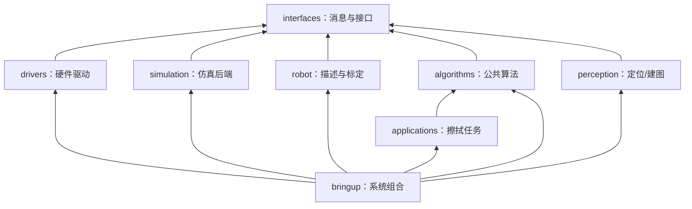

# Tracer + JAKA 工程目录重构设计

> 适用工作区：`/home/a/WBMM`
> 目标：清晰分离实机硬件、仿真、公共算法、部署配置和任务应用，同时保持仿真/实机使用同一 ROS 2 接口契约。
> 本文给出目标设计；当前工作区已按此结构完成第一轮物理目录迁移，后续仍需继续收敛 URDF、bringup launch 和配置 profile。

## 0. 当前完成状态

已完成的目录调整：

- `src/ocs2_ros2` → `src/vendor/ocs2_ros2`
- `src/remani_planner` → `src/vendor/remani_planner`
- `src/imu/*` → `src/drivers/sensors/*`
- `src/lakibeam` → `src/drivers/sensors/lakibeam1`
- `src/tracer_jaka/*` → 按职责拆入 `robot/`、`drivers/`、`algorithms/`、`perception/`、`applications/`、`simulation/`
- 新增 `tracer_jaka_description`、`tracer_jaka_bringup`、`tracer_jaka_interfaces`、`tracer_jaka_localization`、`tracer_jaka_mapping` 骨架
- `demo/` → `tools/examples/`
- 审核地图移入 `src/bringup/tracer_jaka_bringup/maps/`
- 运行数据/调试产物移入 `data/` 并 gitignore

仍建议按第 8 节顺序继续推进：

1. 把 MuJoCo/OCS2/MoveIt 中的重复 URDF 收敛到 `tracer_jaka_description`
2. 把完整 sim/real 组合 launch 收敛到 `tracer_jaka_bringup`
3. 从 `tracer_jaka_mujoco` 拆出实机定位 launch 到 `tracer_jaka_localization`
4. 清理 OCS2/REMANI/WipePlanner 对 MuJoCo 的依赖和绝对路径

## 1. 设计结论

推荐使用“**按职责组织源码 + 按部署场景组织覆盖配置**”的结构：

- 驱动层只负责真实硬件 I/O。
- 仿真层只负责模拟硬件和场景。
- 描述层是 URDF、碰撞模型、mesh 和标定的唯一来源。
- 公共算法层不依赖 MuJoCo、JAKA SDK 或具体传感器驱动。
- 任务层负责擦拭业务，不负责启动底盘和硬件。
- bringup 层是唯一允许同时依赖硬件、算法、定位和任务包的顶层组合层。
- 节点默认参数放在所属包内；实机/仿真/现场差异放在 bringup 的 profile 中。
- `build/`、`install/`、`log/`、rosbag 和运行输出不进入源码目录。

最重要的依赖方向是：



箭头表示“上层可以依赖下层”。反向依赖应禁止，例如：

- OCS2 算法包不能依赖 `tracer_jaka_mujoco`。
- REMANI 不能从 MuJoCo 包读取 URDF。
- MuJoCo 包不能启动实机 IMU、LiDAR 或 JAKA SDK。
- WipePlanner 不负责选择仿真或实机硬件。
- 驱动包不能依赖 WipePlanner、REMANI 或 OCS2。

## 2. 推荐的工作区目录

```text
WBMM/
├── README.md
├── .gitignore
├── docs/                              # 架构、部署、标定、调试文档
├── tools/                             # 仓库级检查/构建/录包脚本
├── data/                              # 运行数据，不属于源码
│   ├── bags/
│   ├── maps_generated/
│   ├── logs/
│   └── outputs/
├── src/
│   ├── vendor/                        # 上游或第三方源码，尽量少修改
│   │   ├── ocs2_ros2/
│   │   └── remani_planner/
│   │
│   ├── interfaces/                    # 跨层稳定契约
│   │   └── tracer_jaka_interfaces/
│   │
│   ├── robot/                         # 机器人本体的唯一描述来源
│   │   ├── tracer_jaka_description/
│   │   └── tracer_jaka_moveit_config/
│   │
│   ├── drivers/                       # 真实硬件 I/O
│   │   ├── base/
│   │   │   ├── tracer_base/
│   │   │   ├── tracer_msgs/
│   │   │   └── ugv_sdk/
│   │   ├── arm/
│   │   │   ├── jaka_hardware_interface/
│   │   │   └── jaka_driver_tools/
│   │   ├── force_torque/
│   │   │   └── tracer_jaka_ft_tools/
│   │   └── sensors/
│   │       ├── hipnuc_imu/
│   │       ├── hipnuc_imu_can/
│   │       ├── hipnuc_lib_package/
│   │       ├── lakibeam1/
│   │       └── realsense_bringup/      # 只放项目定制封装；官方驱动仍为外部依赖
│   │
│   ├── algorithms/                    # 与硬件后端无关的公共算法
│   │   ├── control/
│   │   │   └── tracer_jaka_ocs2/
│   │   ├── planning/
│   │   │   ├── remani_integration/
│   │   │   └── environment_model/
│   │   └── force_control/
│   │       └── contact_control_core/
│   │
│   ├── perception/                    # 定位、建图、ESDF
│   │   ├── tracer_jaka_localization/
│   │   ├── tracer_jaka_mapping/
│   │   ├── my_nvblox_bringup/
│   │   ├── grid_map/
│   │   └── esdf_simple_nav/
│   │
│   ├── applications/                  # 具体任务
│   │   └── wiping/
│   │       └── wipe_planner/
│   │
│   ├── simulation/                    # 仿真专用后端和场景
│   │   └── tracer_jaka_mujoco/
│   │
│   └── bringup/                       # 系统唯一顶层入口
│       └── tracer_jaka_bringup/
│
├── build/                             # colcon 生成，gitignore
├── install/                           # colcon 生成，gitignore
└── log/                               # colcon 生成，gitignore
```

顶层目录只是源码分组，不要求立即修改已有 ROS 包名。colcon 会递归发现 `package.xml`，所以可以先移动物理目录、保持包名不变，降低一次性重构风险。

## 3. 各层职责

### 3.1 `interfaces/`

只存放跨包长期稳定的消息、服务和动作定义，不包含算法实现。

建议包：`tracer_jaka_interfaces`。

可逐步加入：

```text
msg/WholeBodyState.msg
msg/ForceControlStatus.msg
msg/PipelineStatus.msg
srv/SetTaskExecution.srv
srv/ResetForceSafety.srv
action/ExecuteWipe.action
```

当前项目大量使用标准消息，这是正确的。仅在 `String` 状态或多个松散 topic 已不足以表达状态机时，再引入自定义消息。硬件 I/O 继续优先使用：

```text
nav_msgs/Odometry
sensor_msgs/JointState
sensor_msgs/Imu
sensor_msgs/LaserScan
geometry_msgs/WrenchStamped
geometry_msgs/Twist
std_msgs/Float64MultiArray
```

### 3.2 `robot/`

`tracer_jaka_description` 应成为以下内容的唯一来源：

```text
tracer_jaka_description/
├── urdf/
│   ├── tracer_jaka.urdf.xacro
│   ├── tracer_jaka_links.xacro
│   ├── tracer_jaka_sensors.xacro
│   ├── tracer_jaka_tool.xacro
│   └── ros2_control/
│       ├── sim_hardware.xacro
│       ├── real_hardware.xacro
│       └── mock_hardware.xacro
├── meshes/
├── config/
│   ├── calibration/
│   │   ├── base_to_arm.yaml
│   │   ├── tool0.yaml
│   │   └── sensors.yaml
│   └── joint_limits.yaml
├── rviz/
└── launch/
    └── view_robot.launch.py
```

仿真与实机只能切换 `ros2_control` 插件和设备参数，下面这些内容必须完全共用：

- 关节名称、零位和方向。
- `base_footprint`、`base_link`、`jaka_base_link`、`tool0` 等 frame。
- 碰撞球、关节限位和工具几何。
- LiDAR、IMU、D455、F/T 传感器外参。

当前 `tracer_jaka_mujoco/urdf`、`tracer_jaka_moveit_config` 和 `jaka_description` 中存在重复描述，应逐步收敛到这里。

### 3.3 `drivers/`

驱动包只做以下工作：

- 与设备通信。
- 发布标准状态。
- 接收标准命令。
- 实现硬件 watchdog、超时和生命周期。
- 提供独立的硬件诊断 launch。

驱动包不应：

- 加载擦拭任务参数。
- 启动 OCS2、REMANI 或 WipePlanner。
- 知道黑板位置。
- 发布仿真假状态。
- 包含 RViz 任务逻辑。

建议把厂商 SDK 与项目适配层分开：

```text
drivers/arm/
├── jaka_vendor/                       # 头文件和 libjakaAPI.so，最好封装为 vendor package
├── jaka_hardware_interface/           # ros2_control SystemInterface
└── jaka_driver_tools/                 # 标零、诊断、低速 jog 工具
```

JAKA F/T 的坐标变换、重力补偿和标定最好拆到独立、可单测的库，不要继续全部写在硬件接口的 `read()` 中。

### 3.4 `algorithms/`

公共算法只依赖数学库、机器人描述和 ROS 接口，不依赖真实或模拟硬件包。

`tracer_jaka_ocs2` 内部建议继续分层：

```text
tracer_jaka_ocs2/
├── include/tracer_jaka_ocs2/
│   ├── core/                          # 动力学、代价、约束
│   ├── safety/                        # 命令检查和限幅
│   └── ros/                           # ROS adapter 声明
├── src/
│   ├── core/
│   ├── safety/
│   └── nodes/
├── config/
│   └── defaults/                      # 算法默认值，不含设备 IP
└── test/
```

WipePlanner 建议拆成：

```text
wipe_planner/
├── include/wipe_planner/core/
├── src/core/                          # raster、IK、导纳、虚拟进度
├── src/nodes/                         # ROS 订阅、发布、服务和可视化
├── config/defaults/
├── launch/                            # 仅 task/preview 节点，不启动整台机器人
└── test/
```

短期不必拆成多个 ROS 包；先把 C++ 核心和 ROS node 在包内分目录，就能明显改善可维护性。只有当核心库需要被多个包复用时，再拆成 `contact_control_core` 或 `wipe_planner_core` 独立包。

### 3.5 `perception/`

当前定位配置放在 `tracer_jaka_mujoco` 中，这会让实机定位依赖仿真包。建议拆出：

```text
tracer_jaka_localization/
├── config/
│   ├── ekf_common.yaml
│   ├── ekf_sim.yaml
│   ├── ekf_real.yaml
│   ├── slam_common.yaml
│   └── slam_real.yaml
└── launch/
    ├── localization.launch.py
    └── slam.launch.py
```

`tracer_jaka_mapping` 负责 D455、地图、ESDF 适配，不负责启动机械臂或控制器。

### 3.6 `simulation/`

`tracer_jaka_mujoco` 只保留：

```text
tracer_jaka_mujoco/
├── models/                            # scene XML 和仿真 asset
├── config/
│   ├── physics.yaml
│   ├── sensors_sim.yaml
│   └── actuators_sim.yaml
├── src 或 Python module/              # MuJoCo bridge 和 simulated sensors
├── launch/
│   ├── mujoco.launch.py
│   ├── sensors_sim.launch.py
│   └── ros2_control_sim.launch.py
└── test/
```

下列内容应移出 MuJoCo 包：

- 实机 SLAM launch。
- 实机 EKF 配置。
- 机器人唯一 URDF。
- JAKA 硬件参数。
- 通用擦拭任务配置。

仿真包应像一个可替换的硬件后端：发布与实机相同的话题和 TF，接收与实机相同的命令。

### 3.7 `applications/`

`wipe_planner` 是擦拭任务应用层。它可以依赖 OCS2 接口、REMANI 接口和机器人描述，但不应依赖 MuJoCo 或 JAKA 硬件实现。

任务层负责：

- 黑板覆盖路径。
- 预接触姿态。
- 导航到擦拭的 ownership handoff。
- 法向导纳和力安全状态。
- 任务进度、状态和诊断。

任务层不负责：

- 创建 controller manager。
- 启动 Tracer CAN。
- 登录 JAKA 控制柜。
- 决定是否使用 `/clock`。
- 启动 SLAM 或 MuJoCo。

### 3.8 `bringup/`

`tracer_jaka_bringup` 是唯一顶层系统组合包。它只包含 launch、部署 profile、RViz 和运行检查，不包含核心算法。

推荐结构：

```text
tracer_jaka_bringup/
├── launch/
│   ├── components/
│   │   ├── description.launch.py
│   │   ├── localization.launch.py
│   │   ├── control.launch.py
│   │   ├── remani.launch.py
│   │   └── wiping.launch.py
│   ├── sim/
│   │   ├── base_sim.launch.py
│   │   └── wipe_sim.launch.py
│   └── real/
│       ├── hardware_real.launch.py
│       ├── localization_real.launch.py
│       ├── wipe_commissioning.launch.py
│       └── wipe_production.launch.py
├── config/
│   ├── common/
│   ├── sim/
│   ├── real/
│   │   ├── commissioning/
│   │   └── production/
│   └── sites/
│       ├── lab_blackboard.yaml
│       └── factory_blackboard.yaml
├── maps/                              # 经审核、用于部署的固定地图
├── rviz/
└── test/
    ├── test_launch_contracts.py
    ├── test_unique_publishers.py
    └── test_tf_contract.py
```

顶层入口应明确分开：

```bash
ros2 launch tracer_jaka_bringup wipe_sim.launch.py
ros2 launch tracer_jaka_bringup wipe_commissioning.launch.py
ros2 launch tracer_jaka_bringup wipe_production.launch.py
```

不建议只做一个 `mode:=sim/real` 的巨大 launch。实机误用仿真 profile 的风险高，两个明确入口更安全；共用部分通过 `components/` include。

## 4. 两级配置体系

### 4.1 第一级：包内默认配置

默认配置描述算法本身，不包含现场设备信息：

```text
tracer_jaka_ocs2/config/defaults/task.yaml
wipe_planner/config/defaults/planner.yaml
tracer_jaka_localization/config/ekf_common.yaml
```

默认配置可以包含：

- MPC horizon、代价和约束。
- 导纳结构参数。
- 进度投影算法参数。
- 默认 topic 名称。
- 通用 QoS 和发布频率。

默认配置不应包含：

- `robot_ip`、`local_ip`、串口和 CAN 设备。
- 某一块黑板的绝对坐标。
- `/home/a/...` 绝对路径。
- 仿真场景文件路径。
- 当天标定得到的 F/T bias。

### 4.2 第二级：bringup profile

profile 覆盖部署差异：

```text
config/sim/wipe.yaml
config/real/commissioning/hardware.yaml
config/real/commissioning/wipe.yaml
config/real/production/hardware.yaml
config/real/production/wipe.yaml
config/sites/lab_blackboard.yaml
```

建议区分至少三个 profile：

| Profile | 用途 | 典型特点 |
| --- | --- | --- |
| `sim` | MuJoCo 回归 | `use_sim_time=true`、模拟 F/T |
| `real/commissioning` | 初次上机 | 低速、2–3 N、严格 hard limit |
| `real/production` | 验收后运行 | 经批准的正式速度和力参数 |

### 4.3 配置命名规则

统一使用：

```text
*_defaults.yaml               算法默认值
*_sim.yaml                    仿真覆盖
*_real.yaml                   通用实机覆盖
*_commissioning.yaml          实机调试
*_production.yaml             实机正式运行
*_site_<name>.yaml            现场几何/地图
```

避免继续出现含义不清的：

```text
task.info
task_back.info
task_real.info
exp0_param.yaml
exp1_param.yaml
```

若 OCS2 的 `.info` 格式必须保留，也应改为表达用途的名称，例如：

```text
ocs2_navigation_defaults.info
ocs2_wiping_sim.info
ocs2_wiping_real_commissioning.info
ocs2_wiping_real_production.info
```

## 5. ROS 接口契约

仿真后端和实机后端必须提供同一个接口：

| 方向 | 话题 | 类型 | 所有者 |
| --- | --- | --- | --- |
| 状态输入 | `/odometry/filtered` | `nav_msgs/msg/Odometry` | EKF 或仿真定位 |
| 状态输入 | `/joint_states` | `sensor_msgs/msg/JointState` | JS broadcaster 或仿真桥 |
| 力输入 | `/fts_broadcaster/wrench` | `geometry_msgs/msg/WrenchStamped` | F/T broadcaster 或仿真 FTS |
| 环境输入 | `/scan` | `sensor_msgs/msg/LaserScan` | Lakibeam 或仿真 LiDAR |
| 底盘输出 | `/cmd_vel` | `geometry_msgs/msg/Twist` | MRT，唯一发布者 |
| 机械臂输出 | `/arm_controller/commands` | `std_msgs/msg/Float64MultiArray` | MRT，唯一发布者 |

建议在 `tracer_jaka_bringup/test` 中把这些契约写成自动测试：

- topic 存在且类型正确。
- 数据频率达到阈值。
- TF 链完整。
- 关键 topic 只有一个发布者。
- `use_sim_time` 与入口一致。
- 实机入口中没有 MuJoCo node 和 `/clock`。
- 仿真入口中没有 JAKA SDK 和 CAN node。

## 6. 当前目录到目标目录的映射

| 当前路径 | 目标位置 | 处理方式 |
| --- | --- | --- |
| `src/ocs2_ros2` | `src/vendor/ocs2_ros2` | 保持包名，视作上游依赖 |
| `src/remani_planner` | `src/vendor/remani_planner` 或 `algorithms/planning/remani` | 若长期维护 fork，则放 algorithms；否则放 vendor |
| `src/imu/*` | `src/drivers/sensors/*` | 保持现有包名 |
| `src/lakibeam` | `src/drivers/sensors/lakibeam1` | 保持包名 `lakibeam1` |
| `jaka_ros2/.../tracer_driver` | `src/drivers/base` | 拆掉过深嵌套 |
| `jaka_hardware_interface` | `src/drivers/arm/jaka_hardware_interface` | 保持包名 |
| `jaka_driver` | `src/drivers/arm/jaka_driver_tools` | 清理重复 launch/控制器命名 |
| `tracer_jaka_mujoco/urdf` | `src/robot/tracer_jaka_description` | 抽出唯一结构描述 |
| `jaka_description` | 合并进 `tracer_jaka_description` | 仅保留仍需要的模型资源 |
| `tracer_jaka_moveit_config` | `src/robot/tracer_jaka_moveit_config` | 改为依赖统一 description |
| `tracer_jaka_mujoco` | `src/simulation/tracer_jaka_mujoco` | 移走实机 launch/配置 |
| `tracer_jaka_ocs2` | `src/algorithms/control/tracer_jaka_ocs2` | 删除对 MuJoCo 的 exec dependency |
| `wipe_planner` | `src/applications/wiping/wipe_planner` | launch 只启动自身节点 |
| `real_slam.launch.py` | `tracer_jaka_bringup` 或 `tracer_jaka_localization` | 不再放在 MuJoCo 包 |
| `my_nvblox_bringup` | `src/perception/my_nvblox_bringup` | 与仿真后端解耦 |
| `grid_map` | `src/perception/grid_map` | 保持包名 |
| `esdf_simple_nav` | `src/perception/esdf_simple_nav` | 保持包名 |
| 根目录 `demo/` | `tools/examples/` | 示例与生产源码分开 |
| 根目录 `maps/` | 审核地图进 bringup；生成地图进 `data/` | 区分可部署资源与运行输出 |
| 根目录 `outputs/` | `data/outputs/` | gitignore |
| 根目录 `.posegraph`、TF 导出图 | `data/debug/` | 运行产物，不放根目录 |
| 根目录重复 Markdown | `docs/` | 建立索引，删除重复版本前先比对 |

## 7. 当前最明显的耦合问题

### 7.1 算法依赖仿真包

当前 `tracer_jaka_ocs2/package.xml` 对 `tracer_jaka_mujoco` 有运行依赖，OCS2 launch 也从 MuJoCo 包取 URDF。这使实机控制算法无法独立安装。

修正方式：

```text
tracer_jaka_ocs2 -> tracer_jaka_description
tracer_jaka_mujoco -> tracer_jaka_description
jaka_hardware_interface -> tracer_jaka_description 的 real ros2_control xacro
```

### 7.2 实机定位放在仿真包中

`real_slam.launch.py` 和 `ekf_real.yaml` 位于 `tracer_jaka_mujoco`。这会导致实机部署安装一个仿真包才能启动定位。

修正方式：移入 `tracer_jaka_localization`，顶层由 bringup include。

### 7.3 任务 launch 启动整台机器人

当前 `wipe_pipeline.launch.py` 位于 WipePlanner 包，但它会启动 MuJoCo、OCS2 和 REMANI。任务包因此同时承担业务逻辑和系统编排。

修正方式：

- `wipe_planner/launch/wipe_node.launch.py`：只启动 WipePlanner。
- `tracer_jaka_bringup/launch/sim/wipe_sim.launch.py`：组合仿真全链路。
- `tracer_jaka_bringup/launch/real/wipe_commissioning.launch.py`：组合实机调试链路。

### 7.4 包目录嵌套过深

当前路径存在：

```text
src/drivers/base/tracer_ros2/tracer_base
```

包名本身只有 `tracer_base`，中间多层目录不提供构建价值，反而增加查找成本。可以在保持包名不变的前提下移动到：

```text
src/drivers/base/tracer_base
```

### 7.5 绝对路径和运行产物混入源码

当前 launch/节点中仍存在 `/home/a/WBMM/...` 和 `/home/a/workspaces/...` 绝对路径。所有部署资源应通过：

- `ament_index_python/cpp` 查包路径。
- launch 参数传入外部资源。
- `XDG_DATA_HOME` 或显式 `data_dir` 存放运行数据。

禁止算法节点内写死开发机目录。

## 8. 推荐的迁移顺序

当前工作区存在多项未提交修改，不建议立刻执行一次性 `git mv`。推荐分阶段迁移，每阶段都能构建和回滚。

### 阶段 0：建立重构基线

1. 完成当前功能修改和测试。
2. 创建专用重构分支。
3. 保存 `colcon list`、topic/TF 契约和当前仿真回归结果。
4. 补充 `.gitignore`，排除 `build/install/log/data`。
5. 不在这一阶段更改包名。

### 阶段 1：统一机器人描述

1. 新建 `tracer_jaka_description`。
2. 合并两份 Tracer-JAKA URDF、传感器外参和工具几何。
3. 用 xacro 参数选择 `sim/real/mock` ros2_control 插件。
4. 让 MuJoCo、OCS2、MoveIt、REMANI 和实机 controller manager 全部引用同一 description 包。
5. 验证 `check_urdf`、Pinocchio joint 顺序、TF 和 MuJoCo 模型一致性。

这是最高优先级，因为后续所有层都依赖模型。

### 阶段 2：建立 bringup 包

1. 新建 `tracer_jaka_bringup`。
2. 把完整仿真 pipeline 从 WipePlanner/OCS2 launch 移到 bringup。
3. 把实机硬件、定位和擦拭入口组合到 bringup。
4. 建立 `sim`、`real/commissioning`、`real/production` profile。
5. 增加 topic、TF 和唯一发布者 launch tests。

### 阶段 3：拆出定位与建图

1. 新建 `tracer_jaka_localization`。
2. 从 MuJoCo 包移出 real/sim 共用 EKF 和 SLAM 配置。
3. 把 D455/nvblox 组合放到 perception 层。
4. 保证定位节点不启动硬件驱动，由 bringup 注入 topic。

### 阶段 4：整理驱动

1. 物理移动 Tracer、JAKA、IMU 和 LiDAR 包到 `drivers/`。
2. 保持 ROS 包名和 topic 契约不变。
3. 给底盘、JAKA 和 F/T 增加独立诊断 launch 和 watchdog 测试。
4. 把 JAKA SDK 封装成 vendor package，避免源码路径直接链接 `.so`。

### 阶段 5：清理算法层

1. 删除 OCS2/REMANI/WipePlanner 对 MuJoCo 包的依赖。
2. 把核心数学逻辑和 ROS node adapter 分目录。
3. 将 F/T 重力补偿、导纳和力状态监督做成可单测组件。
4. 清除绝对路径。

### 阶段 6：整理数据和文档

1. 建立 `docs/index.md`。
2. 合并重复的 REMANI/OCS2 文档。
3. 审核后的地图进入 bringup；生成地图和 rosbag 进入 `data/`。
4. 示例 CSV、TF 图和调试输出不再放仓库根目录。

## 9. 每阶段验证清单

目录移动本身不代表重构成功。每阶段至少运行：

```bash
cd /home/a/WBMM
source /opt/ros/humble/setup.bash

colcon list
rosdep install --from-paths src --ignore-src -r
colcon build --symlink-install --packages-up-to \
  tracer_jaka_description tracer_jaka_ocs2 remani_planner wipe_planner
colcon test --packages-select wipe_planner tracer_jaka_ocs2
colcon test-result --verbose
```

launch 检查（以下 `tracer_jaka_bringup` 入口为规划目标，当前尚未创建，待实现后再执行）：

```bash
ROS_LOG_DIR=/tmp/tracer_jaka_launch_check \
ros2 launch tracer_jaka_bringup wipe_sim.launch.py --show-args

ROS_LOG_DIR=/tmp/tracer_jaka_launch_check \
ros2 launch tracer_jaka_bringup wipe_commissioning.launch.py --show-args
```

运行契约：

- 仿真 pipeline 能完成短墙面折角/向上段回归。
- preview 能加载统一 description 和指定 site task。
- 实机 launch dry-run 不启动 MuJoCo，不使用 `/clock`。
- 仿真 launch 不加载 JAKA SDK，不访问 CAN。
- `odom -> base_footprint`、`/joint_states` 和控制命令均只有一个所有者。

移动包后如果 `--symlink-install` 出现旧目录冲突，只清理对应包：

```bash
rm -rf build/<package_name> install/<package_name>
```

不要删除整个工作区的用户数据，也不要用 `git reset --hard` 处理迁移问题。

## 10. 建议的第一批实际改动

建议先完成以下四项，它们收益最大、风险相对可控：

1. 新建 `tracer_jaka_description`，统一 URDF/xacro/mesh/标定。
2. 新建 `tracer_jaka_bringup`，把完整 sim/real pipeline 放到顶层组合包。
3. 从 MuJoCo 包移出 `real_slam.launch.py`、`ekf_real.yaml` 和实机传感器组合。
4. 让 `tracer_jaka_ocs2`、REMANI、WipePlanner 只依赖 description/接口，不再依赖 MuJoCo。

暂时不要优先做：

- 大规模重命名所有 ROS 包。
- 同时拆分所有 C++ 库。
- 改变现有 topic 名称。
- 一次性移动整个 `src` 后再集中修编译错误。

先修清晰的依赖边界，再优化物理目录名称，成功率更高。

## 11. 目标状态的判断标准

重构完成后，应能回答以下问题且答案唯一：

- 机器人 URDF 在哪里？——`tracer_jaka_description`。
- JAKA/Tracer 硬件代码在哪里？——`drivers/`。
- MuJoCo 场景在哪里？——`simulation/tracer_jaka_mujoco`。
- OCS2/REMANI/导纳算法在哪里？——`algorithms/`。
- 擦黑板业务在哪里？——`applications/wiping/wipe_planner`。
- 实机启动入口在哪里？——`tracer_jaka_bringup/launch/real`。
- 仿真启动入口在哪里？——`tracer_jaka_bringup/launch/sim`。
- 正式现场参数在哪里？——`tracer_jaka_bringup/config/real/production` 和 `config/sites`。
- 运行生成的数据在哪里？——`data/`，而不是 `src/` 或仓库根目录。

当仿真和实机只替换最底层 backend、上层算法和 topic/TF 契约完全不变时，这个目录设计才真正达到目的。

## 12. 相关文档

- [实机部署指南](./实机部署指南.md)
- [恒力控制设计](./擦黑板恒力控制设计.md)
- [总体 Pipeline](<./总体 Pipeline.md>)
- [D455 与 ESDF 指南](./D455_ESDF_仿真与实机运行指南.md)
