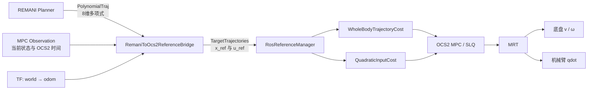
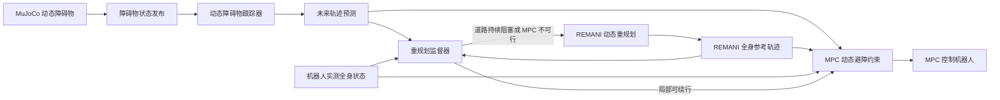

可以，而且现有架构已经具备大部分基础。推荐增加一个独立的 `RemaniToOcs2ReferenceBridge` 节点，将 REMANI 多项式轨迹转换为 OCS2 的 `TargetTrajectories`。不需要修改 MPC 求解器核心。

## 总体 Pipeline

> 快速命令速查见 [QUICKSTART.md](QUICKSTART.md)。




## 1. 状态和控制量映射

代码中两边的定义为：

| 内容      | REMANI                 | OCS2                   |
| --------- | ---------------------- | ---------------------- |
| 轨迹状态  | `[x,y,q1…q6]`，8维     | `[x,y,yaw,q1…q6]`，9维 |
| 控制/导数 | `[vx,vy,q̇1…q̇6]`        | `[v,ω,q̇1…q̇6]`，8维     |
| 行驶方向  | `singul=+1/-1`         | `v` 的正负号           |
| 航向      | 由速度和 `singul` 恢复 | 显式 yaw 状态          |

OCS2 模型定义可以在 [WheelBasedMobileManipulatorDynamics.cpp](/home/a/WBMM/src/vendor/ocs2_ros2/basic examples/ocs2_mobile_manipulator/src/dynamics/WheelBasedMobileManipulatorDynamics.cpp) 中看到：

\[ \dot{x}=v\cos(yaw),\quad \dot{y}=v\sin(yaw),\quad \dot{yaw}=\omega,\quad \dot{q}=u_{arm} \]

桥接节点在采样时计算：

\[ yaw=\operatorname{atan2}(s\,v_y,\ s\,v_x) \]\[ v=s\sqrt{v_x^2+v_y^2} \]\[ \omega=\frac{v_xa_y-v_ya_x}{v_x^2+v_y^2} \]

其中 \(s=\text{singul}\)。

最终生成：

```
x_ref = [x, y, yaw, q1, q2, q3, q4, q5, q6]
u_ref = [v, omega, qdot1, qdot2, qdot3, qdot4, qdot5, qdot6]
```

建议生成真实的 `u_ref`，不要全部填零。现有 `QuadraticInputCost` 实际计算的是：

```
u - targetTrajectories.getDesiredInput(time)
```

因此解析前馈速度可以明显减小跟踪滞后。

## 2. REMANI 多项式解析

REMANI 每个 `PolynomialMatrix`：

- `num_dim = 8`
- `num_order = degree`
- `duration` 是 piece 时长
- `data` 是 Eigen 列主序系数矩阵

解析下标应为：

```
coefficient = data[column * num_dim + dimension]
power       = num_order - column
```

对应代码可参考：

- [PolynomialTraj.msg](/home/a/WBMM/src/vendor/remani_planner/quadrotor_msgs/msg/PolynomialTraj.msg)
- [poly_traj_utils.hpp (line 19)](/home/a/WBMM/src/vendor/remani_planner/traj_utils/include/traj_utils/poly_traj_utils.hpp:19)
- [remani_simulator.py (line 154)](/home/a/WBMM/src/vendor/remani_planner/plan_manage/scripts/remani_simulator.py:154)

桥接节点最好直接解析求位置、速度和加速度，而不是先转成大量离散点再做数值差分。

## 3. 分段轨迹拼接

REMANI 按行驶方向分段发布：

- `trajectory_id == 1`：新轨迹开始，清空旧分段
- 后续 ID：追加到当前轨迹
- 按 `trajectory_id` 排序
- 每段开始时间等于前面所有分段 duration 的累加
- `singul` 在每个分段内固定

发布逻辑在 [remani_replan_fsm.cpp (line 785)](/home/a/WBMM/src/vendor/remani_planner/plan_manage/src/remani_replan_fsm.cpp:785)。

目前消息中没有 `segment_count` 或独立的 `plan_id`，因此桥接层不能严格知道一批消息什么时候发送完成。短期可以：

1. 收到 ID 1 后开始新一批缓存。
2. 每收到一段重启一个约 20～50 ms 的 debounce timer。
3. timer 到期后认为本批分段接收完成并发布。

更可靠的长期方案是给消息增加：

```
plan_id
segment_index
segment_count
segment_start_offset
```

这样可以原子替换完整参考轨迹，并检测丢包或乱序。

## 4. 时间同步是最重要的一点

REMANI 使用 ROS 时钟绝对时间，而 MRT 中的 OCS2 observation 时间从节点启动时的 0 开始：

```
obs.time = (now() - t0).seconds();
```

因此不能直接把 REMANI 的 `header.stamp` 填进 OCS2。

收到轨迹时，使用最新 MPC observation 建立转换：

\[ t_{\text{ocs2,start}} = t_{\text{obs}} + (t_{\text{remani,start}}-t_{\text{ros,now}}) \]

即：

```
OCS2 轨迹起始时间
= 最新 observation.time
+ REMANI header.stamp 相对当前 ROS 时间的偏移
```

如果轨迹因为通信延迟已经开始，应跳过已经过期的部分：

```
elapsed = max(0, ros_now - remani_start_stamp)
```

然后从 `elapsed` 开始采样，而不是让 MPC 重新跟踪过期点。

对于在线重规划，还要保留旧参考直到新轨迹的开始时间。否则新轨迹首点在未来时，`WholeBodyTrajectoryCost` 会在开始时间之前钳位到新轨迹首点，造成参考跳变。

## 5. 采样与发布策略

当前 MPC horizon 是 2 秒，频率配置为 100 Hz，见 [task.info (line 74)](/home/a/WBMM/src/algorithms/control/tracer_jaka_ocs2/config/task.info:74)。

建议桥接器：

- 内部保存完整解析多项式。
- 以 10～20 Hz 更新滚动参考窗口。
- 每次发布未来 2.5～3.0 秒轨迹。
- 参考采样间隔先设为 0.02～0.05 秒。
- 轨迹最后追加 1～3 秒终点保持。
- 最后保持点的 `u_ref` 为零。

没有必要按 MPC 的 100 Hz 生成参考点，因为 [WholeBodyTrajectoryCost.cpp (line 40)](/home/a/WBMM/src/vendor/ocs2_ros2/basic examples/ocs2_mobile_manipulator/src/cost/WholeBodyTrajectoryCost.cpp:40) 已经会在线性插值状态，并对 yaw 使用最短角插值。

## 6. 航向和倒车段处理

必须专门处理以下情况：

### yaw 解包

连续采样后做 yaw unwrap，避免 `+π/-π` 切换产生整圈旋转。虽然 cost 内部会 wrap yaw 误差，但连续参考仍有利于可视化和速度计算。

### 零速度点

轨迹起点、终点和换向点可能满足：

```
sqrt(vx² + vy²) ≈ 0
```

此时 `atan2` 和 omega 公式不可靠。建议：

- 起点优先使用当前实测 yaw；
- 普通低速点保持上一个有效 yaw；
- 换向点使用左右两侧的单边极限；
- 当速度低于阈值时设置 `v=0, omega=0`。

### 前进/倒车切换

由于：

```
yaw = atan2(singul * vy, singul * vx)
v   = singul * norm(velocity)
```

当几何速度方向反转且 `singul` 同时变化时，车体 yaw 应保持连续，而速度符号改变。不要简单地在倒车段给上一段 yaw 加 π。

## 7. ROS 接口设计

桥接节点建议使用：

订阅：

```
/planning/trajectory
  quadrotor_msgs/msg/PolynomialTraj

/mobile_manipulator_mpc_observation
  ocs2_msgs/msg/MpcObservation
```

发布：

```
/mobile_manipulator_mpc_target
  ocs2_msgs/msg/MpcTargetTrajectories
```

发布端直接复用现有的：

```
ocs2::TargetTrajectoriesRosPublisher
```

MPC 端不需要改动，因为 [TracerJakaMpcNode.cpp (line 57)](/home/a/WBMM/src/algorithms/control/tracer_jaka_ocs2/src/TracerJakaMpcNode.cpp:57) 已经通过 `RosReferenceManager` 订阅目标。

现有的 [tracer_jaka_whole_body_trajectory_node.cpp (line 420)](/home/a/WBMM/src/algorithms/control/tracer_jaka_ocs2/src/tracer_jaka_whole_body_trajectory_node.cpp:420) 可以作为桥接节点的直接模板，只需把“读取 CSV”替换成“解析并采样 REMANI 多项式”。

## 8. 坐标系和关节顺序检查

REMANI 仿真使用 `world`，而 OCS2 当前通常使用 `odom`。需要明确：

```
T_odom_world
```

如果二者不完全重合，桥接节点应通过 TF 转换：

- 位置；
- 平面速度；
- 平面加速度；
- yaw。

不能只修改 `frame_id`。

机械臂还必须确认两边均为：

```
joint_1, joint_2, joint_3, joint_4, joint_5, joint_6
```

并确认：

- 单位均为 rad；
- 零位定义一致；
- 没有关节方向符号相反；
- REMANI 模型与 OCS2 URDF 使用相同工具、底座安装变换。

## 9. 重规划和安全行为

建议桥接器使用以下状态机：

```
WAIT_OBSERVATION
    ↓
WAIT_TRAJECTORY
    ↓
ASSEMBLING
    ↓
TRACKING
    ├── 新 ID=1 → 保留旧轨迹，组装新轨迹，按时间平滑切换
    ├── ACTION_ABORT → 发布当前状态保持目标
    └── 轨迹结束 → 发布终点保持目标
```

收到 `ACTION_ABORT` 时应：

1. 清空未执行的 REMANI 轨迹。
2. 读取最新 OCS2 observation。
3. 发布单点或短时间保持轨迹：
   `[current_x,current_y,current_yaw,current_q]`。
4. `u_ref` 设为零。
5. MRT 原有安全层继续负责输出零速度。

## 10. 碰撞约束的职责划分

REMANI 给出的是碰撞安全的名义轨迹，但 MPC 为满足动力学和状态误差可能偏离轨迹，因此不能认为“规划安全”等于“实际执行安全”。

推荐职责：

- REMANI：全局/局部搜索、动态地图、完整机器人碰撞检查。
- OCS2：跟踪、输入/关节限制、自碰撞、短时安全修正。
- Safety monitor：跟踪误差或安全距离超限时触发重规划或急停。

当前 OCS2 环境障碍来自 `task.info` 的静态障碍，并没有与 REMANI 地图自动同步。因此不要假定两个模块看到的是同一个环境。后续如果需要 MPC 主动绕开新障碍，应再增加地图或安全走廊同步。

## 推荐落地顺序

1. 先将 REMANI 轨迹离线采样成 CSV，通过现有全身轨迹节点验证坐标系、关节顺序和 MPC 参数。
2. 实现在线桥接节点，先只处理单一 `singul=+1`。
3. 加入倒车、yaw unwrap 和零速换向处理。
4. 加入重规划拼接、旧轨迹保留和 `ACTION_ABORT`。
5. 最后加入地图同步、跟踪误差监控与自动重规划。

整体来看，你现在的 `WholeBodyTrajectoryCost + RosReferenceManager + MRT` 不需要重新设计；真正需要补齐的是“REMANI 多项式参考适配层”。这条路径改动范围最小，也最容易逐阶段验证。


是的，按照目前实现，MPC 为躲避动态障碍物主动偏离 REMANI 轨迹，也会被计算为跟踪误差。如果超过阈值并持续 `0.30 s`，就可能触发重规划。

但“动态避障造成的合理偏差”和“MPC 跟踪失败造成的异常偏差”不应该使用完全相同的处理逻辑。推荐加入一个动态障碍物感知的监督层，由它决定继续让 MPC 局部修正，还是通知 REMANI 重新规划。

## 推荐 Pipeline




### 1. 动态障碍物发布

在 MuJoCo 中读取每个动态障碍物的：

- 位置和朝向；
- 线速度、角速度；
- 碰撞体形状和尺寸；
- 障碍物 ID；
- 时间戳。

建议发布类似：

```
/dynamic_obstacles
  obstacle_id
  pose
  twist
  shape
  dimensions
  timestamp
```

不要直接把动态障碍物永久写入当前静态 ESDF，否则移动过的位置可能留下“幽灵障碍物”。

### 2. 跟踪与预测

动态障碍物跟踪器根据最近若干帧估计未来运动：

```
当前状态
   ↓
卡尔曼滤波/EKF
   ↓
未来 0～3 秒障碍物轨迹
   ↓
每个预测点的位置、速度、碰撞半径和不确定性
```

安全半径可以计算为：

```
动态安全半径 =
    障碍物碰撞半径
  + 机器人碰撞球半径
  + 基础安全距离
  + 预测不确定性膨胀
```

预测越远，不确定性膨胀通常越大。

### 3. MPC 负责短期局部避障

MPC 每个求解周期接收动态障碍物预测，并在其预测时域内增加约束：

```
distance(robot_sphere(t), obstacle(t))
    >= dynamic_safe_distance(t)
```

MPC 适合处理：

- 障碍物短暂经过；
- 小范围绕行；
- 临时减速或停车；
- 动态障碍物很快离开；
- 不需要改变全局路径拓扑的情况。

此时，即使机器人偏离 REMANI 轨迹，也属于“合理避障偏差”，不应该立即重规划。

## 重规划监督器

监督器需要同时观察四类信息：

- 实际状态与 REMANI 参考轨迹误差；
- MPC 是否正在执行动态避障；
- MPC 求解是否可行；
- 动态障碍物是否持续阻塞原路径。

建议的决策逻辑如下。

### 情况一：MPC 可以局部绕开

满足以下条件时不重规划：

```
MPC 求解可行
动态障碍物正在离开或预计短时间内离开
机器人仍在参考轨迹走廊附近
机器人仍然向目标方向取得进展
局部绕行预计可以重新汇入原轨迹
```

这时监督器应：

- 暂停当前的跟踪偏差计时器；或者
- 临时放大位置误差阈值，例如从 `0.30 m` 放大至 `0.60 m`；
- 继续让 MPC 避障；
- 障碍物离开后恢复正常阈值。

因此不能简单地认为“存在偏差就必须重规划”。

### 情况二：需要 REMANI 重规划

以下任一情况持续出现时触发重规划：

- MPC 连续求解不可行；
- 动态障碍物在原路径上持续阻塞；
- MPC 只能停车，机器人长时间没有前进；
- 局部绕行距离已经超过参考轨迹走廊；
- 预测显示在 MPC 时域内无法重新汇入原轨迹；
- 动态障碍物使原轨迹未来一段时间内必然碰撞；
- 动态避障导致全身轨迹偏差持续扩大。

推荐触发条件示例：

```
obstacle_blocks_reference > 1.0 s
或
mpc_infeasible_count >= 3
或
no_progress_time > 2.0 s
或
distance_to_reference_corridor > 0.6 m
```

触发后：

```
当前实测全身状态
+ 原目标全身状态
+ 动态障碍物预测
        ↓
REMANI 重新搜索
        ↓
新全身轨迹
        ↓
桥接器清除旧轨迹
        ↓
更新 MPC target
```

## REMANI 如何加入动态障碍物

当前 REMANI 使用的是不随时间变化的静态 ESDF。因此有两个实现层级。

### 第一阶段：保守动态 ESDF

这是相对容易实现的版本。

根据未来一小段时间内障碍物的预测位置，把障碍物运动范围合并成膨胀体：

```
obstacle(t0)
obstacle(t1)
obstacle(t2)
      ↓ union
预测扫掠体积
      ↓
临时动态 ESDF
```

规划时查询：

```
distance = min(
    static_esdf_distance,
    dynamic_esdf_distance
)
```

优点是容易接入现有 `GridMap`、Kino A* 和轨迹优化器。

缺点是比较保守。例如障碍物虽然很快经过，整个运动区域仍可能被视为全部占用。

### 第二阶段：时空动态规划

这是更推荐的最终方案。

让 REMANI 的每个搜索状态包含时间：

```
[x, y, yaw, q1...q6, t]
```

碰撞检测从：

```
checkCollision(robot_state)
```

变成：

```
checkCollision(robot_state, arrival_time)
```

然后根据机器人到达某个位置的时间，查询障碍物在对应时刻的预测位置：

```
robot sphere at t
        ↕ distance
dynamic obstacle prediction at t
```

后端轨迹优化同样按照每个采样点的绝对时间计算动态障碍物代价。

这种方法允许规划器主动选择：

- 绕过障碍物；
- 减速等待；
- 从障碍物后方通过；
- 在障碍物到达前穿过；
- 改变机械臂姿态以增加间隙。

它比把动态障碍物永久塞入 ESDF 更符合动态避障问题。

## 建议的状态机

```
TRACK_REFERENCE
    │
    ├─ 无动态障碍物
    │      └─ 正常跟踪误差监控
    │
    └─ 检测到动态障碍物
           ↓
     MPC_LOCAL_AVOIDANCE
           │
           ├─ MPC 可行且仍有进展
           │      └─ 暂停偏差重规划计时
           │
           ├─ 障碍物离开
           │      └─ TRACK_REFERENCE
           │
           ├─ 持续阻塞/无法汇入
           │      └─ REMANI_REPLAN
           │
           └─ 即将碰撞且重规划来不及
                  └─ EMERGENCY_STOP
```

## 对当前工程的推荐实施顺序

1. 首先给 MPC 加入动态障碍物预测约束。
2. MPC 发布状态：
   - `dynamic_avoidance_active`
   - `solver_feasible`
   - `minimum_dynamic_clearance`
   - `expected_rejoin_time`
3. 修改当前偏差监督器：`dynamic_avoidance_active=true` 且 MPC 可行时，暂停偏差计时。
4. 加入“持续阻塞、无进展、无法重新汇入”判断。
5. 满足重规划条件后，从实测全身状态重新规划到原目标。
6. 初期使用动态障碍物扫掠体积生成临时动态 ESDF。
7. 后续将 Kino A* 和后端优化扩展为带时间的动态碰撞检测。

核心原则是：MPC 负责高频、短时间、小范围的动态修正；REMANI 负责低频、长时间、需要改变路径拓扑的重新规划；紧急停止负责两者都来不及处理的情况。