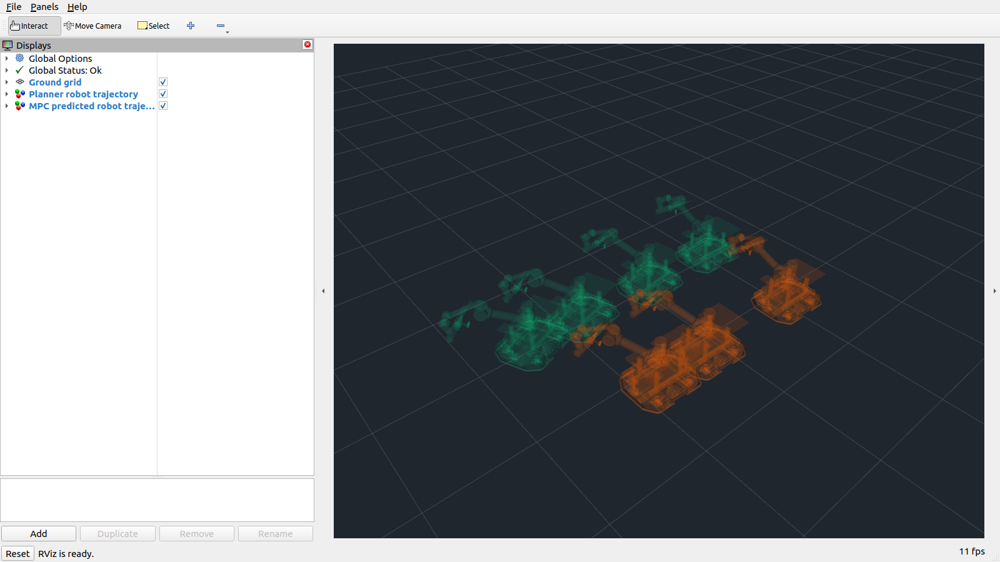

# wbmm_visualization

**只负责显示**的 ROS 2 功能包：把已有 planner / MPC 状态轨迹显示为沿途排列的半透明整机模型。显示实现、独立配置和测试位于本包；`tracer_jaka_bringup` 的 tracking 入口负责组合启动，不修改规划或控制算法。

## 输入与输出

| 来源 | 订阅消息 / 默认话题 | 显示输出 |
|---|---|---|
| Planner | `wbmm_planning_msgs/WholeBodyTrajectory`，`/wbmm/whole_body_trajectory` | `/wbmm/visualization/planner`，绿色整机残影 |
| MPC | `ocs2_msgs/MpcFlattenedController`，`/mobile_manipulator_mpc_policy` | `/wbmm/visualization/mpc`，橙色整机残影 |

输出均为标准 `visualization_msgs/MarkerArray`，无需自定义 RViz 插件或新增消息。MPC 使用 **`state_trajectory` 预测状态**，不是 `plan_target_trajectories` 参考目标，也不是 observation 单帧状态。MPC 控制器类型、增益、输入和求解器内部数据不参与显示。

C++ 适配器转换到已有 `wbmm::core::WholeBodyTrajectory / WholeBodyState`；`renderTrajectory()` 也可以直接显示其他 WBMM 模块生成的相同核心类型。转换只校验显示所需的位置、名称、时间和 frame，不因缺少控制输入而拒绝显示。

## 接入 WBMM tracking

`wbmm_tracking.launch.py` 已默认启动本显示节点，并在其原有 RViz 窗口中显示两层整机残影：

```bash
ros2 launch tracer_jaka_bringup wbmm_tracking.launch.py \
  esdf_file:=maps/map1/site_remani.npz
```

请在工作区根目录运行上述相对地图路径。集成入口共享 `world_frame`、URDF 和仿真时间，并保留 ESDF 地图、当前机器人、2D 导航目标及末端交互目标。

- `use_trajectory_visualization:=false`：关闭整机轨迹显示节点。
- `use_rviz:=false`：只关闭 RViz 窗口，仍发布整机 MarkerArray，便于远程显示。
- `trajectory_visualization_config:=/absolute/path/custom.yaml`：调整本包显示参数。
- 默认使用 `tracer_jaka_bringup/rviz/wbmm_tracking_map1.rviz`；自定义 `rviz_config` 时需包含本包两个 MarkerArray 图层。

## 独立启动

```bash
cd /home/a/WBMM
source /opt/ros/humble/setup.bash
source install/setup.bash
colcon build --packages-select wbmm_visualization
source install/setup.bash

# 与已有 remani_tracking / wbmm_tracking 仿真配合，它们当前 OCS2 frame 为 map：
ros2 launch wbmm_visualization visualization.launch.py \
  mpc_frame:=map use_sim_time:=true
```

此 launch **只启动显示节点和可选 RViz**，不启动机器人、规划器、MPC/MRT 或驱动。先启动显示节点再发送导航目标；planner 的原发布者是 volatile，显示节点启动前已经发布的计划不会自动补发。显示节点的输出为 reliable + transient-local，因此 RViz 可以晚于显示节点加入。

使用已打开的 RViz：传 `use_rviz:=false`，添加两个 MarkerArray 显示，分别订阅上表输出，Durability 选择 **Transient Local**。随包 RViz 配置仅包含网格和整机轨迹，不带发目标/运动控制工具。

MPC 消息没有 frame/joint names：必须将 `mpc_frame` 设为当前 OCS2 的 `world_frame`，并确保 `joint_names` 与 MPC 状态顺序一致。planner 使用消息自身的 `header.frame_id`。显示节点不伪造 TF；两种 frame 不同则由 RViz 使用部署提供的 TF 转换。Marker 时间戳为 0，表示显示时使用最新 TF，而非未来预测时间的 TF。

## 与 REMANI 效果的对应

参考文件 `plan_manage/src/planning_visualization.cpp` 主要绘制路径点和线；真正的整机轨迹在 `traj_opt/src/poly_traj_optimizer.cpp` 中采样，然后调用 `mm_config::MMConfig::getMMMarkerArray()` 生成多个 mesh 模型，透明度约 0.17。

本包采用相同的“整机残影”效果。planner 默认透明度 0.17，MPC 默认 0.25，以绿/橙区分。默认不画路径线，可分别启用 `planner.show_base_path` / `mpc.show_ee_path` 等。若希望使用 URDF 原始外观及 DAE 内嵌材质，将对应 `use_urdf_materials`、`use_embedded_materials` 设为 true；具体 DAE 材质的透明混合由 RViz/Ogre 实现。

## 更换机器人 / 调整显示

显示参数在启动时读取，修改后需重启显示节点。复制 `config/visualization.yaml`，通过 `config_file:=/absolute/path/custom.yaml` 指定自定义配置：

- `urdf_file`：已展开的 URDF。节点也支持 `robot_description` XML 参数。相对 mesh 路径相对于 URDF 所在目录，或显式 `mesh_directory`；`package://`、`file://` 资源由 RViz 加载。
- `joint_names`：轨迹中的活动关节。planner 按名称匹配，可与配置顺序不同；MPC 严格按此顺序解释 `[x,y,yaw,q...]`。
- `base_frame`：轨迹底盘位姿对应的 URDF link，默认根 link；必须与根之间只有固定关节。不会重复叠加底盘平移/旋转。
- `default_joint_names/positions`：轨迹未提供的轮子、夹爪等活动关节的**明确显示值**。没有配置的独立活动关节会报错；不会默默把它们当成零。mimic 关节从其源关节计算。
- `*.sample_interval` 与 `*.max_robot_poses`：按时间选择原始样本，保留首尾，数量有界。默认 planner 约每 2 秒取一个姿态，最多显示 4 个整机模型；长轨迹会进一步拉大间隔，以降低 RViz 渲染负担。不插值、不重新规划；原地转向和仅机械臂运动也能显示。
- `*.rgba`：颜色和透明度；`*.max_markers`：几何数量上限；`publish_rate`：最多处理最新轨迹的显示频率，默认 5 Hz。
- `*.timeout`：无新消息时清理该图层，0 表示保留。MPC 默认 1 秒，planner 默认保留最后一条**规划几何**，不宣称它仍被执行；本包不订阅取消/阶段控制话题。

支持 URDF `visual` 的 mesh、box、cylinder、sphere、多 visual、各自 origin/scale/material；支持 fixed、revolute、continuous、prismatic 及 mimic 链。底盘状态遵循当前 WBMM 的平面 `[x,y,yaw]` 契约；不支持轨迹中没有表达的浮动 6D 基座或 URDF planar/floating 关节。

当前 `wbmm_pinocchio::PinocchioRobotModel` 明确限制六个关节，并且逐 link FK 接口不暴露 visual/material。为避免修改该控制/规划模型，本包用 urdfdom 提供的树结构计算**显示位置**，不实现 `RobotModel` 的规划、动力学、Jacobian、限位或碰撞职责。

## 文件职责与验证

- `robot_visual_model.*`：URDF visual 与关节树显示变换。
- `trajectory_display.*`：已有消息适配、时间采样、整机 Marker 生成、过时 id 的 DELETE。
- `visualization_node.cpp`：只订阅轨迹，只发布两个 MarkerArray；输入缓存大小 1，限制显示频率。
- `launch/`、`config/`、`rviz/`：独立使用入口和显示样式。
- `test/`：模型变换/消息/采样单测与隔离 ROS 显示链检查。

```bash
colcon test --packages-select wbmm_visualization --event-handlers console_direct+
# 独立 ROS 域中启动自己的显示节点，只发布合成轨迹，不启动控制器或硬件：
ROS_DOMAIN_ID=101 ROS_LOCALHOST_ONLY=1 ROS_LOG_DIR=/tmp/wbmm_visualization_logs \
  ros2 run wbmm_visualization ros_display_check.py \
  --urdf /home/a/WBMM/src/robotics/tracer_jaka_description/urdf/tracer_jaka_zu5.urdf
```

所有 Marker 使用稳定 namespace/id。轨迹变短、为空、非法或超时会显式删除旧图层，不使用可能清除其他模块模型的 DELETEALL。


## 本轮验证与人工检查点（2026-09-28）

- 新包编译通过；12 项 C++ 单元测试通过。
- 在隔离 ROS 域，用当前 `tracer_jaka_zu5.urdf` 和合成 planner/MPC 消息完成集成检查：29 个 visual、网格文件可读取、不同输入 frame、迟加入订阅者、轨迹缩短/非法/为空后的删除、MPC 超时清理、仅显示话题发布。
- 在 RViz/OpenGL 中实际渲染并检查两层整机残影，见下图。该独立显示测试只启动显示节点和合成输入，没有运行 planner/MPC 闭环或硬件。
- 人工接入时确认：`mpc_frame` 与实际 OCS2 world frame 一致；`joint_names` 与 MPC 状态顺序一致；`base_frame` 与轨迹底盘位姿定义一致。透明度、采样间隔和模型数量可根据地图密度调整。




Tracking 接入验证：`wbmm_visualization` 和 `tracer_jaka_bringup` 构建通过，现有 21 项 bringup 启动配置检查通过。在独立 ROS 域使用 `wbmm_tracking.launch.py esdf_file:=maps/map1/site_remani.npz viewer:=false use_rviz:=false` 启动 MuJoCo，并发送仿真导航目标；实际 planner 输出产生 5 个整机姿态（145 个 Marker），实际 MPC policy 产生 4 个整机姿态（116 个 Marker），均位于 `map`。此项验证确认真实消息接入与模型输出，不代表导航到达或完整模式切换验收。
